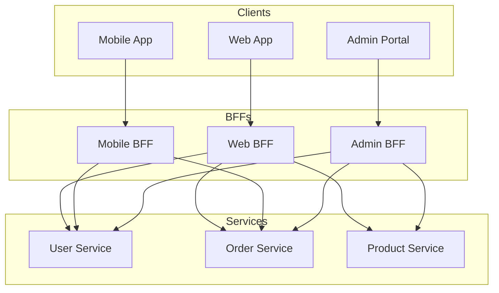

# BFF 패턴 (Backend for Frontend)

## 정의

BFF 패턴은 각 클라이언트(웹, 모바일, IoT 등)에 최적화된 전용 백엔드를 제공하는 패턴입니다. 클라이언트별 요구사항에 맞는 API를 제공합니다.

## 🎯 한눈에 보기

| 항목 | 설명 |
|------|------|
| **핵심** | 클라이언트별 전용 백엔드 |
| **비유** | 고객별 전담 직원 |
| **언제** | 다양한 클라이언트, MSA 환경 |
| **Spring** | Spring Cloud Gateway, WebFlux |

## 구조 (Structure)



## 사용 이유

### 1. 클라이언트 최적화
- 웹: 풍부한 데이터, 복잡한 뷰
- 모바일: 경량 데이터, 배터리 효율
- Admin: 관리 기능 중심

### 2. 독립적 개발
- 프론트엔드 팀이 BFF 소유
- 백엔드 변경 영향 최소화

### 3. 보안 분리
- 클라이언트별 인증/인가 정책
- Admin은 더 강한 인증

## 기본 예제

### Web BFF

```java
@RestController
@RequestMapping("/api/web")
public class WebBffController {

    private final UserService userService;
    private final OrderService orderService;
    private final ProductService productService;

    @GetMapping("/dashboard")
    public DashboardResponse getDashboard(@AuthenticationPrincipal User user) {
        // 웹용: 풍부한 데이터 조합
        return DashboardResponse.builder()
            .user(userService.getProfile(user.getId()))
            .recentOrders(orderService.getRecent(user.getId(), 10))
            .recommendations(productService.getRecommendations(user.getId(), 20))
            .notifications(notificationService.getAll(user.getId()))
            .build();
    }
}
```

### Mobile BFF

```java
@RestController
@RequestMapping("/api/mobile")
public class MobileBffController {

    @GetMapping("/dashboard")
    public MobileDashboardResponse getDashboard(@AuthenticationPrincipal User user) {
        // 모바일용: 경량 데이터
        return MobileDashboardResponse.builder()
            .userName(userService.getName(user.getId()))
            .orderCount(orderService.getCount(user.getId()))
            .hasNotification(notificationService.hasUnread(user.getId()))
            .build();
    }
}
```

## BFF vs API Gateway

| 항목 | BFF | API Gateway |
|------|-----|-------------|
| 목적 | 클라이언트 최적화 | 라우팅/인증 |
| 비즈니스 로직 | 포함 | 없음 |
| 소유 팀 | 프론트엔드 | 플랫폼 |
| 개수 | 클라이언트 수만큼 | 1개 |

## 장단점

### 장점
- 클라이언트별 최적화된 API
- 프론트엔드 팀 자율성
- 백엔드 변경 영향 격리

### 단점
- 코드 중복 가능성
- BFF 개수만큼 관리 필요
- 일관성 유지 어려움

## 관련 패턴

| 패턴 | 관계 |
|------|------|
| [Facade](../../../structural/Facade) | BFF는 MSA의 Facade |
| [API Gateway](../../distributed) | 라우팅/인증 담당 |
