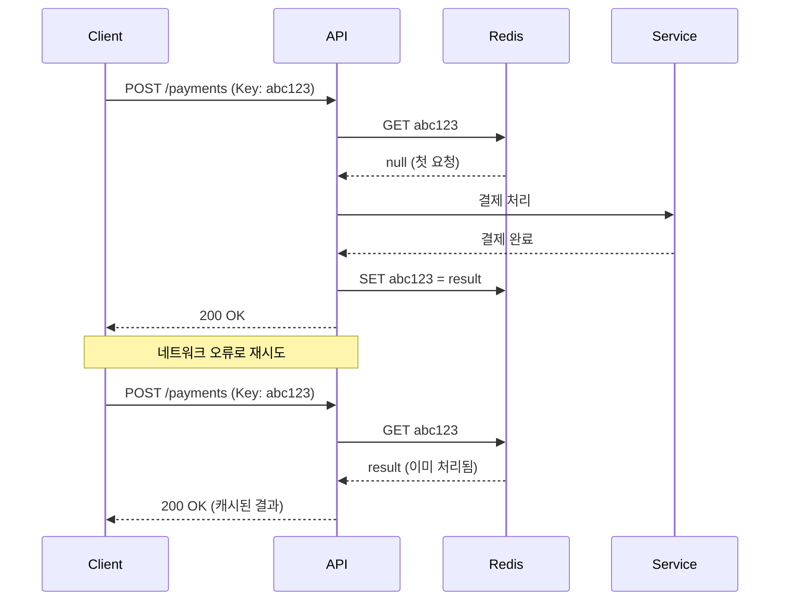

# Idempotency 패턴 (멱등성)

## 정의

Idempotency 패턴은 동일한 요청을 여러 번 실행해도 결과가 같음을 보장하는 패턴입니다. 네트워크 재시도, 중복 클릭 등으로 인한 중복 처리를 방지합니다.

## 🎯 한눈에 보기

| 항목 | 설명 |
|------|------|
| **핵심** | 같은 요청 → 같은 결과 |
| **비유** | 엘리베이터 버튼 여러 번 눌러도 한 번만 작동 |
| **언제** | 결제, 송금, 주문 등 중요 API |
| **Spring** | Redis + Idempotency-Key 헤더 |

> **💡 결제 API에서 중복 결제를 방지하고 싶을 때...**
>
> **❌ Before (중복 결제 위험)**
> ```java
> public Payment processPayment(PaymentRequest req) {
>     return paymentService.charge(req);  // 재시도 시 중복 결제!
> }
> ```
>
> **✅ After (멱등성 보장)**
> ```java
> public Payment processPayment(String idempotencyKey, PaymentRequest req) {
>     Payment cached = cache.get(idempotencyKey);
>     if (cached != null) return cached;  // 이미 처리됨
>
>     Payment result = paymentService.charge(req);
>     cache.put(idempotencyKey, result);
>     return result;
> }
> ```

## 구조 (Structure)



## 기본 예제

### Spring + Redis 구현

```java
@RestController
@RequiredArgsConstructor
public class PaymentController {

    private final PaymentService paymentService;
    private final RedisTemplate<String, Payment> redisTemplate;

    @PostMapping("/payments")
    public ResponseEntity<Payment> createPayment(
            @RequestHeader("Idempotency-Key") String idempotencyKey,
            @RequestBody PaymentRequest request) {

        String cacheKey = "payment:" + idempotencyKey;

        // 1. 캐시 확인
        Payment cached = redisTemplate.opsForValue().get(cacheKey);
        if (cached != null) {
            return ResponseEntity.ok(cached);  // 이미 처리됨
        }

        // 2. 처리 중 표시 (동시 요청 방지)
        Boolean acquired = redisTemplate.opsForValue()
            .setIfAbsent(cacheKey + ":lock", "processing", Duration.ofSeconds(30));

        if (Boolean.FALSE.equals(acquired)) {
            return ResponseEntity.status(409).build();  // 처리 중
        }

        try {
            // 3. 실제 처리
            Payment result = paymentService.process(request);

            // 4. 결과 캐시 (24시간)
            redisTemplate.opsForValue().set(cacheKey, result, Duration.ofHours(24));

            return ResponseEntity.ok(result);
        } finally {
            redisTemplate.delete(cacheKey + ":lock");
        }
    }
}
```

### AOP 기반 구현

```java
@Aspect
@Component
@RequiredArgsConstructor
public class IdempotencyAspect {

    private final RedisTemplate<String, Object> redis;

    @Around("@annotation(Idempotent)")
    public Object checkIdempotency(ProceedingJoinPoint pjp) throws Throwable {
        HttpServletRequest request = getCurrentRequest();
        String key = request.getHeader("Idempotency-Key");

        if (key == null) {
            throw new IllegalArgumentException("Idempotency-Key required");
        }

        Object cached = redis.opsForValue().get(key);
        if (cached != null) {
            return cached;
        }

        Object result = pjp.proceed();
        redis.opsForValue().set(key, result, Duration.ofHours(24));
        return result;
    }
}

// 사용
@Idempotent
@PostMapping("/orders")
public Order createOrder(@RequestBody OrderRequest req) {
    return orderService.create(req);
}
```

## Idempotency Key 생성 전략

| 전략 | 예시 | 장점 |
|------|------|------|
| UUID | `550e8400-e29b-41d4-a716-446655440000` | 충돌 없음 |
| 비즈니스 키 | `order-user123-20240115-001` | 의미 있음 |
| 해시 | `SHA256(userId + amount + timestamp)` | 중복 방지 |

## 장단점

### 장점
- 중복 처리 방지로 데이터 일관성 보장
- 네트워크 재시도에 안전
- 사용자 실수 (더블 클릭) 방지

### 단점
- 추가 저장소 (Redis) 필요
- 캐시 만료 정책 관리 필요
- 키 생성 전략 설계 필요

## 관련 패턴

| 패턴 | 관계 |
|------|------|
| [Inbox](../../messaging/Inbox) | 메시지 중복 처리 방지 |
| [Retry](../../resilience/Retry) | 재시도와 함께 사용 |
