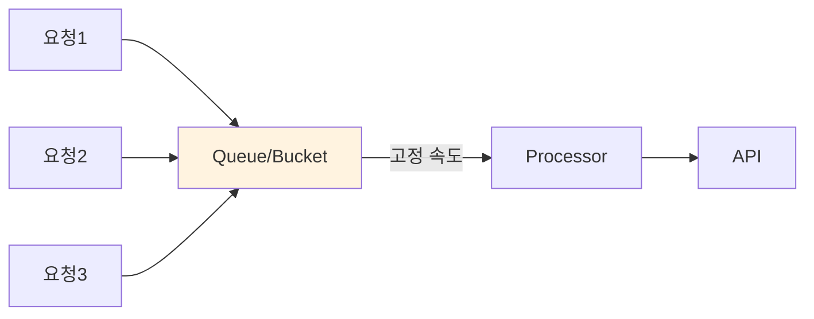

# Leaky Bucket 패턴

## 정의

Leaky Bucket 패턴은 요청을 큐에 저장하고 고정된 속도로 처리하여 출력 속도를 일정하게 유지하는 Rate Limiting 패턴입니다. 버스트 트래픽을 평탄화합니다.

## 🎯 한눈에 보기

| 항목 | 설명 |
|------|------|
| **핵심** | 고정 속도로 요청 처리 |
| **비유** | 바닥에 구멍 난 양동이 (일정 속도 누수) |
| **언제** | 균등한 처리 속도, 트래픽 쉐이핑 필요 시 |
| **Spring** | ScheduledExecutorService, 큐 기반 |

## 구조 (Structure)



## 기본 예제

```java
@Component
public class LeakyBucketRateLimiter {

    private final BlockingQueue<Runnable> queue = new LinkedBlockingQueue<>(100);
    private final ScheduledExecutorService executor = Executors.newScheduledThreadPool(1);

    @PostConstruct
    public void init() {
        // 100ms마다 하나씩 처리 (초당 10개)
        executor.scheduleAtFixedRate(() -> {
            Runnable task = queue.poll();
            if (task != null) task.run();
        }, 0, 100, TimeUnit.MILLISECONDS);
    }

    public boolean trySubmit(Runnable task) {
        return queue.offer(task);  // 큐가 가득 차면 false
    }
}
```

## Token Bucket과 비교

| 항목 | Token Bucket | Leaky Bucket |
|------|-------------|--------------|
| 버스트 | 허용 | 평탄화 |
| 출력 속도 | 가변 | 고정 |
| 적합 | API 보호 | 네트워크 쉐이핑 |

## 장단점

### 장점
- 일정한 출력 속도 보장
- 백엔드 시스템 보호

### 단점
- 버스트 요청 시 지연 발생
- 큐 오버플로우 처리 필요

## 관련 패턴

| 패턴 | 관계 |
|------|------|
| [Token Bucket](../TokenBucket) | 버스트 허용 변형 |
