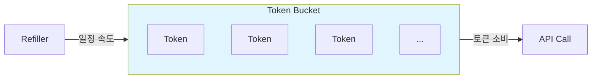
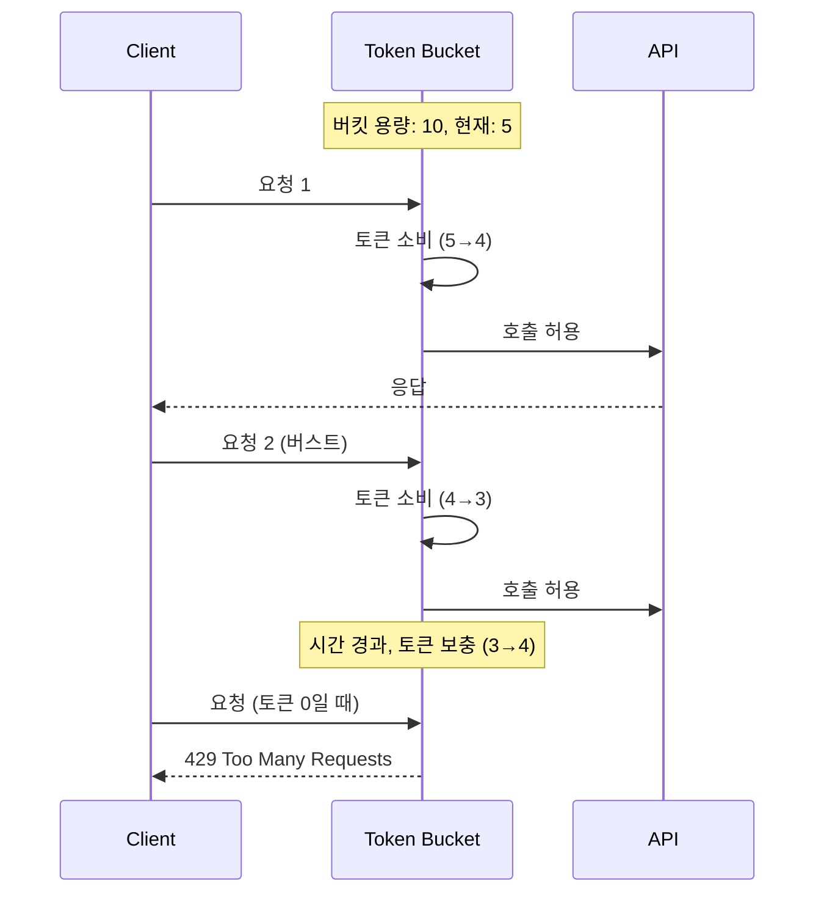

# Token Bucket 패턴

## 정의

Token Bucket 패턴은 일정 속도로 토큰이 버킷에 채워지고, 요청마다 토큰을 소비하여 API 호출 빈도를 제한하는 Rate Limiting 패턴입니다. 버스트 트래픽을 허용하면서도 평균 속도를 제한합니다.

## 🎯 한눈에 보기

| 항목 | 설명 |
|------|------|
| **핵심** | 토큰 소진 시 요청 차단 |
| **비유** | 물탱크에서 물 사용 (채워지는 속도 제한) |
| **언제** | API Rate Limiting, 버스트 허용 필요 시 |
| **Spring** | Bucket4j, Resilience4j RateLimiter |

> **💡 API 남용을 방지하고 싶을 때...**
>
> **✅ Token Bucket 적용**
> ```java
> @RateLimiter(name = "api", fallbackMethod = "fallback")
> public Response callApi() {
>     return apiClient.call();  // 토큰 있으면 호출, 없으면 제한
> }
> ```

## 구조 (Structure)



## 동작 원리



## 기본 예제

### Bucket4j 구현

```java
@Configuration
public class RateLimitConfig {

    @Bean
    public Bucket apiRateLimiter() {
        return Bucket.builder()
            .addLimit(Bandwidth.classic(100, Refill.intervally(100, Duration.ofMinutes(1))))
            .build();
        // 분당 100회, 버스트 허용
    }
}

@RestController
@RequiredArgsConstructor
public class ApiController {

    private final Bucket bucket;

    @GetMapping("/api/data")
    public ResponseEntity<?> getData() {
        if (bucket.tryConsume(1)) {
            return ResponseEntity.ok(service.getData());
        }
        return ResponseEntity.status(429).body("Rate limit exceeded");
    }
}
```

### Resilience4j 구현

```java
@Service
public class ApiService {

    @RateLimiter(name = "api", fallbackMethod = "rateLimitFallback")
    public Data fetchData() {
        return externalApi.call();
    }

    private Data rateLimitFallback(Exception e) {
        return Data.cached();  // 캐시된 데이터 반환
    }
}
```

```yaml
# application.yml
resilience4j:
  ratelimiter:
    instances:
      api:
        limit-for-period: 100
        limit-refresh-period: 1m
        timeout-duration: 0s
```

## Token Bucket vs Leaky Bucket

| 항목 | Token Bucket | Leaky Bucket |
|------|-------------|--------------|
| 버스트 | 허용 | 불허 |
| 처리 속도 | 가변적 | 고정 |
| 구현 | 토큰 카운터 | 큐 기반 |
| 적합 | API 보호 | 트래픽 쉐이핑 |

## 장단점

### 장점
- 버스트 트래픽 허용으로 사용자 경험 개선
- 구현이 단순함
- 평균 속도 제한 효과적

### 단점
- 순간 부하 발생 가능
- 버킷 크기 튜닝 필요

## 관련 패턴

| 패턴 | 관계 |
|------|------|
| [Leaky Bucket](../LeakyBucket) | 고정 속도 처리 변형 |
| [Circuit Breaker](../../resilience/CircuitBreaker) | 장애 시 차단과 함께 사용 |
