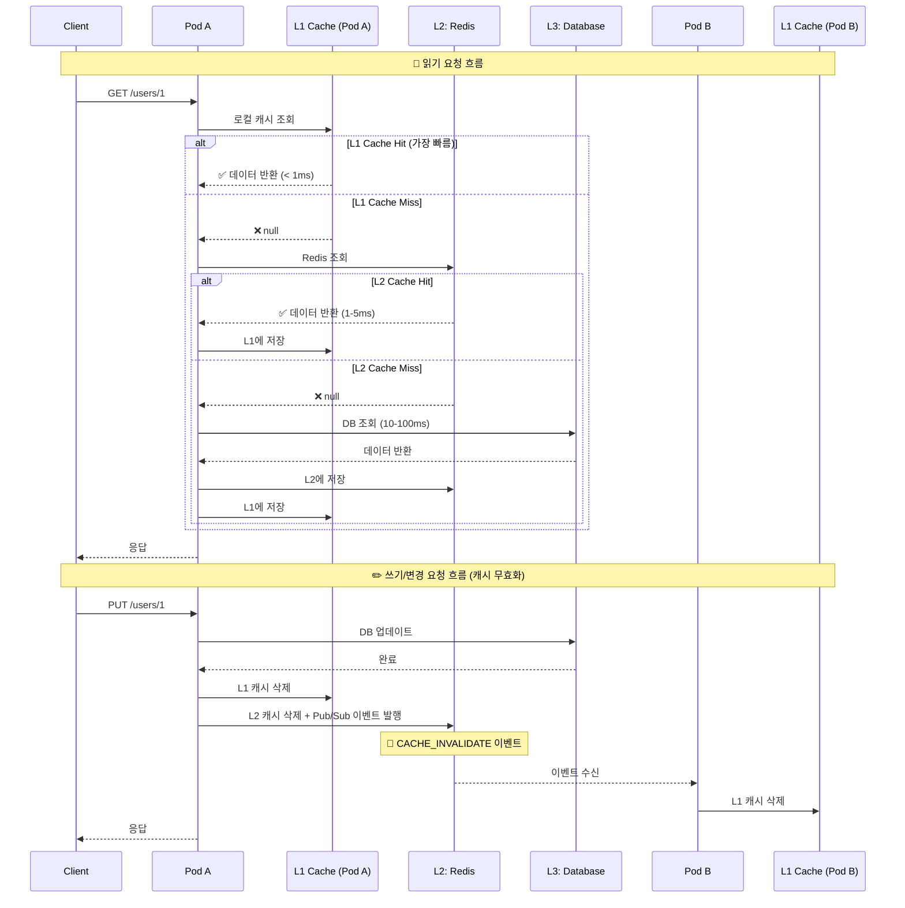
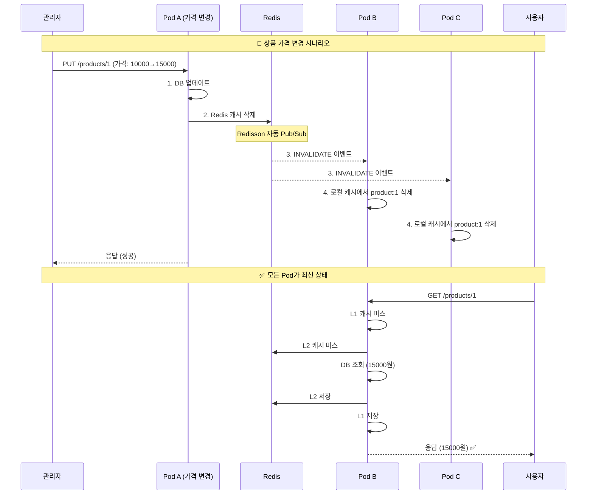

# Cache-Aside 패턴 - MSA 멀티레벨 캐시 (고급)

## 정의

MSA 환경에서의 Cache-Aside 패턴은 **3계층 캐시 아키텍처**(L1: 로컬 캐시, L2: 분산 캐시, L3: 데이터베이스)를 사용하여 성능을 극대화하고, **Pub/Sub 기반 캐시 무효화**를 통해 여러 Pod 간 캐시 일관성을 유지하는 고급 캐싱 전략입니다.

## 🎯 한눈에 보기

| 항목 | 설명 |
|------|------|
| **핵심** | L1(로컬) → L2(Redis) → L3(DB) 3계층 캐시 + Pod 간 동기화 |
| **비유** | 내 책상(L1) → 팀 공유 서랍(L2) → 회사 창고(L3), 변경 시 전체 공지 |
| **언제** | MSA 환경, 높은 읽기 성능 필요, Pod 스케일링 시 |
| **기술스택** | Spring Boot + Caffeine + Redisson + Redis Pub/Sub |

> **💡 단일 레벨 캐시의 한계**
>
> **❌ Before (단일 Redis 캐시)**
> ```java
> @Cacheable("users")
> public User findById(Long id) {
>     return userRepository.findById(id);
> }
> // 문제점:
> // 1. 매번 네트워크 호출 (Redis RTT)
> // 2. Redis 장애 시 전체 서비스 영향
> // 3. Pod 스케일 아웃 시 캐시 효율 저하
> ```
>
> **✅ After (멀티레벨 캐시 + Pub/Sub 동기화)**
> ```java
> @MultiLevelCacheable(l1 = "local", l2 = "redis")
> public User findById(Long id) {
>     return userRepository.findById(id);
> }
> // 장점:
> // 1. L1 로컬 캐시로 네트워크 비용 제거 (45배 빠름)
> // 2. Redis 장애 시 L1 캐시로 서비스 지속
> // 3. Pub/Sub로 모든 Pod 캐시 자동 동기화
> ```

## 아키텍처 (Architecture)

### 3계층 캐시 구조

```
┌─────────────────────────────────────────────────────────────────────────────┐
│                              Kubernetes Cluster                              │
│  ┌─────────────────┐   ┌─────────────────┐   ┌─────────────────┐            │
│  │     Pod A       │   │     Pod B       │   │     Pod C       │            │
│  │  ┌───────────┐  │   │  ┌───────────┐  │   │  ┌───────────┐  │            │
│  │  │ L1 Cache  │  │   │  │ L1 Cache  │  │   │  │ L1 Cache  │  │            │
│  │  │ (Caffeine)│  │   │  │ (Caffeine)│  │   │  │ (Caffeine)│  │            │
│  │  │  10ms ⚡  │  │   │  │  10ms ⚡  │  │   │  │  10ms ⚡  │  │            │
│  │  └─────┬─────┘  │   │  └─────┬─────┘  │   │  └─────┬─────┘  │            │
│  │        │        │   │        │        │   │        │        │            │
│  │  ┌─────▼─────┐  │   │  ┌─────▼─────┐  │   │  ┌─────▼─────┐  │            │
│  │  │ Redisson  │◄─┼───┼──┤ Redisson  │◄─┼───┼──┤ Redisson  │  │            │
│  │  │  Client   │──┼───┼─►│  Client   │──┼───┼─►│  Client   │  │            │
│  │  └───────────┘  │   │  └───────────┘  │   │  └───────────┘  │            │
│  └────────┬────────┘   └────────┬────────┘   └────────┬────────┘            │
│           │                     │                     │                      │
│           │         Redis Pub/Sub (캐시 무효화 이벤트)  │                      │
│           └─────────────────────┼─────────────────────┘                      │
│                                 │                                            │
│                    ┌────────────▼────────────┐                               │
│                    │      L2: Redis          │                               │
│                    │   (Distributed Cache)   │                               │
│                    │        1-5ms ⚡         │                               │
│                    └────────────┬────────────┘                               │
│                                 │                                            │
│                    ┌────────────▼────────────┐                               │
│                    │      L3: Database       │                               │
│                    │   (PostgreSQL/MySQL)    │                               │
│                    │       10-100ms 🐢       │                               │
│                    └─────────────────────────┘                               │
└─────────────────────────────────────────────────────────────────────────────┘
```

### 데이터 흐름 시퀀스



## 구성요소 설명

### L1: 로컬 캐시 (Caffeine)

| 특성 | 설명 |
|------|------|
| **위치** | 각 Pod의 JVM 메모리 |
| **속도** | < 1ms (네트워크 비용 없음) |
| **용량** | 제한적 (설정된 최대 개수) |
| **TTL** | 짧게 설정 (1-5분) |
| **동기화** | Redis Pub/Sub로 무효화 전파 |

### L2: 분산 캐시 (Redis + Redisson)

| 특성 | 설명 |
|------|------|
| **위치** | Redis 클러스터 |
| **속도** | 1-5ms (네트워크 호출) |
| **용량** | 대용량 (수 GB~TB) |
| **TTL** | 중간 (10-60분) |
| **동기화** | 단일 저장소로 일관성 보장 |

### L3: 데이터베이스

| 특성 | 설명 |
|------|------|
| **위치** | PostgreSQL, MySQL 등 |
| **속도** | 10-100ms |
| **용량** | 영구 저장 |
| **역할** | 원본 데이터 (Source of Truth) |

## 프로젝트 구조

```
src/main/java/com/example/cache/
├── config/
│   ├── RedissonConfig.java           # Redisson 클라이언트 설정
│   ├── CaffeineConfig.java           # Caffeine 로컬 캐시 설정
│   └── MultiLevelCacheConfig.java    # 멀티레벨 캐시 통합 설정
├── cache/
│   ├── MultiLevelCache.java          # 멀티레벨 캐시 인터페이스
│   ├── MultiLevelCacheManager.java   # 캐시 매니저 구현
│   ├── CacheEventPublisher.java      # 캐시 이벤트 발행자
│   └── CacheEventSubscriber.java     # 캐시 이벤트 구독자
├── event/
│   ├── CacheInvalidationEvent.java   # 캐시 무효화 이벤트
│   └── CacheEventType.java           # 이벤트 타입 enum
├── service/
│   └── ProductService.java           # 비즈니스 서비스 예제
└── domain/
    └── Product.java                  # 도메인 객체
```

## Spring Boot + Redisson 구현

### 1. 의존성 설정 (build.gradle)

```groovy
dependencies {
    // Spring Boot
    implementation 'org.springframework.boot:spring-boot-starter-web'
    implementation 'org.springframework.boot:spring-boot-starter-data-jpa'

    // Redisson (Redis 클라이언트 + 로컬 캐시 지원)
    implementation 'org.redisson:redisson-spring-boot-starter:3.25.0'

    // Caffeine (로컬 캐시 - Redisson과 별도로 사용 시)
    implementation 'com.github.ben-manes.caffeine:caffeine:3.1.8'

    // Jackson (직렬화)
    implementation 'com.fasterxml.jackson.core:jackson-databind'
    implementation 'com.fasterxml.jackson.datatype:jackson-datatype-jsr310'
}
```

### 2. application.yml 설정

```yaml
spring:
  application:
    name: cache-aside-msa

  # Redis 연결 설정
  redis:
    host: ${REDIS_HOST:localhost}
    port: ${REDIS_PORT:6379}
    password: ${REDIS_PASSWORD:}

# Redisson 설정
redisson:
  config: |
    singleServerConfig:
      address: "redis://${REDIS_HOST:localhost}:${REDIS_PORT:6379}"
      password: ${REDIS_PASSWORD:null}
      connectionPoolSize: 64
      connectionMinimumIdleSize: 24
      subscriptionConnectionPoolSize: 50
    codec: !<org.redisson.codec.JsonJacksonCodec> {}

# 캐시 설정
cache:
  l1:
    max-size: 10000           # 로컬 캐시 최대 항목 수
    ttl-minutes: 5            # 로컬 캐시 TTL
    record-stats: true        # 통계 기록
  l2:
    ttl-minutes: 30           # Redis 캐시 TTL
  invalidation:
    channel: "cache:invalidation"  # Pub/Sub 채널명
```

### 3. Redisson 설정

```java
package com.example.cache.config;

import org.redisson.Redisson;
import org.redisson.api.RedissonClient;
import org.redisson.api.LocalCachedMapOptions;
import org.redisson.api.LocalCachedMapOptions.SyncStrategy;
import org.redisson.api.LocalCachedMapOptions.ReconnectionStrategy;
import org.redisson.api.LocalCachedMapOptions.EvictionPolicy;
import org.redisson.config.Config;
import org.springframework.beans.factory.annotation.Value;
import org.springframework.context.annotation.Bean;
import org.springframework.context.annotation.Configuration;

import java.util.concurrent.TimeUnit;

@Configuration
public class RedissonConfig {

    @Value("${spring.redis.host:localhost}")
    private String redisHost;

    @Value("${spring.redis.port:6379}")
    private int redisPort;

    @Value("${spring.redis.password:}")
    private String redisPassword;

    @Value("${cache.l1.max-size:10000}")
    private int localCacheMaxSize;

    @Value("${cache.l1.ttl-minutes:5}")
    private int localCacheTtlMinutes;

    @Value("${cache.l2.ttl-minutes:30}")
    private int redisCacheTtlMinutes;

    /**
     * Redisson 클라이언트 생성
     */
    @Bean(destroyMethod = "shutdown")
    public RedissonClient redissonClient() {
        Config config = new Config();

        String address = String.format("redis://%s:%d", redisHost, redisPort);

        config.useSingleServer()
            .setAddress(address)
            .setPassword(redisPassword.isEmpty() ? null : redisPassword)
            .setConnectionPoolSize(64)
            .setConnectionMinimumIdleSize(24)
            .setSubscriptionConnectionPoolSize(50)
            .setRetryAttempts(3)
            .setRetryInterval(1500);

        return Redisson.create(config);
    }

    /**
     * 로컬 캐시 옵션 설정
     * - INVALIDATE: 다른 Pod에서 변경 시 로컬 캐시 무효화
     * - CLEAR: Redis 연결 끊김 후 재연결 시 로컬 캐시 전체 삭제
     */
    @Bean
    public LocalCachedMapOptions<String, Object> localCachedMapOptions() {
        return LocalCachedMapOptions.<String, Object>defaults()
            // 동기화 전략: 다른 인스턴스에서 변경 시 로컬 캐시 무효화
            .syncStrategy(SyncStrategy.INVALIDATE)

            // 재연결 전략: 연결 끊김 후 10분 이내면 무효화 로그 기반 정리, 이후는 전체 삭제
            .reconnectionStrategy(ReconnectionStrategy.CLEAR)

            // LRU 정책으로 오래된 항목 자동 제거
            .evictionPolicy(EvictionPolicy.LRU)

            // 로컬 캐시 최대 크기
            .cacheSize(localCacheMaxSize)

            // 로컬 캐시 TTL (Redis TTL보다 짧게)
            .timeToLive(localCacheTtlMinutes, TimeUnit.MINUTES)

            // 캐시 미스 저장 안 함 (null 캐싱 방지)
            .storeCacheMiss(false);
    }
}
```

### 4. 멀티레벨 캐시 매니저

```java
package com.example.cache.cache;

import com.example.cache.event.CacheInvalidationEvent;
import com.example.cache.event.CacheEventType;
import com.fasterxml.jackson.databind.ObjectMapper;
import lombok.extern.slf4j.Slf4j;
import org.redisson.api.*;
import org.springframework.beans.factory.annotation.Value;
import org.springframework.stereotype.Component;

import jakarta.annotation.PostConstruct;
import jakarta.annotation.PreDestroy;
import java.util.Optional;
import java.util.concurrent.TimeUnit;
import java.util.function.Supplier;

/**
 * 멀티레벨 캐시 매니저
 *
 * L1 (로컬) → L2 (Redis) → L3 (DB) 순서로 조회하고,
 * 변경 시 Pub/Sub를 통해 모든 Pod의 로컬 캐시를 무효화합니다.
 */
@Slf4j
@Component
public class MultiLevelCacheManager {

    private final RedissonClient redissonClient;
    private final LocalCachedMapOptions<String, Object> localCacheOptions;
    private final ObjectMapper objectMapper;

    @Value("${cache.invalidation.channel:cache:invalidation}")
    private String invalidationChannel;

    @Value("${cache.l2.ttl-minutes:30}")
    private int redisTtlMinutes;

    // 캐시 이름별 RLocalCachedMap 저장
    private final java.util.concurrent.ConcurrentHashMap<String, RLocalCachedMap<String, Object>> caches
        = new java.util.concurrent.ConcurrentHashMap<>();

    private RTopic invalidationTopic;

    public MultiLevelCacheManager(
            RedissonClient redissonClient,
            LocalCachedMapOptions<String, Object> localCacheOptions,
            ObjectMapper objectMapper) {
        this.redissonClient = redissonClient;
        this.localCacheOptions = localCacheOptions;
        this.objectMapper = objectMapper;
    }

    @PostConstruct
    public void init() {
        // Pub/Sub 구독 설정
        invalidationTopic = redissonClient.getTopic(invalidationChannel);

        invalidationTopic.addListener(String.class, (channel, message) -> {
            try {
                CacheInvalidationEvent event = objectMapper.readValue(message, CacheInvalidationEvent.class);
                handleInvalidationEvent(event);
            } catch (Exception e) {
                log.error("캐시 무효화 이벤트 처리 실패", e);
            }
        });

        log.info("✅ 캐시 무효화 Pub/Sub 구독 시작: {}", invalidationChannel);
    }

    @PreDestroy
    public void destroy() {
        caches.values().forEach(RLocalCachedMap::destroy);
        log.info("🛑 멀티레벨 캐시 매니저 종료");
    }

    /**
     * 캐시 맵 가져오기 (없으면 생성)
     */
    private RLocalCachedMap<String, Object> getCache(String cacheName) {
        return caches.computeIfAbsent(cacheName, name -> {
            log.info("📦 새 캐시 생성: {}", name);
            return redissonClient.getLocalCachedMap(
                "cache:" + name,
                localCacheOptions
            );
        });
    }

    /**
     * 캐시 조회 (L1 → L2 → DB 순서)
     *
     * @param cacheName 캐시 이름
     * @param key 캐시 키
     * @param type 반환 타입
     * @param dbLoader DB 조회 함수 (캐시 미스 시 호출)
     * @return 캐시된 값 또는 DB 조회 결과
     */
    public <T> Optional<T> get(String cacheName, String key, Class<T> type, Supplier<T> dbLoader) {
        RLocalCachedMap<String, Object> cache = getCache(cacheName);
        String cacheKey = buildKey(cacheName, key);

        // L1 + L2 통합 조회 (Redisson이 자동으로 L1 먼저 확인)
        Object cached = cache.get(key);

        if (cached != null) {
            log.debug("💾 캐시 히트 [{}]: {}", cacheName, key);
            return Optional.of(type.cast(cached));
        }

        // L3: DB 조회
        log.debug("🔍 캐시 미스, DB 조회 [{}]: {}", cacheName, key);
        T value = dbLoader.get();

        if (value != null) {
            // L1 + L2에 저장 (Redisson이 자동으로 양쪽에 저장)
            cache.put(key, value);
            log.debug("💾 캐시 저장 [{}]: {}", cacheName, key);
        }

        return Optional.ofNullable(value);
    }

    /**
     * 캐시에 값 저장
     */
    public <T> void put(String cacheName, String key, T value) {
        RLocalCachedMap<String, Object> cache = getCache(cacheName);
        cache.put(key, value);
        log.debug("💾 캐시 저장 [{}]: {}", cacheName, key);
    }

    /**
     * 캐시에 값 저장 (TTL 지정)
     */
    public <T> void put(String cacheName, String key, T value, long ttl, TimeUnit timeUnit) {
        RLocalCachedMap<String, Object> cache = getCache(cacheName);
        cache.put(key, value, ttl, timeUnit);
        log.debug("💾 캐시 저장 [{}]: {} (TTL: {} {})", cacheName, key, ttl, timeUnit);
    }

    /**
     * 캐시 무효화 (로컬 + Redis + 다른 Pod 전파)
     */
    public void evict(String cacheName, String key) {
        RLocalCachedMap<String, Object> cache = getCache(cacheName);
        cache.remove(key);

        // Pub/Sub로 다른 Pod에 무효화 이벤트 전파
        publishInvalidationEvent(cacheName, key, CacheEventType.EVICT);

        log.info("🗑️ 캐시 무효화 [{}]: {}", cacheName, key);
    }

    /**
     * 캐시 전체 삭제 (특정 캐시)
     */
    public void evictAll(String cacheName) {
        RLocalCachedMap<String, Object> cache = getCache(cacheName);
        cache.clear();

        // Pub/Sub로 다른 Pod에 전체 무효화 이벤트 전파
        publishInvalidationEvent(cacheName, "*", CacheEventType.EVICT_ALL);

        log.info("🗑️ 캐시 전체 삭제 [{}]", cacheName);
    }

    /**
     * 캐시 무효화 이벤트 발행
     */
    private void publishInvalidationEvent(String cacheName, String key, CacheEventType eventType) {
        try {
            CacheInvalidationEvent event = CacheInvalidationEvent.builder()
                .cacheName(cacheName)
                .key(key)
                .eventType(eventType)
                .sourceInstanceId(getInstanceId())
                .timestamp(System.currentTimeMillis())
                .build();

            String message = objectMapper.writeValueAsString(event);
            invalidationTopic.publish(message);

            log.debug("📤 캐시 무효화 이벤트 발행: {}", event);
        } catch (Exception e) {
            log.error("캐시 무효화 이벤트 발행 실패", e);
        }
    }

    /**
     * 캐시 무효화 이벤트 처리
     */
    private void handleInvalidationEvent(CacheInvalidationEvent event) {
        // 자기 자신이 보낸 이벤트는 무시 (이미 로컬 캐시 처리됨)
        if (getInstanceId().equals(event.getSourceInstanceId())) {
            return;
        }

        log.info("📥 캐시 무효화 이벤트 수신: {}", event);

        RLocalCachedMap<String, Object> cache = caches.get(event.getCacheName());
        if (cache == null) {
            return;
        }

        switch (event.getEventType()) {
            case EVICT:
                // 로컬 캐시에서만 제거 (Redis는 이미 처리됨)
                cache.remove(event.getKey());
                break;
            case EVICT_ALL:
                cache.clear();
                break;
            case UPDATE:
                // 필요시 캐시 갱신 로직
                break;
        }
    }

    /**
     * 인스턴스 ID 생성 (Pod 식별용)
     */
    private String getInstanceId() {
        String hostname = System.getenv("HOSTNAME");  // Kubernetes Pod 이름
        if (hostname == null || hostname.isEmpty()) {
            hostname = java.util.UUID.randomUUID().toString().substring(0, 8);
        }
        return hostname;
    }

    private String buildKey(String cacheName, String key) {
        return cacheName + ":" + key;
    }

    /**
     * 캐시 통계 조회
     */
    public CacheStats getStats(String cacheName) {
        RLocalCachedMap<String, Object> cache = caches.get(cacheName);
        if (cache == null) {
            return CacheStats.empty();
        }

        return CacheStats.builder()
            .cacheName(cacheName)
            .size(cache.size())
            .build();
    }

    @lombok.Builder
    @lombok.Getter
    public static class CacheStats {
        private final String cacheName;
        private final int size;

        public static CacheStats empty() {
            return CacheStats.builder().cacheName("unknown").size(0).build();
        }
    }
}
```

### 5. 캐시 무효화 이벤트

```java
package com.example.cache.event;

/**
 * 캐시 이벤트 타입
 */
public enum CacheEventType {
    EVICT,       // 단일 키 무효화
    EVICT_ALL,   // 전체 캐시 무효화
    UPDATE       // 캐시 갱신
}
```

```java
package com.example.cache.event;

import lombok.AllArgsConstructor;
import lombok.Builder;
import lombok.Data;
import lombok.NoArgsConstructor;

/**
 * 캐시 무효화 이벤트
 * Redis Pub/Sub를 통해 모든 Pod에 전파됩니다.
 */
@Data
@Builder
@NoArgsConstructor
@AllArgsConstructor
public class CacheInvalidationEvent {

    private String cacheName;           // 캐시 이름 (예: "products")
    private String key;                 // 캐시 키 (예: "product:123")
    private CacheEventType eventType;   // 이벤트 타입
    private String sourceInstanceId;    // 이벤트 발생 Pod ID
    private long timestamp;             // 이벤트 발생 시간
}
```

### 6. 비즈니스 서비스 예제

```java
package com.example.cache.service;

import com.example.cache.cache.MultiLevelCacheManager;
import com.example.cache.domain.Product;
import com.example.cache.repository.ProductRepository;
import lombok.RequiredArgsConstructor;
import lombok.extern.slf4j.Slf4j;
import org.springframework.stereotype.Service;
import org.springframework.transaction.annotation.Transactional;

import java.util.Optional;

/**
 * 상품 서비스 - 멀티레벨 캐시 적용 예제
 */
@Slf4j
@Service
@RequiredArgsConstructor
public class ProductService {

    private static final String CACHE_NAME = "products";

    private final ProductRepository productRepository;
    private final MultiLevelCacheManager cacheManager;

    /**
     * 상품 조회 (L1 → L2 → L3 순서)
     */
    public Optional<Product> findById(Long id) {
        String cacheKey = String.valueOf(id);

        return cacheManager.get(
            CACHE_NAME,
            cacheKey,
            Product.class,
            () -> productRepository.findById(id).orElse(null)
        );
    }

    /**
     * 상품 생성
     */
    @Transactional
    public Product create(Product product) {
        Product saved = productRepository.save(product);

        // 캐시에 저장
        cacheManager.put(CACHE_NAME, String.valueOf(saved.getId()), saved);

        log.info("✅ 상품 생성: {}", saved.getId());
        return saved;
    }

    /**
     * 상품 수정 (DB 업데이트 + 캐시 무효화)
     */
    @Transactional
    public Product update(Long id, Product product) {
        Product existing = productRepository.findById(id)
            .orElseThrow(() -> new RuntimeException("상품을 찾을 수 없습니다: " + id));

        existing.setName(product.getName());
        existing.setPrice(product.getPrice());
        existing.setStock(product.getStock());

        Product updated = productRepository.save(existing);

        // 캐시 무효화 (모든 Pod에 전파됨)
        cacheManager.evict(CACHE_NAME, String.valueOf(id));

        log.info("✅ 상품 수정 및 캐시 무효화: {}", id);
        return updated;
    }

    /**
     * 상품 삭제 (DB 삭제 + 캐시 무효화)
     */
    @Transactional
    public void delete(Long id) {
        productRepository.deleteById(id);

        // 캐시 무효화 (모든 Pod에 전파됨)
        cacheManager.evict(CACHE_NAME, String.valueOf(id));

        log.info("✅ 상품 삭제 및 캐시 무효화: {}", id);
    }

    /**
     * 전체 상품 캐시 삭제 (관리용)
     */
    public void clearAllCache() {
        cacheManager.evictAll(CACHE_NAME);
        log.info("🗑️ 전체 상품 캐시 삭제");
    }
}
```

### 7. 도메인 객체

```java
package com.example.cache.domain;

import jakarta.persistence.*;
import lombok.*;
import java.io.Serializable;
import java.math.BigDecimal;
import java.time.LocalDateTime;

@Entity
@Table(name = "products")
@Getter
@Setter
@NoArgsConstructor
@AllArgsConstructor
@Builder
public class Product implements Serializable {

    private static final long serialVersionUID = 1L;

    @Id
    @GeneratedValue(strategy = GenerationType.IDENTITY)
    private Long id;

    @Column(nullable = false)
    private String name;

    @Column(nullable = false, precision = 10, scale = 2)
    private BigDecimal price;

    @Column(nullable = false)
    private Integer stock;

    @Column(name = "created_at")
    private LocalDateTime createdAt;

    @Column(name = "updated_at")
    private LocalDateTime updatedAt;

    @PrePersist
    protected void onCreate() {
        createdAt = LocalDateTime.now();
        updatedAt = LocalDateTime.now();
    }

    @PreUpdate
    protected void onUpdate() {
        updatedAt = LocalDateTime.now();
    }
}
```

### 8. REST API 컨트롤러

```java
package com.example.cache.controller;

import com.example.cache.cache.MultiLevelCacheManager;
import com.example.cache.domain.Product;
import com.example.cache.service.ProductService;
import lombok.RequiredArgsConstructor;
import org.springframework.http.ResponseEntity;
import org.springframework.web.bind.annotation.*;

@RestController
@RequestMapping("/api/products")
@RequiredArgsConstructor
public class ProductController {

    private final ProductService productService;
    private final MultiLevelCacheManager cacheManager;

    @GetMapping("/{id}")
    public ResponseEntity<Product> getProduct(@PathVariable Long id) {
        return productService.findById(id)
            .map(ResponseEntity::ok)
            .orElse(ResponseEntity.notFound().build());
    }

    @PostMapping
    public ResponseEntity<Product> createProduct(@RequestBody Product product) {
        Product created = productService.create(product);
        return ResponseEntity.ok(created);
    }

    @PutMapping("/{id}")
    public ResponseEntity<Product> updateProduct(
            @PathVariable Long id,
            @RequestBody Product product) {
        Product updated = productService.update(id, product);
        return ResponseEntity.ok(updated);
    }

    @DeleteMapping("/{id}")
    public ResponseEntity<Void> deleteProduct(@PathVariable Long id) {
        productService.delete(id);
        return ResponseEntity.noContent().build();
    }

    // 캐시 관리 엔드포인트
    @DeleteMapping("/cache")
    public ResponseEntity<Void> clearCache() {
        productService.clearAllCache();
        return ResponseEntity.noContent().build();
    }

    @GetMapping("/cache/stats")
    public ResponseEntity<MultiLevelCacheManager.CacheStats> getCacheStats() {
        return ResponseEntity.ok(cacheManager.getStats("products"));
    }
}
```

## Redisson RLocalCachedMap 사용 (더 간단한 방식)

Redisson의 `RLocalCachedMap`을 직접 사용하면 별도의 Pub/Sub 코드 없이도 자동으로 Pod 간 캐시 동기화가 됩니다.

```java
package com.example.cache.service;

import org.redisson.api.LocalCachedMapOptions;
import org.redisson.api.RLocalCachedMap;
import org.redisson.api.RedissonClient;
import org.springframework.stereotype.Service;

import jakarta.annotation.PostConstruct;

@Service
public class SimpleProductCacheService {

    private final RedissonClient redissonClient;
    private RLocalCachedMap<Long, Product> productCache;

    public SimpleProductCacheService(RedissonClient redissonClient) {
        this.redissonClient = redissonClient;
    }

    @PostConstruct
    public void init() {
        // Redisson LocalCachedMap 설정
        // SyncStrategy.INVALIDATE: 다른 Pod에서 변경 시 자동으로 로컬 캐시 무효화
        LocalCachedMapOptions<Long, Product> options = LocalCachedMapOptions.<Long, Product>defaults()
            .syncStrategy(LocalCachedMapOptions.SyncStrategy.INVALIDATE)
            .reconnectionStrategy(LocalCachedMapOptions.ReconnectionStrategy.CLEAR)
            .evictionPolicy(LocalCachedMapOptions.EvictionPolicy.LRU)
            .cacheSize(10000);

        productCache = redissonClient.getLocalCachedMap("products", options);
    }

    /**
     * 상품 조회 - L1(로컬) → L2(Redis) 자동 처리
     */
    public Product findById(Long id) {
        // Redisson이 자동으로 L1 먼저 확인 후 L2 조회
        return productCache.get(id);
    }

    /**
     * 상품 저장 - L1 + L2 동시 저장, 다른 Pod에 변경 알림
     */
    public void save(Long id, Product product) {
        // 저장 시 다른 Pod의 로컬 캐시가 자동으로 무효화됨
        productCache.put(id, product);
    }

    /**
     * 상품 삭제 - L1 + L2 동시 삭제, 다른 Pod에 변경 알림
     */
    public void delete(Long id) {
        // 삭제 시 다른 Pod의 로컬 캐시가 자동으로 무효화됨
        productCache.remove(id);
    }
}
```

## Pod 간 캐시 동기화 흐름



## 장점

| 장점 | 설명 |
|------|------|
| **극대화된 성능** | L1 로컬 캐시로 네트워크 비용 제거, Redis 대비 45배 빠른 응답 |
| **자동 동기화** | Redisson Pub/Sub로 모든 Pod의 캐시 자동 무효화 |
| **장애 격리** | Redis 장애 시 L1 캐시로 서비스 지속 (Graceful Degradation) |
| **확장성** | Pod 스케일 아웃 시에도 캐시 일관성 유지 |
| **설정 간소화** | Redisson RLocalCachedMap으로 복잡한 로직 없이 구현 |

## 단점

| 단점 | 설명 |
|------|------|
| **메모리 사용** | 각 Pod마다 로컬 캐시 메모리 필요 |
| **일시적 불일치** | Pub/Sub 전파 지연으로 짧은 시간 동안 캐시 불일치 가능 (수십 ms) |
| **복잡성** | 단일 레벨 캐시보다 설정과 운영 복잡도 증가 |
| **Redisson 의존** | Redisson 라이브러리에 대한 의존성 |

## 주의사항

### 1. TTL 설정 전략

```
L1 TTL < L2 TTL < 데이터 유효 기간

예시:
- L1 (로컬): 5분
- L2 (Redis): 30분
- 데이터 유효 기간: 수 시간~무기한
```

L1 TTL을 L2보다 짧게 설정하여 Redis를 주기적으로 확인하도록 합니다.

### 2. Redis 연결 끊김 처리

```java
// ReconnectionStrategy 옵션
NONE   // 아무 처리 안 함 (권장하지 않음)
CLEAR  // 재연결 시 로컬 캐시 전체 삭제 (권장)
LOAD   // 10분 이내면 무효화 로그 기반 정리, 이후는 전체 삭제
```

### 3. 외부 프로세스 변경 감지

Redisson 외부에서 Redis를 직접 수정하면 로컬 캐시가 무효화되지 않습니다.
모든 캐시 변경은 Redisson을 통해 수행해야 합니다.

### 4. Serialization

캐시에 저장하는 객체는 반드시 `Serializable`을 구현해야 합니다.

```java
public class Product implements Serializable {
    private static final long serialVersionUID = 1L;
    // ...
}
```

## 관련 패턴

| 패턴 | 관계 |
|------|------|
| [Cache-Aside (기본)](./README.md) | 이 패턴의 기본 버전 |
| [Write-Through](../WriteThrough) | 쓰기 시 캐시와 DB 동시 갱신 |
| [Circuit Breaker](../../resilience/CircuitBreaker) | Redis 장애 시 폴백 처리 |
| [Pub/Sub](../../messaging/PubSub) | 캐시 무효화 이벤트 전파 |

## 참고 자료

- [Redisson RLocalCachedMap 문서](https://redisson.pro/docs/cache-api-implementations/)
- [Spring Boot Multilevel Cache Starter](https://github.com/SuppieRK/spring-boot-multilevel-cache-starter)
- [Redis Caching Patterns - AWS](https://docs.aws.amazon.com/whitepapers/latest/database-caching-strategies-using-redis/caching-patterns.html)
- [Managing In-Memory Cache Invalidation Using Redis Pub/Sub](https://osmos-tech-blog.medium.com/managing-in-memory-cache-invalidation-using-redis-pub-sub-c2bd60c13b69)
- [Hybrid Cache Strategy with Redisson and Caffeine](https://dev.to/mahmoud_nawwar_2024/hybrid-cache-strategy-in-spring-boot-a-guide-to-redisson-and-caffeine-integration-19g)
