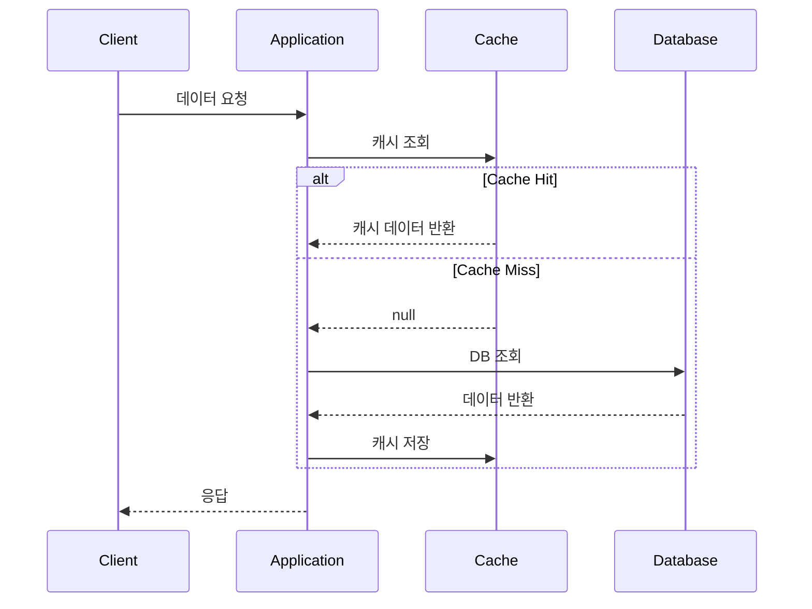

# Cache-Aside 패턴 (Lazy Loading)

## 정의

Cache-Aside 패턴은 애플리케이션이 캐시를 직접 관리하며, 캐시 미스 시 데이터베이스에서 조회한 후 캐시에 저장하는 가장 일반적인 캐싱 패턴입니다.

## 🎯 한눈에 보기

| 항목 | 설명 |
|------|------|
| **핵심** | 캐시 미스 시 DB 조회 → 캐시 저장 |
| **비유** | 냉장고에 없으면 마트에서 사와서 넣기 |
| **언제** | 읽기 중심 워크로드, 캐시 적중률 높을 때 |
| **Spring** | `@Cacheable` 어노테이션 |

> **💡 데이터 조회 시 캐시를 활용하고 싶을 때...**
>
> **❌ Before (매번 DB 조회)**
> ```java
> public User findById(Long id) {
>     return userRepository.findById(id);  // 매번 DB 조회
> }
> ```
>
> **✅ After (캐시 우선 조회)**
> ```java
> @Cacheable(value = "users", key = "#id")
> public User findById(Long id) {
>     return userRepository.findById(id);  // 캐시 미스 시만 DB 조회
> }
> ```

## 구조 (Structure)



## 사용 이유

### 1. 성능 향상
- DB 조회 대신 메모리 캐시 조회로 응답 시간 단축
- 데이터베이스 부하 감소

### 2. 단순한 구현
- 애플리케이션이 캐시와 DB를 직접 제어
- 캐시 라이브러리 의존성 낮음

### 3. 유연한 제어
- 캐시 저장 시점, 만료 정책 직접 결정
- 선택적 캐싱 가능

## 적용 상황

✅ **적합한 경우**
- 읽기가 쓰기보다 훨씬 많은 워크로드
- 동일한 데이터에 대한 반복적인 요청
- 약간의 데이터 불일치가 허용되는 경우

❌ **부적합한 경우**
- 쓰기 중심 워크로드
- 실시간 일관성이 중요한 경우
- 캐시 적중률이 낮은 경우

## 기본 예제

### Spring Boot + Redis 구현

```java
@Service
public class UserService {

    private final UserRepository userRepository;

    // 캐시 조회 - 없으면 DB 조회 후 캐시 저장
    @Cacheable(value = "users", key = "#id")
    public User findById(Long id) {
        return userRepository.findById(id)
            .orElseThrow(() -> new UserNotFoundException(id));
    }

    // 캐시 갱신 - DB 저장 후 캐시도 갱신
    @CachePut(value = "users", key = "#user.id")
    public User update(User user) {
        return userRepository.save(user);
    }

    // 캐시 삭제 - DB 삭제 후 캐시도 삭제
    @CacheEvict(value = "users", key = "#id")
    public void delete(Long id) {
        userRepository.deleteById(id);
    }
}
```

### 설정

```java
@Configuration
@EnableCaching
public class CacheConfig {

    @Bean
    public RedisCacheManager cacheManager(RedisConnectionFactory factory) {
        RedisCacheConfiguration config = RedisCacheConfiguration.defaultCacheConfig()
            .entryTtl(Duration.ofMinutes(30))  // TTL 30분
            .serializeValuesWith(
                RedisSerializationContext.SerializationPair
                    .fromSerializer(new GenericJackson2JsonRedisSerializer())
            );

        return RedisCacheManager.builder(factory)
            .cacheDefaults(config)
            .build();
    }
}
```

## 장단점

### 장점
| 장점 | 설명 |
|------|------|
| **단순함** | 구현이 직관적이고 이해하기 쉬움 |
| **유연성** | 캐시 저장 로직을 세밀하게 제어 가능 |
| **장애 격리** | 캐시 장애 시 DB로 폴백 가능 |

### 단점
| 단점 | 설명 |
|------|------|
| **Cold Start** | 캐시가 비어있을 때 초기 지연 발생 |
| **불일치 가능** | DB 변경 시 캐시와 불일치 발생 가능 |
| **추가 코드** | 캐시 무효화 로직 직접 관리 필요 |

## 캐시 무효화 전략

```java
// 1. TTL 기반 - 자동 만료
@Cacheable(value = "users", key = "#id")  // config에서 TTL 설정

// 2. 명시적 삭제
@CacheEvict(value = "users", key = "#id")
public void invalidateUser(Long id) {}

// 3. 전체 삭제
@CacheEvict(value = "users", allEntries = true)
public void invalidateAllUsers() {}
```

## 고급 버전

| 문서 | 설명 |
|------|------|
| [MSA 멀티레벨 캐시](./MSA-MultiLevel.md) | 3계층 캐시(L1:로컬, L2:Redis, L3:DB) + Pod 간 Pub/Sub 동기화 |

MSA 환경에서 로컬 캐시와 분산 캐시를 함께 사용하고, 여러 Pod 간 캐시 일관성을 유지해야 한다면 고급 버전을 참고하세요.

## 관련 패턴

| 패턴 | 관계 |
|------|------|
| [Read-Through](../ReadThrough) | 캐시가 DB 접근을 담당하는 변형 |
| [Write-Through](../WriteThrough) | 쓰기 시 캐시도 함께 갱신 |
| [Proxy](../../../structural/Proxy) | 캐시는 원본의 프록시 역할 |
