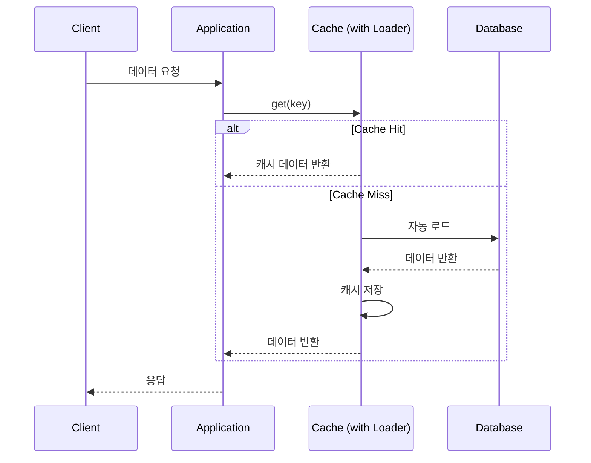

# Read-Through 패턴

## 정의

Read-Through 패턴은 캐시가 데이터베이스 접근을 담당하며, 애플리케이션은 캐시와만 상호작용하는 패턴입니다. 캐시 미스 시 캐시 자체가 DB에서 데이터를 로드합니다.

## 🎯 한눈에 보기

| 항목 | 설명 |
|------|------|
| **핵심** | 캐시가 DB 접근 책임을 가짐 |
| **비유** | 비서가 필요한 서류를 알아서 찾아옴 |
| **언제** | 캐시 계층 분리, 일관된 캐시 로직 필요 시 |
| **Spring** | CacheLoader, Caffeine LoadingCache |

## 구조 (Structure)



## Cache-Aside vs Read-Through

| 항목 | Cache-Aside | Read-Through |
|------|------------|--------------|
| DB 접근 주체 | 애플리케이션 | 캐시 |
| 로직 위치 | 서비스 코드 | 캐시 설정 |
| 코드 중복 | 가능 | 없음 |
| 유연성 | 높음 | 중간 |

## 기본 예제

### Caffeine LoadingCache

```java
@Configuration
public class CacheConfig {

    @Bean
    public LoadingCache<Long, User> userCache(UserRepository userRepository) {
        return Caffeine.newBuilder()
            .maximumSize(10_000)
            .expireAfterWrite(Duration.ofMinutes(30))
            .build(key -> userRepository.findById(key).orElse(null));
    }
}

@Service
@RequiredArgsConstructor
public class UserService {

    private final LoadingCache<Long, User> userCache;

    public User findById(Long id) {
        // 캐시가 자동으로 DB 조회
        return userCache.get(id);
    }
}
```

## 장단점

### 장점
- 애플리케이션 코드 단순화
- 캐시 로직 중앙화
- 일관된 캐시 동작

### 단점
- 캐시 설정 복잡도 증가
- 캐시 제공자 의존성

## 관련 패턴

| 패턴 | 관계 |
|------|------|
| [Cache-Aside](../CacheAside) | 애플리케이션이 DB 접근하는 변형 |
| [Write-Through](../WriteThrough) | 쓰기 시 함께 적용 |
