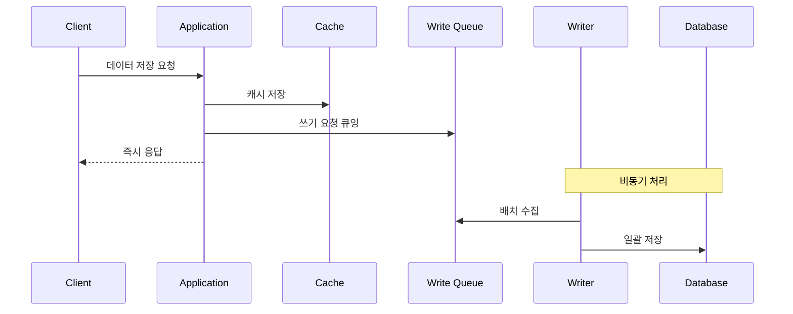

# Write-Behind 패턴 (Write-Back)

## 정의

Write-Behind 패턴은 데이터를 캐시에 먼저 저장한 후, 비동기로 데이터베이스에 저장하는 패턴입니다. 높은 쓰기 성능이 필요할 때 사용합니다.

## 🎯 한눈에 보기

| 항목 | 설명 |
|------|------|
| **핵심** | 캐시 먼저, 비동기 DB 저장 |
| **비유** | 메모 후 나중에 정리 |
| **언제** | 높은 쓰기 성능, 배치 처리 필요 시 |
| **Spring** | `@Async` + MessageQueue |

## 구조 (Structure)



## 기본 예제

```java
@Service
public class UserService {

    private final Cache<Long, User> cache;
    private final BlockingQueue<User> writeQueue;

    public User save(User user) {
        cache.put(user.getId(), user);  // 캐시 즉시 저장
        writeQueue.offer(user);          // 큐에 추가
        return user;                     // 즉시 응답
    }
}

@Component
public class AsyncWriter {

    @Scheduled(fixedDelay = 1000)
    public void flush() {
        List<User> batch = new ArrayList<>();
        writeQueue.drainTo(batch, 100);  // 최대 100개 수집
        if (!batch.isEmpty()) {
            userRepository.saveAll(batch);  // 일괄 저장
        }
    }
}
```

## 장단점

### 장점
- 매우 빠른 쓰기 응답
- DB 부하 감소 (배치 처리)

### 단점
- 데이터 손실 위험 (캐시 장애 시)
- 일시적 불일치 발생

## ⚠️ 주의사항

- 캐시 장애 대비 영속성 전략 필요
- 중요 데이터에는 부적합

## 관련 패턴

| 패턴 | 관계 |
|------|------|
| [Write-Through](../WriteThrough) | 동기 저장하는 안전한 변형 |
| [Outbox](../../messaging/Outbox) | 신뢰성 있는 비동기 처리 |
