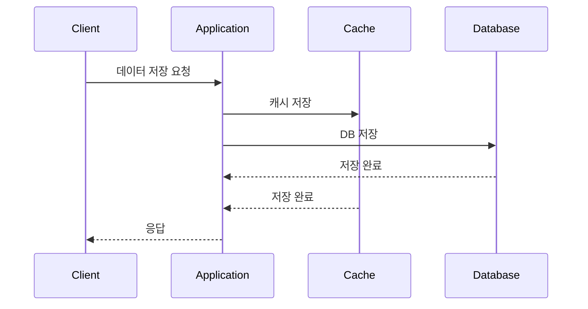

# Write-Through 패턴

## 정의

Write-Through 패턴은 데이터 쓰기 시 캐시와 데이터베이스를 동시에 업데이트하여 항상 일관성을 유지하는 패턴입니다.

## 🎯 한눈에 보기

| 항목 | 설명 |
|------|------|
| **핵심** | 쓰기 시 캐시와 DB 동시 업데이트 |
| **비유** | 원본과 복사본을 동시에 수정 |
| **언제** | 데이터 일관성이 중요할 때 |
| **Spring** | `@CachePut` 어노테이션 |

## 구조 (Structure)



## 기본 예제

```java
@Service
public class UserService {

    @CachePut(value = "users", key = "#user.id")
    public User save(User user) {
        return userRepository.save(user);  // DB 저장 후 캐시도 자동 갱신
    }

    @CachePut(value = "users", key = "#user.id")
    public User update(User user) {
        return userRepository.save(user);  // 캐시와 DB 동시 업데이트
    }
}
```

## 장단점

### 장점
- 캐시와 DB 항상 일관성 유지
- 읽기 시 최신 데이터 보장

### 단점
- 쓰기 지연 (두 곳에 저장)
- 캐시 저장 실패 시 처리 필요

## 관련 패턴

| 패턴 | 관계 |
|------|------|
| [Write-Behind](../WriteBehind) | 비동기로 DB 저장하는 변형 |
| [Cache-Aside](../CacheAside) | 읽기 패턴과 함께 사용 |
