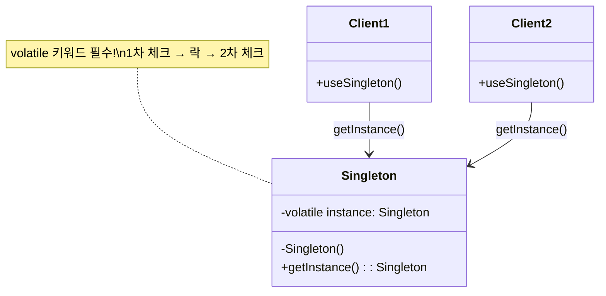
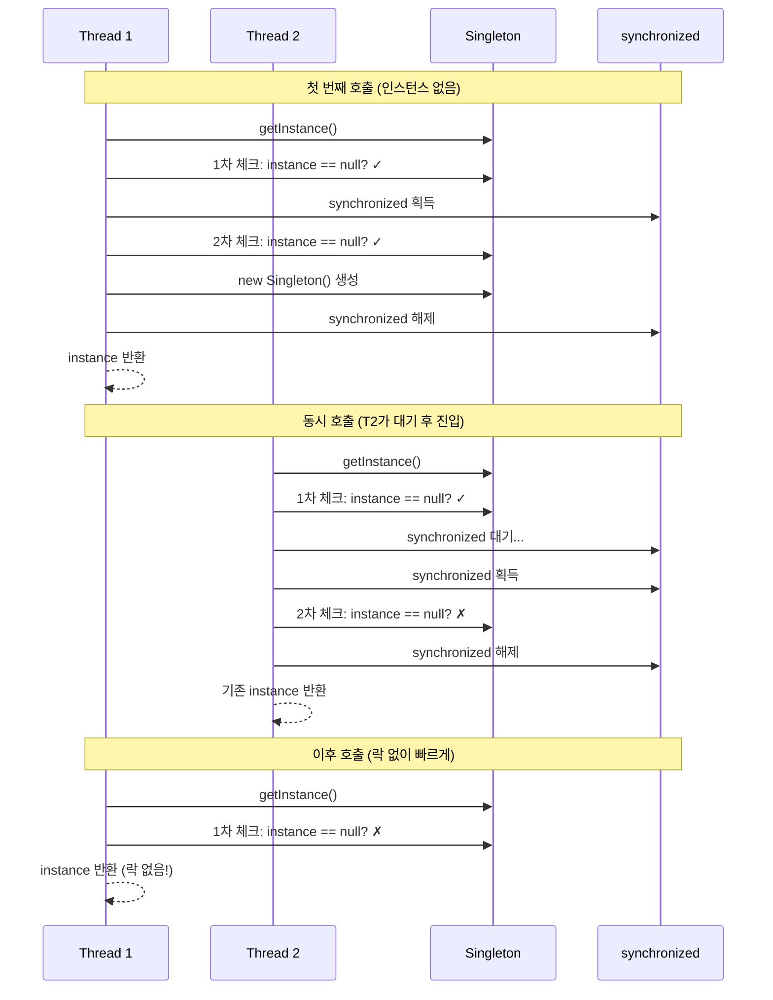

# Double Checked Locking 패턴

## 정의

Double Checked Locking(DCL)은 멀티스레드 환경에서 지연 초기화(Lazy Initialization)를 안전하고 효율적으로 구현하기 위한 동시성 패턴입니다. 락(lock) 획득 비용을 최소화하면서 스레드 안전성을 보장합니다.

## 🎯 한눈에 보기

| 항목 | 설명 |
|------|------|
| **핵심** | 락 획득 전후로 두 번 체크하여 성능과 안전성 동시 확보 |
| **비유** | 문 앞에서 확인(1차) → 열쇠로 열고 → 안에서 다시 확인(2차) |
| **언제** | Singleton 지연 초기화, 비용이 큰 객체의 스레드 안전한 생성 |
| **Spring** | Spring Bean은 기본적으로 싱글톤이므로 직접 구현할 일 적음 |

> **💡 멀티스레드 환경에서 Singleton 인스턴스 생성할 때...**
>
> **❌ Before (매번 동기화)**
> ```java
> public synchronized static Instance getInstance() {
>     if (instance == null) {
>         instance = new Instance();  // 항상 락 획득 → 성능 저하
>     }
>     return instance;
> }
> ```
>
> **✅ After (Double Checked Locking)**
> ```java
> if (instance == null) {              // 1차 체크 (락 없이)
>     synchronized (lock) {
>         if (instance == null) {      // 2차 체크 (락 안에서)
>             instance = new Instance();
>         }
>     }
> }
> return instance;  // 대부분의 호출에서 락 없이 빠르게 반환!
> ```

## 구조 (Structure)



## 동작 흐름 (시퀀스 다이어그램)



## 사용 이유

### 1. 성능 최적화
- **synchronized의 비용**: 락 획득/해제는 비용이 큼
- **DCL의 해결책**: 대부분의 호출에서 락 없이 인스턴스 반환
- **효과**: 첫 번째 생성 이후에는 락 오버헤드 없음

### 2. 스레드 안전성
- **경쟁 조건 방지**: 두 스레드가 동시에 인스턴스를 생성하는 문제 해결
- **이중 체크**: 락 안에서 다시 확인하여 중복 생성 방지

### 3. 지연 초기화
- **필요할 때만 생성**: 애플리케이션 시작 시간 단축
- **메모리 효율**: 사용하지 않으면 생성하지 않음

## 적용 상황

### 1. Singleton 패턴 구현
```java
// 가장 흔한 사용 사례
public class ExpensiveService {
    private static volatile ExpensiveService instance;

    public static ExpensiveService getInstance() {
        if (instance == null) {
            synchronized (ExpensiveService.class) {
                if (instance == null) {
                    instance = new ExpensiveService();
                }
            }
        }
        return instance;
    }
}
```

### 2. 캐시 초기화
```java
public class ConfigCache {
    private volatile Map<String, String> cache;

    public Map<String, String> getCache() {
        if (cache == null) {
            synchronized (this) {
                if (cache == null) {
                    cache = loadFromDatabase();  // 비용이 큰 작업
                }
            }
        }
        return cache;
    }
}
```

### 3. 비용이 큰 리소스 초기화
- 데이터베이스 커넥션 풀
- 외부 API 클라이언트
- 대용량 설정 파일 로딩

## 🔰 5분 만에 이해하기 - 초급 예제

```java
public class DatabaseConnection {
    // volatile: 모든 스레드가 최신 값을 보도록 보장
    private static volatile DatabaseConnection instance;

    // private 생성자: 외부에서 new 불가
    private DatabaseConnection() {
        System.out.println("DB 연결 생성 (비용이 큰 작업)");
    }

    public static DatabaseConnection getInstance() {
        // 1차 체크: 이미 있으면 바로 반환 (락 없이!)
        if (instance == null) {
            // 락 획득: 한 번에 하나의 스레드만 진입
            synchronized (DatabaseConnection.class) {
                // 2차 체크: 대기하는 동안 다른 스레드가 생성했을 수도!
                if (instance == null) {
                    instance = new DatabaseConnection();
                }
            }
        }
        return instance;
    }

    public void query(String sql) {
        System.out.println("쿼리 실행: " + sql);
    }
}

// 사용 예시
public class Main {
    public static void main(String[] args) {
        // 여러 스레드에서 동시에 호출해도 안전
        DatabaseConnection db1 = DatabaseConnection.getInstance();
        DatabaseConnection db2 = DatabaseConnection.getInstance();

        System.out.println(db1 == db2);  // true (같은 인스턴스)
        db1.query("SELECT * FROM users");
    }
}
```

**실행 결과:**
```
DB 연결 생성 (비용이 큰 작업)
true
쿼리 실행: SELECT * FROM users
```

## ⚠️ volatile이 필수인 이유

```java
// ❌ volatile 없이는 위험!
private static DatabaseConnection instance;  // volatile 빠짐

// 문제: JVM 최적화로 인한 명령어 재정렬
// 1. 메모리 할당
// 2. instance 변수에 참조 할당  ← 이게 먼저 실행될 수 있음!
// 3. 생성자 실행              ← 아직 초기화 안 됨

// 다른 스레드가 "2" 시점에서 instance를 읽으면
// 초기화가 완료되지 않은 객체를 사용하게 됨!
```

```java
// ✅ volatile로 해결
private static volatile DatabaseConnection instance;

// volatile 효과:
// 1. 가시성(Visibility): 모든 스레드가 최신 값을 봄
// 2. 순서 보장(Ordering): 명령어 재정렬 방지
```

## Spring Boot에서의 활용

Spring에서는 Bean이 기본적으로 싱글톤이므로 DCL을 직접 구현할 일이 적습니다. 하지만 Bean이 아닌 객체에서 필요할 수 있습니다.

```java
@Component
public class ExternalApiClient {

    // Spring Bean 내부에서 지연 초기화가 필요한 경우
    private volatile HttpClient httpClient;

    public HttpClient getHttpClient() {
        if (httpClient == null) {
            synchronized (this) {
                if (httpClient == null) {
                    httpClient = HttpClient.newBuilder()
                        .connectTimeout(Duration.ofSeconds(10))
                        .build();
                }
            }
        }
        return httpClient;
    }

    public String callApi(String url) {
        return getHttpClient().send(/* ... */);
    }
}
```

### Spring의 더 좋은 대안들

```java
// 방법 1: @Lazy 어노테이션
@Component
@Lazy  // 첫 사용 시점에 Bean 생성
public class ExpensiveService {
    public ExpensiveService() {
        // 비용이 큰 초기화
    }
}

// 방법 2: Supplier를 활용한 지연 초기화
@Component
public class LazyResourceHolder {

    private final Supplier<ExpensiveResource> resourceSupplier =
        Suppliers.memoize(this::createResource);  // Guava 사용

    private ExpensiveResource createResource() {
        return new ExpensiveResource();
    }

    public ExpensiveResource getResource() {
        return resourceSupplier.get();
    }
}

// 방법 3: Java 8+ Holder 패턴 (가장 권장)
public class BestSingleton {

    private BestSingleton() {}

    // 클래스 로딩 시점에 초기화 → JVM이 스레드 안전성 보장
    private static class Holder {
        static final BestSingleton INSTANCE = new BestSingleton();
    }

    public static BestSingleton getInstance() {
        return Holder.INSTANCE;  // 락 필요 없음!
    }
}
```

## 장단점

### 장점 ✅

| 장점 | 설명 |
|------|------|
| **성능 향상** | 대부분의 호출에서 락 없이 빠르게 반환 |
| **스레드 안전** | 경쟁 조건 없이 단일 인스턴스 보장 |
| **지연 초기화** | 필요할 때만 객체 생성 |
| **메모리 효율** | 사용하지 않으면 생성하지 않음 |

### 단점 ❌

| 단점 | 설명 |
|------|------|
| **복잡성** | volatile, synchronized 이해 필요 |
| **실수 가능성** | volatile 누락 시 버그 (찾기 어려움) |
| **Java 5+ 필수** | 이전 버전에서는 volatile 동작 불완전 |
| **더 좋은 대안** | Holder 패턴, enum Singleton이 더 간단 |

## 관련 패턴

| 패턴 | 관계 |
|------|------|
| **Singleton** | DCL은 Singleton의 스레드 안전한 구현 방법 중 하나 |
| **Lazy Initialization** | DCL은 지연 초기화의 멀티스레드 안전 버전 |
| **Object Pool** | 풀 초기화에 DCL 적용 가능 |

## 권장 사항

| 상황 | 권장 방법 |
|------|----------|
| Java Singleton | **Holder 패턴** (가장 간단하고 안전) |
| enum 가능 | **enum Singleton** (직렬화도 안전) |
| Spring 환경 | **@Component** + **@Lazy** (프레임워크 위임) |
| 동적 초기화 필요 | **DCL** (volatile 필수!) |
