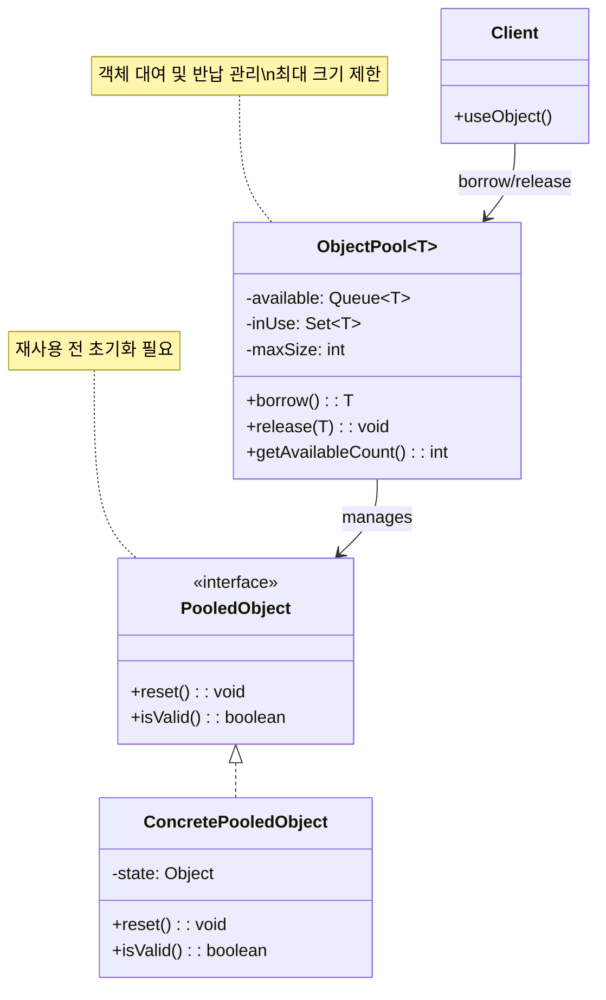
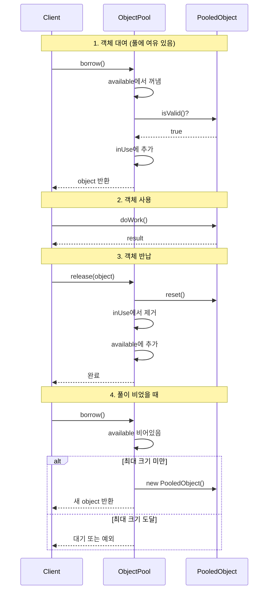

# Object Pool 패턴 (Object Pool Pattern)

## 정의

Object Pool 패턴은 생성 비용이 큰 객체들을 미리 생성하여 풀(pool)에 보관하고, 필요할 때 빌려주고 사용 후 반환받아 재사용하는 생성 패턴입니다.

## 🎯 한눈에 보기

| 항목 | 설명 |
|------|------|
| **핵심** | 비용이 큰 객체를 재사용하여 생성/소멸 비용 절감 |
| **비유** | 도서관에서 책을 빌려쓰고 반납 (매번 사지 않음) |
| **언제** | DB 커넥션, 스레드, 네트워크 연결 등 생성 비용이 큰 리소스 |
| **Spring** | HikariCP (DB 풀), ThreadPoolTaskExecutor (스레드 풀) |

> **💡 DB 연결이 필요할 때마다...**
>
> **❌ Before (매번 새로 생성)**
> ```java
> Connection conn = DriverManager.getConnection(url);  // 느림!
> // 사용
> conn.close();  // 연결 종료
> // 다음 요청에서 또 새로 생성... 반복
> ```
>
> **✅ After (Object Pool)**
> ```java
> Connection conn = connectionPool.borrow();  // 즉시 반환!
> // 사용
> connectionPool.release(conn);  // 풀에 반납 (연결 유지)
> // 다음 요청에서 재사용 → 빠름!
> ```

## 구조 (Structure)



## 동작 흐름 (시퀀스 다이어그램)



## 사용 이유

### 1. 성능 향상
- **객체 생성 비용**: DB 커넥션, 스레드 생성은 수십~수백 ms
- **재사용 효과**: 풀에서 꺼내는 것은 거의 즉시 (< 1ms)

### 2. 리소스 관리
- **최대 개수 제한**: 시스템 리소스 고갈 방지
- **안정적 운영**: 트래픽 급증 시에도 제한된 리소스로 동작

### 3. 연결 유지
- **Keep-Alive**: 네트워크 연결을 유지하여 재연결 비용 절감
- **세션 재사용**: 인증된 세션을 재활용

## 적용 상황

### 1. 데이터베이스 커넥션 풀
```java
// HikariCP - 가장 많이 사용되는 JDBC 커넥션 풀
HikariConfig config = new HikariConfig();
config.setJdbcUrl("jdbc:mysql://localhost:3306/mydb");
config.setMaximumPoolSize(10);  // 최대 10개 커넥션

HikariDataSource dataSource = new HikariDataSource(config);
Connection conn = dataSource.getConnection();  // 풀에서 대여
```

### 2. 스레드 풀
```java
// Java의 기본 스레드 풀
ExecutorService executor = Executors.newFixedThreadPool(5);

// 스레드 재사용하여 작업 실행
executor.submit(() -> System.out.println("작업 1"));
executor.submit(() -> System.out.println("작업 2"));
```

### 3. HTTP 클라이언트 커넥션 풀
```java
// Apache HttpClient 커넥션 풀
PoolingHttpClientConnectionManager cm = new PoolingHttpClientConnectionManager();
cm.setMaxTotal(100);           // 전체 최대 커넥션
cm.setDefaultMaxPerRoute(20);  // 호스트당 최대 커넥션
```

## 🔰 5분 만에 이해하기 - 초급 예제

```java
import java.util.concurrent.BlockingQueue;
import java.util.concurrent.LinkedBlockingQueue;

// 1. 풀에서 관리할 객체
class DatabaseConnection {
    private final int id;
    private boolean inUse = false;

    public DatabaseConnection(int id) {
        this.id = id;
        System.out.println("Connection-" + id + " 생성 (비용이 큰 작업)");
    }

    public void query(String sql) {
        System.out.println("Connection-" + id + ": " + sql);
    }

    public void reset() {
        // 재사용 전 상태 초기화
        inUse = false;
    }
}

// 2. Object Pool 구현
class ConnectionPool {
    private final BlockingQueue<DatabaseConnection> pool;
    private final int maxSize;
    private int created = 0;

    public ConnectionPool(int maxSize) {
        this.maxSize = maxSize;
        this.pool = new LinkedBlockingQueue<>(maxSize);
    }

    // 객체 대여
    public DatabaseConnection borrow() throws InterruptedException {
        // 풀에 있으면 바로 반환
        DatabaseConnection conn = pool.poll();
        if (conn != null) {
            System.out.println("풀에서 커넥션 대여");
            return conn;
        }

        // 없으면 새로 생성 (최대 크기까지만)
        synchronized (this) {
            if (created < maxSize) {
                created++;
                return new DatabaseConnection(created);
            }
        }

        // 최대 크기 도달 시 대기
        System.out.println("풀이 비어있음, 대기 중...");
        return pool.take();  // 반납될 때까지 대기
    }

    // 객체 반납
    public void release(DatabaseConnection conn) {
        conn.reset();
        pool.offer(conn);
        System.out.println("커넥션 반납 완료");
    }
}

// 3. 사용 예시
public class Main {
    public static void main(String[] args) throws InterruptedException {
        ConnectionPool pool = new ConnectionPool(2);  // 최대 2개

        // 첫 번째 대여 → 새로 생성
        DatabaseConnection conn1 = pool.borrow();
        conn1.query("SELECT * FROM users");

        // 두 번째 대여 → 새로 생성
        DatabaseConnection conn2 = pool.borrow();
        conn2.query("SELECT * FROM orders");

        // 반납
        pool.release(conn1);

        // 세 번째 대여 → 풀에서 재사용!
        DatabaseConnection conn3 = pool.borrow();
        conn3.query("SELECT * FROM products");

        System.out.println("conn1 == conn3: " + (conn1 == conn3));  // true!
    }
}
```

**실행 결과:**
```
Connection-1 생성 (비용이 큰 작업)
Connection-1: SELECT * FROM users
Connection-2 생성 (비용이 큰 작업)
Connection-2: SELECT * FROM orders
커넥션 반납 완료
풀에서 커넥션 대여
Connection-1: SELECT * FROM products
conn1 == conn3: true
```

## Spring Boot 예제

### 1. HikariCP 커넥션 풀 설정

```yaml
# application.yml
spring:
  datasource:
    url: jdbc:mysql://localhost:3306/mydb
    username: root
    password: password
    hikari:
      maximum-pool-size: 10      # 최대 커넥션 수
      minimum-idle: 5            # 최소 유휴 커넥션 수
      idle-timeout: 300000       # 유휴 커넥션 유지 시간 (5분)
      connection-timeout: 20000  # 커넥션 획득 대기 시간 (20초)
      max-lifetime: 1200000      # 커넥션 최대 수명 (20분)
```

### 2. 스레드 풀 설정

```java
@Configuration
@EnableAsync
public class AsyncConfig {

    @Bean
    public TaskExecutor taskExecutor() {
        ThreadPoolTaskExecutor executor = new ThreadPoolTaskExecutor();
        executor.setCorePoolSize(5);       // 기본 스레드 수
        executor.setMaxPoolSize(10);       // 최대 스레드 수
        executor.setQueueCapacity(25);     // 대기 큐 크기
        executor.setThreadNamePrefix("Async-");
        executor.initialize();
        return executor;
    }
}

@Service
public class NotificationService {

    @Async  // 스레드 풀에서 비동기 실행
    public CompletableFuture<Void> sendEmail(String to, String message) {
        // 이메일 발송 (스레드 풀의 스레드가 처리)
        System.out.println(Thread.currentThread().getName() + ": 이메일 발송");
        return CompletableFuture.completedFuture(null);
    }
}
```

### 3. 커스텀 Object Pool (Apache Commons Pool2)

```java
// build.gradle
// implementation 'org.apache.commons:commons-pool2:2.12.0'

// 1. 풀에서 관리할 객체
public class ExpensiveResource {
    private final String id;

    public ExpensiveResource() {
        this.id = UUID.randomUUID().toString().substring(0, 8);
        // 비용이 큰 초기화 작업
        try {
            Thread.sleep(1000);  // 시뮬레이션
        } catch (InterruptedException e) {
            Thread.currentThread().interrupt();
        }
    }

    public void doWork() {
        System.out.println("Resource-" + id + " 작업 수행");
    }

    public void reset() {
        // 상태 초기화
    }
}

// 2. 팩토리 정의
public class ExpensiveResourceFactory
    extends BasePooledObjectFactory<ExpensiveResource> {

    @Override
    public ExpensiveResource create() {
        return new ExpensiveResource();
    }

    @Override
    public PooledObject<ExpensiveResource> wrap(ExpensiveResource obj) {
        return new DefaultPooledObject<>(obj);
    }

    @Override
    public void passivateObject(PooledObject<ExpensiveResource> p) {
        p.getObject().reset();  // 반납 시 초기화
    }
}

// 3. Pool 설정 및 사용
@Configuration
public class PoolConfig {

    @Bean
    public GenericObjectPool<ExpensiveResource> resourcePool() {
        GenericObjectPoolConfig<ExpensiveResource> config =
            new GenericObjectPoolConfig<>();
        config.setMaxTotal(5);              // 최대 객체 수
        config.setMinIdle(2);               // 최소 유휴 객체
        config.setMaxWaitMillis(5000);      // 대기 시간

        return new GenericObjectPool<>(
            new ExpensiveResourceFactory(), config);
    }
}

@Service
@RequiredArgsConstructor
public class ResourceService {

    private final GenericObjectPool<ExpensiveResource> pool;

    public void useResource() {
        ExpensiveResource resource = null;
        try {
            resource = pool.borrowObject();  // 대여
            resource.doWork();
        } catch (Exception e) {
            throw new RuntimeException("풀에서 객체 획득 실패", e);
        } finally {
            if (resource != null) {
                pool.returnObject(resource);  // 반납
            }
        }
    }
}
```

### 4. try-with-resources 패턴

```java
// AutoCloseable을 구현한 Wrapper
public class PooledResourceWrapper implements AutoCloseable {
    private final ExpensiveResource resource;
    private final GenericObjectPool<ExpensiveResource> pool;

    public PooledResourceWrapper(GenericObjectPool<ExpensiveResource> pool)
        throws Exception {
        this.pool = pool;
        this.resource = pool.borrowObject();
    }

    public ExpensiveResource get() {
        return resource;
    }

    @Override
    public void close() {
        pool.returnObject(resource);  // 자동 반납
    }
}

// 사용
public void process() {
    try (PooledResourceWrapper wrapper = new PooledResourceWrapper(pool)) {
        wrapper.get().doWork();
    }  // 자동으로 반납됨
}
```

## 장단점

### 장점 ✅

| 장점 | 설명 |
|------|------|
| **성능 향상** | 객체 생성/소멸 비용 절감 |
| **리소스 제어** | 최대 개수 제한으로 시스템 안정성 확보 |
| **응답 시간 일관성** | 미리 생성된 객체 사용으로 지연 감소 |
| **재사용** | 비용이 큰 연결, 세션 등 유지 |

### 단점 ❌

| 단점 | 설명 |
|------|------|
| **메모리 사용** | 유휴 객체도 메모리 점유 |
| **복잡성** | 풀 관리 로직 필요 (크기, 타임아웃, 검증) |
| **상태 관리** | 반납 전 객체 상태 초기화 필수 |
| **데드락 위험** | 반납하지 않으면 풀 고갈 |

## 관련 패턴

| 패턴 | 관계 |
|------|------|
| **Flyweight** | 공유 가능한 객체를 재사용 (Object Pool은 독점 사용) |
| **Singleton** | 풀 자체가 싱글톤으로 관리되는 경우 많음 |
| **Factory Method** | 풀에서 객체 생성 시 팩토리 사용 |
| **Prototype** | 풀에 있는 객체를 복제하여 사용하기도 함 |

## 풀 크기 설정 가이드

| 용도 | 권장 크기 | 고려 사항 |
|------|----------|----------|
| **DB 커넥션** | CPU 코어 수 × 2 + 디스크 수 | HikariCP 권장 공식 |
| **스레드 풀** | CPU 코어 수 (CPU 바운드) | I/O 바운드는 더 크게 |
| **HTTP 클라이언트** | 호스트당 20~50개 | 네트워크 대역폭 고려 |

```java
// HikariCP 권장 공식
int poolSize = (coreCount * 2) + effectiveSpindleCount;
// 예: 4코어 + SSD(1) = 4 * 2 + 1 = 9개
```
