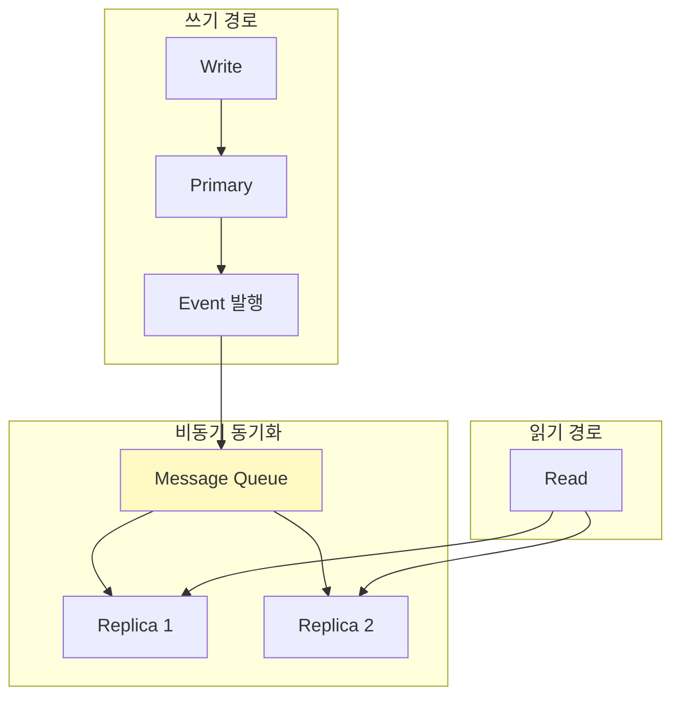
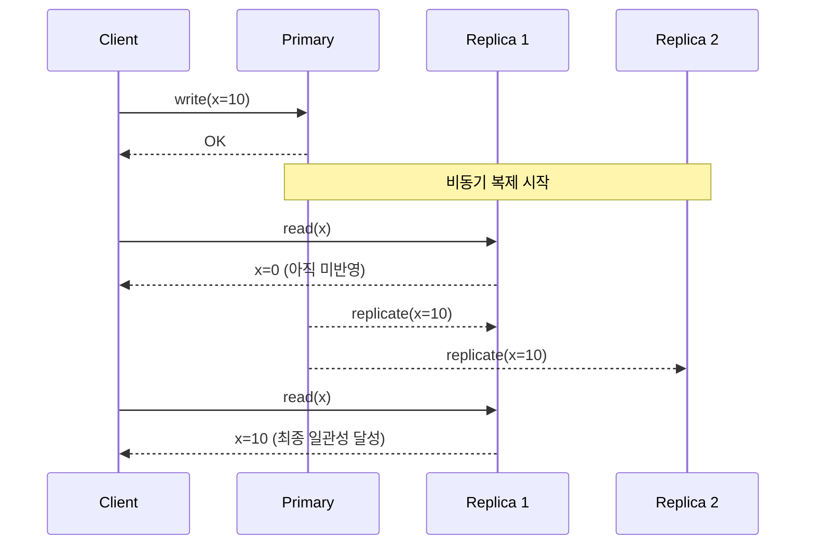

# Eventual Consistency 패턴

## 정의

Eventual Consistency는 분산 시스템에서 일시적인 불일치를 허용하되, 최종적으로는 모든 노드가 동일한 상태에 도달함을 보장하는 일관성 모델입니다.

## 🎯 한눈에 보기

| 항목 | 설명 |
|------|------|
| **핵심** | "지금 당장"이 아닌 "결국에는" 일관성 |
| **비유** | 은행 잔액 문자 (실시간 아님, 나중에 맞음) |
| **언제** | 높은 가용성, 대규모 분산 시스템 |
| **도구** | Kafka, RabbitMQ, Event Sourcing |

> **💡 CAP 정리에서 가용성을 선택할 때...**
>
> ```
> Strong Consistency: 쓰기 → 모든 읽기에서 즉시 반영 (느림)
> Eventual Consistency: 쓰기 → 일부 읽기 지연 → 최종 동기화 (빠름)
> ```

## 구조 (Structure)



## 시간에 따른 일관성



## 기본 예제

### 이벤트 기반 동기화

```java
// 주문 서비스 (Primary)
@Service
@RequiredArgsConstructor
public class OrderService {

    private final OrderRepository orderRepo;
    private final ApplicationEventPublisher eventPublisher;

    @Transactional
    public Order createOrder(OrderRequest request) {
        Order order = Order.create(request);
        orderRepo.save(order);

        // 이벤트 발행 (비동기 처리)
        eventPublisher.publishEvent(new OrderCreatedEvent(order));

        return order;  // 즉시 응답 (다른 서비스는 나중에 동기화)
    }
}

// 재고 서비스 (Eventually Consistent)
@Service
@RequiredArgsConstructor
public class InventoryEventHandler {

    private final InventoryRepository inventoryRepo;

    @EventListener
    @Async
    public void handleOrderCreated(OrderCreatedEvent event) {
        // 비동기로 재고 차감 (지연 발생 가능)
        Inventory inventory = inventoryRepo
            .findByProductId(event.getProductId());
        inventory.decrease(event.getQuantity());
        inventoryRepo.save(inventory);
    }
}
```

### Kafka 기반 구현

```java
// Producer: 주문 서비스
@Service
@RequiredArgsConstructor
public class OrderService {

    private final KafkaTemplate<String, OrderEvent> kafkaTemplate;
    private final OrderRepository orderRepo;

    @Transactional
    public Order createOrder(OrderRequest request) {
        Order order = orderRepo.save(Order.create(request));

        // 이벤트 발행 (Outbox 패턴 권장)
        kafkaTemplate.send("order-events",
            order.getId().toString(),
            new OrderCreatedEvent(order));

        return order;
    }
}

// Consumer: 검색 서비스 (읽기 모델)
@Service
public class SearchIndexConsumer {

    private final SearchIndexRepository searchRepo;

    @KafkaListener(topics = "order-events", groupId = "search-service")
    public void handleOrderEvent(OrderEvent event) {
        if (event instanceof OrderCreatedEvent created) {
            // 검색 인덱스 비동기 업데이트
            searchRepo.index(created.toSearchDocument());
        }
    }
}
```

### 읽기 모델 동기화 (CQRS)

```java
// Command 측: 쓰기 담당
@Service
public class ProductCommandService {

    private final ProductRepository productRepo;
    private final EventPublisher eventPublisher;

    @Transactional
    public void updatePrice(Long productId, BigDecimal newPrice) {
        Product product = productRepo.findById(productId);
        product.setPrice(newPrice);
        productRepo.save(product);

        eventPublisher.publish(new PriceChangedEvent(productId, newPrice));
    }
}

// Query 측: 읽기 담당 (Eventually Consistent)
@Service
public class ProductQueryService {

    private final ProductReadRepository readRepo;  // Redis 또는 Elasticsearch

    @EventListener
    public void onPriceChanged(PriceChangedEvent event) {
        // 읽기 모델 비동기 업데이트
        ProductView view = readRepo.findById(event.getProductId());
        view.setPrice(event.getNewPrice());
        view.setLastUpdated(Instant.now());
        readRepo.save(view);
    }

    public ProductView getProduct(Long productId) {
        // 읽기 모델에서 조회 (최신 가격이 아닐 수 있음)
        return readRepo.findById(productId);
    }
}
```

### 버전 기반 충돌 해결

```java
@Entity
public class Document {

    @Id
    private String id;
    private String content;

    @Version
    private Long version;  // 낙관적 락

    private Instant lastModified;
    private String lastModifiedBy;
}

@Service
public class DocumentService {

    private final DocumentRepository repo;

    public Document update(String id, String content, Long expectedVersion) {
        Document doc = repo.findById(id);

        // 버전 충돌 감지
        if (!doc.getVersion().equals(expectedVersion)) {
            throw new ConflictException(
                "Document was modified by another user. " +
                "Expected version: " + expectedVersion +
                ", Current: " + doc.getVersion()
            );
        }

        doc.setContent(content);
        return repo.save(doc);  // 자동 버전 증가
    }
}
```

## 일관성 전략

| 전략 | 설명 | 사용 시점 |
|------|------|----------|
| **Last Write Wins** | 마지막 쓰기가 승리 | 단순, 충돌 드뭄 |
| **First Write Wins** | 첫 쓰기가 승리 | 중복 방지 |
| **Version Vector** | 버전 비교로 병합 | 동시 편집 |
| **CRDT** | 자동 병합 가능 자료구조 | 분산 협업 |

## 장단점

### 장점
- 높은 가용성
- 확장성 용이
- 지연 시간 최소화
- 네트워크 파티션 허용

### 단점
| 단점 | 해결책 |
|------|--------|
| 읽기 지연 | 읽기 후 확인 UI |
| 충돌 가능 | 버전 관리, CRDT |
| 디버깅 어려움 | 이벤트 추적 로그 |
| 복잡한 비즈니스 로직 | 도메인 이벤트 설계 |

## 주의사항

```java
// ⚠️ Eventual Consistency 적용 시 고려사항

// 1. 사용자 기대 관리 - UI에서 명확히 표시
public OrderResponse createOrder(OrderRequest request) {
    Order order = orderService.create(request);
    return OrderResponse.builder()
        .orderId(order.getId())
        .status("PROCESSING")  // "CONFIRMED"가 아님
        .message("주문이 접수되었습니다. 잠시 후 확인됩니다.")
        .build();
}

// 2. 멱등성 보장 - 중복 이벤트 처리
@KafkaListener(topics = "events")
public void handle(Event event) {
    if (processedEventIds.contains(event.getId())) {
        return;  // 이미 처리됨
    }
    process(event);
    processedEventIds.add(event.getId());
}

// 3. 순서 보장이 필요한 경우 - 파티션 키 사용
kafkaTemplate.send("events",
    userId,  // 같은 사용자 이벤트는 같은 파티션
    event);
```

## 관련 패턴

| 패턴 | 관계 |
|------|------|
| [CQRS](../../distributed/CQRS) | 읽기/쓰기 분리로 활용 |
| [Event Sourcing](../../distributed/EventSourcing) | 이벤트 기반 상태 |
| [Outbox](../../messaging/Outbox) | 이벤트 발행 보장 |
| [Saga](../../distributed/Saga) | 분산 트랜잭션 대안 |
