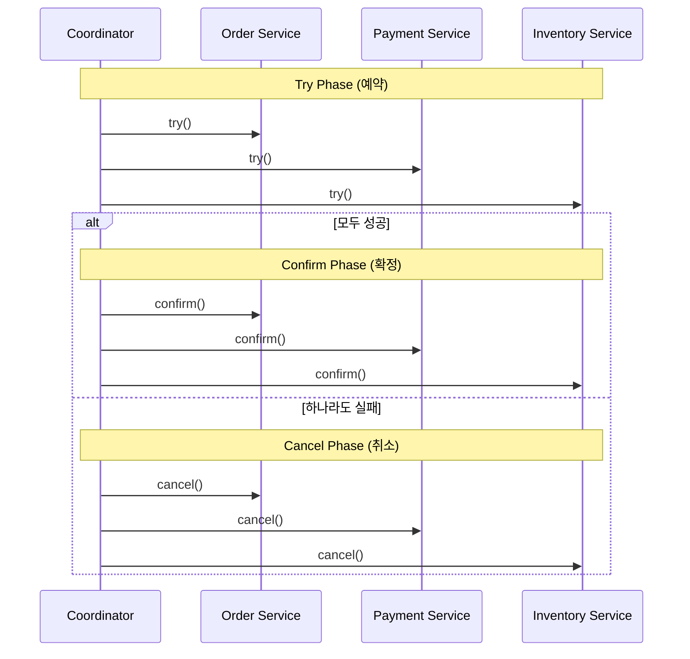
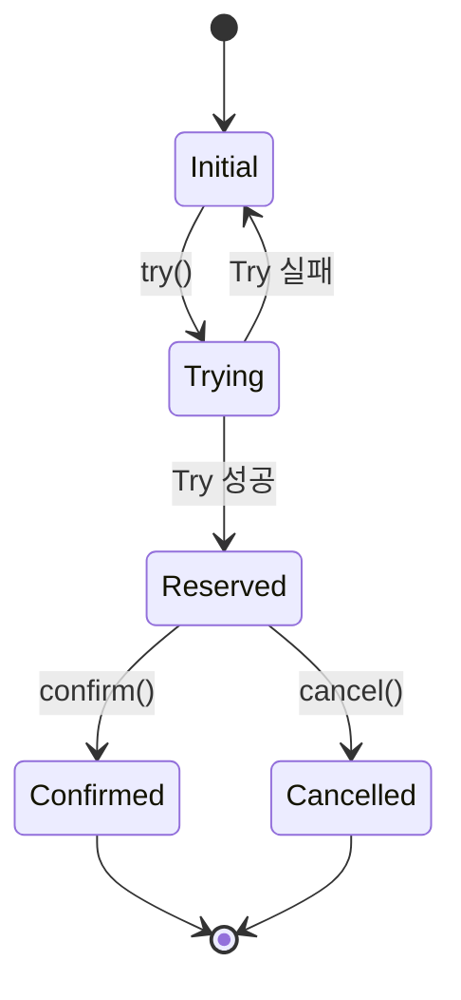

# TCC (Try-Confirm-Cancel) 패턴

## 정의

TCC는 비즈니스 로직 레벨에서 분산 트랜잭션을 처리하는 패턴입니다. Try로 리소스를 예약하고, Confirm으로 확정하거나, Cancel로 취소합니다.

## 🎯 한눈에 보기

| 항목 | 설명 |
|------|------|
| **핵심** | Try(예약) → Confirm(확정) or Cancel(취소) |
| **비유** | 호텔 예약 → 확정 or 취소 |
| **언제** | 리소스 예약이 가능한 비즈니스 |
| **구현** | Seata, Hmily, ByteTCC |

> **💡 주문-결제-재고를 동시에 처리할 때...**
>
> ```
> Try:     재고 예약 + 잔액 차감 예약 + 주문 생성(pending)
> Confirm: 재고 확정 + 잔액 확정 + 주문 확정
> Cancel:  재고 복원 + 잔액 복원 + 주문 취소
> ```

## 구조 (Structure)



## TCC 상태 흐름



## 기본 예제

### TCC 인터페이스 정의

```java
public interface TccService<T> {

    // 1단계: 리소스 예약
    boolean tryAction(T request);

    // 2단계: 예약 확정
    boolean confirm(T request);

    // 2단계: 예약 취소
    boolean cancel(T request);
}
```

### 재고 서비스 TCC 구현

```java
@Service
@RequiredArgsConstructor
public class InventoryTccService implements TccService<OrderRequest> {

    private final InventoryRepository repository;
    private final ReservationRepository reservationRepo;

    @Override
    @Transactional
    public boolean tryAction(OrderRequest request) {
        Inventory inventory = repository.findByProductId(request.getProductId());

        // 가용 재고 확인
        if (inventory.getAvailable() < request.getQuantity()) {
            return false;
        }

        // 재고 예약 (가용 재고 감소, 예약 재고 증가)
        inventory.reserve(request.getQuantity());
        repository.save(inventory);

        // 예약 기록 저장 (취소 시 필요)
        reservationRepo.save(new Reservation(
            request.getTransactionId(),
            request.getProductId(),
            request.getQuantity(),
            ReservationStatus.RESERVED
        ));

        return true;
    }

    @Override
    @Transactional
    public boolean confirm(OrderRequest request) {
        Reservation reservation = reservationRepo
            .findByTransactionId(request.getTransactionId());

        if (reservation == null || reservation.isConfirmed()) {
            return true;  // 멱등성: 이미 확정됨
        }

        // 예약 재고를 실제 차감으로 전환
        Inventory inventory = repository.findByProductId(request.getProductId());
        inventory.confirmReservation(reservation.getQuantity());
        repository.save(inventory);

        reservation.setStatus(ReservationStatus.CONFIRMED);
        reservationRepo.save(reservation);

        return true;
    }

    @Override
    @Transactional
    public boolean cancel(OrderRequest request) {
        Reservation reservation = reservationRepo
            .findByTransactionId(request.getTransactionId());

        if (reservation == null || reservation.isCancelled()) {
            return true;  // 멱등성: 이미 취소됨
        }

        // 예약 재고 복원
        Inventory inventory = repository.findByProductId(request.getProductId());
        inventory.cancelReservation(reservation.getQuantity());
        repository.save(inventory);

        reservation.setStatus(ReservationStatus.CANCELLED);
        reservationRepo.save(reservation);

        return true;
    }
}
```

### TCC Coordinator 구현

```java
@Service
@RequiredArgsConstructor
@Slf4j
public class TccCoordinator {

    private final OrderTccService orderService;
    private final PaymentTccService paymentService;
    private final InventoryTccService inventoryService;

    @Transactional
    public void executeOrder(OrderRequest request) {
        String txId = UUID.randomUUID().toString();
        request.setTransactionId(txId);

        List<TccService<OrderRequest>> participants = List.of(
            inventoryService, paymentService, orderService
        );

        // Try Phase
        List<TccService<OrderRequest>> succeeded = new ArrayList<>();
        boolean allTrySuccess = true;

        for (TccService<OrderRequest> participant : participants) {
            try {
                if (participant.tryAction(request)) {
                    succeeded.add(participant);
                } else {
                    allTrySuccess = false;
                    break;
                }
            } catch (Exception e) {
                log.error("Try failed for {}", participant.getClass(), e);
                allTrySuccess = false;
                break;
            }
        }

        // Confirm or Cancel
        if (allTrySuccess) {
            confirmAll(succeeded, request);
        } else {
            cancelAll(succeeded, request);
            throw new TccException("Transaction failed, rolled back");
        }
    }

    private void confirmAll(List<TccService<OrderRequest>> services,
                           OrderRequest request) {
        for (TccService<OrderRequest> service : services) {
            try {
                service.confirm(request);
            } catch (Exception e) {
                log.error("Confirm failed, will retry", e);
                // 재시도 로직 또는 보상 처리
            }
        }
    }

    private void cancelAll(List<TccService<OrderRequest>> services,
                          OrderRequest request) {
        for (TccService<OrderRequest> service : services) {
            try {
                service.cancel(request);
            } catch (Exception e) {
                log.error("Cancel failed, will retry", e);
                // 재시도 로직
            }
        }
    }
}
```

### Inventory 엔티티

```java
@Entity
@Data
public class Inventory {

    @Id
    private Long productId;
    private int total;      // 전체 재고
    private int reserved;   // 예약된 재고
    private int available;  // 가용 재고 (total - reserved)

    public void reserve(int quantity) {
        this.reserved += quantity;
        this.available -= quantity;
    }

    public void confirmReservation(int quantity) {
        this.reserved -= quantity;
        this.total -= quantity;
    }

    public void cancelReservation(int quantity) {
        this.reserved -= quantity;
        this.available += quantity;
    }
}
```

## TCC vs 2PC

| 항목 | 2PC | TCC |
|------|-----|-----|
| **레벨** | 인프라 (XA) | 비즈니스 로직 |
| **락 범위** | DB 레벨 락 | 비즈니스 레벨 예약 |
| **성능** | 낮음 (Blocking) | 상대적 높음 |
| **구현** | 드라이버 지원 | 직접 구현 필요 |
| **유연성** | 제한적 | 높음 |

## 장단점

### 장점
- 2PC보다 나은 성능
- 비즈니스 로직 레벨 제어
- DB 락 최소화
- 타임아웃/재시도 유연

### 단점
- 구현 복잡도 높음
- 세 가지 메서드 모두 구현 필요
- 멱등성 보장 필수
- 비즈니스 침투적

## 주의사항

```java
// ⚠️ TCC 구현 시 필수 고려사항

// 1. 멱등성: 같은 요청 여러 번 와도 동일 결과
public boolean confirm(Request req) {
    if (alreadyConfirmed(req.getTxId())) {
        return true;  // 중복 요청 허용
    }
    // ...
}

// 2. 타임아웃: Try 후 일정 시간 내 Confirm/Cancel 없으면 자동 Cancel
@Scheduled(fixedRate = 60000)
public void cleanupExpiredReservations() {
    reservationRepo.findExpired(Duration.ofMinutes(5))
        .forEach(this::cancel);
}

// 3. 순서 보장: Cancel이 Try보다 먼저 올 수 있음
public boolean cancel(Request req) {
    Reservation r = find(req.getTxId());
    if (r == null) {
        // Try가 아직 안 왔을 수 있음 - 빈 취소 기록 생성
        saveEmptyCancel(req.getTxId());
        return true;
    }
    // ...
}
```

## 관련 패턴

| 패턴 | 관계 |
|------|------|
| [Saga](../../distributed/Saga) | 보상 트랜잭션 방식 |
| [Two-Phase Commit](../TwoPhaseCommit) | DB 레벨 원자성 |
| [Idempotency](../../api-security/Idempotency) | 멱등성 보장 |
