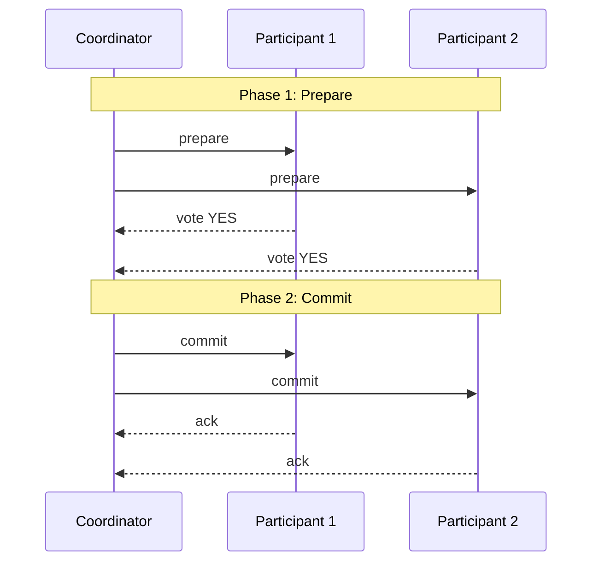
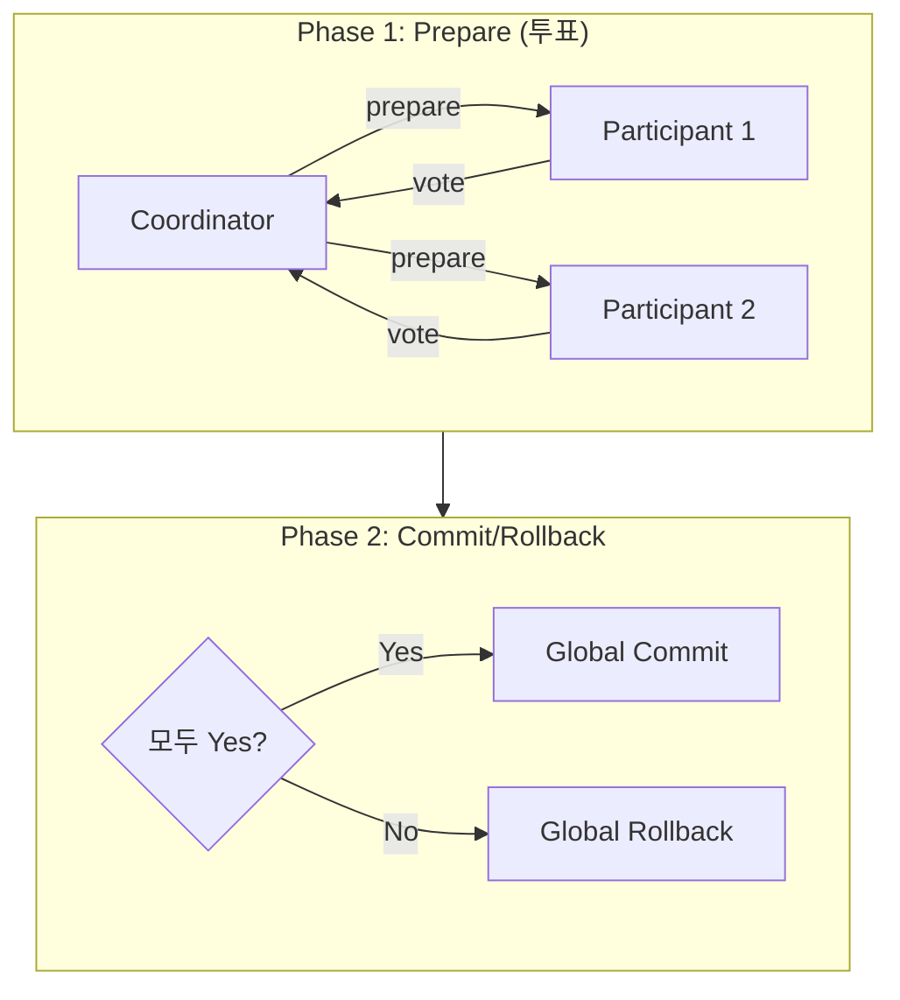

# Two-Phase Commit (2PC) 패턴

## 정의

Two-Phase Commit은 분산 시스템에서 여러 노드가 참여하는 트랜잭션의 원자성(Atomicity)을 보장하는 프로토콜입니다. 모든 참여자가 커밋하거나, 모두 롤백합니다.

## 🎯 한눈에 보기

| 항목 | 설명 |
|------|------|
| **핵심** | 전체 커밋 또는 전체 롤백 |
| **비유** | 결혼식 주례 "이의 있습니까?" |
| **언제** | 강한 일관성 필수, 분산 트랜잭션 |
| **도구** | JTA, Atomikos, Narayana |

> **💡 여러 DB에 동시 저장이 필요할 때...**
>
> ```
> Phase 1 (Prepare): 모든 참여자에게 "커밋 가능?" 질문
> Phase 2 (Commit):  모두 "Yes" → 커밋 / 하나라도 "No" → 롤백
> ```

## 구조 (Structure)



## 2단계 프로세스



## 기본 예제

### JTA (Java Transaction API)

```java
@Configuration
public class JtaConfig {

    @Bean
    public JtaTransactionManager transactionManager() {
        return new JtaTransactionManager();
    }
}

@Service
@RequiredArgsConstructor
public class OrderService {

    private final UserTransaction userTransaction;
    private final OrderRepository orderRepo;      // DB1
    private final InventoryRepository inventoryRepo;  // DB2

    public void createOrder(Order order) throws Exception {
        userTransaction.begin();

        try {
            // Phase 1: 각 리소스에 작업 수행 (내부적으로 prepare)
            orderRepo.save(order);
            inventoryRepo.decrease(order.getProductId(), order.getQuantity());

            // Phase 2: 모두 성공하면 commit
            userTransaction.commit();

        } catch (Exception e) {
            // 하나라도 실패하면 rollback
            userTransaction.rollback();
            throw e;
        }
    }
}
```

### Atomikos 설정

```java
@Configuration
public class AtomikosConfig {

    @Bean
    @Primary
    public DataSource orderDataSource() {
        AtomikosDataSourceBean ds = new AtomikosDataSourceBean();
        ds.setUniqueResourceName("orderDB");
        ds.setXaDataSourceClassName("com.mysql.cj.jdbc.MysqlXADataSource");
        ds.setXaProperties(orderDbProperties());
        return ds;
    }

    @Bean
    public DataSource inventoryDataSource() {
        AtomikosDataSourceBean ds = new AtomikosDataSourceBean();
        ds.setUniqueResourceName("inventoryDB");
        ds.setXaDataSourceClassName("com.mysql.cj.jdbc.MysqlXADataSource");
        ds.setXaProperties(inventoryDbProperties());
        return ds;
    }

    @Bean
    public JtaTransactionManager transactionManager() {
        UserTransactionManager utm = new UserTransactionManager();
        UserTransactionImp ut = new UserTransactionImp();
        return new JtaTransactionManager(ut, utm);
    }
}
```

### Spring @Transactional with JTA

```java
@Service
@Transactional  // JTA TransactionManager 사용 시 분산 트랜잭션
public class TransferService {

    private final AccountRepository accountRepo;  // DB1
    private final AuditRepository auditRepo;      // DB2

    public void transfer(String from, String to, BigDecimal amount) {
        // 두 DB 작업이 하나의 트랜잭션으로 묶임
        accountRepo.withdraw(from, amount);
        accountRepo.deposit(to, amount);
        auditRepo.log(new AuditLog(from, to, amount));
        // 메서드 종료 시 2PC로 커밋
    }
}
```

## 실패 시나리오

| 시나리오 | Phase 1 | Phase 2 | 결과 |
|----------|---------|---------|------|
| 정상 | 모두 Yes | Commit | ✅ 성공 |
| 참여자 거부 | 하나 No | Rollback | ↩️ 전체 롤백 |
| 참여자 장애 | Timeout | Rollback | ↩️ 전체 롤백 |
| Coordinator 장애 | - | Blocking | ⚠️ 참여자 대기 |

## 장단점

### 장점
- 강한 일관성 보장 (ACID)
- 표준화된 프로토콜 (XA)
- 여러 리소스 원자적 처리

### 단점
| 단점 | 설명 |
|------|------|
| **Blocking** | Coordinator 장애 시 참여자 무한 대기 |
| **성능** | 동기 방식으로 지연 발생 |
| **확장성** | 참여자 증가 시 성능 저하 |
| **단일 실패점** | Coordinator가 SPOF |

## 주의사항

```java
// ❌ 2PC는 마이크로서비스에 부적합
// - 네트워크 지연
// - 서비스 간 강한 결합
// - 확장성 제한

// ✅ 대안 고려
// - Saga 패턴 (보상 트랜잭션)
// - TCC 패턴 (Try-Confirm-Cancel)
// - Eventual Consistency
```

## 관련 패턴

| 패턴 | 관계 |
|------|------|
| [Saga](../../distributed/Saga) | 2PC 대안 (긴 트랜잭션) |
| [TCC](../TCC) | 2PC 변형 (비즈니스 레벨) |
| [Eventual Consistency](../EventualConsistency) | 약한 일관성 대안 |
