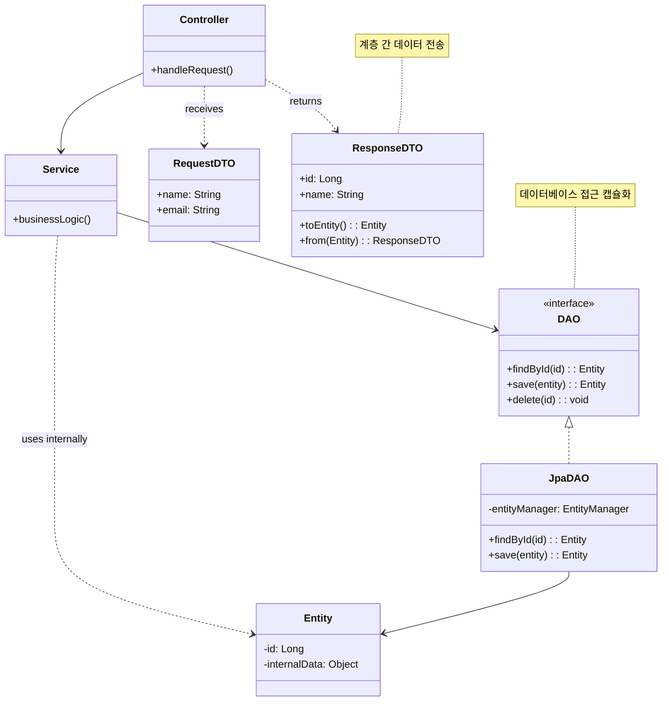
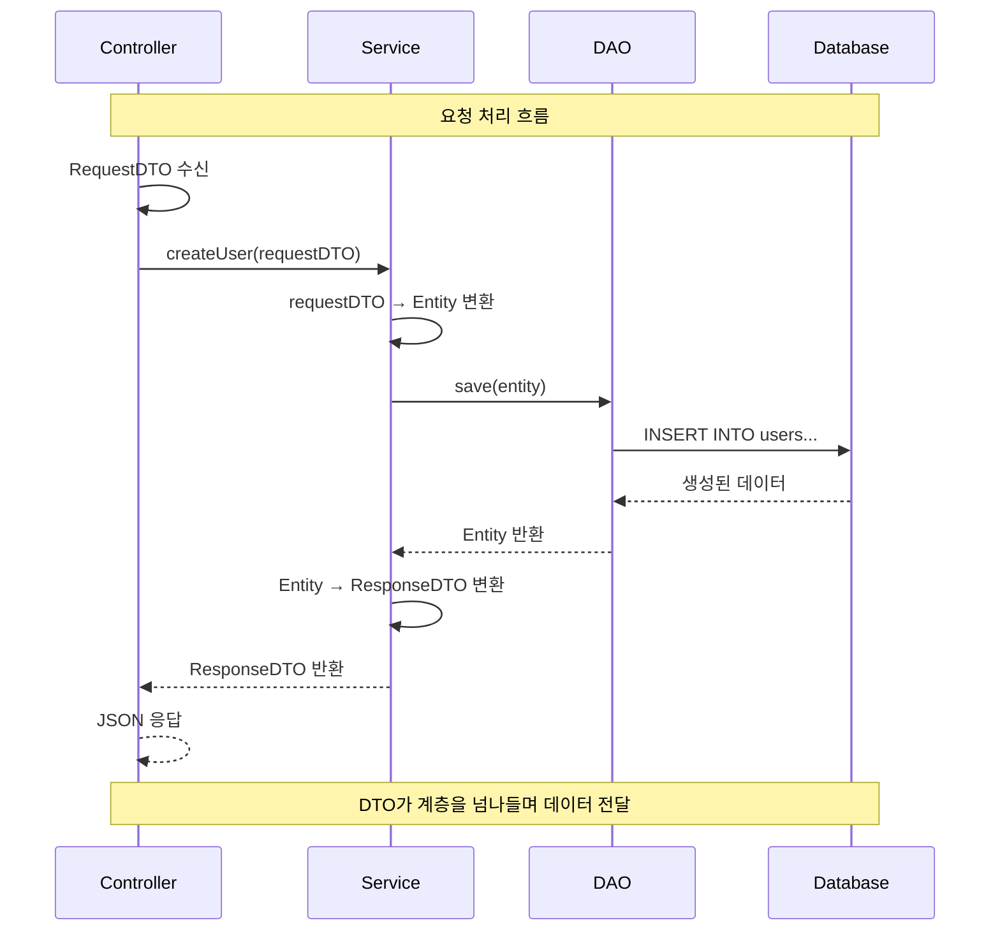

# DTO/DAO 패턴 (Data Transfer Object / Data Access Object)

## 정의

**DAO (Data Access Object)**: 데이터베이스 접근 로직을 캡슐화하여 비즈니스 로직과 분리하는 패턴입니다.

**DTO (Data Transfer Object)**: 계층 간 데이터 전송을 위한 객체로, 여러 데이터를 하나로 묶어 전달합니다.

## 🎯 한눈에 보기

| 항목 | 설명 |
|------|------|
| **핵심** | DAO는 DB 접근 분리, DTO는 데이터 운반 객체 |
| **비유** | DAO는 창고 직원, DTO는 배송 상자 |
| **언제** | 계층 간 데이터 전달, DB 접근 로직 분리가 필요할 때 |
| **Spring** | `@Repository` (DAO), `record` 또는 클래스 (DTO) |

> **💡 사용자 정보를 API로 반환할 때...**
>
> **❌ Before (엔티티 직접 노출)**
> ```java
> @GetMapping("/users/{id}")
> public User getUser(@PathVariable Long id) {
>     return userRepository.findById(id);  // 비밀번호, 내부 필드까지 노출!
> }
> ```
>
> **✅ After (DTO 사용)**
> ```java
> @GetMapping("/users/{id}")
> public UserResponse getUser(@PathVariable Long id) {
>     User user = userRepository.findById(id);
>     return UserResponse.from(user);  // 필요한 정보만 담아서 반환
> }
> ```

## 구조 (Structure)



## 동작 흐름 (시퀀스 다이어그램)



## 사용 이유

### 1. DAO의 장점

```java
// 비즈니스 로직과 데이터 접근 로직 분리
@Service
public class OrderService {
    private final OrderDao orderDao;  // DAO에 위임

    public void processOrder(Long orderId) {
        Order order = orderDao.findById(orderId);  // DB 접근은 DAO가
        order.process();                            // 비즈니스 로직만 집중
        orderDao.save(order);
    }
}
```

### 2. DTO의 장점

```java
// 엔티티 직접 노출 방지
@Entity
public class User {
    private Long id;
    private String name;
    private String password;      // 노출하면 안 됨!
    private String socialNumber;  // 노출하면 안 됨!
    private LocalDateTime createdAt;
}

// DTO로 필요한 정보만 전달
public record UserResponse(
    Long id,
    String name,
    LocalDateTime createdAt
) {
    public static UserResponse from(User user) {
        return new UserResponse(user.getId(), user.getName(), user.getCreatedAt());
    }
}
```

### 3. API 버전 관리 용이

```java
// API v1
public record UserResponseV1(Long id, String name) {}

// API v2 - 필드 추가해도 v1에 영향 없음
public record UserResponseV2(Long id, String name, String email, String phone) {}
```

## 적용 상황

### 1. REST API 응답/요청
```java
// 요청 DTO
public record CreateUserRequest(
    @NotBlank String name,
    @Email String email,
    @Size(min = 8) String password
) {}

// 응답 DTO
public record UserResponse(Long id, String name, String email) {}
```

### 2. 계층 간 데이터 전달
```java
// 검색 조건 DTO
public record UserSearchCondition(
    String name,
    UserStatus status,
    LocalDate startDate,
    LocalDate endDate
) {}
```

### 3. 외부 API 연동
```java
// 외부 결제 API 요청 DTO
public record PaymentRequest(
    String merchantId,
    BigDecimal amount,
    String currency
) {}
```

## 🔰 5분 만에 이해하기 - 초급 예제

```java
// 1. Entity (DB 테이블과 매핑)
class User {
    private Long id;
    private String name;
    private String email;
    private String password;  // 민감 정보

    // 생성자, getter, setter 생략
}

// 2. DAO (데이터베이스 접근 담당)
interface UserDao {
    User findById(Long id);
    List<User> findAll();
    void save(User user);
    void delete(Long id);
}

class JdbcUserDao implements UserDao {
    // 실제로는 JDBC, JPA 등을 사용
    private Map<Long, User> database = new HashMap<>();
    private Long sequence = 0L;

    @Override
    public User findById(Long id) {
        return database.get(id);
    }

    @Override
    public List<User> findAll() {
        return new ArrayList<>(database.values());
    }

    @Override
    public void save(User user) {
        if (user.getId() == null) {
            user.setId(++sequence);
        }
        database.put(user.getId(), user);
    }

    @Override
    public void delete(Long id) {
        database.remove(id);
    }
}

// 3. DTO (계층 간 데이터 전송)
// 요청 DTO
record CreateUserRequest(String name, String email, String password) {
    public User toEntity() {
        return new User(null, name, email, password);
    }
}

// 응답 DTO (비밀번호 제외!)
record UserResponse(Long id, String name, String email) {
    public static UserResponse from(User user) {
        return new UserResponse(user.getId(), user.getName(), user.getEmail());
    }
}

// 4. Service
class UserService {
    private final UserDao userDao;

    public UserService(UserDao userDao) {
        this.userDao = userDao;
    }

    public UserResponse createUser(CreateUserRequest request) {
        User user = request.toEntity();      // DTO → Entity
        userDao.save(user);                  // DAO로 저장
        return UserResponse.from(user);      // Entity → DTO
    }

    public UserResponse getUser(Long id) {
        User user = userDao.findById(id);    // DAO로 조회
        return UserResponse.from(user);      // Entity → DTO
    }

    public List<UserResponse> getAllUsers() {
        return userDao.findAll().stream()
            .map(UserResponse::from)
            .toList();
    }
}

// 5. 사용 예시
public class Main {
    public static void main(String[] args) {
        UserDao dao = new JdbcUserDao();
        UserService service = new UserService(dao);

        // 사용자 생성 (DTO 사용)
        CreateUserRequest request = new CreateUserRequest("홍길동", "hong@example.com", "secret123");
        UserResponse created = service.createUser(request);

        System.out.println("생성된 사용자: " + created);
        // 출력: UserResponse[id=1, name=홍길동, email=hong@example.com]
        // password는 응답에 포함되지 않음!
    }
}
```

## Spring Boot 예제

### 1. Entity

```java
@Entity
@Table(name = "users")
@Getter
@NoArgsConstructor(access = AccessLevel.PROTECTED)
public class User {

    @Id
    @GeneratedValue(strategy = GenerationType.IDENTITY)
    private Long id;

    @Column(nullable = false)
    private String name;

    @Column(nullable = false, unique = true)
    private String email;

    @Column(nullable = false)
    private String password;  // 민감 정보!

    @Column(name = "social_number")
    private String socialNumber;  // 민감 정보!

    @Enumerated(EnumType.STRING)
    private UserStatus status = UserStatus.ACTIVE;

    @CreatedDate
    private LocalDateTime createdAt;

    @LastModifiedDate
    private LocalDateTime updatedAt;

    @Builder
    public User(String name, String email, String password) {
        this.name = name;
        this.email = email;
        this.password = password;
    }
}
```

### 2. DTO 클래스들

```java
// 요청 DTO
public class UserRequest {

    // 생성 요청
    @Getter
    public static class Create {
        @NotBlank(message = "이름은 필수입니다")
        private String name;

        @Email(message = "올바른 이메일 형식이 아닙니다")
        @NotBlank(message = "이메일은 필수입니다")
        private String email;

        @Size(min = 8, message = "비밀번호는 8자 이상이어야 합니다")
        private String password;

        public User toEntity(PasswordEncoder encoder) {
            return User.builder()
                .name(name)
                .email(email)
                .password(encoder.encode(password))
                .build();
        }
    }

    // 수정 요청
    @Getter
    public static class Update {
        private String name;
        private String email;
    }
}

// 응답 DTO (Java 16+ record 사용)
public record UserResponse(
    Long id,
    String name,
    String email,
    UserStatus status,
    LocalDateTime createdAt
) {
    public static UserResponse from(User user) {
        return new UserResponse(
            user.getId(),
            user.getName(),
            user.getEmail(),
            user.getStatus(),
            user.getCreatedAt()
        );
    }
}

// 목록 조회용 간단한 DTO
public record UserSummary(Long id, String name) {
    public static UserSummary from(User user) {
        return new UserSummary(user.getId(), user.getName());
    }
}

// 페이지 응답 DTO
public record PageResponse<T>(
    List<T> content,
    int page,
    int size,
    long totalElements,
    int totalPages,
    boolean hasNext
) {
    public static <T> PageResponse<T> from(Page<T> page) {
        return new PageResponse<>(
            page.getContent(),
            page.getNumber(),
            page.getSize(),
            page.getTotalElements(),
            page.getTotalPages(),
            page.hasNext()
        );
    }
}
```

### 3. DAO/Repository

```java
// Spring Data JPA를 사용한 DAO
@Repository
public interface UserRepository extends JpaRepository<User, Long> {

    Optional<User> findByEmail(String email);

    List<User> findByStatus(UserStatus status);

    boolean existsByEmail(String email);

    @Query("SELECT new com.example.dto.UserSummary(u.id, u.name) FROM User u")
    List<UserSummary> findAllSummary();
}

// 복잡한 쿼리를 위한 커스텀 DAO
@Repository
@RequiredArgsConstructor
public class UserQueryDao {

    private final JPAQueryFactory queryFactory;

    public List<UserResponse> searchUsers(UserSearchCondition condition) {
        QUser user = QUser.user;

        return queryFactory
            .select(Projections.constructor(UserResponse.class,
                user.id,
                user.name,
                user.email,
                user.status,
                user.createdAt
            ))
            .from(user)
            .where(
                nameContains(condition.name()),
                statusEquals(condition.status())
            )
            .fetch();
    }
}
```

### 4. Service

```java
@Service
@RequiredArgsConstructor
@Transactional(readOnly = true)
public class UserService {

    private final UserRepository userRepository;
    private final PasswordEncoder passwordEncoder;

    @Transactional
    public UserResponse createUser(UserRequest.Create request) {
        // 이메일 중복 체크
        if (userRepository.existsByEmail(request.getEmail())) {
            throw new DuplicateEmailException(request.getEmail());
        }

        // DTO → Entity
        User user = request.toEntity(passwordEncoder);
        User saved = userRepository.save(user);

        // Entity → DTO
        return UserResponse.from(saved);
    }

    public UserResponse getUser(Long id) {
        User user = userRepository.findById(id)
            .orElseThrow(() -> new UserNotFoundException(id));
        return UserResponse.from(user);
    }

    public PageResponse<UserResponse> getUsers(Pageable pageable) {
        Page<User> page = userRepository.findAll(pageable);
        Page<UserResponse> dtoPage = page.map(UserResponse::from);
        return PageResponse.from(dtoPage);
    }

    public List<UserSummary> getUserSummaries() {
        // Repository에서 직접 DTO로 조회 (성능 최적화)
        return userRepository.findAllSummary();
    }
}
```

### 5. Controller

```java
@RestController
@RequestMapping("/api/users")
@RequiredArgsConstructor
public class UserController {

    private final UserService userService;

    @PostMapping
    public ResponseEntity<UserResponse> createUser(
        @Valid @RequestBody UserRequest.Create request
    ) {
        UserResponse response = userService.createUser(request);
        return ResponseEntity.status(HttpStatus.CREATED).body(response);
    }

    @GetMapping("/{id}")
    public ResponseEntity<UserResponse> getUser(@PathVariable Long id) {
        return ResponseEntity.ok(userService.getUser(id));
    }

    @GetMapping
    public ResponseEntity<PageResponse<UserResponse>> getUsers(
        @PageableDefault(size = 20) Pageable pageable
    ) {
        return ResponseEntity.ok(userService.getUsers(pageable));
    }

    @GetMapping("/summary")
    public ResponseEntity<List<UserSummary>> getUserSummaries() {
        return ResponseEntity.ok(userService.getUserSummaries());
    }
}
```

### 6. MapStruct를 활용한 매핑 자동화

```java
// build.gradle
// implementation 'org.mapstruct:mapstruct:1.5.5.Final'
// annotationProcessor 'org.mapstruct:mapstruct-processor:1.5.5.Final'

@Mapper(componentModel = "spring")
public interface UserMapper {

    @Mapping(target = "id", ignore = true)
    @Mapping(target = "password", ignore = true)
    User toEntity(UserRequest.Create request);

    UserResponse toResponse(User user);

    List<UserResponse> toResponseList(List<User> users);

    @BeanMapping(nullValuePropertyMappingStrategy = NullValuePropertyMappingStrategy.IGNORE)
    void updateFromDto(UserRequest.Update dto, @MappingTarget User entity);
}

// Service에서 사용
@Service
@RequiredArgsConstructor
public class UserService {
    private final UserMapper userMapper;

    public UserResponse createUser(UserRequest.Create request) {
        User user = userMapper.toEntity(request);
        return userMapper.toResponse(userRepository.save(user));
    }
}
```

## 장단점

### 장점 ✅

| 장점 | 설명 |
|------|------|
| **보안** | 민감 정보를 API 응답에서 제외 |
| **유연성** | API 스펙과 DB 스키마 독립적 관리 |
| **계층 분리** | 명확한 책임 분리로 유지보수 용이 |
| **직렬화 제어** | JSON 변환 시 필요한 필드만 포함 |
| **버전 관리** | API 버전별 다른 DTO 사용 가능 |

### 단점 ❌

| 단점 | 설명 |
|------|------|
| **보일러플레이트** | Entity ↔ DTO 변환 코드 반복 |
| **클래스 증가** | 요청/응답별 DTO 클래스 필요 |
| **동기화 어려움** | Entity 변경 시 DTO도 수정 필요 |
| **성능 오버헤드** | 변환 과정에서 객체 생성 비용 |

## 관련 패턴

| 패턴 | 관계 |
|------|------|
| **Repository** | Repository는 도메인 중심, DAO는 데이터 중심 |
| **Factory** | DTO 생성 로직을 Factory로 분리 가능 |
| **Mapper** | Entity ↔ DTO 변환 담당 |

## DTO 설계 가이드

| 상황 | 권장 DTO |
|------|---------|
| 생성 요청 | `XxxRequest.Create` |
| 수정 요청 | `XxxRequest.Update` |
| 상세 응답 | `XxxResponse` |
| 목록 응답 | `XxxSummary` |
| 검색 조건 | `XxxSearchCondition` |
| 페이지 응답 | `PageResponse<T>` |
