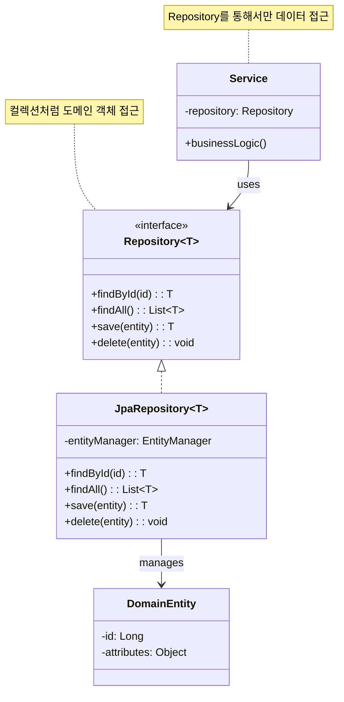
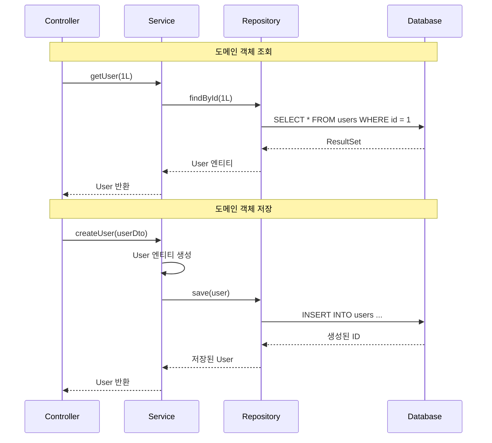

# Repository 패턴 (Repository Pattern)

## 정의

Repository 패턴은 도메인 객체에 접근하는 로직을 캡슐화하여, 도메인 레이어와 데이터 접근 레이어 사이에 추상화 계층을 제공하는 패턴입니다. 마치 인메모리 컬렉션처럼 도메인 객체를 다룰 수 있게 해줍니다.

## 🎯 한눈에 보기

| 항목 | 설명 |
|------|------|
| **핵심** | 도메인 객체를 컬렉션처럼 다루는 추상화 계층 |
| **비유** | 도서관 사서 - 책(도메인)과 서가(DB) 사이의 중재자 |
| **언제** | 도메인 로직과 데이터 접근 로직을 분리하고 싶을 때 |
| **Spring** | `JpaRepository`, `CrudRepository`, Spring Data JPA |

> **💡 사용자 데이터를 조회할 때...**
>
> **❌ Before (서비스에서 직접 쿼리)**
> ```java
> @Service
> public class UserService {
>     @PersistenceContext
>     private EntityManager em;
>
>     public User findUser(Long id) {
>         return em.createQuery("SELECT u FROM User u WHERE u.id = :id", User.class)
>                  .setParameter("id", id)
>                  .getSingleResult();  // 서비스가 쿼리를 알아야 함
>     }
> }
> ```
>
> **✅ After (Repository 패턴)**
> ```java
> @Service
> public class UserService {
>     private final UserRepository userRepository;
>
>     public User findUser(Long id) {
>         return userRepository.findById(id);  // 컬렉션처럼 사용!
>     }
> }
> ```

## 구조 (Structure)



## 동작 흐름 (시퀀스 다이어그램)



## 사용 이유

### 1. 관심사 분리
- **도메인 레이어**: 비즈니스 로직에만 집중
- **Repository**: 데이터 접근 로직 캡슐화
- **결과**: 코드 가독성과 유지보수성 향상

### 2. 테스트 용이성
```java
// Repository를 Mock으로 대체 가능
@Test
void 사용자_조회_테스트() {
    // given
    UserRepository mockRepo = mock(UserRepository.class);
    when(mockRepo.findById(1L)).thenReturn(Optional.of(testUser));

    UserService service = new UserService(mockRepo);

    // when
    User result = service.getUser(1L);

    // then
    assertThat(result).isEqualTo(testUser);
}
```

### 3. 데이터 소스 교체 용이
- JPA → MyBatis 변경 시 Repository 구현체만 교체
- 테스트 시 인메모리 구현체 사용 가능

## 적용 상황

### 1. 도메인 중심 설계 (DDD)
```java
// Aggregate Root에 대한 Repository만 생성
public interface OrderRepository {
    Order findById(Long id);
    void save(Order order);
    // OrderItem은 Order를 통해서만 접근
}
```

### 2. 복잡한 조회 조건
```java
public interface UserRepository {
    List<User> findByStatus(UserStatus status);
    List<User> findByCreatedAtBetween(LocalDateTime start, LocalDateTime end);
    Optional<User> findByEmail(String email);
}
```

### 3. 페이징과 정렬
```java
public interface ProductRepository extends JpaRepository<Product, Long> {
    Page<Product> findByCategory(Category category, Pageable pageable);
}
```

## 🔰 5분 만에 이해하기 - 초급 예제

```java
// 1. 도메인 엔티티
class User {
    private Long id;
    private String name;
    private String email;

    // 생성자, getter, setter
    public User(Long id, String name, String email) {
        this.id = id;
        this.name = name;
        this.email = email;
    }

    // getter, setter 생략
}

// 2. Repository 인터페이스 (컬렉션처럼 사용)
interface UserRepository {
    Optional<User> findById(Long id);
    List<User> findAll();
    User save(User user);
    void deleteById(Long id);
}

// 3. Repository 구현체 (실제 저장소)
class InMemoryUserRepository implements UserRepository {
    private final Map<Long, User> store = new HashMap<>();
    private Long sequence = 0L;

    @Override
    public Optional<User> findById(Long id) {
        return Optional.ofNullable(store.get(id));
    }

    @Override
    public List<User> findAll() {
        return new ArrayList<>(store.values());
    }

    @Override
    public User save(User user) {
        if (user.getId() == null) {
            user.setId(++sequence);
        }
        store.put(user.getId(), user);
        return user;
    }

    @Override
    public void deleteById(Long id) {
        store.remove(id);
    }
}

// 4. Service (Repository를 컬렉션처럼 사용)
class UserService {
    private final UserRepository userRepository;

    public UserService(UserRepository userRepository) {
        this.userRepository = userRepository;
    }

    public User createUser(String name, String email) {
        User user = new User(null, name, email);
        return userRepository.save(user);  // 마치 List.add() 처럼
    }

    public User getUser(Long id) {
        return userRepository.findById(id)  // 마치 List.get() 처럼
            .orElseThrow(() -> new RuntimeException("User not found"));
    }

    public List<User> getAllUsers() {
        return userRepository.findAll();  // 마치 List 자체처럼
    }
}

// 5. 사용 예시
public class Main {
    public static void main(String[] args) {
        UserRepository repository = new InMemoryUserRepository();
        UserService service = new UserService(repository);

        // 사용자 생성
        User user1 = service.createUser("홍길동", "hong@example.com");
        User user2 = service.createUser("김철수", "kim@example.com");

        // 사용자 조회
        User found = service.getUser(user1.getId());
        System.out.println("찾은 사용자: " + found.getName());

        // 전체 사용자 조회
        List<User> all = service.getAllUsers();
        System.out.println("전체 사용자 수: " + all.size());
    }
}
```

**실행 결과:**
```
찾은 사용자: 홍길동
전체 사용자 수: 2
```

## Spring Boot 예제

### 1. 기본 Spring Data JPA Repository

```java
// 1. 엔티티
@Entity
@Table(name = "users")
@Getter @Setter
@NoArgsConstructor
public class User {

    @Id
    @GeneratedValue(strategy = GenerationType.IDENTITY)
    private Long id;

    @Column(nullable = false)
    private String name;

    @Column(nullable = false, unique = true)
    private String email;

    @Enumerated(EnumType.STRING)
    private UserStatus status = UserStatus.ACTIVE;

    @CreatedDate
    private LocalDateTime createdAt;

    public User(String name, String email) {
        this.name = name;
        this.email = email;
    }
}

// 2. Repository 인터페이스 (Spring Data JPA가 구현체 자동 생성)
public interface UserRepository extends JpaRepository<User, Long> {

    // 메서드 이름으로 쿼리 자동 생성
    Optional<User> findByEmail(String email);

    List<User> findByStatus(UserStatus status);

    List<User> findByNameContaining(String keyword);

    // 페이징 지원
    Page<User> findByStatus(UserStatus status, Pageable pageable);

    // 정렬 지원
    List<User> findByStatusOrderByCreatedAtDesc(UserStatus status);

    // 커스텀 쿼리
    @Query("SELECT u FROM User u WHERE u.createdAt >= :date")
    List<User> findRecentUsers(@Param("date") LocalDateTime date);

    // 네이티브 쿼리
    @Query(value = "SELECT * FROM users WHERE email LIKE %:domain", nativeQuery = true)
    List<User> findByEmailDomain(@Param("domain") String domain);
}

// 3. Service
@Service
@RequiredArgsConstructor
@Transactional(readOnly = true)
public class UserService {

    private final UserRepository userRepository;

    @Transactional
    public User createUser(String name, String email) {
        // 이메일 중복 체크
        userRepository.findByEmail(email)
            .ifPresent(u -> {
                throw new IllegalArgumentException("이미 존재하는 이메일입니다");
            });

        User user = new User(name, email);
        return userRepository.save(user);
    }

    public User getUser(Long id) {
        return userRepository.findById(id)
            .orElseThrow(() -> new EntityNotFoundException("User not found: " + id));
    }

    public Page<User> getActiveUsers(int page, int size) {
        Pageable pageable = PageRequest.of(page, size, Sort.by("createdAt").descending());
        return userRepository.findByStatus(UserStatus.ACTIVE, pageable);
    }

    public List<User> searchUsers(String keyword) {
        return userRepository.findByNameContaining(keyword);
    }
}

// 4. Controller
@RestController
@RequestMapping("/api/users")
@RequiredArgsConstructor
public class UserController {

    private final UserService userService;

    @PostMapping
    public ResponseEntity<User> createUser(@RequestBody CreateUserRequest request) {
        User user = userService.createUser(request.getName(), request.getEmail());
        return ResponseEntity.status(HttpStatus.CREATED).body(user);
    }

    @GetMapping("/{id}")
    public ResponseEntity<User> getUser(@PathVariable Long id) {
        return ResponseEntity.ok(userService.getUser(id));
    }

    @GetMapping
    public ResponseEntity<Page<User>> getActiveUsers(
        @RequestParam(defaultValue = "0") int page,
        @RequestParam(defaultValue = "10") int size
    ) {
        return ResponseEntity.ok(userService.getActiveUsers(page, size));
    }
}
```

### 2. 커스텀 Repository 구현

```java
// 복잡한 쿼리가 필요한 경우 커스텀 Repository 사용

// 1. 커스텀 인터페이스
public interface UserRepositoryCustom {
    List<User> findUsersWithComplexCondition(UserSearchCondition condition);
}

// 2. 커스텀 구현체
@Repository
@RequiredArgsConstructor
public class UserRepositoryImpl implements UserRepositoryCustom {

    private final JPAQueryFactory queryFactory;

    @Override
    public List<User> findUsersWithComplexCondition(UserSearchCondition condition) {
        QUser user = QUser.user;

        return queryFactory
            .selectFrom(user)
            .where(
                nameContains(condition.getName()),
                statusEq(condition.getStatus()),
                createdAtBetween(condition.getStartDate(), condition.getEndDate())
            )
            .orderBy(user.createdAt.desc())
            .limit(condition.getLimit())
            .fetch();
    }

    private BooleanExpression nameContains(String name) {
        return name != null ? QUser.user.name.contains(name) : null;
    }

    private BooleanExpression statusEq(UserStatus status) {
        return status != null ? QUser.user.status.eq(status) : null;
    }

    private BooleanExpression createdAtBetween(LocalDateTime start, LocalDateTime end) {
        if (start == null || end == null) return null;
        return QUser.user.createdAt.between(start, end);
    }
}

// 3. 기본 Repository에 커스텀 확장
public interface UserRepository extends
    JpaRepository<User, Long>,
    UserRepositoryCustom {  // 커스텀 추가

    // 기존 메서드들...
}
```

### 3. 테스트

```java
@DataJpaTest
class UserRepositoryTest {

    @Autowired
    private UserRepository userRepository;

    @Test
    void 이메일로_사용자_조회() {
        // given
        User user = new User("홍길동", "hong@example.com");
        userRepository.save(user);

        // when
        Optional<User> found = userRepository.findByEmail("hong@example.com");

        // then
        assertThat(found).isPresent();
        assertThat(found.get().getName()).isEqualTo("홍길동");
    }

    @Test
    void 상태별_사용자_페이징_조회() {
        // given
        for (int i = 0; i < 15; i++) {
            userRepository.save(new User("사용자" + i, "user" + i + "@example.com"));
        }

        // when
        Page<User> page = userRepository.findByStatus(
            UserStatus.ACTIVE,
            PageRequest.of(0, 10)
        );

        // then
        assertThat(page.getContent()).hasSize(10);
        assertThat(page.getTotalElements()).isEqualTo(15);
        assertThat(page.getTotalPages()).isEqualTo(2);
    }
}
```

## 장단점

### 장점 ✅

| 장점 | 설명 |
|------|------|
| **관심사 분리** | 도메인 로직과 데이터 접근 로직 분리 |
| **테스트 용이** | Mock Repository로 쉽게 단위 테스트 |
| **유연성** | 데이터 소스 변경에 유연하게 대응 |
| **컬렉션 추상화** | 도메인 객체를 컬렉션처럼 자연스럽게 다룸 |
| **중복 방지** | 조회 로직의 중앙 집중화 |

### 단점 ❌

| 단점 | 설명 |
|------|------|
| **계층 추가** | Repository 계층으로 인한 복잡성 증가 |
| **과도한 추상화** | 단순한 CRUD에는 불필요할 수 있음 |
| **쿼리 제한** | 복잡한 쿼리는 별도 구현 필요 |
| **학습 곡선** | Spring Data JPA 메서드 네이밍 규칙 학습 필요 |

## 관련 패턴

| 패턴 | 관계 |
|------|------|
| **DAO** | Repository는 도메인 중심, DAO는 데이터 중심 |
| **Unit of Work** | Repository와 함께 트랜잭션 관리에 사용 |
| **Specification** | 복잡한 조회 조건을 Repository에 전달 |
| **Factory** | 복잡한 엔티티 생성 로직 분리 |

## Repository vs DAO

| 측면 | Repository | DAO |
|------|-----------|-----|
| **관점** | 도메인 모델 중심 | 데이터 접근 중심 |
| **반환 타입** | 도메인 객체 | 데이터 객체 (DTO) |
| **설계 원칙** | DDD의 Aggregate 개념 | 테이블 당 하나의 DAO |
| **추상화 수준** | 높음 (비즈니스 의미) | 낮음 (CRUD 기본 연산) |
