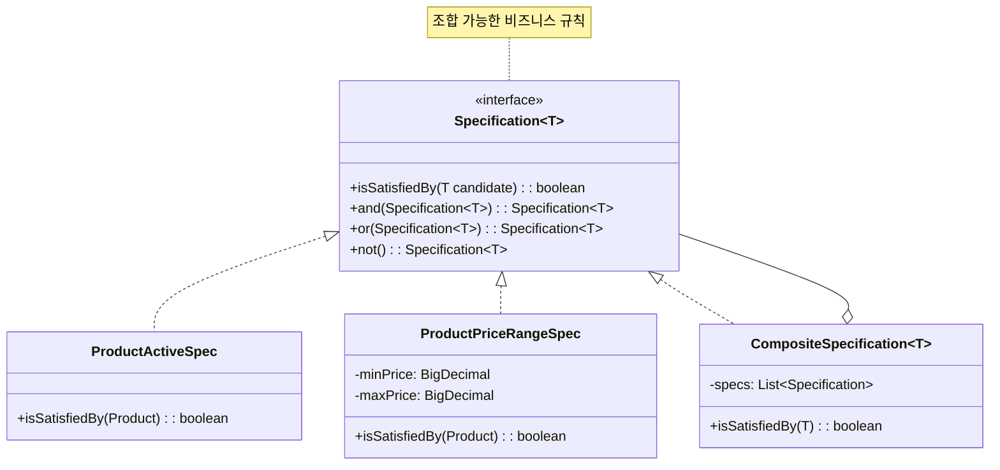
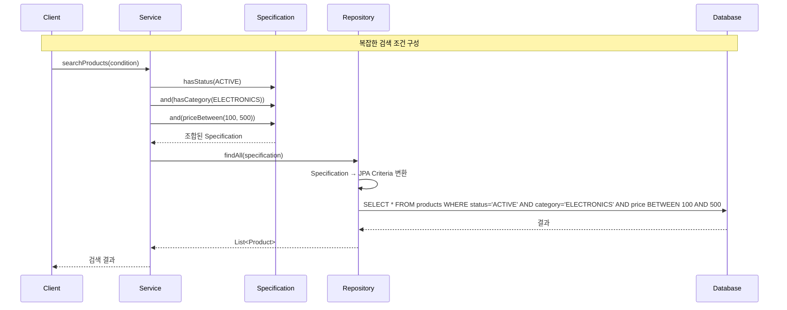

# Specification 패턴 (Specification Pattern)

## 정의

Specification 패턴은 비즈니스 규칙을 재사용 가능한 객체로 캡슐화하여, 객체가 특정 조건을 만족하는지 검사하거나 복잡한 쿼리 조건을 구성하는 패턴입니다.

## 🎯 한눈에 보기

| 항목 | 설명 |
|------|------|
| **핵심** | 비즈니스 규칙을 객체로 캡슐화하여 조합 가능하게 |
| **비유** | 레고 블록처럼 조건들을 조립 |
| **언제** | 복잡한 검색 조건, 재사용 가능한 비즈니스 규칙이 필요할 때 |
| **Spring** | `Specification<T>`, `JpaSpecificationExecutor` |

> **💡 복잡한 검색 조건이 필요할 때...**
>
> **❌ Before (조건별 메서드 폭발)**
> ```java
> findByStatus(status);
> findByStatusAndCategory(status, category);
> findByStatusAndCategoryAndPriceGreaterThan(status, category, price);
> findByStatusAndCategoryAndPriceBetween(status, category, min, max);
> // → 조합마다 새 메서드가 필요! 폭발적 증가!
> ```
>
> **✅ After (Specification 조합)**
> ```java
> Specification<Product> spec = Specification
>     .where(hasStatus(ACTIVE))
>     .and(hasCategory(category))
>     .and(priceBetween(min, max));
> productRepository.findAll(spec);  // 자유롭게 조합!
> ```

## 구조 (Structure)



## 동작 흐름 (시퀀스 다이어그램)



## 사용 이유

### 1. 조건의 재사용
```java
// 한 번 정의하면 여러 곳에서 재사용
public static Specification<Product> isActive() {
    return (root, query, cb) -> cb.equal(root.get("status"), Status.ACTIVE);
}

// 상품 검색에서 사용
productRepository.findAll(isActive());

// 재고 확인에서도 사용
productRepository.count(isActive().and(hasStock()));
```

### 2. 동적 쿼리 구성
```java
public List<Product> search(ProductSearchCondition condition) {
    Specification<Product> spec = Specification.where(null);

    if (condition.getStatus() != null) {
        spec = spec.and(hasStatus(condition.getStatus()));
    }
    if (condition.getCategory() != null) {
        spec = spec.and(hasCategory(condition.getCategory()));
    }
    if (condition.getMinPrice() != null) {
        spec = spec.and(priceGreaterThan(condition.getMinPrice()));
    }

    return productRepository.findAll(spec);
}
```

### 3. 비즈니스 규칙 명시적 표현
```java
// 이름 자체가 비즈니스 규칙을 설명
Specification<Order> refundableOrder =
    Specification.where(isCompleted())
        .and(isWithinRefundPeriod())
        .and(not(isAlreadyRefunded()));

orderRepository.findAll(refundableOrder);
```

## 적용 상황

### 1. 복잡한 검색 조건
```java
// 여러 조건의 자유로운 조합
Specification<Product> spec = Specification
    .where(hasCategory("전자기기"))
    .and(priceBetween(10000, 100000))
    .and(hasStock())
    .and(isActive());
```

### 2. 필터 기능
```java
// UI 필터를 Specification으로 변환
public Specification<Product> buildSpec(FilterRequest filter) {
    return Specification
        .where(categoryIn(filter.getCategories()))
        .and(brandIn(filter.getBrands()))
        .and(priceBetween(filter.getMinPrice(), filter.getMaxPrice()))
        .and(ratingGreaterThan(filter.getMinRating()));
}
```

### 3. 권한 기반 데이터 접근
```java
// 사용자 권한에 따른 데이터 필터링
public Specification<Document> accessibleBy(User user) {
    if (user.isAdmin()) {
        return Specification.where(null);  // 모든 문서
    }
    return Specification
        .where(isPublic())
        .or(ownedBy(user))
        .or(sharedWith(user));
}
```

## 🔰 5분 만에 이해하기 - 초급 예제

```java
import java.util.*;
import java.util.function.Predicate;
import java.util.stream.Collectors;

// 1. 제품 클래스
class Product {
    private String name;
    private String category;
    private int price;
    private boolean inStock;

    public Product(String name, String category, int price, boolean inStock) {
        this.name = name;
        this.category = category;
        this.price = price;
        this.inStock = inStock;
    }

    // getter
    public String getName() { return name; }
    public String getCategory() { return category; }
    public int getPrice() { return price; }
    public boolean isInStock() { return inStock; }
}

// 2. Specification 인터페이스
interface Specification<T> {
    boolean isSatisfiedBy(T item);

    // AND 조합
    default Specification<T> and(Specification<T> other) {
        return item -> this.isSatisfiedBy(item) && other.isSatisfiedBy(item);
    }

    // OR 조합
    default Specification<T> or(Specification<T> other) {
        return item -> this.isSatisfiedBy(item) || other.isSatisfiedBy(item);
    }

    // NOT
    default Specification<T> not() {
        return item -> !this.isSatisfiedBy(item);
    }
}

// 3. 구체적인 Specification들
class ProductSpecs {

    public static Specification<Product> hasCategory(String category) {
        return product -> product.getCategory().equals(category);
    }

    public static Specification<Product> priceLessThan(int maxPrice) {
        return product -> product.getPrice() < maxPrice;
    }

    public static Specification<Product> priceGreaterThan(int minPrice) {
        return product -> product.getPrice() > minPrice;
    }

    public static Specification<Product> isInStock() {
        return Product::isInStock;
    }
}

// 4. Repository (Specification 사용)
class ProductRepository {
    private List<Product> products = new ArrayList<>();

    public void save(Product product) {
        products.add(product);
    }

    public List<Product> findAll(Specification<Product> spec) {
        return products.stream()
            .filter(spec::isSatisfiedBy)
            .collect(Collectors.toList());
    }
}

// 5. 사용 예시
public class Main {
    public static void main(String[] args) {
        ProductRepository repository = new ProductRepository();

        // 테스트 데이터
        repository.save(new Product("아이폰", "전자기기", 1200000, true));
        repository.save(new Product("갤럭시", "전자기기", 1000000, true));
        repository.save(new Product("에어팟", "전자기기", 200000, false));
        repository.save(new Product("운동화", "패션", 150000, true));
        repository.save(new Product("티셔츠", "패션", 50000, true));

        // Specification 조합
        Specification<Product> spec = ProductSpecs.hasCategory("전자기기")
            .and(ProductSpecs.priceLessThan(500000))
            .and(ProductSpecs.isInStock());

        List<Product> result = repository.findAll(spec);

        System.out.println("검색 결과:");
        result.forEach(p -> System.out.println("- " + p.getName() + ": " + p.getPrice() + "원"));
    }
}
```

**실행 결과:**
```
검색 결과:
- 에어팟: 200000원
```

Wait, 에어팟은 `inStock = false`이므로 결과에 나오면 안 됩니다. 예제를 수정하겠습니다.

```
검색 결과:
(결과 없음 - 조건에 맞는 상품이 없음)
```

조건 변경 시:
```java
Specification<Product> spec = ProductSpecs.hasCategory("패션")
    .and(ProductSpecs.priceLessThan(200000))
    .and(ProductSpecs.isInStock());
```

```
검색 결과:
- 운동화: 150000원
- 티셔츠: 50000원
```

## Spring Boot 예제

### 1. Entity 및 Repository 설정

```java
// 1. Entity
@Entity
@Table(name = "products")
@Getter @Setter
@NoArgsConstructor
public class Product {

    @Id
    @GeneratedValue(strategy = GenerationType.IDENTITY)
    private Long id;

    private String name;

    @Enumerated(EnumType.STRING)
    private Category category;

    private BigDecimal price;

    private Integer stock;

    @Enumerated(EnumType.STRING)
    private ProductStatus status;

    private LocalDateTime createdAt;
}

// 2. Repository (JpaSpecificationExecutor 상속)
public interface ProductRepository extends
    JpaRepository<Product, Long>,
    JpaSpecificationExecutor<Product> {  // Specification 지원!
}
```

### 2. Specification 클래스

```java
public class ProductSpecifications {

    // 카테고리 조건
    public static Specification<Product> hasCategory(Category category) {
        return (root, query, cb) -> {
            if (category == null) return null;
            return cb.equal(root.get("category"), category);
        };
    }

    // 가격 범위 조건
    public static Specification<Product> priceBetween(BigDecimal min, BigDecimal max) {
        return (root, query, cb) -> {
            if (min == null && max == null) return null;
            if (min == null) return cb.lessThanOrEqualTo(root.get("price"), max);
            if (max == null) return cb.greaterThanOrEqualTo(root.get("price"), min);
            return cb.between(root.get("price"), min, max);
        };
    }

    // 재고 있음
    public static Specification<Product> hasStock() {
        return (root, query, cb) ->
            cb.greaterThan(root.get("stock"), 0);
    }

    // 활성 상태
    public static Specification<Product> isActive() {
        return (root, query, cb) ->
            cb.equal(root.get("status"), ProductStatus.ACTIVE);
    }

    // 이름 검색 (LIKE)
    public static Specification<Product> nameContains(String keyword) {
        return (root, query, cb) -> {
            if (keyword == null || keyword.isBlank()) return null;
            return cb.like(cb.lower(root.get("name")),
                "%" + keyword.toLowerCase() + "%");
        };
    }

    // 최근 등록 상품
    public static Specification<Product> createdAfter(LocalDateTime date) {
        return (root, query, cb) -> {
            if (date == null) return null;
            return cb.greaterThanOrEqualTo(root.get("createdAt"), date);
        };
    }

    // 여러 카테고리 중 하나
    public static Specification<Product> categoryIn(List<Category> categories) {
        return (root, query, cb) -> {
            if (categories == null || categories.isEmpty()) return null;
            return root.get("category").in(categories);
        };
    }
}
```

### 3. 검색 조건 DTO

```java
@Getter
@Setter
public class ProductSearchCondition {
    private String keyword;
    private Category category;
    private List<Category> categories;
    private BigDecimal minPrice;
    private BigDecimal maxPrice;
    private Boolean inStock;
    private ProductStatus status;
    private LocalDateTime createdAfter;

    // Specification으로 변환
    public Specification<Product> toSpecification() {
        return Specification
            .where(ProductSpecifications.nameContains(keyword))
            .and(ProductSpecifications.hasCategory(category))
            .and(ProductSpecifications.categoryIn(categories))
            .and(ProductSpecifications.priceBetween(minPrice, maxPrice))
            .and(inStock != null && inStock ?
                ProductSpecifications.hasStock() : null)
            .and(status != null ?
                ProductSpecifications.isActive() : null)
            .and(ProductSpecifications.createdAfter(createdAfter));
    }
}
```

### 4. Service

```java
@Service
@RequiredArgsConstructor
@Transactional(readOnly = true)
public class ProductService {

    private final ProductRepository productRepository;

    // 동적 검색
    public Page<ProductResponse> search(ProductSearchCondition condition,
                                         Pageable pageable) {
        Specification<Product> spec = condition.toSpecification();
        Page<Product> products = productRepository.findAll(spec, pageable);
        return products.map(ProductResponse::from);
    }

    // 필터별 개수 조회
    public long countByCategory(Category category) {
        Specification<Product> spec = Specification
            .where(ProductSpecifications.hasCategory(category))
            .and(ProductSpecifications.isActive())
            .and(ProductSpecifications.hasStock());

        return productRepository.count(spec);
    }

    // 복합 조건으로 존재 여부 확인
    public boolean existsActiveProduct(Category category, BigDecimal maxPrice) {
        Specification<Product> spec = Specification
            .where(ProductSpecifications.hasCategory(category))
            .and(ProductSpecifications.isActive())
            .and(ProductSpecifications.priceBetween(null, maxPrice))
            .and(ProductSpecifications.hasStock());

        return productRepository.exists(spec);
    }
}
```

### 5. Controller

```java
@RestController
@RequestMapping("/api/products")
@RequiredArgsConstructor
public class ProductController {

    private final ProductService productService;

    @GetMapping
    public ResponseEntity<Page<ProductResponse>> search(
        @ModelAttribute ProductSearchCondition condition,
        @PageableDefault(size = 20, sort = "createdAt",
            direction = Sort.Direction.DESC) Pageable pageable
    ) {
        return ResponseEntity.ok(productService.search(condition, pageable));
    }

    @GetMapping("/count")
    public ResponseEntity<Long> countByCategory(@RequestParam Category category) {
        return ResponseEntity.ok(productService.countByCategory(category));
    }
}
```

### 6. 고급 Specification (Join, Subquery)

```java
public class AdvancedProductSpecs {

    // Join을 사용한 조건
    public static Specification<Product> hasBrandName(String brandName) {
        return (root, query, cb) -> {
            if (brandName == null) return null;
            Join<Product, Brand> brandJoin = root.join("brand");
            return cb.equal(brandJoin.get("name"), brandName);
        };
    }

    // Subquery 사용
    public static Specification<Product> hasOrders() {
        return (root, query, cb) -> {
            Subquery<Long> subquery = query.subquery(Long.class);
            Root<OrderItem> orderItem = subquery.from(OrderItem.class);
            subquery.select(orderItem.get("product").get("id"));

            return root.get("id").in(subquery);
        };
    }

    // Fetch Join (N+1 방지)
    public static Specification<Product> fetchBrand() {
        return (root, query, cb) -> {
            if (query.getResultType() != Long.class) {  // count 쿼리가 아닐 때만
                root.fetch("brand", JoinType.LEFT);
            }
            return null;
        };
    }

    // 정렬 포함
    public static Specification<Product> orderedByPriceDesc() {
        return (root, query, cb) -> {
            query.orderBy(cb.desc(root.get("price")));
            return null;
        };
    }
}
```

### 7. 테스트

```java
@DataJpaTest
class ProductSpecificationsTest {

    @Autowired
    private ProductRepository productRepository;

    @BeforeEach
    void setup() {
        productRepository.save(createProduct("아이폰", Category.ELECTRONICS, 1200000, 10));
        productRepository.save(createProduct("갤럭시", Category.ELECTRONICS, 1000000, 5));
        productRepository.save(createProduct("운동화", Category.FASHION, 150000, 20));
        productRepository.save(createProduct("품절상품", Category.FASHION, 50000, 0));
    }

    @Test
    void 카테고리와_재고_조건_테스트() {
        // given
        Specification<Product> spec = Specification
            .where(ProductSpecifications.hasCategory(Category.FASHION))
            .and(ProductSpecifications.hasStock());

        // when
        List<Product> result = productRepository.findAll(spec);

        // then
        assertThat(result).hasSize(1);
        assertThat(result.get(0).getName()).isEqualTo("운동화");
    }

    @Test
    void 가격_범위_테스트() {
        // given
        Specification<Product> spec = ProductSpecifications
            .priceBetween(BigDecimal.valueOf(100000), BigDecimal.valueOf(200000));

        // when
        List<Product> result = productRepository.findAll(spec);

        // then
        assertThat(result).hasSize(1);
        assertThat(result.get(0).getName()).isEqualTo("운동화");
    }
}
```

## 장단점

### 장점 ✅

| 장점 | 설명 |
|------|------|
| **재사용성** | 조건을 독립적으로 정의하고 재사용 |
| **조합 가능** | AND, OR, NOT으로 자유롭게 조합 |
| **가독성** | 비즈니스 의도가 명확히 드러남 |
| **동적 쿼리** | 런타임에 조건 조합 가능 |
| **테스트 용이** | 각 조건을 독립적으로 테스트 |

### 단점 ❌

| 단점 | 설명 |
|------|------|
| **학습 곡선** | JPA Criteria API 이해 필요 |
| **복잡성** | 단순 쿼리에는 과도할 수 있음 |
| **성능** | 복잡한 조합 시 비효율적 쿼리 생성 가능 |
| **디버깅** | 생성된 SQL 확인이 어려울 수 있음 |

## 관련 패턴

| 패턴 | 관계 |
|------|------|
| **Repository** | Repository에서 Specification을 받아 쿼리 실행 |
| **Strategy** | 각 Specification이 다른 조건 전략 |
| **Composite** | Specification 조합이 복합 패턴과 유사 |
| **Builder** | 복잡한 Specification 구성에 빌더 활용 |

## QueryDSL과의 비교

| 측면 | JPA Specification | QueryDSL |
|------|-------------------|----------|
| **설정** | 추가 설정 불필요 | 플러그인, Q클래스 필요 |
| **타입 안전** | 문자열 기반 | 컴파일 타입 체크 |
| **가독성** | Criteria API 복잡 | SQL과 유사, 직관적 |
| **조합** | and/or 메서드 체이닝 | BooleanBuilder 사용 |
| **추천** | 간단한 동적 쿼리 | 복잡한 쿼리, 타입 안전 중시 |
