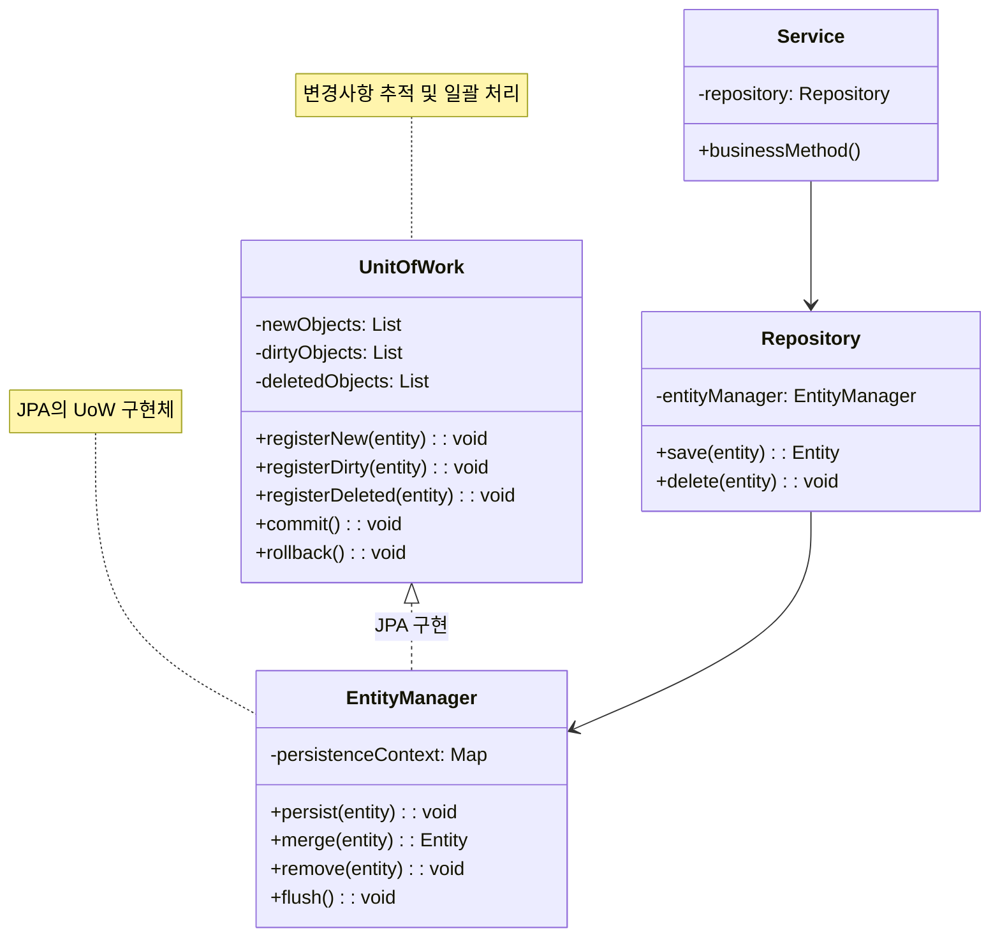
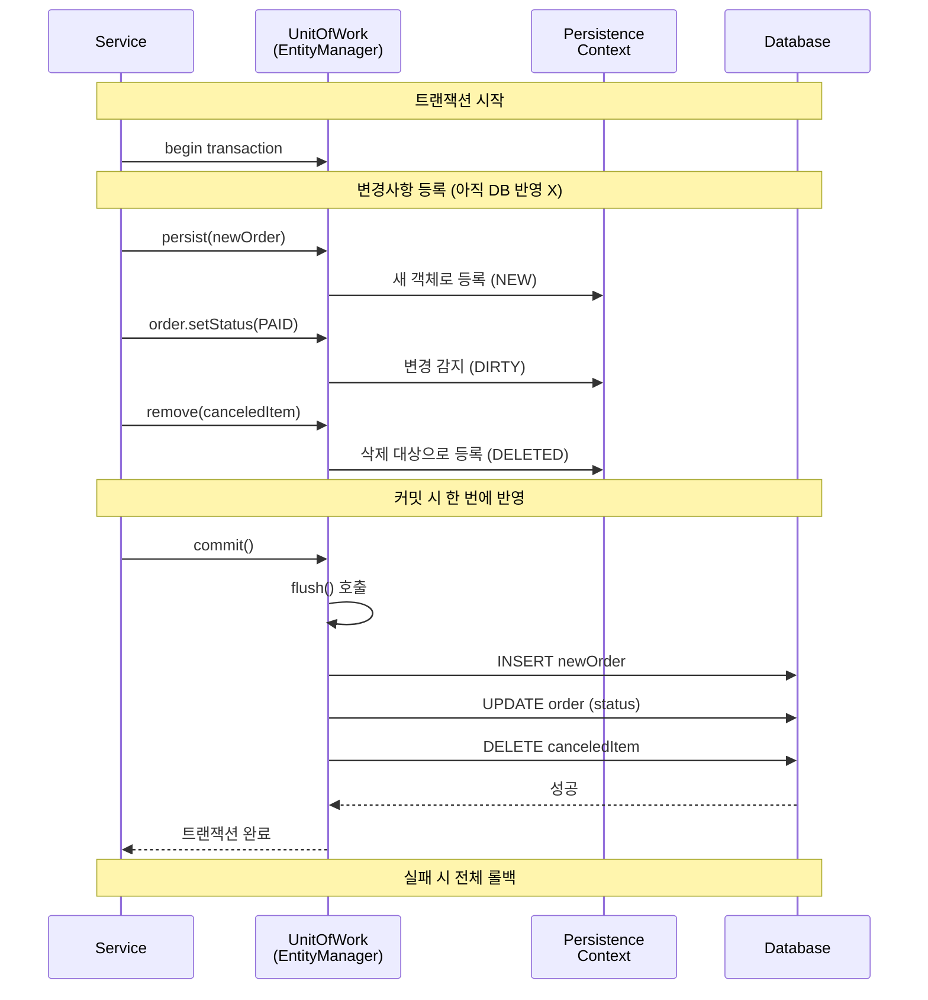

# Unit of Work 패턴 (Unit of Work Pattern)

## 정의

Unit of Work 패턴은 비즈니스 트랜잭션 동안 발생하는 모든 변경사항을 추적하고, 트랜잭션 종료 시 변경된 내용을 한 번에 데이터베이스에 반영하는 패턴입니다.

## 🎯 한눈에 보기

| 항목 | 설명 |
|------|------|
| **핵심** | 변경사항을 추적하고 한 번에 커밋 |
| **비유** | 장바구니에 담아두었다가 한 번에 결제 |
| **언제** | 여러 엔티티를 동시에 변경해야 할 때 |
| **Spring** | JPA `EntityManager`, `@Transactional` |

> **💡 주문 처리 시 여러 테이블을 수정할 때...**
>
> **❌ Before (매번 즉시 저장)**
> ```java
> orderRepository.save(order);           // INSERT 1번
> inventoryRepository.update(inventory); // UPDATE 1번
> paymentRepository.save(payment);       // INSERT 1번
> // → 중간에 실패하면? 불일치 발생!
> ```
>
> **✅ After (Unit of Work)**
> ```java
> // 변경사항만 추적
> unitOfWork.registerNew(order);
> unitOfWork.registerDirty(inventory);
> unitOfWork.registerNew(payment);
>
> // 한 번에 커밋 (All or Nothing)
> unitOfWork.commit();  // 하나라도 실패하면 전체 롤백!
> ```

## 구조 (Structure)



## 동작 흐름 (시퀀스 다이어그램)



## 사용 이유

### 1. 트랜잭션 일관성
```java
@Transactional
public void transferMoney(Long fromId, Long toId, BigDecimal amount) {
    Account from = accountRepository.findById(fromId);
    Account to = accountRepository.findById(toId);

    from.withdraw(amount);  // 변경 추적됨
    to.deposit(amount);     // 변경 추적됨

    // 메서드 종료 시 자동으로 두 변경이 함께 커밋
    // 하나라도 실패하면 둘 다 롤백!
}
```

### 2. 성능 최적화
- **쓰기 지연 (Write-behind)**: 변경을 모아서 한 번에 실행
- **배치 처리**: 여러 INSERT를 하나의 배치로 처리
- **중복 제거**: 같은 엔티티 여러 번 변경해도 최종 상태만 저장

### 3. 변경 감지 (Dirty Checking)
```java
@Transactional
public void updateUser(Long id, String newName) {
    User user = userRepository.findById(id);
    user.setName(newName);  // 변경만 해도 OK

    // save() 호출 불필요!
    // 트랜잭션 종료 시 자동으로 변경 감지하여 UPDATE 실행
}
```

## 적용 상황

### 1. 복잡한 비즈니스 트랜잭션
```java
@Transactional
public void processOrder(OrderRequest request) {
    // 여러 엔티티가 함께 변경됨
    Order order = Order.create(request);
    entityManager.persist(order);

    Inventory inventory = inventoryRepository.findByProductId(request.getProductId());
    inventory.decrease(request.getQuantity());

    Point point = pointRepository.findByUserId(request.getUserId());
    point.accumulate(order.getTotal());

    // 모든 변경이 성공해야 커밋, 하나라도 실패하면 전체 롤백
}
```

### 2. 대량 데이터 처리
```java
@Transactional
public void batchInsert(List<Product> products) {
    for (int i = 0; i < products.size(); i++) {
        entityManager.persist(products.get(i));

        // 50개마다 flush하여 메모리 관리
        if (i % 50 == 0) {
            entityManager.flush();
            entityManager.clear();
        }
    }
}
```

### 3. 낙관적 잠금 처리
```java
@Entity
public class Order {
    @Version
    private Long version;  // UoW가 버전 체크
}
```

## 🔰 5분 만에 이해하기 - 초급 예제

```java
import java.util.*;

// 1. 엔티티
class User {
    private Long id;
    private String name;
    private boolean modified = false;

    public User(Long id, String name) {
        this.id = id;
        this.name = name;
    }

    public void setName(String name) {
        this.name = name;
        this.modified = true;  // 변경 추적
    }

    public boolean isModified() { return modified; }
    public void clearModified() { modified = false; }

    // getter 생략
}

// 2. Unit of Work 구현
class UnitOfWork {
    private List<User> newObjects = new ArrayList<>();
    private List<User> dirtyObjects = new ArrayList<>();
    private List<User> deletedObjects = new ArrayList<>();

    // 새 객체 등록
    public void registerNew(User user) {
        newObjects.add(user);
        System.out.println("새 객체 등록: " + user.getName());
    }

    // 변경된 객체 등록
    public void registerDirty(User user) {
        if (!newObjects.contains(user) && !dirtyObjects.contains(user)) {
            dirtyObjects.add(user);
            System.out.println("변경 객체 등록: " + user.getName());
        }
    }

    // 삭제할 객체 등록
    public void registerDeleted(User user) {
        deletedObjects.add(user);
        System.out.println("삭제 객체 등록: " + user.getName());
    }

    // 모든 변경사항 한 번에 커밋
    public void commit() {
        System.out.println("\n=== 커밋 시작 ===");

        // INSERT
        for (User user : newObjects) {
            System.out.println("INSERT: " + user.getName());
        }

        // UPDATE
        for (User user : dirtyObjects) {
            System.out.println("UPDATE: " + user.getName());
        }

        // DELETE
        for (User user : deletedObjects) {
            System.out.println("DELETE: " + user.getName());
        }

        // 상태 초기화
        clear();
        System.out.println("=== 커밋 완료 ===\n");
    }

    public void rollback() {
        System.out.println("롤백: 모든 변경 취소");
        clear();
    }

    private void clear() {
        newObjects.clear();
        dirtyObjects.clear();
        deletedObjects.clear();
    }
}

// 3. 사용 예시
public class Main {
    public static void main(String[] args) {
        UnitOfWork uow = new UnitOfWork();

        // 새 사용자 추가
        User newUser = new User(null, "홍길동");
        uow.registerNew(newUser);

        // 기존 사용자 수정
        User existingUser = new User(1L, "김철수");
        existingUser.setName("김영희");
        uow.registerDirty(existingUser);

        // 사용자 삭제
        User deletedUser = new User(2L, "박지민");
        uow.registerDeleted(deletedUser);

        // 한 번에 모든 변경 적용
        uow.commit();
    }
}
```

**실행 결과:**
```
새 객체 등록: 홍길동
변경 객체 등록: 김영희
삭제 객체 등록: 박지민

=== 커밋 시작 ===
INSERT: 홍길동
UPDATE: 김영희
DELETE: 박지민
=== 커밋 완료 ===
```

## Spring Boot에서의 Unit of Work

JPA의 `EntityManager`가 Unit of Work 패턴을 구현합니다. `@Transactional`과 함께 자동으로 동작합니다.

### 1. 기본 동작 이해

```java
@Service
@RequiredArgsConstructor
public class OrderService {

    private final EntityManager entityManager;  // Unit of Work

    @Transactional
    public void createOrder(OrderRequest request) {
        // 1. 새 엔티티 등록 (registerNew)
        Order order = new Order(request);
        entityManager.persist(order);  // 아직 INSERT 안 함!

        // 2. 기존 엔티티 조회
        User user = entityManager.find(User.class, request.getUserId());

        // 3. 변경 (자동 dirty checking)
        user.addPoint(order.getTotal());  // 변경만 해도 추적됨

        // 4. 메서드 종료 시 자동 commit
        // → INSERT order, UPDATE user가 한 번에 실행됨
    }
}
```

### 2. Persistence Context 상태

```java
@Service
@Transactional
public class EntityStateExample {

    @PersistenceContext
    private EntityManager em;

    public void demonstrateStates() {
        // 1. NEW (비영속) - 아직 관리 안 함
        User user = new User("홍길동");

        // 2. MANAGED (영속) - Unit of Work가 추적
        em.persist(user);
        user.setName("김철수");  // 변경 자동 추적

        // 3. DETACHED (준영속) - 추적 중단
        em.detach(user);
        user.setName("박영희");  // 변경 추적 안 됨!

        // 4. REMOVED (삭제) - 삭제 예정
        em.merge(user);  // 다시 영속 상태로
        em.remove(user);

        // flush() 시점에 실제 SQL 실행
    }
}
```

### 3. 쓰기 지연 (Write-behind)

```java
@Service
@RequiredArgsConstructor
public class BatchInsertService {

    private final EntityManager em;

    @Transactional
    public void insertProducts(List<ProductRequest> requests) {
        int batchSize = 50;

        for (int i = 0; i < requests.size(); i++) {
            Product product = new Product(requests.get(i));
            em.persist(product);  // 쓰기 지연 저장소에 쌓임

            // 50개마다 한 번에 INSERT
            if ((i + 1) % batchSize == 0) {
                em.flush();  // INSERT 50개 배치 실행
                em.clear();  // 메모리 해제
                System.out.println((i + 1) + "개 저장 완료");
            }
        }
    }
}
```

### 4. 변경 감지 (Dirty Checking)

```java
@Service
@RequiredArgsConstructor
public class UserService {

    private final UserRepository userRepository;

    @Transactional
    public void updateUserName(Long userId, String newName) {
        // 1. 엔티티 조회 → 영속 상태
        User user = userRepository.findById(userId)
            .orElseThrow();

        // 2. 값 변경만 하면 됨 (save() 불필요!)
        user.setName(newName);

        // 3. 트랜잭션 종료 시 자동으로:
        //    - 원본과 현재 상태 비교 (dirty checking)
        //    - 변경되었으면 UPDATE SQL 생성
        //    - commit
    }

    @Transactional
    public void updateMultipleFields(Long userId, UpdateRequest request) {
        User user = userRepository.findById(userId).orElseThrow();

        // 여러 필드 변경해도 UPDATE는 한 번만
        user.setName(request.getName());
        user.setEmail(request.getEmail());
        user.setPhone(request.getPhone());
        // → UPDATE users SET name=?, email=?, phone=? WHERE id=?
    }
}
```

### 5. 트랜잭션 경계와 Unit of Work

```java
@Service
@RequiredArgsConstructor
public class TransactionBoundaryExample {

    private final OrderRepository orderRepository;
    private final PaymentRepository paymentRepository;
    private final InventoryRepository inventoryRepository;

    @Transactional  // Unit of Work 시작
    public void processOrder(OrderRequest request) {
        // 모든 변경이 같은 Unit of Work 안에서 관리됨

        Order order = Order.create(request);
        orderRepository.save(order);

        Payment payment = Payment.create(order);
        paymentRepository.save(payment);

        Inventory inventory = inventoryRepository.findByProductId(request.getProductId());
        inventory.decrease(request.getQuantity());

        // 메서드 종료 시:
        // 1. flush() - 모든 SQL 실행
        // 2. commit() - 트랜잭션 확정
        // 예외 발생 시 자동 rollback
    }

    @Transactional(readOnly = true)  // 읽기 전용 (dirty checking 생략 → 성능 향상)
    public OrderResponse getOrder(Long orderId) {
        Order order = orderRepository.findById(orderId).orElseThrow();
        return OrderResponse.from(order);
        // flush() 생략됨
    }
}
```

### 6. 명시적 flush와 clear

```java
@Service
@RequiredArgsConstructor
public class FlushExample {

    private final EntityManager em;

    @Transactional
    public Long createAndGetId() {
        Product product = new Product("새상품");
        em.persist(product);

        // persist만으로는 ID가 없을 수 있음 (IDENTITY 전략 제외)
        em.flush();  // 즉시 INSERT 실행하여 ID 확정

        return product.getId();  // 이제 ID 있음
    }

    @Transactional
    public void processLargeData(List<Data> dataList) {
        for (int i = 0; i < dataList.size(); i++) {
            processItem(dataList.get(i));

            if (i % 100 == 0) {
                em.flush();  // 메모리의 변경사항을 DB에 반영
                em.clear();  // 영속성 컨텍스트 초기화 (메모리 해제)
            }
        }
    }
}
```

## 장단점

### 장점 ✅

| 장점 | 설명 |
|------|------|
| **트랜잭션 일관성** | 모든 변경이 함께 성공하거나 실패 |
| **성능 최적화** | 변경사항을 모아서 한 번에 처리 |
| **변경 감지** | 명시적 save() 없이 자동 업데이트 |
| **쓰기 지연** | 불필요한 DB 왕복 감소 |
| **배치 처리** | 여러 SQL을 하나의 배치로 실행 |

### 단점 ❌

| 단점 | 설명 |
|------|------|
| **메모리 사용** | 영속성 컨텍스트가 모든 엔티티 보관 |
| **복잡성** | 영속 상태 이해 필요 (NEW, MANAGED, DETACHED) |
| **지연 예외** | flush 시점에 예외 발생 가능 |
| **Long Transaction** | 긴 트랜잭션은 DB 잠금 문제 발생 |

## 관련 패턴

| 패턴 | 관계 |
|------|------|
| **Repository** | Repository가 Unit of Work와 함께 동작 |
| **Identity Map** | 같은 ID의 엔티티는 하나만 존재하도록 보장 |
| **Lazy Loading** | Unit of Work 내에서 지연 로딩 |

## Unit of Work 흐름 정리

```
┌─────────────────────────────────────────────────────────┐
│  @Transactional 시작                                    │
├─────────────────────────────────────────────────────────┤
│                                                         │
│   persist(new)  ─────→  NEW 등록                        │
│   find(id)      ─────→  MANAGED 상태로 조회              │
│   entity.setX() ─────→  DIRTY로 표시 (자동)              │
│   remove(entity)─────→  DELETED로 표시                  │
│                                                         │
├─────────────────────────────────────────────────────────┤
│  메서드 종료 (또는 flush())                              │
├─────────────────────────────────────────────────────────┤
│                                                         │
│   NEW     ─────→  INSERT SQL                           │
│   DIRTY   ─────→  UPDATE SQL                           │
│   DELETED ─────→  DELETE SQL                           │
│                                                         │
├─────────────────────────────────────────────────────────┤
│  commit() 또는 rollback()                               │
└─────────────────────────────────────────────────────────┘
```
