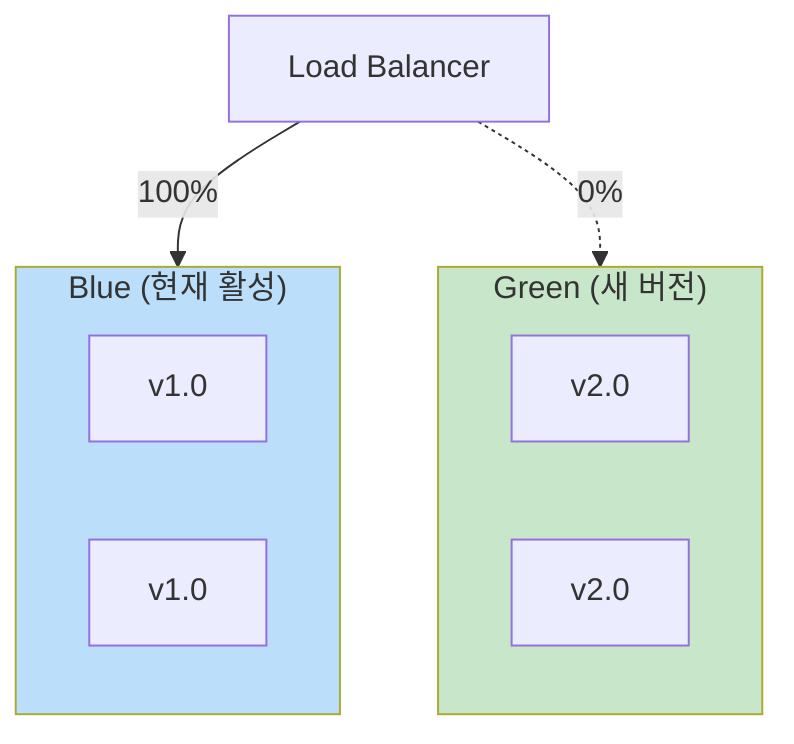
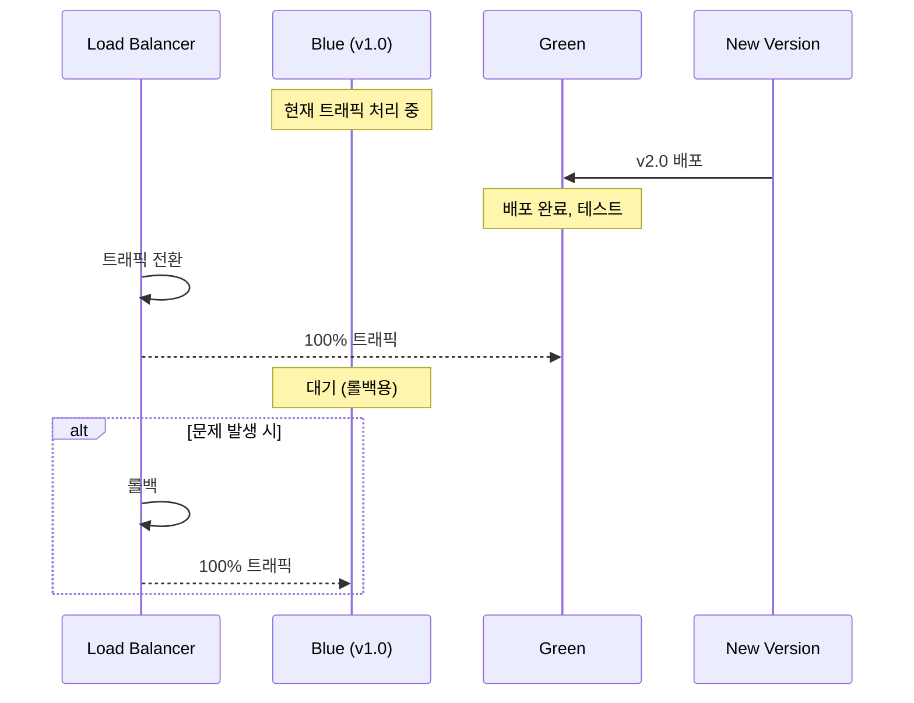

# Blue-Green 배포 패턴

## 정의

Blue-Green 배포는 동일한 운영 환경 두 개(Blue, Green)를 준비하고, 새 버전을 비활성 환경에 배포한 후 트래픽을 한 번에 전환하는 무중단 배포 패턴입니다.

## 🎯 한눈에 보기

| 항목 | 설명 |
|------|------|
| **핵심** | 두 환경 준비 → 즉시 전환 |
| **비유** | 백업 무대로 즉시 이동 |
| **언제** | 빠른 롤백 필요, 중요 릴리스 |
| **도구** | Kubernetes Service, Load Balancer |

## 구조 (Structure)



## 배포 흐름



## 기본 예제

### Kubernetes 구현

```yaml
# blue-deployment.yaml
apiVersion: apps/v1
kind: Deployment
metadata:
  name: myapp-blue
spec:
  replicas: 3
  selector:
    matchLabels:
      app: myapp
      version: blue
  template:
    metadata:
      labels:
        app: myapp
        version: blue
    spec:
      containers:
      - name: myapp
        image: myapp:1.0.0
---
# green-deployment.yaml
apiVersion: apps/v1
kind: Deployment
metadata:
  name: myapp-green
spec:
  replicas: 3
  selector:
    matchLabels:
      app: myapp
      version: green
  template:
    metadata:
      labels:
        app: myapp
        version: green
    spec:
      containers:
      - name: myapp
        image: myapp:2.0.0
---
# service.yaml (전환용)
apiVersion: v1
kind: Service
metadata:
  name: myapp
spec:
  selector:
    app: myapp
    version: blue  # green으로 변경하여 전환
  ports:
  - port: 80
```

### 전환 스크립트

```bash
#!/bin/bash
# 현재 활성 버전 확인
CURRENT=$(kubectl get svc myapp -o jsonpath='{.spec.selector.version}')

if [ "$CURRENT" == "blue" ]; then
  NEW="green"
else
  NEW="blue"
fi

# 트래픽 전환
kubectl patch svc myapp -p "{\"spec\":{\"selector\":{\"version\":\"$NEW\"}}}"
echo "Switched from $CURRENT to $NEW"
```

## 장단점

### 장점
| 장점 | 설명 |
|------|------|
| **즉시 롤백** | 이전 환경으로 즉시 전환 |
| **무중단** | 서비스 중단 없음 |
| **검증 가능** | 전환 전 새 환경 테스트 가능 |

### 단점
| 단점 | 설명 |
|------|------|
| **리소스 2배** | 두 환경 운영 비용 |
| **DB 마이그레이션** | 스키마 변경 시 복잡 |
| **상태 관리** | 세션/캐시 전환 처리 필요 |

## 관련 패턴

| 패턴 | 관계 |
|------|------|
| [Canary](../Canary) | 점진적 전환 변형 |
| [Rolling](../Rolling) | 순차적 전환 변형 |
