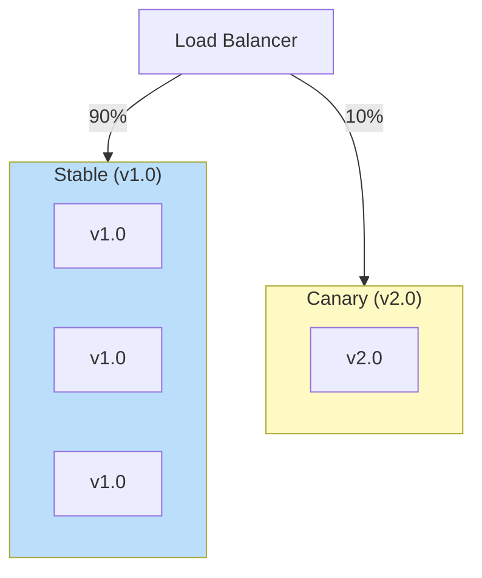
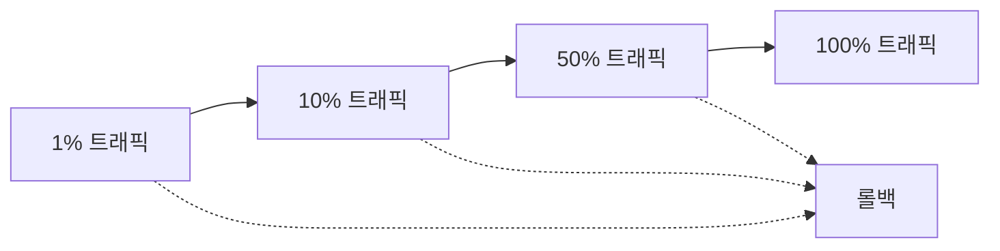

# Canary 배포 패턴

## 정의

Canary 배포는 새 버전을 일부 사용자에게만 먼저 배포하고, 문제가 없으면 점진적으로 트래픽을 확대하는 배포 패턴입니다.

## 🎯 한눈에 보기

| 항목 | 설명 |
|------|------|
| **핵심** | 일부 사용자에게 먼저 배포 → 점진적 확대 |
| **비유** | 탄광의 카나리아 (위험 감지용) |
| **언제** | 대규모 변경, 리스크 최소화 |
| **도구** | Istio, Spinnaker, Argo Rollouts |

## 구조 (Structure)



## 배포 단계



## 기본 예제

### Istio VirtualService

```yaml
apiVersion: networking.istio.io/v1beta1
kind: VirtualService
metadata:
  name: myapp
spec:
  hosts:
  - myapp
  http:
  - match:
    - headers:
        canary:
          exact: "true"
    route:
    - destination:
        host: myapp
        subset: canary
  - route:
    - destination:
        host: myapp
        subset: stable
      weight: 90
    - destination:
        host: myapp
        subset: canary
      weight: 10
---
apiVersion: networking.istio.io/v1beta1
kind: DestinationRule
metadata:
  name: myapp
spec:
  host: myapp
  subsets:
  - name: stable
    labels:
      version: v1
  - name: canary
    labels:
      version: v2
```

### Argo Rollouts

```yaml
apiVersion: argoproj.io/v1alpha1
kind: Rollout
metadata:
  name: myapp
spec:
  replicas: 10
  strategy:
    canary:
      steps:
      - setWeight: 10
      - pause: {duration: 5m}
      - setWeight: 30
      - pause: {duration: 5m}
      - setWeight: 50
      - pause: {duration: 5m}
      - setWeight: 100
      analysis:
        templates:
        - templateName: success-rate
```

## 트래픽 라우팅 전략

| 전략 | 설명 | 사용 시점 |
|------|------|----------|
| 가중치 | 비율로 분배 | 일반적 |
| 헤더 기반 | 특정 헤더 시 Canary | 내부 테스트 |
| 쿠키 기반 | 특정 사용자 그룹 | A/B 테스트 |
| 지역 기반 | 특정 지역만 | 지역별 롤아웃 |

## 장단점

### 장점
- 리스크 최소화
- 실제 트래픽으로 검증
- 문제 시 영향 범위 제한

### 단점
- 구현 복잡도
- 모니터링 필수
- 배포 시간 증가

## 관련 패턴

| 패턴 | 관계 |
|------|------|
| [Blue-Green](../BlueGreen) | 즉시 전환 변형 |
| [Feature Toggle](../FeatureToggle) | 기능 단위 제어 |
