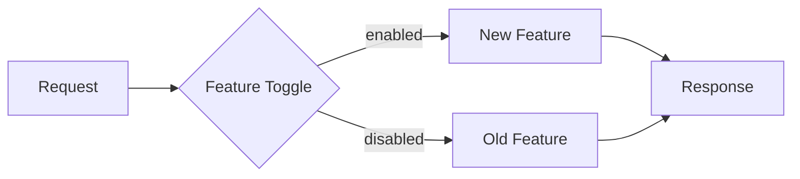

# Feature Toggle 패턴 (Feature Flag)

## 정의

Feature Toggle은 코드를 배포한 후 런타임에 기능을 활성화/비활성화할 수 있게 하는 패턴입니다. 배포와 릴리스를 분리합니다.

## 🎯 한눈에 보기

| 항목 | 설명 |
|------|------|
| **핵심** | 런타임에 기능 ON/OFF |
| **비유** | 전등 스위치 |
| **언제** | 점진적 릴리스, A/B 테스트 |
| **도구** | LaunchDarkly, Unleash, Spring Properties |

> **💡 미완성 기능을 배포하고 나중에 활성화하고 싶을 때...**
>
> ```java
> if (featureToggle.isEnabled("new-checkout")) {
>     return newCheckoutService.process(cart);
> } else {
>     return legacyCheckoutService.process(cart);
> }
> ```

## 토글 종류

| 종류 | 목적 | 수명 |
|------|------|------|
| **Release Toggle** | 미완성 기능 숨김 | 짧음 |
| **Experiment Toggle** | A/B 테스트 | 중간 |
| **Ops Toggle** | 운영 중 기능 제어 | 길음 |
| **Permission Toggle** | 사용자별 기능 | 영구 |

## 구조 (Structure)



## 기본 예제

### Spring Boot 구현

```java
@Component
@ConfigurationProperties(prefix = "features")
@Data
public class FeatureToggles {
    private boolean newCheckout = false;
    private boolean darkMode = false;
    private boolean betaFeatures = false;
}

@Service
@RequiredArgsConstructor
public class CheckoutService {

    private final FeatureToggles features;
    private final NewCheckoutService newService;
    private final LegacyCheckoutService legacyService;

    public CheckoutResult checkout(Cart cart) {
        if (features.isNewCheckout()) {
            return newService.process(cart);
        }
        return legacyService.process(cart);
    }
}
```

```yaml
# application.yml
features:
  new-checkout: true
  dark-mode: false
  beta-features: false
```

### DB 기반 동적 토글

```java
@Service
@RequiredArgsConstructor
public class FeatureToggleService {

    private final FeatureToggleRepository repository;
    private final CacheManager cacheManager;

    @Cacheable("features")
    public boolean isEnabled(String featureName) {
        return repository.findByName(featureName)
            .map(FeatureToggle::isEnabled)
            .orElse(false);
    }

    @CacheEvict(value = "features", key = "#featureName")
    public void toggle(String featureName, boolean enabled) {
        FeatureToggle toggle = repository.findByName(featureName)
            .orElseGet(() -> new FeatureToggle(featureName));
        toggle.setEnabled(enabled);
        repository.save(toggle);
    }
}
```

### 사용자별 토글

```java
public boolean isEnabledForUser(String feature, User user) {
    FeatureToggle toggle = getToggle(feature);

    // 1. 특정 사용자 화이트리스트
    if (toggle.getWhitelistUsers().contains(user.getId())) {
        return true;
    }

    // 2. 비율 기반 (A/B 테스트)
    if (toggle.getRolloutPercentage() > 0) {
        int hash = Math.abs(user.getId().hashCode() % 100);
        return hash < toggle.getRolloutPercentage();
    }

    return toggle.isEnabled();
}
```

## 장단점

### 장점
- 배포와 릴리스 분리
- 빠른 롤백 (토글 OFF)
- A/B 테스트 용이

### 단점
- 코드 복잡도 증가
- 토글 관리 부채
- 테스트 경우의 수 증가

## 주의사항

```java
// ❌ 토글 남발
if (toggle.isA() && !toggle.isB() || toggle.isC()) { ... }

// ✅ 단순하게 유지, 사용 후 제거
if (toggle.isNewFeature()) { ... }
```

## 관련 패턴

| 패턴 | 관계 |
|------|------|
| [Strategy](../../../behavioral/Strategy) | 토글로 전략 선택 |
| [Canary](../Canary) | 점진적 롤아웃 |
