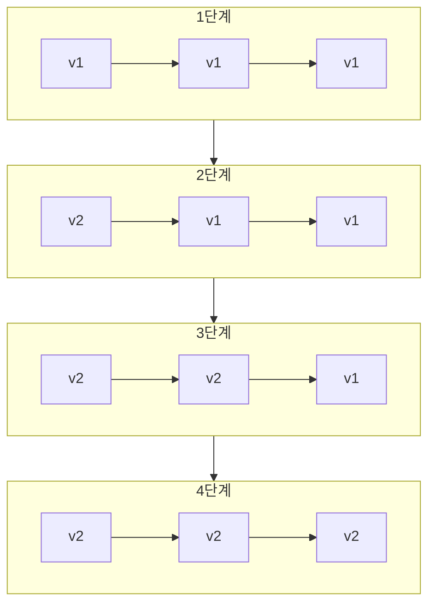

# Rolling 배포 패턴

## 정의

Rolling 배포는 서버를 한 대씩 순차적으로 새 버전으로 교체하는 가장 기본적인 무중단 배포 패턴입니다.

## 🎯 한눈에 보기

| 항목 | 설명 |
|------|------|
| **핵심** | 서버 순차 교체 |
| **비유** | 열차 칸을 하나씩 교체 |
| **언제** | 리소스 효율, 일반 배포 |
| **도구** | Kubernetes Rolling Update (기본) |

## 구조 (Structure)



## 기본 예제

### Kubernetes

```yaml
apiVersion: apps/v1
kind: Deployment
metadata:
  name: myapp
spec:
  replicas: 3
  strategy:
    type: RollingUpdate
    rollingUpdate:
      maxSurge: 1        # 추가 생성 가능 Pod 수
      maxUnavailable: 0  # 최소 가용 Pod 보장
  template:
    spec:
      containers:
      - name: myapp
        image: myapp:2.0.0
        readinessProbe:
          httpGet:
            path: /health
            port: 8080
          initialDelaySeconds: 5
          periodSeconds: 5
```

## 장단점

### 장점
- 추가 리소스 최소화
- 구현 단순
- Kubernetes 기본 지원

### 단점
- 롤백 시간 소요
- 구/신 버전 혼재 시간
- 배포 중 불안정 가능

## 관련 패턴

| 패턴 | 관계 |
|------|------|
| [Blue-Green](../BlueGreen) | 즉시 전환 (리소스 2배) |
| [Canary](../Canary) | 점진적 전환 (가중치) |
