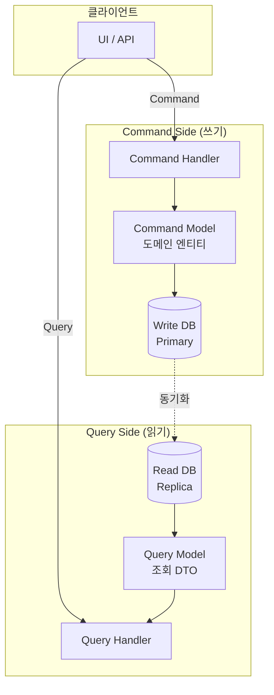
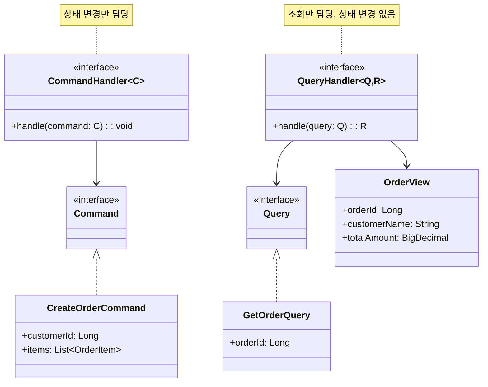
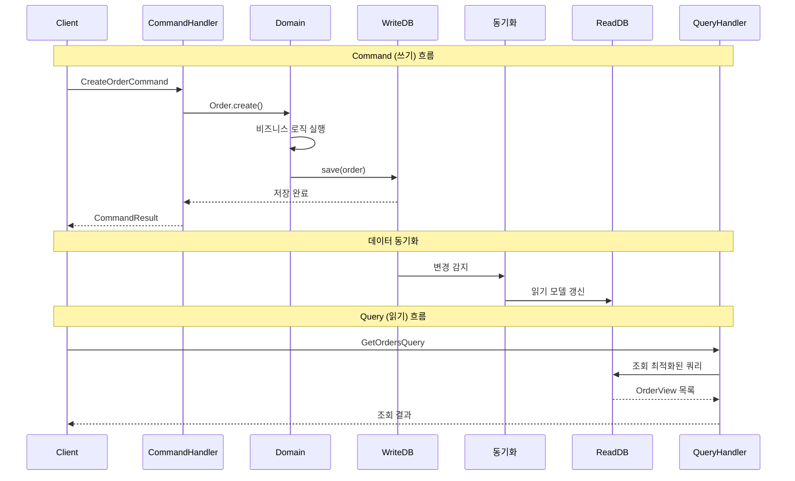

# CQRS 패턴 (Command Query Responsibility Segregation)

## 정의

CQRS 패턴은 데이터의 읽기(Query)와 쓰기(Command) 작업을 별도의 모델로 분리하는 아키텍처 패턴입니다. 복잡한 도메인에서 읽기와 쓰기의 요구사항이 다를 때 각각에 최적화된 모델을 사용할 수 있습니다.

## 🎯 한눈에 보기

| 항목 | 설명 |
|------|------|
| **핵심** | 읽기(Query)와 쓰기(Command) 모델 분리 |
| **비유** | 은행의 창구 분리 - 입출금 창구 vs 조회 창구 |
| **언제** | 읽기/쓰기 부하가 극단적으로 다를 때, 복잡한 도메인 |
| **Spring** | 별도 Repository, 읽기 전용 Replica DB |

> **💡 상품 목록과 주문 처리의 부하가 매우 다를 때...**
>
> **❌ Before (단일 모델)**
> ```java
> // 같은 테이블, 같은 모델
> Product product = productRepository.findById(id);  // 읽기
> product.decreaseStock(10);                          // 쓰기
> productRepository.save(product);
> // → 읽기 최적화하면 쓰기 느려지고, 쓰기 최적화하면 읽기 느려짐
> ```
>
> **✅ After (CQRS)**
> ```java
> // 명령 (쓰기) - 도메인 모델 사용
> commandHandler.handle(new DecreaseStockCommand(productId, 10));
>
> // 조회 (읽기) - 조회 최적화된 모델 사용
> ProductListView products = queryHandler.handle(new GetProductsQuery());
> // → 각각 독립적으로 최적화 가능!
> ```

## 구조 (Structure)





## 동작 흐름 (시퀀스 다이어그램)



## 사용 이유

### 1. 독립적 확장
```
읽기: 초당 10,000 요청 → Read Replica 3대
쓰기: 초당 100 요청 → Primary 1대

각각 독립적으로 스케일링!
```

### 2. 모델 최적화
```java
// 쓰기 모델: 비즈니스 로직에 집중
@Entity
public class Order {
    private List<OrderItem> items;
    private OrderStatus status;

    public void addItem(Product product, int quantity) {
        // 복잡한 비즈니스 규칙
        validateStock(product, quantity);
        items.add(new OrderItem(product, quantity));
        recalculateTotal();
    }
}

// 읽기 모델: 조회 성능에 집중 (역정규화)
public class OrderListView {
    private Long orderId;
    private String customerName;    // JOIN 없이 바로 조회
    private String productNames;    // 미리 계산된 값
    private BigDecimal totalAmount;
    private String statusDisplay;
}
```

### 3. 복잡성 분리
- **Command**: 도메인 로직, 유효성 검증, 트랜잭션
- **Query**: 단순 조회, 캐싱, 페이징

## 적용 상황

### 1. 읽기/쓰기 비율 극단적 차이
```
이커머스: 상품 조회 99% vs 주문 1%
SNS: 피드 조회 99.9% vs 포스팅 0.1%
```

### 2. 복잡한 도메인
```
금융 시스템: 복잡한 거래 규칙 (쓰기) + 다양한 리포트 (읽기)
예약 시스템: 예약 로직 (쓰기) + 가용성 조회 (읽기)
```

### 3. 다양한 조회 요구사항
```java
// 같은 데이터지만 다른 형태의 조회
OrderDetailView    // 주문 상세
OrderListView      // 주문 목록
OrderStatsView     // 통계용
OrderExportView    // 엑셀 다운로드용
```

## 🔰 5분 만에 이해하기 - 초급 예제

```java
// 1. Command (쓰기 요청)
record CreateProductCommand(String name, int price, int stock) {}
record UpdateStockCommand(Long productId, int quantity) {}

// 2. Query (읽기 요청)
record GetProductQuery(Long productId) {}
record GetProductListQuery(int page, int size) {}

// 3. 조회용 View
record ProductView(Long id, String name, int price, String stockStatus) {}

// 4. 쓰기 모델 (도메인 엔티티)
class Product {
    private Long id;
    private String name;
    private int price;
    private int stock;

    public void decreaseStock(int quantity) {
        if (stock < quantity) {
            throw new IllegalStateException("재고 부족");
        }
        this.stock -= quantity;
    }
}

// 5. Command Handler (쓰기 처리)
class ProductCommandHandler {
    private final ProductRepository writeRepository;

    public Long handle(CreateProductCommand cmd) {
        Product product = new Product(cmd.name(), cmd.price(), cmd.stock());
        writeRepository.save(product);
        return product.getId();
    }

    public void handle(UpdateStockCommand cmd) {
        Product product = writeRepository.findById(cmd.productId());
        product.decreaseStock(cmd.quantity());
        writeRepository.save(product);
    }
}

// 6. Query Handler (읽기 처리)
class ProductQueryHandler {
    private final ProductViewRepository readRepository;

    public ProductView handle(GetProductQuery query) {
        return readRepository.findById(query.productId());
    }

    public List<ProductView> handle(GetProductListQuery query) {
        return readRepository.findAll(query.page(), query.size());
    }
}

// 7. 사용
public class Main {
    public static void main(String[] args) {
        ProductCommandHandler commandHandler = new ProductCommandHandler(writeRepo);
        ProductQueryHandler queryHandler = new ProductQueryHandler(readRepo);

        // 쓰기: 상품 생성
        Long productId = commandHandler.handle(
            new CreateProductCommand("노트북", 1500000, 100)
        );

        // 쓰기: 재고 감소
        commandHandler.handle(new UpdateStockCommand(productId, 5));

        // 읽기: 상품 조회
        ProductView product = queryHandler.handle(new GetProductQuery(productId));
        System.out.println("상품: " + product);
    }
}
```

## Spring Boot 예제

### 1. 기본 구조

```java
// ===== Command Side =====

// Command
public record CreateOrderCommand(
    Long customerId,
    List<OrderItemCommand> items
) {}

public record OrderItemCommand(Long productId, int quantity) {}

// Command Handler
@Service
@RequiredArgsConstructor
@Transactional
public class OrderCommandHandler {

    private final OrderRepository orderRepository;
    private final ProductRepository productRepository;
    private final ApplicationEventPublisher eventPublisher;

    public Long handle(CreateOrderCommand command) {
        // 1. 도메인 로직 실행
        List<OrderItem> items = command.items().stream()
            .map(item -> {
                Product product = productRepository.findById(item.productId())
                    .orElseThrow();
                product.decreaseStock(item.quantity());
                return new OrderItem(product, item.quantity());
            })
            .toList();

        Order order = Order.create(command.customerId(), items);

        // 2. 저장
        orderRepository.save(order);

        // 3. 이벤트 발행 (읽기 모델 동기화용)
        eventPublisher.publishEvent(new OrderCreatedEvent(order.getId()));

        return order.getId();
    }
}

// Write Repository
public interface OrderRepository extends JpaRepository<Order, Long> {
}
```

```java
// ===== Query Side =====

// Query
public record GetOrderQuery(Long orderId) {}
public record GetOrderListQuery(Long customerId, Pageable pageable) {}

// View (조회용 DTO)
public record OrderView(
    Long orderId,
    String customerName,
    List<OrderItemView> items,
    BigDecimal totalAmount,
    String status,
    LocalDateTime createdAt
) {}

public record OrderItemView(String productName, int quantity, BigDecimal price) {}

// Query Handler
@Service
@RequiredArgsConstructor
@Transactional(readOnly = true)
public class OrderQueryHandler {

    private final OrderViewRepository orderViewRepository;

    public OrderView handle(GetOrderQuery query) {
        return orderViewRepository.findById(query.orderId())
            .orElseThrow(() -> new OrderNotFoundException(query.orderId()));
    }

    public Page<OrderView> handle(GetOrderListQuery query) {
        return orderViewRepository.findByCustomerId(
            query.customerId(), query.pageable());
    }
}

// Read Repository (조회 전용)
@Repository
public interface OrderViewRepository {

    @Query("""
        SELECT new com.example.query.OrderView(
            o.id, c.name, o.totalAmount, o.status, o.createdAt
        )
        FROM Order o JOIN o.customer c
        WHERE o.id = :orderId
        """)
    Optional<OrderView> findById(@Param("orderId") Long orderId);

    Page<OrderView> findByCustomerId(Long customerId, Pageable pageable);
}
```

### 2. 읽기/쓰기 DB 분리

```yaml
# application.yml
spring:
  datasource:
    write:
      url: jdbc:mysql://primary:3306/orders
      username: write_user
      password: write_password
    read:
      url: jdbc:mysql://replica:3306/orders
      username: read_user
      password: read_password
```

```java
@Configuration
public class DataSourceConfig {

    @Bean
    @Primary
    @ConfigurationProperties("spring.datasource.write")
    public DataSource writeDataSource() {
        return DataSourceBuilder.create().build();
    }

    @Bean
    @ConfigurationProperties("spring.datasource.read")
    public DataSource readDataSource() {
        return DataSourceBuilder.create().build();
    }

    @Bean
    public DataSource routingDataSource(
        @Qualifier("writeDataSource") DataSource write,
        @Qualifier("readDataSource") DataSource read
    ) {
        ReplicationRoutingDataSource routingDataSource = new ReplicationRoutingDataSource();
        Map<Object, Object> dataSourceMap = new HashMap<>();
        dataSourceMap.put("write", write);
        dataSourceMap.put("read", read);
        routingDataSource.setTargetDataSources(dataSourceMap);
        routingDataSource.setDefaultTargetDataSource(write);
        return routingDataSource;
    }
}

public class ReplicationRoutingDataSource extends AbstractRoutingDataSource {
    @Override
    protected Object determineCurrentLookupKey() {
        return TransactionSynchronizationManager.isCurrentTransactionReadOnly()
            ? "read" : "write";
    }
}
```

### 3. 이벤트 기반 동기화

```java
// 도메인 이벤트
public record OrderCreatedEvent(Long orderId) {}

// 읽기 모델 갱신 리스너
@Component
@RequiredArgsConstructor
@Slf4j
public class OrderViewUpdater {

    private final OrderRepository orderRepository;
    private final OrderViewStore viewStore;

    @EventListener
    @Async
    public void on(OrderCreatedEvent event) {
        log.info("읽기 모델 갱신: orderId={}", event.orderId());

        Order order = orderRepository.findById(event.orderId())
            .orElseThrow();

        // 읽기 모델로 변환하여 저장
        OrderView view = OrderView.from(order);
        viewStore.save(view);
    }
}
```

### 4. Controller

```java
@RestController
@RequiredArgsConstructor
public class OrderController {

    private final OrderCommandHandler commandHandler;
    private final OrderQueryHandler queryHandler;

    // 쓰기 API
    @PostMapping("/orders")
    public ResponseEntity<Long> createOrder(@RequestBody CreateOrderCommand command) {
        Long orderId = commandHandler.handle(command);
        return ResponseEntity.status(HttpStatus.CREATED).body(orderId);
    }

    // 읽기 API
    @GetMapping("/orders/{orderId}")
    public ResponseEntity<OrderView> getOrder(@PathVariable Long orderId) {
        OrderView order = queryHandler.handle(new GetOrderQuery(orderId));
        return ResponseEntity.ok(order);
    }

    @GetMapping("/customers/{customerId}/orders")
    public ResponseEntity<Page<OrderView>> getOrders(
        @PathVariable Long customerId,
        Pageable pageable
    ) {
        return ResponseEntity.ok(
            queryHandler.handle(new GetOrderListQuery(customerId, pageable))
        );
    }
}
```

## 장단점

### 장점 ✅

| 장점 | 설명 |
|------|------|
| **독립적 확장** | 읽기/쓰기 각각 스케일링 가능 |
| **최적화** | 각 모델을 목적에 맞게 최적화 |
| **복잡성 분리** | 도메인 로직과 조회 로직 분리 |
| **성능 향상** | 읽기 전용 복제본, 캐싱 활용 |
| **유연성** | 다양한 읽기 모델 지원 |

### 단점 ❌

| 단점 | 설명 |
|------|------|
| **복잡성 증가** | 두 가지 모델 관리 필요 |
| **데이터 동기화** | 읽기/쓰기 모델 간 동기화 필요 |
| **일관성 지연** | 최종 일관성 (Eventual Consistency) |
| **개발 비용** | 더 많은 코드, 더 많은 테스트 |

## 관련 패턴

| 패턴 | 관계 |
|------|------|
| **Event Sourcing** | CQRS와 자주 함께 사용 |
| **Repository** | 읽기/쓰기 각각 다른 Repository |
| **Mediator** | Command/Query 라우팅에 사용 |
| **Observer** | 읽기 모델 동기화에 이벤트 사용 |

## CQRS 적용 수준

| 수준 | 설명 | 복잡도 |
|------|------|--------|
| **Level 1** | 같은 DB, Command/Query 핸들러 분리 | 낮음 |
| **Level 2** | 같은 DB, 읽기/쓰기 모델 분리 | 중간 |
| **Level 3** | 별도 DB (Primary-Replica) | 높음 |
| **Level 4** | 완전 분리 + Event Sourcing | 매우 높음 |

## 적용 권장/비권장

| 상황 | 권장 여부 |
|------|----------|
| 단순 CRUD | ❌ 과도한 복잡성 |
| 읽기/쓰기 비율 비슷 | ❌ 이점 적음 |
| 읽기 >> 쓰기 | ✅ 읽기 최적화 효과 |
| 복잡한 도메인 | ✅ 관심사 분리 효과 |
| 다양한 뷰 필요 | ✅ 뷰별 최적화 가능 |
