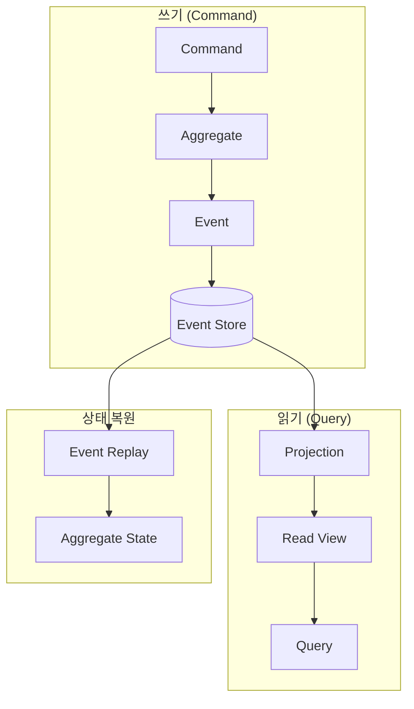
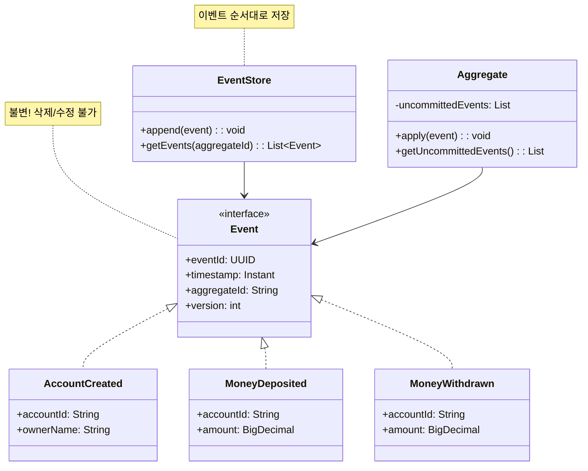
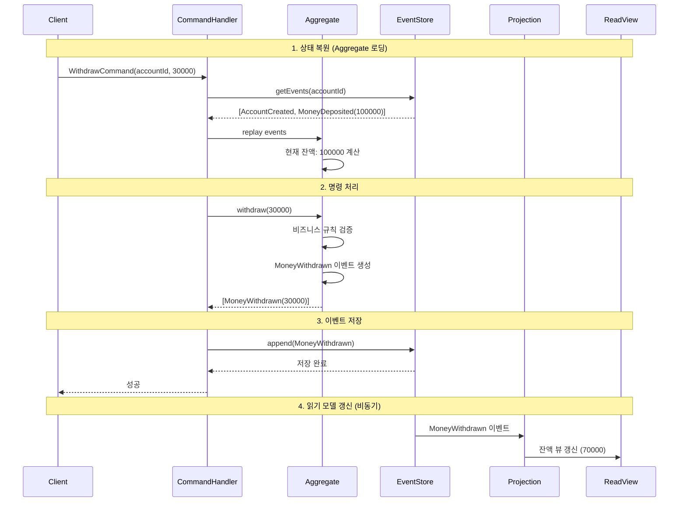

# Event Sourcing 패턴 (Event Sourcing Pattern)

## 정의

Event Sourcing 패턴은 애플리케이션의 상태를 직접 저장하는 대신, 상태 변경을 유발한 모든 이벤트를 순서대로 저장하는 아키텍처 패턴입니다. 현재 상태는 이벤트들을 재생(replay)하여 도출합니다.

## 🎯 한눈에 보기

| 항목 | 설명 |
|------|------|
| **핵심** | 상태 대신 이벤트(변경 이력)를 저장 |
| **비유** | 은행 통장 - 잔액이 아닌 모든 입출금 내역 기록 |
| **언제** | 완전한 감사 로그, 시간 여행(과거 상태 조회), 이벤트 기반 시스템 |
| **Spring** | Axon Framework, Spring ApplicationEvent |

> **💡 계좌 잔액을 관리할 때...**
>
> **❌ Before (현재 상태만 저장)**
> ```java
> // accounts 테이블: balance = 100,000
> account.withdraw(30000);  // balance = 70,000
> account.deposit(50000);   // balance = 120,000
> // 과거에 무슨 일이 있었는지 알 수 없음!
> ```
>
> **✅ After (이벤트 소싱)**
> ```java
> // account_events 테이블:
> // 1. AccountCreated { balance: 0 }
> // 2. MoneyDeposited { amount: 100000 }
> // 3. MoneyWithdrawn { amount: 30000 }
> // 4. MoneyDeposited { amount: 50000 }
> // → 언제든 과거 상태 재현 가능! 완전한 감사 추적!
> ```

## 구조 (Structure)





## 동작 흐름 (시퀀스 다이어그램)



## 핵심 개념

### 1. 이벤트 (Event)
```java
// 이벤트는 과거에 발생한 사실 - 불변!
public record MoneyWithdrawn(
    UUID eventId,
    String accountId,
    BigDecimal amount,
    Instant occurredAt
) implements DomainEvent {}
```

### 2. Aggregate
```java
// 이벤트를 재생하여 현재 상태 도출
public class Account {
    private String accountId;
    private BigDecimal balance = BigDecimal.ZERO;

    // 이벤트 적용 (상태 변경)
    public void apply(MoneyDeposited event) {
        this.balance = this.balance.add(event.amount());
    }

    public void apply(MoneyWithdrawn event) {
        this.balance = this.balance.subtract(event.amount());
    }
}
```

### 3. Event Store
```java
// 이벤트를 순서대로 저장하는 저장소
interface EventStore {
    void append(String aggregateId, List<DomainEvent> events, int expectedVersion);
    List<DomainEvent> getEvents(String aggregateId);
    List<DomainEvent> getEvents(String aggregateId, int fromVersion);
}
```

## 사용 이유

### 1. 완전한 감사 추적 (Audit Trail)
```
모든 상태 변경 이력이 보존됨
- 누가 언제 무엇을 했는지 완벽하게 추적
- 컴플라이언스, 감사 요구사항 충족
- 버그 분석, 재현 가능
```

### 2. 시간 여행 (Temporal Query)
```java
// 특정 시점의 상태 조회
Account accountAt = replayEvents(accountId, atDate("2024-01-15"));
// → 2024-01-15 시점의 계좌 상태
```

### 3. 이벤트 리플레이
```
버그 수정 후 이벤트를 다시 재생하여 데이터 복구
새로운 Projection(읽기 모델) 추가 시 기존 이벤트로 생성
```

## 적용 상황

### 1. 금융 시스템
```
계좌 입출금, 거래 내역 → 완전한 감사 추적 필수
```

### 2. 예약 시스템
```
예약 생성, 변경, 취소 → 모든 변경 이력 필요
```

### 3. 게임
```
플레이어 행동 기록 → 리플레이, 버그 재현
```

## 🔰 5분 만에 이해하기 - 초급 예제

```java
import java.math.BigDecimal;
import java.time.Instant;
import java.util.*;

// 1. 도메인 이벤트
interface DomainEvent {
    Instant getOccurredAt();
}

record AccountCreated(String accountId, String ownerName, Instant occurredAt)
    implements DomainEvent {
    public Instant getOccurredAt() { return occurredAt; }
}

record MoneyDeposited(String accountId, BigDecimal amount, Instant occurredAt)
    implements DomainEvent {
    public Instant getOccurredAt() { return occurredAt; }
}

record MoneyWithdrawn(String accountId, BigDecimal amount, Instant occurredAt)
    implements DomainEvent {
    public Instant getOccurredAt() { return occurredAt; }
}

// 2. Event Store (간단한 인메모리 구현)
class SimpleEventStore {
    private final Map<String, List<DomainEvent>> store = new HashMap<>();

    public void append(String aggregateId, DomainEvent event) {
        store.computeIfAbsent(aggregateId, k -> new ArrayList<>()).add(event);
        System.out.println("이벤트 저장: " + event);
    }

    public List<DomainEvent> getEvents(String aggregateId) {
        return store.getOrDefault(aggregateId, Collections.emptyList());
    }
}

// 3. Aggregate (상태 관리)
class Account {
    private String accountId;
    private String ownerName;
    private BigDecimal balance = BigDecimal.ZERO;

    // 이벤트 재생으로 상태 복원
    public static Account fromEvents(List<DomainEvent> events) {
        Account account = new Account();
        for (DomainEvent event : events) {
            account.apply(event);
        }
        return account;
    }

    // 이벤트 적용
    private void apply(DomainEvent event) {
        if (event instanceof AccountCreated e) {
            this.accountId = e.accountId();
            this.ownerName = e.ownerName();
        } else if (event instanceof MoneyDeposited e) {
            this.balance = this.balance.add(e.amount());
        } else if (event instanceof MoneyWithdrawn e) {
            this.balance = this.balance.subtract(e.amount());
        }
    }

    public BigDecimal getBalance() { return balance; }
    public String getAccountId() { return accountId; }
}

// 4. 사용 예시
public class Main {
    public static void main(String[] args) {
        SimpleEventStore eventStore = new SimpleEventStore();
        String accountId = "ACC-001";

        // 이벤트 발생 (상태 변경 대신 이벤트 저장)
        eventStore.append(accountId,
            new AccountCreated(accountId, "홍길동", Instant.now()));
        eventStore.append(accountId,
            new MoneyDeposited(accountId, BigDecimal.valueOf(100000), Instant.now()));
        eventStore.append(accountId,
            new MoneyWithdrawn(accountId, BigDecimal.valueOf(30000), Instant.now()));
        eventStore.append(accountId,
            new MoneyDeposited(accountId, BigDecimal.valueOf(50000), Instant.now()));

        // 이벤트 재생으로 현재 상태 도출
        List<DomainEvent> events = eventStore.getEvents(accountId);
        Account account = Account.fromEvents(events);

        System.out.println("\n=== 현재 상태 ===");
        System.out.println("계좌: " + account.getAccountId());
        System.out.println("잔액: " + account.getBalance() + "원");

        // 이벤트 히스토리 확인
        System.out.println("\n=== 이벤트 히스토리 ===");
        for (DomainEvent event : events) {
            System.out.println("- " + event);
        }
    }
}
```

**실행 결과:**
```
이벤트 저장: AccountCreated[accountId=ACC-001, ownerName=홍길동, ...]
이벤트 저장: MoneyDeposited[accountId=ACC-001, amount=100000, ...]
이벤트 저장: MoneyWithdrawn[accountId=ACC-001, amount=30000, ...]
이벤트 저장: MoneyDeposited[accountId=ACC-001, amount=50000, ...]

=== 현재 상태 ===
계좌: ACC-001
잔액: 120000원

=== 이벤트 히스토리 ===
- AccountCreated[accountId=ACC-001, ownerName=홍길동, ...]
- MoneyDeposited[accountId=ACC-001, amount=100000, ...]
- MoneyWithdrawn[accountId=ACC-001, amount=30000, ...]
- MoneyDeposited[accountId=ACC-001, amount=50000, ...]
```

## Spring Boot 예제 (Axon Framework)

### 1. 의존성

```gradle
dependencies {
    implementation 'org.axonframework:axon-spring-boot-starter:4.9.0'
    implementation 'org.axonframework:axon-configuration:4.9.0'
}
```

### 2. 이벤트 정의

```java
// 이벤트는 불변 객체
public record AccountCreatedEvent(
    @TargetAggregateIdentifier String accountId,
    String ownerName,
    BigDecimal initialBalance
) {}

public record MoneyDepositedEvent(
    String accountId,
    BigDecimal amount,
    String transactionId
) {}

public record MoneyWithdrawnEvent(
    String accountId,
    BigDecimal amount,
    String transactionId
) {}
```

### 3. Aggregate (Axon)

```java
@Aggregate
public class Account {

    @AggregateIdentifier
    private String accountId;
    private BigDecimal balance;

    protected Account() {} // Axon이 사용

    // Command Handler: 명령을 받아 이벤트 생성
    @CommandHandler
    public Account(CreateAccountCommand cmd) {
        // 비즈니스 규칙 검증
        if (cmd.initialBalance().compareTo(BigDecimal.ZERO) < 0) {
            throw new IllegalArgumentException("초기 잔액은 0 이상이어야 합니다");
        }

        // 이벤트 발행 (아직 상태 변경 안 함!)
        AggregateLifecycle.apply(new AccountCreatedEvent(
            cmd.accountId(), cmd.ownerName(), cmd.initialBalance()));
    }

    @CommandHandler
    public void handle(DepositMoneyCommand cmd) {
        if (cmd.amount().compareTo(BigDecimal.ZERO) <= 0) {
            throw new IllegalArgumentException("입금액은 0보다 커야 합니다");
        }

        AggregateLifecycle.apply(new MoneyDepositedEvent(
            this.accountId, cmd.amount(), UUID.randomUUID().toString()));
    }

    @CommandHandler
    public void handle(WithdrawMoneyCommand cmd) {
        if (balance.compareTo(cmd.amount()) < 0) {
            throw new InsufficientBalanceException("잔액 부족");
        }

        AggregateLifecycle.apply(new MoneyWithdrawnEvent(
            this.accountId, cmd.amount(), UUID.randomUUID().toString()));
    }

    // Event Sourcing Handler: 이벤트로 상태 변경
    @EventSourcingHandler
    public void on(AccountCreatedEvent event) {
        this.accountId = event.accountId();
        this.balance = event.initialBalance();
    }

    @EventSourcingHandler
    public void on(MoneyDepositedEvent event) {
        this.balance = this.balance.add(event.amount());
    }

    @EventSourcingHandler
    public void on(MoneyWithdrawnEvent event) {
        this.balance = this.balance.subtract(event.amount());
    }
}
```

### 4. Projection (읽기 모델)

```java
@Component
@RequiredArgsConstructor
@ProcessingGroup("account-projection")
public class AccountProjection {

    private final AccountViewRepository viewRepository;

    @EventHandler
    public void on(AccountCreatedEvent event) {
        AccountView view = new AccountView(
            event.accountId(),
            event.ownerName(),
            event.initialBalance()
        );
        viewRepository.save(view);
    }

    @EventHandler
    public void on(MoneyDepositedEvent event) {
        viewRepository.findById(event.accountId())
            .ifPresent(view -> {
                view.setBalance(view.getBalance().add(event.amount()));
                viewRepository.save(view);
            });
    }

    @EventHandler
    public void on(MoneyWithdrawnEvent event) {
        viewRepository.findById(event.accountId())
            .ifPresent(view -> {
                view.setBalance(view.getBalance().subtract(event.amount()));
                viewRepository.save(view);
            });
    }
}

// 읽기 전용 View
@Entity
@Table(name = "account_view")
@Getter @Setter
public class AccountView {
    @Id
    private String accountId;
    private String ownerName;
    private BigDecimal balance;
    private LocalDateTime lastUpdated;
}
```

### 5. Command & Query

```java
// Commands
public record CreateAccountCommand(
    @TargetAggregateIdentifier String accountId,
    String ownerName,
    BigDecimal initialBalance
) {}

public record DepositMoneyCommand(
    @TargetAggregateIdentifier String accountId,
    BigDecimal amount
) {}

// Query
public record GetAccountQuery(String accountId) {}

// Query Handler
@Component
@RequiredArgsConstructor
public class AccountQueryHandler {

    private final AccountViewRepository viewRepository;

    @QueryHandler
    public AccountView handle(GetAccountQuery query) {
        return viewRepository.findById(query.accountId())
            .orElseThrow(() -> new AccountNotFoundException(query.accountId()));
    }
}
```

### 6. Controller

```java
@RestController
@RequestMapping("/accounts")
@RequiredArgsConstructor
public class AccountController {

    private final CommandGateway commandGateway;
    private final QueryGateway queryGateway;

    @PostMapping
    public ResponseEntity<String> createAccount(@RequestBody CreateAccountRequest request) {
        String accountId = UUID.randomUUID().toString();
        commandGateway.sendAndWait(new CreateAccountCommand(
            accountId, request.ownerName(), request.initialBalance()));
        return ResponseEntity.status(HttpStatus.CREATED).body(accountId);
    }

    @PostMapping("/{accountId}/deposit")
    public ResponseEntity<Void> deposit(
        @PathVariable String accountId,
        @RequestBody DepositRequest request
    ) {
        commandGateway.sendAndWait(new DepositMoneyCommand(accountId, request.amount()));
        return ResponseEntity.ok().build();
    }

    @GetMapping("/{accountId}")
    public ResponseEntity<AccountView> getAccount(@PathVariable String accountId) {
        AccountView account = queryGateway.query(
            new GetAccountQuery(accountId), AccountView.class).join();
        return ResponseEntity.ok(account);
    }
}
```

## 장단점

### 장점 ✅

| 장점 | 설명 |
|------|------|
| **완전한 이력** | 모든 상태 변경 추적 가능 |
| **시간 여행** | 특정 시점 상태 재현 가능 |
| **감사 추적** | 컴플라이언스 요구사항 충족 |
| **디버깅** | 문제 상황 재현 가능 |
| **이벤트 리플레이** | 새 Projection 추가 용이 |

### 단점 ❌

| 단점 | 설명 |
|------|------|
| **복잡성** | 기존 CRUD보다 훨씬 복잡 |
| **학습 곡선** | 새로운 패러다임 학습 필요 |
| **저장 공간** | 이벤트 축적으로 용량 증가 |
| **스냅샷 필요** | 이벤트 많으면 재생 느림 |
| **이벤트 버전 관리** | 스키마 변경 복잡 |

## 관련 패턴

| 패턴 | 관계 |
|------|------|
| **CQRS** | Event Sourcing과 자주 함께 사용 |
| **Saga** | 분산 트랜잭션에서 이벤트 기반 조정 |
| **Memento** | 상태 저장의 또 다른 형태 |

## 스냅샷 (성능 최적화)

```java
// 이벤트가 많으면 스냅샷으로 최적화
@Aggregate(snapshotTriggerDefinition = "accountSnapshotTrigger")
public class Account {
    // 100개 이벤트마다 스냅샷 생성
}

@Bean
public SnapshotTriggerDefinition accountSnapshotTrigger(Snapshotter snapshotter) {
    return new EventCountSnapshotTriggerDefinition(snapshotter, 100);
}
```

## Event Sourcing 적용 체크리스트

| 질문 | 예시 |
|------|------|
| 완전한 감사 로그 필요? | 금융, 의료, 법률 시스템 |
| 과거 상태 조회 필요? | "3개월 전 계좌 상태는?" |
| 이벤트 리플레이 필요? | 새 분석 모델 추가 |
| 팀의 학습 의지? | 새 패러다임 도입 비용 |
