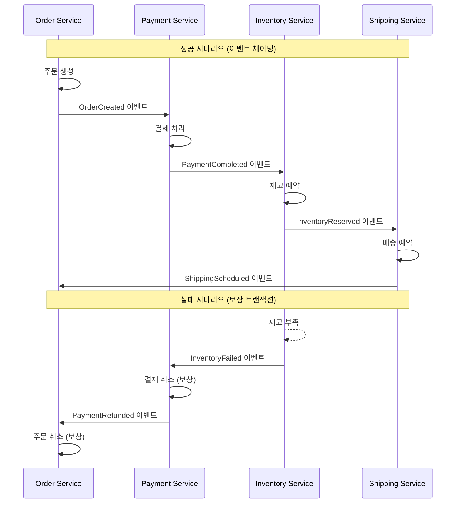
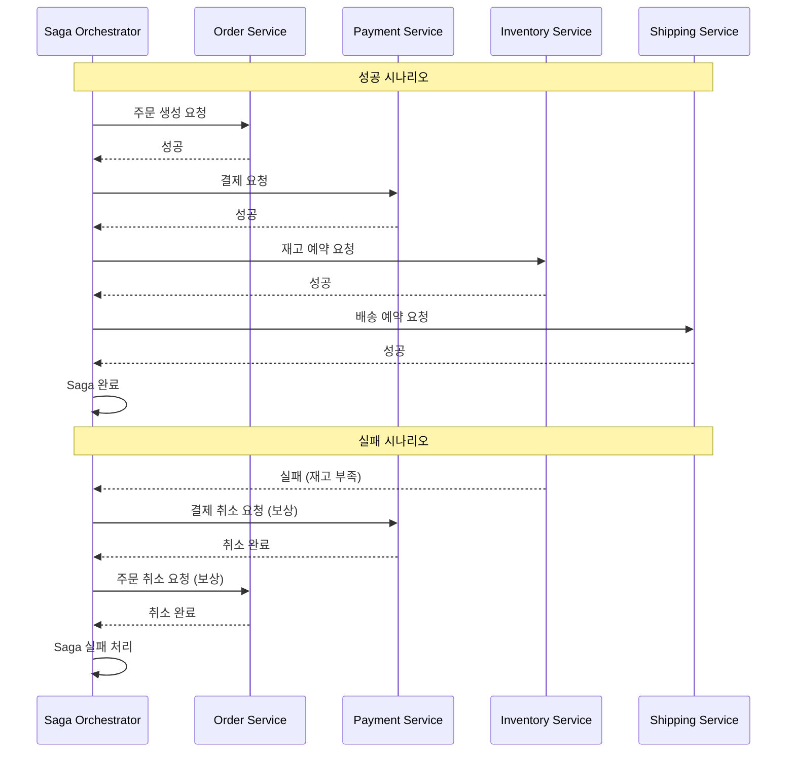
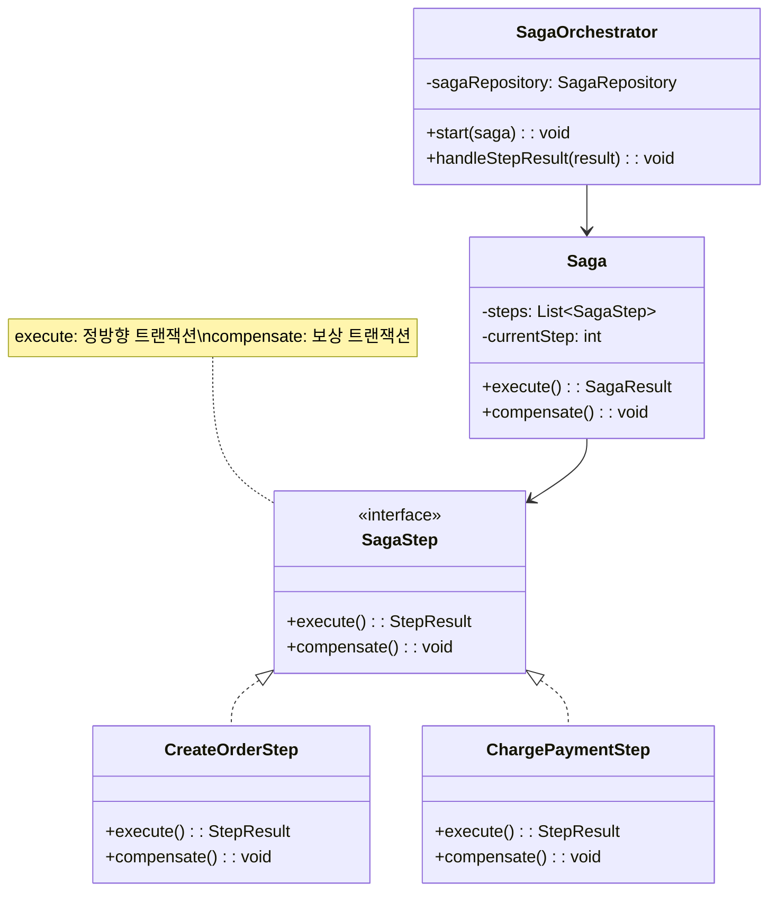

# Saga 패턴 (Saga Pattern)

## 정의

Saga 패턴은 마이크로서비스 환경에서 여러 서비스에 걸친 분산 트랜잭션을 로컬 트랜잭션의 체인으로 관리하는 패턴입니다. 각 단계가 실패하면 보상 트랜잭션(Compensating Transaction)을 실행하여 일관성을 유지합니다.

## 🎯 한눈에 보기

| 항목 | 설명 |
|------|------|
| **핵심** | 분산 트랜잭션을 로컬 트랜잭션 + 보상 트랜잭션으로 처리 |
| **비유** | 여행 예약 - 항공 → 호텔 → 렌터카 순차 예약, 하나 실패 시 역순 취소 |
| **언제** | 마이크로서비스 간 데이터 일관성이 필요할 때 |
| **Spring** | Spring State Machine, Axon Saga, Eventuate |

> **💡 주문-결제-재고-배송이 각각 다른 서비스일 때...**
>
> **❌ Before (2PC 분산 트랜잭션)**
> ```java
> // 2-Phase Commit: 모든 서비스가 동시에 잠금
> transaction.begin();
> orderService.create();     // 잠금
> paymentService.charge();   // 잠금
> inventoryService.reserve();// 잠금
> shippingService.schedule();// 잠금
> transaction.commit();      // 동시에 커밋
> // → 확장성 낮음, 단일 장애점, 성능 저하
> ```
>
> **✅ After (Saga 패턴)**
> ```java
> // 각 서비스가 독립적으로 트랜잭션 수행
> orderSaga
>   .step(createOrder)         .compensate(cancelOrder)
>   .step(chargePayment)       .compensate(refundPayment)
>   .step(reserveInventory)    .compensate(releaseInventory)
>   .step(scheduleShipping)    .compensate(cancelShipping)
>   .execute();
> // 중간 실패 시 → 역순으로 보상 트랜잭션 실행!
> ```

## 두 가지 구현 방식

### 1. Choreography (이벤트 기반)



### 2. Orchestration (중앙 조정자)



## 구조 (Structure)



## 사용 이유

### 1. 마이크로서비스에서의 일관성
```
모놀리식: 하나의 DB 트랜잭션으로 ACID 보장
마이크로서비스: 각 서비스가 자체 DB → 분산 트랜잭션 필요
Saga: 최종 일관성(Eventual Consistency)으로 해결
```

### 2. 확장성과 가용성
```
2PC(Two-Phase Commit): 모든 참여자 동시 잠금 → 병목
Saga: 각 서비스 독립적 트랜잭션 → 높은 확장성
```

### 3. 장애 격리
```
Saga 중간에 서비스 장애 발생해도:
→ 보상 트랜잭션으로 부분 롤백 가능
→ 다른 서비스에 영향 최소화
```

## 적용 상황

### 1. 이커머스 주문 처리
```
주문 → 결제 → 재고 → 배송 → 포인트 적립
각각 다른 서비스, 하나라도 실패 시 전체 롤백
```

### 2. 여행 예약 시스템
```
항공권 → 호텔 → 렌터카 예약
부분 예약 불가, 전체 성공 또는 전체 취소
```

### 3. 금융 이체
```
출금 계좌 → 입금 계좌
중간 실패 시 출금 취소 (보상)
```

## 🔰 5분 만에 이해하기 - 초급 예제

```java
import java.util.*;

// 1. Saga Step 인터페이스
interface SagaStep {
    String getName();
    boolean execute();      // 정방향 트랜잭션
    void compensate();      // 보상 트랜잭션 (롤백)
}

// 2. 구체적인 Step 구현
class CreateOrderStep implements SagaStep {
    private boolean executed = false;

    @Override
    public String getName() { return "주문 생성"; }

    @Override
    public boolean execute() {
        System.out.println("✅ 주문 생성 완료");
        executed = true;
        return true;
    }

    @Override
    public void compensate() {
        if (executed) {
            System.out.println("↩️ 주문 취소 (보상)");
        }
    }
}

class ChargePaymentStep implements SagaStep {
    private boolean executed = false;
    private boolean shouldFail;

    public ChargePaymentStep(boolean shouldFail) {
        this.shouldFail = shouldFail;
    }

    @Override
    public String getName() { return "결제"; }

    @Override
    public boolean execute() {
        if (shouldFail) {
            System.out.println("❌ 결제 실패!");
            return false;
        }
        System.out.println("✅ 결제 완료");
        executed = true;
        return true;
    }

    @Override
    public void compensate() {
        if (executed) {
            System.out.println("↩️ 결제 환불 (보상)");
        }
    }
}

class ReserveInventoryStep implements SagaStep {
    private boolean executed = false;

    @Override
    public String getName() { return "재고 예약"; }

    @Override
    public boolean execute() {
        System.out.println("✅ 재고 예약 완료");
        executed = true;
        return true;
    }

    @Override
    public void compensate() {
        if (executed) {
            System.out.println("↩️ 재고 해제 (보상)");
        }
    }
}

// 3. Saga 실행기 (Orchestrator)
class SagaOrchestrator {
    private final List<SagaStep> steps = new ArrayList<>();
    private final List<SagaStep> executedSteps = new ArrayList<>();

    public SagaOrchestrator addStep(SagaStep step) {
        steps.add(step);
        return this;
    }

    public boolean execute() {
        System.out.println("=== Saga 시작 ===\n");

        for (SagaStep step : steps) {
            System.out.println("▶ " + step.getName() + " 실행...");

            if (step.execute()) {
                executedSteps.add(step);
            } else {
                System.out.println("\n⚠️ " + step.getName() + " 실패! 보상 트랜잭션 시작\n");
                compensate();
                return false;
            }
        }

        System.out.println("\n=== Saga 성공 ===");
        return true;
    }

    private void compensate() {
        // 역순으로 보상 트랜잭션 실행
        Collections.reverse(executedSteps);
        for (SagaStep step : executedSteps) {
            step.compensate();
        }
        System.out.println("\n=== Saga 롤백 완료 ===");
    }
}

// 4. 사용 예시
public class Main {
    public static void main(String[] args) {
        System.out.println("[ 시나리오 1: 모든 단계 성공 ]\n");
        SagaOrchestrator saga1 = new SagaOrchestrator()
            .addStep(new CreateOrderStep())
            .addStep(new ChargePaymentStep(false))  // 성공
            .addStep(new ReserveInventoryStep());
        saga1.execute();

        System.out.println("\n\n[ 시나리오 2: 결제 단계 실패 ]\n");
        SagaOrchestrator saga2 = new SagaOrchestrator()
            .addStep(new CreateOrderStep())
            .addStep(new ChargePaymentStep(true))   // 실패!
            .addStep(new ReserveInventoryStep());
        saga2.execute();
    }
}
```

**실행 결과:**
```
[ 시나리오 1: 모든 단계 성공 ]

=== Saga 시작 ===

▶ 주문 생성 실행...
✅ 주문 생성 완료
▶ 결제 실행...
✅ 결제 완료
▶ 재고 예약 실행...
✅ 재고 예약 완료

=== Saga 성공 ===


[ 시나리오 2: 결제 단계 실패 ]

=== Saga 시작 ===

▶ 주문 생성 실행...
✅ 주문 생성 완료
▶ 결제 실행...
❌ 결제 실패!

⚠️ 결제 실패! 보상 트랜잭션 시작

↩️ 주문 취소 (보상)

=== Saga 롤백 완료 ===
```

## Spring Boot 예제 (Orchestration)

### 1. Saga 상태 관리

```java
// Saga 상태
public enum OrderSagaState {
    STARTED,
    ORDER_CREATED,
    PAYMENT_COMPLETED,
    INVENTORY_RESERVED,
    SHIPPING_SCHEDULED,
    COMPLETED,
    COMPENSATING,
    FAILED
}

// Saga 엔티티
@Entity
@Table(name = "order_sagas")
@Getter @Setter
public class OrderSaga {
    @Id
    private String sagaId;

    private String orderId;
    private String paymentId;
    private String inventoryReservationId;
    private String shippingId;

    @Enumerated(EnumType.STRING)
    private OrderSagaState state;

    private String failureReason;
    private LocalDateTime createdAt;
    private LocalDateTime updatedAt;
}
```

### 2. Saga Orchestrator

```java
@Service
@RequiredArgsConstructor
@Slf4j
public class OrderSagaOrchestrator {

    private final OrderSagaRepository sagaRepository;
    private final OrderService orderService;
    private final PaymentService paymentService;
    private final InventoryService inventoryService;
    private final ShippingService shippingService;

    @Transactional
    public String startSaga(CreateOrderRequest request) {
        // 1. Saga 생성
        OrderSaga saga = new OrderSaga();
        saga.setSagaId(UUID.randomUUID().toString());
        saga.setState(OrderSagaState.STARTED);
        saga.setCreatedAt(LocalDateTime.now());
        sagaRepository.save(saga);

        // 2. Saga 실행
        executeSaga(saga, request);

        return saga.getSagaId();
    }

    private void executeSaga(OrderSaga saga, CreateOrderRequest request) {
        try {
            // Step 1: 주문 생성
            String orderId = orderService.createOrder(request);
            saga.setOrderId(orderId);
            saga.setState(OrderSagaState.ORDER_CREATED);
            sagaRepository.save(saga);

            // Step 2: 결제
            String paymentId = paymentService.charge(orderId, request.getAmount());
            saga.setPaymentId(paymentId);
            saga.setState(OrderSagaState.PAYMENT_COMPLETED);
            sagaRepository.save(saga);

            // Step 3: 재고 예약
            String reservationId = inventoryService.reserve(request.getProductId(),
                request.getQuantity());
            saga.setInventoryReservationId(reservationId);
            saga.setState(OrderSagaState.INVENTORY_RESERVED);
            sagaRepository.save(saga);

            // Step 4: 배송 예약
            String shippingId = shippingService.schedule(orderId);
            saga.setShippingId(shippingId);
            saga.setState(OrderSagaState.SHIPPING_SCHEDULED);
            sagaRepository.save(saga);

            // 완료
            saga.setState(OrderSagaState.COMPLETED);
            sagaRepository.save(saga);
            log.info("Saga 완료: {}", saga.getSagaId());

        } catch (Exception e) {
            log.error("Saga 실패: {}", e.getMessage());
            saga.setFailureReason(e.getMessage());
            compensate(saga);
        }
    }

    private void compensate(OrderSaga saga) {
        saga.setState(OrderSagaState.COMPENSATING);
        sagaRepository.save(saga);

        try {
            // 역순으로 보상 트랜잭션 실행
            if (saga.getShippingId() != null) {
                shippingService.cancel(saga.getShippingId());
                log.info("배송 취소 완료");
            }

            if (saga.getInventoryReservationId() != null) {
                inventoryService.release(saga.getInventoryReservationId());
                log.info("재고 해제 완료");
            }

            if (saga.getPaymentId() != null) {
                paymentService.refund(saga.getPaymentId());
                log.info("결제 환불 완료");
            }

            if (saga.getOrderId() != null) {
                orderService.cancel(saga.getOrderId());
                log.info("주문 취소 완료");
            }

            saga.setState(OrderSagaState.FAILED);
            sagaRepository.save(saga);
            log.info("보상 트랜잭션 완료");

        } catch (Exception e) {
            log.error("보상 트랜잭션 실패: {}", e.getMessage());
            // 수동 개입 필요 알림
        }
    }
}
```

### 3. 비동기 Saga (이벤트 기반)

```java
// 이벤트 정의
public record OrderCreatedEvent(String sagaId, String orderId) {}
public record PaymentCompletedEvent(String sagaId, String paymentId) {}
public record PaymentFailedEvent(String sagaId, String reason) {}

// Saga Orchestrator (이벤트 기반)
@Component
@RequiredArgsConstructor
@Slf4j
public class AsyncOrderSagaOrchestrator {

    private final OrderSagaRepository sagaRepository;
    private final ApplicationEventPublisher eventPublisher;

    @Async
    public void startSaga(String sagaId, CreateOrderRequest request) {
        eventPublisher.publishEvent(new StartOrderSagaCommand(sagaId, request));
    }

    @EventListener
    public void on(OrderCreatedEvent event) {
        OrderSaga saga = sagaRepository.findById(event.sagaId()).orElseThrow();
        saga.setOrderId(event.orderId());
        saga.setState(OrderSagaState.ORDER_CREATED);
        sagaRepository.save(saga);

        // 다음 단계 트리거
        eventPublisher.publishEvent(new ProcessPaymentCommand(
            event.sagaId(), event.orderId()));
    }

    @EventListener
    public void on(PaymentCompletedEvent event) {
        OrderSaga saga = sagaRepository.findById(event.sagaId()).orElseThrow();
        saga.setPaymentId(event.paymentId());
        saga.setState(OrderSagaState.PAYMENT_COMPLETED);
        sagaRepository.save(saga);

        // 다음 단계 트리거
        eventPublisher.publishEvent(new ReserveInventoryCommand(event.sagaId()));
    }

    @EventListener
    public void on(PaymentFailedEvent event) {
        log.warn("결제 실패, 보상 시작: {}", event.reason());
        OrderSaga saga = sagaRepository.findById(event.sagaId()).orElseThrow();
        saga.setFailureReason(event.reason());

        // 보상 트리거
        eventPublisher.publishEvent(new CompensateOrderCommand(event.sagaId()));
    }
}
```

### 4. Spring State Machine 활용

```java
@Configuration
@EnableStateMachineFactory
public class OrderSagaStateMachineConfig
    extends StateMachineConfigurerAdapter<OrderSagaState, OrderSagaEvent> {

    @Override
    public void configure(StateMachineStateConfigurer<OrderSagaState, OrderSagaEvent> states)
        throws Exception {
        states
            .withStates()
            .initial(OrderSagaState.STARTED)
            .state(OrderSagaState.ORDER_CREATED)
            .state(OrderSagaState.PAYMENT_COMPLETED)
            .state(OrderSagaState.INVENTORY_RESERVED)
            .state(OrderSagaState.SHIPPING_SCHEDULED)
            .end(OrderSagaState.COMPLETED)
            .state(OrderSagaState.COMPENSATING)
            .end(OrderSagaState.FAILED);
    }

    @Override
    public void configure(StateMachineTransitionConfigurer<OrderSagaState, OrderSagaEvent> transitions)
        throws Exception {
        transitions
            // 정방향
            .withExternal()
                .source(OrderSagaState.STARTED)
                .target(OrderSagaState.ORDER_CREATED)
                .event(OrderSagaEvent.ORDER_CREATE_SUCCESS)
            .and()
            .withExternal()
                .source(OrderSagaState.ORDER_CREATED)
                .target(OrderSagaState.PAYMENT_COMPLETED)
                .event(OrderSagaEvent.PAYMENT_SUCCESS)
            .and()
            // 보상 (실패 시)
            .withExternal()
                .source(OrderSagaState.ORDER_CREATED)
                .target(OrderSagaState.COMPENSATING)
                .event(OrderSagaEvent.PAYMENT_FAILED)
            .and()
            .withExternal()
                .source(OrderSagaState.COMPENSATING)
                .target(OrderSagaState.FAILED)
                .event(OrderSagaEvent.COMPENSATION_COMPLETE);
    }
}
```

## Choreography vs Orchestration

| 측면 | Choreography | Orchestration |
|------|--------------|---------------|
| **조정 방식** | 이벤트 체이닝 | 중앙 조정자 |
| **결합도** | 낮음 (이벤트만 알면 됨) | 높음 (오케스트레이터 의존) |
| **복잡성** | 분산된 로직 | 중앙 집중 로직 |
| **디버깅** | 어려움 (이벤트 추적) | 쉬움 (중앙에서 모니터링) |
| **추천** | 단순한 Saga (3~4단계) | 복잡한 Saga (5단계 이상) |

## 장단점

### 장점 ✅

| 장점 | 설명 |
|------|------|
| **느슨한 결합** | 각 서비스 독립적 |
| **확장성** | 2PC 대비 높은 확장성 |
| **장애 복원** | 보상 트랜잭션으로 복구 |
| **비동기 처리** | 동기 잠금 없음 |

### 단점 ❌

| 단점 | 설명 |
|------|------|
| **복잡성** | 보상 로직 구현 필요 |
| **일관성 지연** | 최종 일관성 (즉각적 X) |
| **디버깅 어려움** | 분산된 트랜잭션 추적 |
| **보상 실패** | 보상도 실패할 수 있음 |

## 관련 패턴

| 패턴 | 관계 |
|------|------|
| **Event Sourcing** | Saga 이벤트 저장에 활용 |
| **CQRS** | 읽기 모델 동기화 |
| **Outbox** | 이벤트 발행 보장 |
| **Idempotency** | 중복 실행 방지 |

## 보상 트랜잭션 설계 원칙

| 원칙 | 설명 |
|------|------|
| **멱등성** | 같은 보상 여러 번 해도 안전 |
| **순서** | 역순 실행 |
| **타임아웃** | 보상 실패 시 재시도/알림 |
| **로깅** | 모든 단계 기록 |
