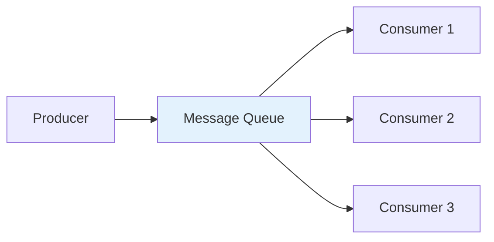
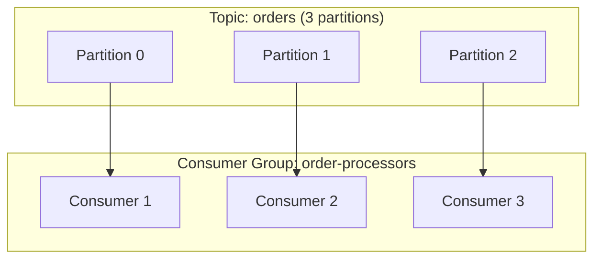

# Competing Consumers 패턴

## 정의

Competing Consumers 패턴은 여러 소비자가 동일한 메시지 큐에서 메시지를 경쟁적으로 가져와 처리하여 처리량을 높이는 패턴입니다.

## 🎯 한눈에 보기

| 항목 | 설명 |
|------|------|
| **핵심** | 다중 소비자로 처리량 증가 |
| **비유** | 여러 창구에서 손님 처리 |
| **언제** | 높은 처리량, 수평 확장 필요 시 |
| **Spring** | Kafka Consumer Group, RabbitMQ |

## 구조 (Structure)



## Kafka Consumer Group



## 기본 예제

### Kafka 설정

```yaml
spring:
  kafka:
    consumer:
      group-id: order-processors
      auto-offset-reset: earliest
      enable-auto-commit: false
```

### Consumer 구현

```java
@Component
public class OrderConsumer {

    @KafkaListener(
        topics = "orders",
        groupId = "order-processors",
        concurrency = "3"  // 3개 스레드
    )
    public void processOrder(ConsumerRecord<String, Order> record) {
        log.info("Processing order on partition {}: {}",
            record.partition(), record.value());
        orderService.process(record.value());
    }
}
```

## 순서 보장

| 요구사항 | 해결책 |
|----------|--------|
| 전역 순서 필요 | 파티션 1개 (확장성 제한) |
| 키별 순서 필요 | 동일 키 → 동일 파티션 |
| 순서 불필요 | 자유롭게 분배 |

```java
// 사용자별 순서 보장
kafkaTemplate.send("orders", userId, order);  // userId가 파티션 키
```

## 장단점

### 장점
- 처리량 수평 확장
- 장애 시 다른 소비자가 처리

### 단점
- 전역 순서 보장 어려움
- 파티션 수 이상 확장 불가 (Kafka)

## 관련 패턴

| 패턴 | 관계 |
|------|------|
| [Inbox](../Inbox) | 중복 처리 방지 |
| [Bulkhead](../../resilience/Bulkhead) | 리소스 격리 |
