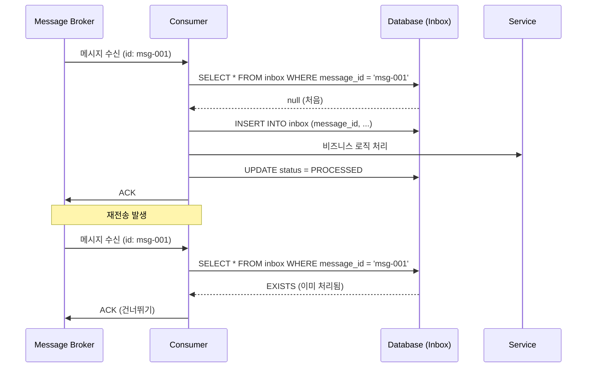

# Inbox 패턴

## 정의

Inbox 패턴은 수신한 메시지를 DB에 저장하고 중복 여부를 확인하여 동일 메시지의 중복 처리를 방지하는 패턴입니다. Outbox와 함께 Exactly-Once를 구현합니다.

## 🎯 한눈에 보기

| 항목 | 설명 |
|------|------|
| **핵심** | 메시지 ID로 중복 체크 |
| **비유** | 받은 편지함에서 이미 읽은 편지 건너뛰기 |
| **언제** | 메시지 중복 처리 방지, Exactly-Once |
| **Spring** | Redis/DB 기반 중복 체크 |

## 구조 (Structure)



## 기본 예제

### Inbox 테이블

```sql
CREATE TABLE inbox_messages (
    id BIGINT PRIMARY KEY AUTO_INCREMENT,
    message_id VARCHAR(255) UNIQUE NOT NULL,
    topic VARCHAR(255),
    payload JSON,
    received_at TIMESTAMP DEFAULT CURRENT_TIMESTAMP,
    processed_at TIMESTAMP NULL,
    status VARCHAR(20) DEFAULT 'RECEIVED'
);
```

### Consumer 구현

```java
@Component
@RequiredArgsConstructor
public class OrderEventConsumer {

    private final InboxRepository inboxRepository;
    private final InventoryService inventoryService;

    @KafkaListener(topics = "order-events")
    @Transactional
    public void handleOrderEvent(ConsumerRecord<String, String> record) {
        String messageId = record.headers()
            .lastHeader("message-id").value().toString();

        // 1. 중복 체크
        if (inboxRepository.existsByMessageId(messageId)) {
            log.info("Duplicate message ignored: {}", messageId);
            return;
        }

        // 2. Inbox에 저장
        InboxMessage inbox = InboxMessage.builder()
            .messageId(messageId)
            .topic(record.topic())
            .payload(record.value())
            .build();
        inboxRepository.save(inbox);

        // 3. 비즈니스 로직 처리
        OrderEvent event = parseEvent(record.value());
        inventoryService.decreaseStock(event.getItems());

        // 4. 처리 완료 표시
        inbox.markProcessed();
    }
}
```

## 장단점

### 장점
- 메시지 중복 처리 방지
- Exactly-Once 시맨틱 구현
- 처리 이력 보존

### 단점
- 추가 저장소 필요
- 메시지마다 DB 조회

## 관련 패턴

| 패턴 | 관계 |
|------|------|
| [Outbox](../Outbox) | 발행 측 신뢰성 |
| [Idempotency](../../api-security/Idempotency) | API 레벨 멱등성 |
