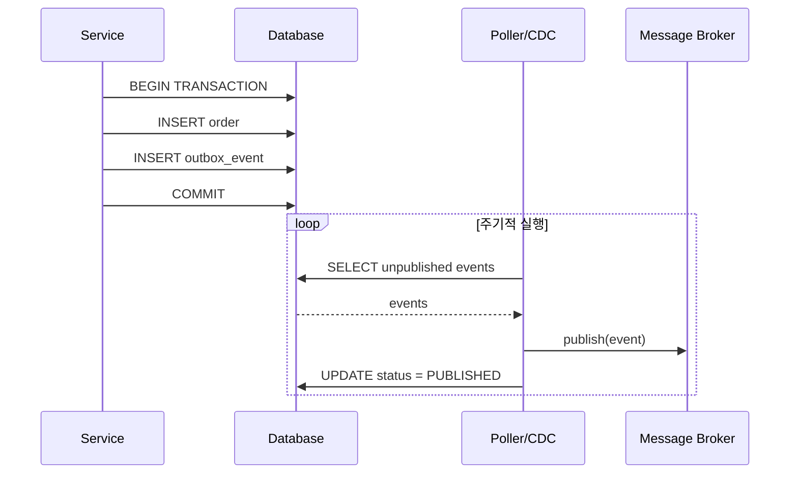

# Outbox 패턴 (Transactional Outbox)

## 정의

Outbox 패턴은 비즈니스 로직과 이벤트를 같은 트랜잭션으로 DB에 저장한 후, 별도 프로세스가 이벤트를 메시지 브로커로 발행하는 패턴입니다. 메시지 손실을 방지합니다.

## 🎯 한눈에 보기

| 항목 | 설명 |
|------|------|
| **핵심** | 이벤트를 DB에 먼저 저장, 이후 발행 |
| **비유** | 보낼 편지를 우편함(Outbox)에 넣고, 우체부가 수거 |
| **언제** | 메시지 손실 방지, 분산 시스템 |
| **Spring** | `@TransactionalEventListener`, Debezium CDC |

> **💡 주문 완료 이벤트를 손실 없이 발행하고 싶을 때...**
>
> **❌ Before (메시지 손실 위험)**
> ```java
> @Transactional
> public void createOrder(Order order) {
>     orderRepository.save(order);
>     kafkaTemplate.send("orders", event);  // DB 커밋 전 실패하면?
> }
> ```
>
> **✅ After (Outbox 패턴)**
> ```java
> @Transactional
> public void createOrder(Order order) {
>     orderRepository.save(order);
>     outboxRepository.save(new OutboxEvent("orders", event));  // 같은 트랜잭션
> }
> // 별도 프로세스가 OUTBOX 테이블 폴링 → Kafka 발행
> ```

## 구조 (Structure)



## 기본 예제

### Outbox 테이블

```sql
CREATE TABLE outbox_events (
    id BIGINT PRIMARY KEY AUTO_INCREMENT,
    aggregate_type VARCHAR(255),
    aggregate_id VARCHAR(255),
    event_type VARCHAR(255),
    payload JSON,
    created_at TIMESTAMP DEFAULT CURRENT_TIMESTAMP,
    published_at TIMESTAMP NULL,
    status VARCHAR(20) DEFAULT 'PENDING'
);
```

### 서비스 구현

```java
@Service
@RequiredArgsConstructor
public class OrderService {

    private final OrderRepository orderRepository;
    private final OutboxRepository outboxRepository;

    @Transactional
    public Order createOrder(CreateOrderRequest request) {
        // 1. 비즈니스 로직
        Order order = Order.create(request);
        orderRepository.save(order);

        // 2. Outbox에 이벤트 저장 (같은 트랜잭션)
        OutboxEvent event = OutboxEvent.builder()
            .aggregateType("Order")
            .aggregateId(order.getId().toString())
            .eventType("OrderCreated")
            .payload(toJson(new OrderCreatedEvent(order)))
            .build();
        outboxRepository.save(event);

        return order;
    }
}
```

### 폴링 발행자

```java
@Component
@RequiredArgsConstructor
public class OutboxPoller {

    private final OutboxRepository outboxRepository;
    private final KafkaTemplate<String, String> kafkaTemplate;

    @Scheduled(fixedDelay = 1000)
    @Transactional
    public void publishEvents() {
        List<OutboxEvent> events = outboxRepository
            .findByStatusOrderByCreatedAtAsc("PENDING", PageRequest.of(0, 100));

        for (OutboxEvent event : events) {
            try {
                kafkaTemplate.send(event.getAggregateType(), event.getPayload());
                event.markPublished();
            } catch (Exception e) {
                log.error("Failed to publish event: {}", event.getId(), e);
            }
        }
    }
}
```

### CDC 방식 (Debezium)

```json
{
  "connector.class": "io.debezium.connector.mysql.MySqlConnector",
  "database.hostname": "localhost",
  "database.port": "3306",
  "database.user": "debezium",
  "database.password": "dbz",
  "database.server.id": "1",
  "table.include.list": "mydb.outbox_events",
  "transforms": "outbox",
  "transforms.outbox.type": "io.debezium.transforms.outbox.EventRouter"
}
```

## 폴링 vs CDC

| 방식 | 폴링 | CDC (Debezium) |
|------|------|----------------|
| 구현 | 간단 | 복잡 |
| 지연 | 폴링 주기 | 실시간 |
| DB 부하 | 있음 | 없음 (로그 기반) |
| 순서 보장 | 조회 순서 | 커밋 순서 |

## 장단점

### 장점
- 메시지 손실 방지 (At-Least-Once)
- 비즈니스 로직과 이벤트 발행 원자성
- 재처리 가능 (이벤트 보존)

### 단점
- 추가 테이블과 프로세스 필요
- 메시지 중복 발행 가능 (Inbox로 해결)
- 발행 지연 발생

## 관련 패턴

| 패턴 | 관계 |
|------|------|
| [Inbox](../Inbox) | 소비 측 중복 방지 |
| [Saga](../../distributed/Saga) | 분산 트랜잭션 구현 시 함께 사용 |
| [Event Sourcing](../../distributed/EventSourcing) | 이벤트 저장 방식 |
