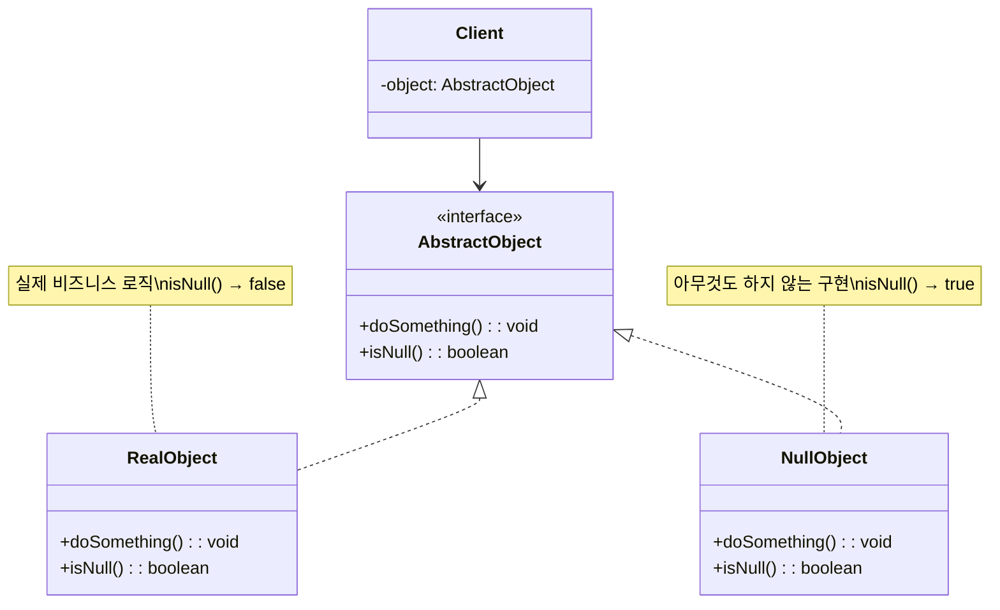
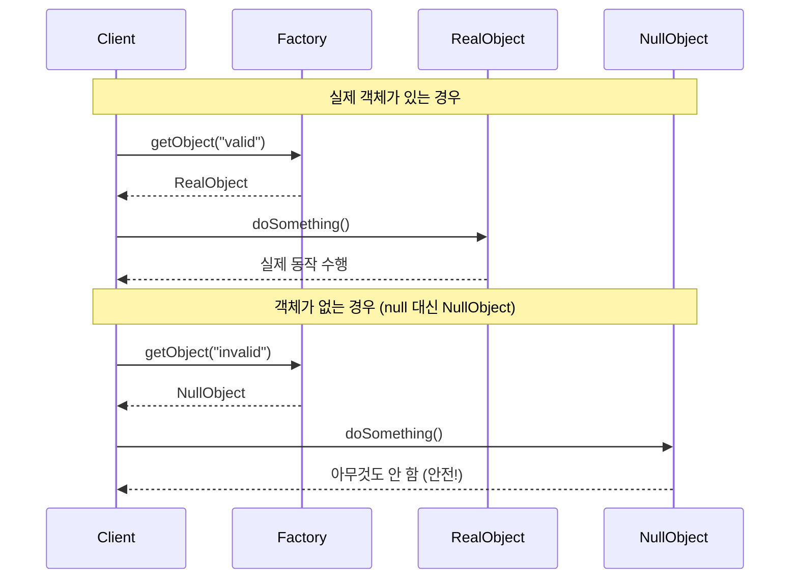

# Null Object 패턴 (Null Object Pattern)

## 정의

Null Object 패턴은 null 대신 "아무것도 하지 않는" 객체를 사용하여 null 체크를 제거하고 NullPointerException을 방지하는 행동 디자인 패턴입니다.

## 🎯 한눈에 보기

| 항목 | 설명 |
|------|------|
| **핵심** | null 대신 "아무것도 안 하는" 기본 객체 사용 |
| **비유** | 손님이 없어도 빈 의자(Null Object)가 있음 |
| **언제** | null 체크가 반복될 때, 기본 동작이 필요할 때 |
| **Spring** | `Optional<T>`, 기본 구현체, 빈 컬렉션 반환 |

> **💡 할인 정책을 적용할 때...**
>
> **❌ Before (null 체크 반복)**
> ```java
> DiscountPolicy discount = getDiscountPolicy(customerId);
> if (discount != null) {
>     price = discount.apply(price);
> }
> // 모든 곳에서 null 체크 필요!
> ```
>
> **✅ After (Null Object)**
> ```java
> DiscountPolicy discount = getDiscountPolicy(customerId);
> price = discount.apply(price);  // null 체크 불필요!
> // NoDiscount가 반환되면 그냥 원래 가격 반환
> ```

## 구조 (Structure)



## 동작 흐름 (시퀀스 다이어그램)



## 사용 이유

### 1. NullPointerException 방지
```java
// Before: NPE 위험
customer.getDiscount().apply(price);  // getDiscount()가 null이면 NPE!

// After: 항상 안전
customer.getDiscount().apply(price);  // NoDiscount 반환 → 안전!
```

### 2. null 체크 제거로 코드 간결화
```java
// Before: 중첩된 null 체크
if (order != null) {
    if (order.getCustomer() != null) {
        if (order.getCustomer().getAddress() != null) {
            return order.getCustomer().getAddress().getCity();
        }
    }
}
return "Unknown";

// After: 깔끔한 체이닝
return order.getCustomer().getAddress().getCity();  // 각각 Null Object 반환
```

### 3. 기본 동작 제공
```java
// 로거가 없어도 안전
Logger logger = getLogger();  // NullLogger 반환 가능
logger.log("message");        // 아무 일도 안 일어남
```

## 적용 상황

### 1. 선택적 정책/전략
```java
// 할인 정책이 없으면 NoDiscount (할인 0%)
DiscountPolicy policy = policyRepository.findByCustomerId(customerId)
    .orElse(NoDiscount.INSTANCE);
```

### 2. 선택적 의존성
```java
// 캐시가 없어도 동작
Cache cache = cacheProvider.getCache()
    .orElse(NoOpCache.INSTANCE);
```

### 3. 컬렉션 대신 빈 컬렉션
```java
// null 대신 빈 리스트
public List<Order> getOrders() {
    return orders != null ? orders : Collections.emptyList();
}
```

## 🔰 5분 만에 이해하기 - 초급 예제

```java
// 1. 인터페이스
interface DiscountPolicy {
    int apply(int price);
    String getDescription();
}

// 2. 실제 구현체들
class PercentDiscount implements DiscountPolicy {
    private final int percent;

    public PercentDiscount(int percent) {
        this.percent = percent;
    }

    @Override
    public int apply(int price) {
        return price - (price * percent / 100);
    }

    @Override
    public String getDescription() {
        return percent + "% 할인";
    }
}

class FixedDiscount implements DiscountPolicy {
    private final int amount;

    public FixedDiscount(int amount) {
        this.amount = amount;
    }

    @Override
    public int apply(int price) {
        return Math.max(0, price - amount);
    }

    @Override
    public String getDescription() {
        return amount + "원 할인";
    }
}

// 3. Null Object (핵심!)
class NoDiscount implements DiscountPolicy {
    public static final NoDiscount INSTANCE = new NoDiscount();

    private NoDiscount() {}  // 싱글톤

    @Override
    public int apply(int price) {
        return price;  // 아무것도 안 함! 원래 가격 그대로
    }

    @Override
    public String getDescription() {
        return "할인 없음";
    }
}

// 4. 서비스 (null 체크 없이 사용)
class PricingService {
    private final Map<String, DiscountPolicy> policies = new HashMap<>();

    public PricingService() {
        policies.put("VIP", new PercentDiscount(20));
        policies.put("GOLD", new PercentDiscount(10));
        policies.put("EVENT", new FixedDiscount(5000));
    }

    // null 반환 대신 NoDiscount 반환!
    public DiscountPolicy getPolicy(String customerType) {
        return policies.getOrDefault(customerType, NoDiscount.INSTANCE);
    }

    public int calculatePrice(String customerType, int originalPrice) {
        DiscountPolicy policy = getPolicy(customerType);
        // null 체크 불필요!
        int finalPrice = policy.apply(originalPrice);
        System.out.println("적용된 정책: " + policy.getDescription());
        System.out.println("최종 가격: " + finalPrice + "원");
        return finalPrice;
    }
}

// 5. 사용
public class Main {
    public static void main(String[] args) {
        PricingService service = new PricingService();

        System.out.println("=== VIP 고객 ===");
        service.calculatePrice("VIP", 100000);

        System.out.println("\n=== 일반 고객 (정책 없음) ===");
        service.calculatePrice("NORMAL", 100000);
        // NullPointerException 없이 안전하게 동작!
    }
}
```

**실행 결과:**
```
=== VIP 고객 ===
적용된 정책: 20% 할인
최종 가격: 80000원

=== 일반 고객 (정책 없음) ===
적용된 정책: 할인 없음
최종 가격: 100000원
```

## Spring Boot 예제

### 1. 기본 구현

```java
// 인터페이스
public interface NotificationSender {
    void send(String message, String recipient);
    boolean isEnabled();
}

// 실제 구현체
@Component
@ConditionalOnProperty(name = "notification.email.enabled", havingValue = "true")
public class EmailNotificationSender implements NotificationSender {

    private final JavaMailSender mailSender;

    @Override
    public void send(String message, String recipient) {
        // 이메일 발송 로직
        SimpleMailMessage mail = new SimpleMailMessage();
        mail.setTo(recipient);
        mail.setText(message);
        mailSender.send(mail);
    }

    @Override
    public boolean isEnabled() {
        return true;
    }
}

// Null Object
@Component
@ConditionalOnMissingBean(NotificationSender.class)
public class NoOpNotificationSender implements NotificationSender {

    private static final Logger log = LoggerFactory.getLogger(NoOpNotificationSender.class);

    @Override
    public void send(String message, String recipient) {
        // 아무것도 안 함 (또는 로그만)
        log.debug("알림 발송 건너뜀: recipient={}", recipient);
    }

    @Override
    public boolean isEnabled() {
        return false;
    }
}

// 서비스에서 사용 (null 체크 불필요)
@Service
@RequiredArgsConstructor
public class OrderService {

    private final NotificationSender notificationSender;

    public void completeOrder(Order order) {
        // 주문 처리 로직...

        // null 체크 없이 안전하게 호출
        notificationSender.send(
            "주문이 완료되었습니다: " + order.getId(),
            order.getCustomerEmail()
        );
    }
}
```

### 2. Optional과 함께 사용

```java
@Service
@RequiredArgsConstructor
public class DiscountService {

    private final DiscountPolicyRepository policyRepository;

    public int calculatePrice(Long customerId, int originalPrice) {
        // Optional + orElse로 Null Object 반환
        DiscountPolicy policy = policyRepository.findByCustomerId(customerId)
            .orElse(NoDiscount.INSTANCE);

        return policy.apply(originalPrice);
    }
}

// Repository
public interface DiscountPolicyRepository extends JpaRepository<DiscountPolicy, Long> {

    Optional<DiscountPolicy> findByCustomerId(Long customerId);

    // 기본 구현 (Null Object 반환)
    default DiscountPolicy getByCustomerIdOrDefault(Long customerId) {
        return findByCustomerId(customerId).orElse(NoDiscount.INSTANCE);
    }
}
```

### 3. 컬렉션에서의 활용

```java
@Service
public class OrderQueryService {

    private final OrderRepository orderRepository;

    // null 대신 빈 리스트 반환
    public List<Order> getOrdersByCustomerId(Long customerId) {
        List<Order> orders = orderRepository.findByCustomerId(customerId);
        return orders != null ? orders : Collections.emptyList();
    }

    // Optional과 함께
    public List<OrderItem> getOrderItems(Long orderId) {
        return orderRepository.findById(orderId)
            .map(Order::getItems)
            .orElse(Collections.emptyList());
    }
}
```

### 4. 빌더 패턴과 함께

```java
@Builder
public class NotificationConfig {
    @Builder.Default
    private NotificationSender emailSender = NoOpNotificationSender.INSTANCE;

    @Builder.Default
    private NotificationSender smsSender = NoOpNotificationSender.INSTANCE;

    @Builder.Default
    private NotificationSender pushSender = NoOpNotificationSender.INSTANCE;
}

// 사용
NotificationConfig config = NotificationConfig.builder()
    .emailSender(new EmailNotificationSender())  // 이메일만 설정
    // SMS, Push는 NoOp (null 아님!)
    .build();
```

### 5. Logger Null Object

```java
public interface AppLogger {
    void info(String message);
    void error(String message, Throwable t);
    void debug(String message);
}

// 실제 로거
@Component
@Primary
public class Slf4jAppLogger implements AppLogger {
    private final Logger log = LoggerFactory.getLogger(Slf4jAppLogger.class);

    @Override
    public void info(String message) {
        log.info(message);
    }

    @Override
    public void error(String message, Throwable t) {
        log.error(message, t);
    }

    @Override
    public void debug(String message) {
        log.debug(message);
    }
}

// Null Object 로거 (테스트용)
public class NullLogger implements AppLogger {
    public static final NullLogger INSTANCE = new NullLogger();

    @Override
    public void info(String message) { /* 아무것도 안 함 */ }

    @Override
    public void error(String message, Throwable t) { /* 아무것도 안 함 */ }

    @Override
    public void debug(String message) { /* 아무것도 안 함 */ }
}

// 테스트에서 사용
@Test
void 주문_생성_테스트() {
    OrderService service = new OrderService(
        mockOrderRepository,
        NullLogger.INSTANCE  // 로그 출력 안 함
    );

    service.createOrder(request);
    // 테스트 로그가 깔끔!
}
```

## Optional vs Null Object

| 측면 | Optional | Null Object |
|------|----------|-------------|
| **목적** | null 가능성 명시 | null 제거 |
| **사용처** | 반환 타입 | 인터페이스 구현 |
| **체이닝** | `map`, `flatMap` | 메서드 호출 |
| **동작** | 없으면 대체값/예외 | 기본 동작 수행 |

```java
// Optional 사용
Optional<Discount> discount = findDiscount(customerId);
int price = discount.map(d -> d.apply(originalPrice))
                    .orElse(originalPrice);

// Null Object 사용
Discount discount = findDiscountOrDefault(customerId);  // NoDiscount 반환
int price = discount.apply(originalPrice);
```

## 장단점

### 장점 ✅

| 장점 | 설명 |
|------|------|
| **NPE 방지** | NullPointerException 원천 차단 |
| **코드 간결화** | null 체크 제거 |
| **일관성** | 모든 경우에 동일한 인터페이스 |
| **기본 동작** | 명시적인 기본 행동 정의 |
| **다형성** | 조건문 대신 다형성 활용 |

### 단점 ❌

| 단점 | 설명 |
|------|------|
| **클래스 증가** | Null Object 클래스 추가 필요 |
| **명확성 부족** | 실제 null인지 Null Object인지 구분 어려움 |
| **오용 가능** | 모든 곳에 적용하면 과도한 추상화 |
| **디버깅** | 아무것도 안 하니까 문제 발견 어려울 수 있음 |

## 관련 패턴

| 패턴 | 관계 |
|------|------|
| **Strategy** | Null Object는 "아무것도 안 하는" 전략 |
| **Singleton** | Null Object는 보통 싱글톤으로 구현 |
| **Proxy** | 실제 객체 대신 동작하는 점에서 유사 |
| **State** | 빈 상태를 Null Object로 표현 가능 |

## 적용 가이드

| 상황 | 권장 |
|------|------|
| 반환 타입 | `Optional<T>` 사용 |
| 인터페이스 구현 | Null Object 패턴 |
| 컬렉션 | `Collections.emptyList()` 반환 |
| 문자열 | 빈 문자열 `""` 반환 |
| 기본 동작 필요 | Null Object 패턴 |
