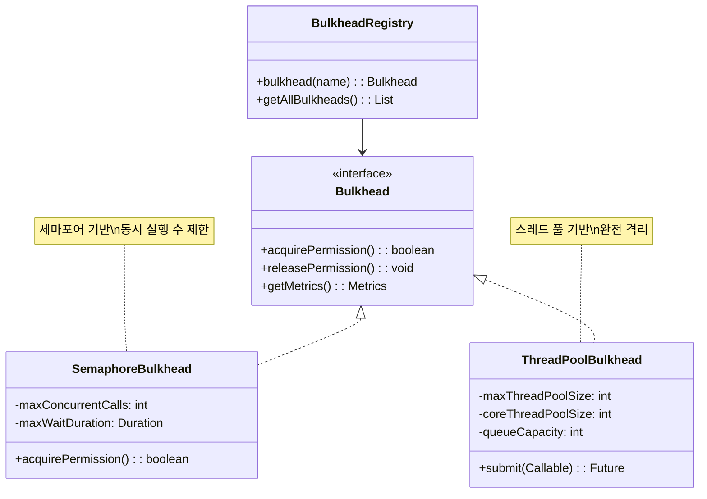
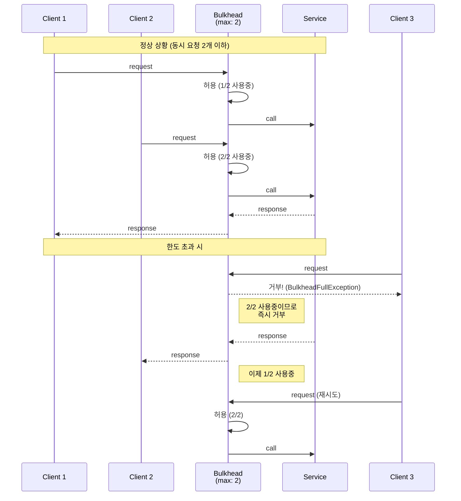
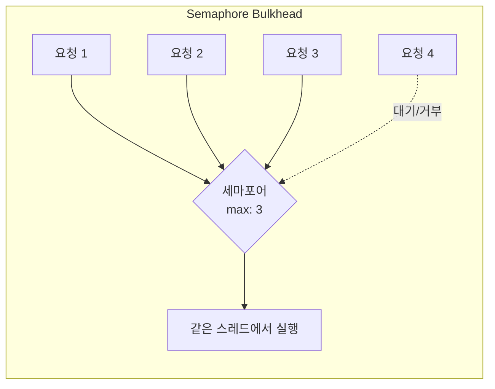
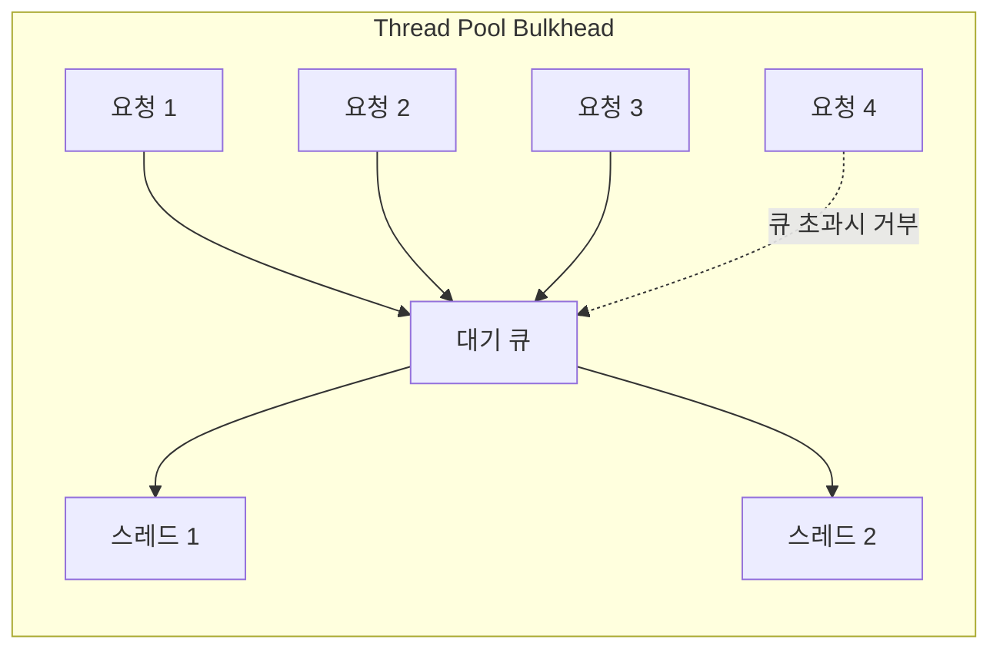

# Bulkhead 패턴 (Bulkhead Pattern)

## 정의

Bulkhead 패턴은 시스템의 리소스를 격리하여 한 부분의 장애가 전체 시스템으로 전파되는 것을 방지하는 복원력 패턴입니다. 배의 격벽(Bulkhead)처럼 하나의 구획에 물이 차도 다른 구획은 안전하게 유지됩니다.

## 🎯 한눈에 보기

| 항목 | 설명 |
|------|------|
| **핵심** | 리소스 격리로 장애 전파 방지 |
| **비유** | 선박의 격벽 - 한 구획 침수되어도 전체 침몰 방지 |
| **언제** | 여러 외부 서비스 호출, 중요도가 다른 기능들 |
| **Spring** | Resilience4j `@Bulkhead`, 스레드 풀 분리 |

> **💡 여러 외부 서비스를 호출하는 API가 있을 때...**
>
> **❌ Before (공유 스레드 풀)**
> ```java
> // 모든 API가 같은 스레드 풀 사용
> paymentApi.call();    // 느려지면...
> userApi.call();       // 스레드 점유
> productApi.call();    // 모든 API 영향받음!
> // → 결제 API 장애 → 전체 서비스 마비!
> ```
>
> **✅ After (격리된 스레드 풀)**
> ```java
> @Bulkhead(name = "payment", type = Type.THREADPOOL)
> public Result payment() { return paymentApi.call(); }
>
> @Bulkhead(name = "user", type = Type.THREADPOOL)
> public Result user() { return userApi.call(); }
>
> // 결제 API 장애 → 결제만 영향, 나머지 정상!
> ```

## 구조 (Structure)



## 동작 흐름 (시퀀스 다이어그램)



## 두 가지 격리 방식

### 1. Semaphore Bulkhead (세마포어 방식)



- **동작**: 동시 실행 가능한 호출 수만 제한
- **스레드**: 호출자의 스레드에서 실행
- **장점**: 오버헤드 적음, 간단
- **단점**: 느린 호출이 호출자 스레드 점유

### 2. Thread Pool Bulkhead (스레드 풀 방식)



- **동작**: 전용 스레드 풀에서 실행
- **스레드**: 별도의 격리된 스레드
- **장점**: 완전한 격리, 호출자 스레드 보호
- **단점**: 스레드 전환 오버헤드, 리소스 사용 증가

## 사용 이유

### 1. 장애 격리
```
[결제 서비스 장애]
    ↓
결제 스레드 풀만 고갈
    ↓
회원, 상품 서비스는 정상 동작!
```

### 2. 리소스 보호
```java
// 각 서비스별 리소스 한도 설정
결제 API: 최대 10개 동시 호출
사용자 API: 최대 20개 동시 호출
상품 API: 최대 30개 동시 호출
// → 하나가 폭주해도 다른 서비스에 영향 없음
```

### 3. 공정한 리소스 분배
- 중요한 기능에 더 많은 리소스 할당
- 덜 중요한 기능의 폭주로 핵심 기능 보호

## 적용 상황

### 1. 다중 외부 서비스 호출
```java
@Bulkhead(name = "paymentApi", fallbackMethod = "fallback")
public PaymentResult callPaymentApi() { /* ... */ }

@Bulkhead(name = "shippingApi", fallbackMethod = "fallback")
public ShippingResult callShippingApi() { /* ... */ }
```

### 2. 기능별 리소스 격리
```java
// 결제 기능: 최우선, 많은 리소스
@Bulkhead(name = "critical", maxConcurrentCalls = 50)
public void processCritical() { /* ... */ }

// 알림 기능: 낮은 우선순위
@Bulkhead(name = "notification", maxConcurrentCalls = 10)
public void sendNotification() { /* ... */ }
```

### 3. 테넌트별 격리 (멀티테넌시)
```java
// 테넌트별 리소스 격리
@Bulkhead(name = "tenant-A")
public void processForTenantA() { /* ... */ }

@Bulkhead(name = "tenant-B")
public void processForTenantB() { /* ... */ }
```

## 🔰 5분 만에 이해하기 - 초급 예제

```java
import java.util.concurrent.*;

// 1. 간단한 세마포어 Bulkhead 구현
class SimpleBulkhead {
    private final Semaphore semaphore;
    private final String name;

    public SimpleBulkhead(String name, int maxConcurrent) {
        this.name = name;
        this.semaphore = new Semaphore(maxConcurrent);
    }

    public <T> T execute(Callable<T> task) throws Exception {
        if (!semaphore.tryAcquire(1, TimeUnit.SECONDS)) {
            throw new RuntimeException(name + " Bulkhead 가득 참! 요청 거부");
        }

        try {
            System.out.println(name + ": 실행 (현재 " +
                (semaphore.availablePermits()) + "개 여유)");
            return task.call();
        } finally {
            semaphore.release();
            System.out.println(name + ": 완료 (반환)");
        }
    }
}

// 2. 서비스 (Bulkhead 적용)
class ApiService {
    private final SimpleBulkhead paymentBulkhead = new SimpleBulkhead("Payment", 2);
    private final SimpleBulkhead userBulkhead = new SimpleBulkhead("User", 3);

    public String callPaymentApi() throws Exception {
        return paymentBulkhead.execute(() -> {
            Thread.sleep(2000);  // 느린 API 시뮬레이션
            return "결제 완료";
        });
    }

    public String callUserApi() throws Exception {
        return userBulkhead.execute(() -> {
            Thread.sleep(500);
            return "사용자 조회 완료";
        });
    }
}

// 3. 테스트
public class Main {
    public static void main(String[] args) {
        ApiService service = new ApiService();
        ExecutorService executor = Executors.newFixedThreadPool(10);

        // 결제 API 5개 동시 호출 시도 (2개만 허용)
        System.out.println("=== 결제 API 테스트 (max: 2) ===");
        for (int i = 0; i < 5; i++) {
            final int num = i;
            executor.submit(() -> {
                try {
                    String result = service.callPaymentApi();
                    System.out.println("요청 " + num + " 성공: " + result);
                } catch (Exception e) {
                    System.out.println("요청 " + num + " 실패: " + e.getMessage());
                }
            });
        }

        // 결과 대기
        executor.shutdown();
    }
}
```

**실행 결과:**
```
=== 결제 API 테스트 (max: 2) ===
Payment: 실행 (현재 1개 여유)
Payment: 실행 (현재 0개 여유)
요청 2 실패: Payment Bulkhead 가득 참! 요청 거부
요청 3 실패: Payment Bulkhead 가득 참! 요청 거부
요청 4 실패: Payment Bulkhead 가득 참! 요청 거부
Payment: 완료 (반환)
요청 0 성공: 결제 완료
Payment: 완료 (반환)
요청 1 성공: 결제 완료
```

## Spring Boot + Resilience4j 예제

### 1. 의존성 추가

```gradle
dependencies {
    implementation 'io.github.resilience4j:resilience4j-spring-boot3:2.1.0'
    implementation 'org.springframework.boot:spring-boot-starter-aop'
}
```

### 2. 설정

```yaml
# application.yml
resilience4j:
  bulkhead:
    instances:
      paymentService:
        maxConcurrentCalls: 10        # 최대 동시 호출 수
        maxWaitDuration: 500ms        # 대기 시간 (초과 시 거부)

      userService:
        maxConcurrentCalls: 25
        maxWaitDuration: 0            # 대기 없이 즉시 거부

  thread-pool-bulkhead:
    instances:
      externalApi:
        maxThreadPoolSize: 5          # 최대 스레드 수
        coreThreadPoolSize: 3         # 기본 스레드 수
        queueCapacity: 10             # 대기 큐 크기
        keepAliveDuration: 20ms
```

### 3. Semaphore Bulkhead 사용

```java
@Service
@Slf4j
public class PaymentService {

    @Bulkhead(name = "paymentService", fallbackMethod = "paymentFallback")
    public PaymentResult processPayment(PaymentRequest request) {
        log.info("결제 처리 중... (동시 처리 제한됨)");
        return paymentClient.process(request);
    }

    private PaymentResult paymentFallback(PaymentRequest request, BulkheadFullException e) {
        log.warn("결제 서비스 과부하: {}", e.getMessage());
        return PaymentResult.pending("잠시 후 다시 시도해주세요");
    }
}
```

### 4. Thread Pool Bulkhead 사용

```java
@Service
@Slf4j
public class ExternalApiService {

    @Bulkhead(name = "externalApi", type = Bulkhead.Type.THREADPOOL,
              fallbackMethod = "fallback")
    public CompletableFuture<String> callExternalApi() {
        log.info("외부 API 호출 (별도 스레드에서 실행)");
        return CompletableFuture.supplyAsync(() -> {
            // 느린 외부 API 호출
            return externalClient.call();
        });
    }

    private CompletableFuture<String> fallback(BulkheadFullException e) {
        log.warn("외부 API 스레드 풀 가득 참");
        return CompletableFuture.completedFuture("cached data");
    }
}
```

### 5. 서비스별 격리

```java
@Service
@RequiredArgsConstructor
@Slf4j
public class OrderService {

    private final PaymentClient paymentClient;
    private final InventoryClient inventoryClient;
    private final ShippingClient shippingClient;

    // 각 외부 서비스별 Bulkhead로 격리
    @Bulkhead(name = "payment")
    public PaymentResult payment(Long orderId) {
        return paymentClient.process(orderId);
    }

    @Bulkhead(name = "inventory")
    public InventoryResult checkInventory(Long productId) {
        return inventoryClient.check(productId);
    }

    @Bulkhead(name = "shipping")
    public ShippingResult calculateShipping(Long orderId) {
        return shippingClient.calculate(orderId);
    }

    // 주문 처리 시 각 Bulkhead가 독립적으로 동작
    public OrderResult processOrder(OrderRequest request) {
        // 결제 서비스 장애 → 결제 Bulkhead만 영향
        // 재고 조회, 배송 계산은 정상 동작!

        try {
            PaymentResult payment = payment(request.getOrderId());
            InventoryResult inventory = checkInventory(request.getProductId());
            ShippingResult shipping = calculateShipping(request.getOrderId());

            return new OrderResult(payment, inventory, shipping);
        } catch (BulkheadFullException e) {
            log.warn("서비스 과부하: {}", e.getMessage());
            throw new ServiceBusyException("잠시 후 다시 시도해주세요");
        }
    }
}
```

### 6. 프로그래밍 방식

```java
@Service
@RequiredArgsConstructor
public class ProgrammaticBulkhead {

    private final BulkheadRegistry bulkheadRegistry;

    public String executeWithBulkhead() {
        io.github.resilience4j.bulkhead.Bulkhead bulkhead =
            bulkheadRegistry.bulkhead("myBulkhead");

        return bulkhead.executeSupplier(() -> {
            return externalService.call();
        });
    }

    // 메트릭 확인
    public void checkMetrics() {
        io.github.resilience4j.bulkhead.Bulkhead bulkhead =
            bulkheadRegistry.bulkhead("myBulkhead");

        Bulkhead.Metrics metrics = bulkhead.getMetrics();
        log.info("사용 가능: {}", metrics.getAvailableConcurrentCalls());
        log.info("최대 허용: {}", metrics.getMaxAllowedConcurrentCalls());
    }
}
```

### 7. CircuitBreaker + Bulkhead 조합

```java
@Service
public class ResilientService {

    // 실행 순서: Bulkhead → CircuitBreaker
    // Bulkhead가 먼저 동시성 제한, 그 안에서 CircuitBreaker 동작

    @Bulkhead(name = "api")
    @CircuitBreaker(name = "api", fallbackMethod = "fallback")
    @Retry(name = "api")
    public String callApi() {
        return externalApi.call();
    }

    private String fallback(Exception e) {
        return "fallback";
    }
}
```

## 장단점

### 장점 ✅

| 장점 | 설명 |
|------|------|
| **장애 격리** | 한 서비스 장애가 다른 서비스에 영향 없음 |
| **리소스 보호** | 스레드 풀, 커넥션 풀 고갈 방지 |
| **공정한 분배** | 중요 기능에 더 많은 리소스 할당 |
| **빠른 실패** | 한도 초과 시 즉시 거부 |

### 단점 ❌

| 단점 | 설명 |
|------|------|
| **리소스 낭비** | 유휴 상태에서도 리소스 점유 |
| **설정 어려움** | 적절한 크기 산정 필요 |
| **복잡성** | 여러 Bulkhead 관리 복잡 |
| **오버헤드** | Thread Pool 방식은 컨텍스트 스위칭 비용 |

## 관련 패턴

| 패턴 | 관계 |
|------|------|
| **Circuit Breaker** | Bulkhead 내에서 실패율 모니터링 |
| **Retry** | Bulkhead 거부 시 재시도 가능 |
| **Rate Limiter** | 속도 제한 (Bulkhead는 동시성 제한) |
| **Timeout** | Bulkhead 내 개별 호출 시간 제한 |

## Bulkhead vs Rate Limiter

| 측면 | Bulkhead | Rate Limiter |
|------|----------|--------------|
| **제한 기준** | 동시 실행 수 | 시간당 호출 수 |
| **예시** | "동시에 10개까지만" | "초당 100개까지만" |
| **사용 사례** | 리소스 격리 | API 사용량 제한 |

## 크기 설정 가이드

```java
// Thread Pool Bulkhead 크기 계산
int poolSize = (targetConcurrency × avgResponseTime) / 1000ms + buffer

// 예: 목표 동시성 100, 평균 응답시간 200ms
// poolSize = (100 × 200) / 1000 + 10 = 30개
```

| 용도 | 권장 설정 |
|------|----------|
| **핵심 기능** | maxConcurrent: 높게, 우선순위 높음 |
| **보조 기능** | maxConcurrent: 낮게, 빠른 거부 |
| **외부 API** | Thread Pool로 완전 격리 |
