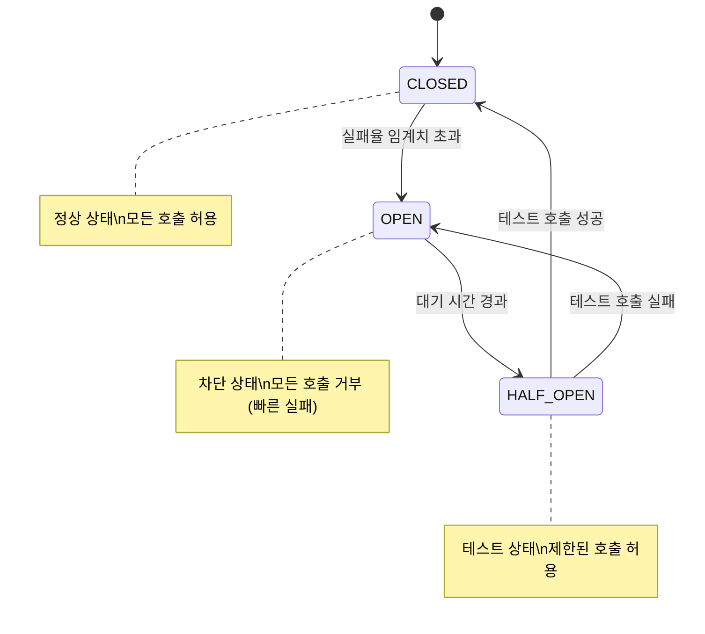
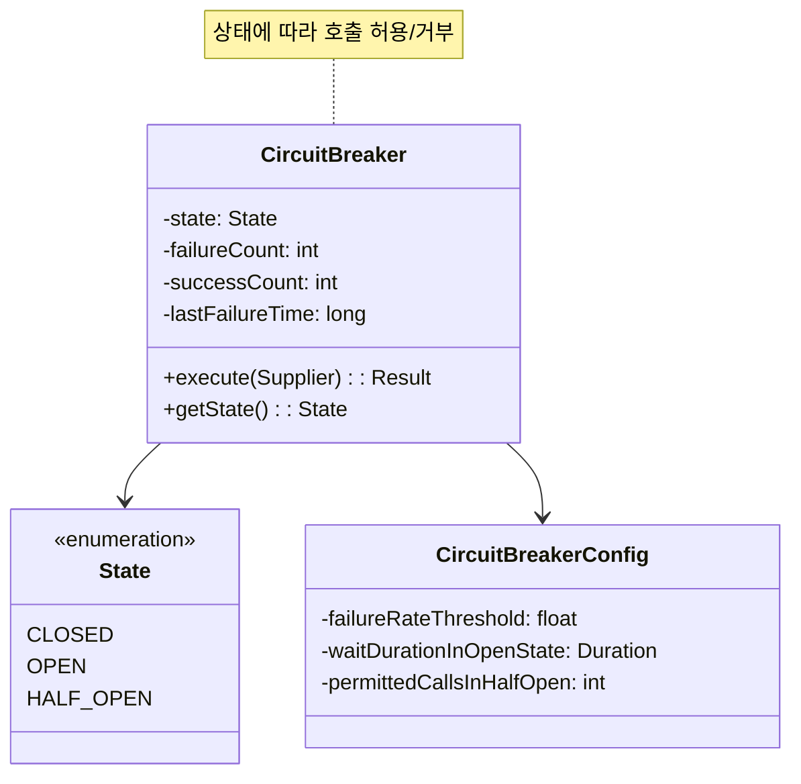
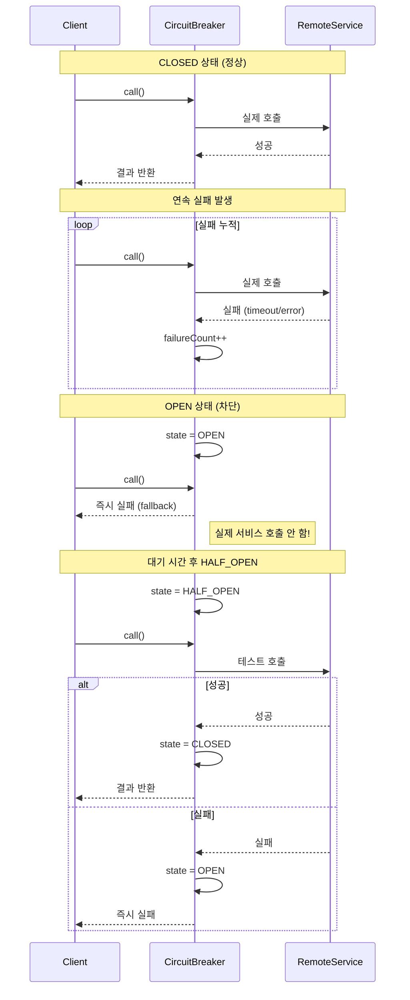

# Circuit Breaker 패턴 (Circuit Breaker Pattern)

## 정의

Circuit Breaker 패턴은 원격 서비스 호출 시 장애가 발생하면 빠르게 실패하여 연쇄 장애를 방지하는 복원력 패턴입니다. 전기 회로의 차단기처럼 문제가 있는 서비스로의 호출을 차단합니다.

## 🎯 한눈에 보기

| 항목 | 설명 |
|------|------|
| **핵심** | 장애 서비스 호출을 차단하여 연쇄 장애 방지 |
| **비유** | 집의 전기 차단기 - 과부하 시 자동으로 전원 차단 |
| **언제** | 외부 API 호출, 마이크로서비스 간 통신 |
| **Spring** | Resilience4j `@CircuitBreaker`, Spring Cloud Circuit Breaker |

> **💡 외부 결제 API가 느려지거나 장애가 발생했을 때...**
>
> **❌ Before (무한 대기 & 장애 전파)**
> ```java
> // 결제 API 응답 대기... 30초 타임아웃까지 스레드 점유
> paymentApi.process(request);  // 매 요청마다 30초 대기
> // → 스레드 풀 고갈 → 전체 서비스 장애!
> ```
>
> **✅ After (Circuit Breaker)**
> ```java
> @CircuitBreaker(name = "payment", fallbackMethod = "fallback")
> public PaymentResult process(PaymentRequest request) {
>     return paymentApi.process(request);
> }
>
> // 5번 연속 실패 → 서킷 OPEN → 즉시 fallback 반환
> // → 장애 서비스 호출 안 함, 빠르게 응답!
> ```

## 구조 (Structure)





## 동작 흐름 (시퀀스 다이어그램)



## 세 가지 상태

| 상태 | 설명 | 동작 |
|------|------|------|
| **CLOSED** | 정상 상태 | 모든 호출 허용, 실패율 모니터링 |
| **OPEN** | 차단 상태 | 모든 호출 거부, 즉시 fallback 반환 |
| **HALF_OPEN** | 테스트 상태 | 제한된 호출 허용, 성공 시 CLOSED로 전환 |

## 사용 이유

### 1. 연쇄 장애 방지
```
[주문 서비스] → [결제 서비스 장애] → 대기
                                   ↓
[주문 서비스 스레드 풀 고갈]
                                   ↓
[주문 서비스 장애] → [재고 서비스, 배송 서비스...] → 전체 장애!

Circuit Breaker 적용 시:
[주문 서비스] → [결제 서비스 장애 감지] → 즉시 fallback
                                       ↓
                      주문 서비스는 정상 동작 유지!
```

### 2. 빠른 실패 (Fail Fast)
- **타임아웃 대기 X**: 장애 서비스에 무의미한 대기 방지
- **리소스 보호**: 스레드, 커넥션 풀 보호
- **사용자 경험**: 빠른 응답으로 UX 유지

### 3. 자동 복구
- **주기적 테스트**: HALF_OPEN에서 서비스 정상화 확인
- **자동 전환**: 정상화되면 자동으로 CLOSED 상태로 복귀

## 적용 상황

### 1. 외부 API 호출
```java
@CircuitBreaker(name = "externalApi")
public ExternalData fetchData() {
    return externalApiClient.getData();
}
```

### 2. 마이크로서비스 간 통신
```java
@CircuitBreaker(name = "userService")
public UserInfo getUserInfo(Long userId) {
    return userServiceClient.getUser(userId);
}
```

### 3. 데이터베이스 연결
```java
@CircuitBreaker(name = "database")
public List<Order> getOrders() {
    return orderRepository.findAll();
}
```

## 🔰 5분 만에 이해하기 - 초급 예제

```java
import java.time.Instant;
import java.util.function.Supplier;

// 1. 서킷 브레이커 상태
enum State {
    CLOSED,    // 정상 - 모든 호출 허용
    OPEN,      // 차단 - 모든 호출 거부
    HALF_OPEN  // 테스트 - 제한된 호출 허용
}

// 2. 간단한 서킷 브레이커 구현
class SimpleCircuitBreaker {
    private State state = State.CLOSED;
    private int failureCount = 0;
    private int successCount = 0;
    private Instant lastFailureTime;

    private final int failureThreshold = 3;      // 3번 실패하면 OPEN
    private final long waitDurationMs = 5000;    // 5초 후 HALF_OPEN
    private final int halfOpenSuccessThreshold = 2;  // 2번 성공하면 CLOSED

    public <T> T execute(Supplier<T> action, Supplier<T> fallback) {
        // 상태 확인
        if (state == State.OPEN) {
            if (shouldAttemptReset()) {
                state = State.HALF_OPEN;
                System.out.println("상태 변경: OPEN → HALF_OPEN (테스트 시도)");
            } else {
                System.out.println("OPEN 상태 - 즉시 fallback 반환");
                return fallback.get();
            }
        }

        try {
            // 실제 호출
            T result = action.get();
            onSuccess();
            return result;
        } catch (Exception e) {
            onFailure();
            return fallback.get();
        }
    }

    private void onSuccess() {
        failureCount = 0;
        if (state == State.HALF_OPEN) {
            successCount++;
            if (successCount >= halfOpenSuccessThreshold) {
                state = State.CLOSED;
                successCount = 0;
                System.out.println("상태 변경: HALF_OPEN → CLOSED (정상화)");
            }
        }
    }

    private void onFailure() {
        failureCount++;
        lastFailureTime = Instant.now();
        System.out.println("실패 횟수: " + failureCount);

        if (failureCount >= failureThreshold && state == State.CLOSED) {
            state = State.OPEN;
            System.out.println("상태 변경: CLOSED → OPEN (차단!)");
        } else if (state == State.HALF_OPEN) {
            state = State.OPEN;
            successCount = 0;
            System.out.println("상태 변경: HALF_OPEN → OPEN (다시 차단)");
        }
    }

    private boolean shouldAttemptReset() {
        return lastFailureTime != null &&
            Instant.now().toEpochMilli() - lastFailureTime.toEpochMilli() >= waitDurationMs;
    }

    public State getState() { return state; }
}

// 3. 사용 예시
public class Main {
    public static void main(String[] args) throws InterruptedException {
        SimpleCircuitBreaker cb = new SimpleCircuitBreaker();

        // 결제 API 시뮬레이션 (처음 3번은 실패)
        int[] callCount = {0};

        Supplier<String> paymentApi = () -> {
            callCount[0]++;
            if (callCount[0] <= 3) {
                throw new RuntimeException("결제 API 장애!");
            }
            return "결제 성공";
        };

        Supplier<String> fallback = () -> "fallback: 결제 실패, 나중에 다시 시도해주세요";

        // 테스트
        for (int i = 1; i <= 5; i++) {
            System.out.println("\n=== 호출 " + i + " ===");
            String result = cb.execute(paymentApi, fallback);
            System.out.println("결과: " + result);
            System.out.println("현재 상태: " + cb.getState());
        }

        // 5초 대기 후 HALF_OPEN 테스트
        System.out.println("\n... 5초 대기 ...\n");
        Thread.sleep(5000);

        for (int i = 6; i <= 8; i++) {
            System.out.println("\n=== 호출 " + i + " ===");
            String result = cb.execute(paymentApi, fallback);
            System.out.println("결과: " + result);
            System.out.println("현재 상태: " + cb.getState());
        }
    }
}
```

**실행 결과:**
```
=== 호출 1 ===
실패 횟수: 1
결과: fallback: 결제 실패, 나중에 다시 시도해주세요
현재 상태: CLOSED

=== 호출 2 ===
실패 횟수: 2
결과: fallback: 결제 실패, 나중에 다시 시도해주세요
현재 상태: CLOSED

=== 호출 3 ===
실패 횟수: 3
상태 변경: CLOSED → OPEN (차단!)
결과: fallback: 결제 실패, 나중에 다시 시도해주세요
현재 상태: OPEN

=== 호출 4 ===
OPEN 상태 - 즉시 fallback 반환
결과: fallback: 결제 실패, 나중에 다시 시도해주세요
현재 상태: OPEN

=== 호출 5 ===
OPEN 상태 - 즉시 fallback 반환
결과: fallback: 결제 실패, 나중에 다시 시도해주세요
현재 상태: OPEN

... 5초 대기 ...

=== 호출 6 ===
상태 변경: OPEN → HALF_OPEN (테스트 시도)
결과: 결제 성공
현재 상태: HALF_OPEN

=== 호출 7 ===
상태 변경: HALF_OPEN → CLOSED (정상화)
결과: 결제 성공
현재 상태: CLOSED
```

## Spring Boot + Resilience4j 예제

### 1. 의존성 추가

```gradle
// build.gradle
dependencies {
    implementation 'io.github.resilience4j:resilience4j-spring-boot3:2.1.0'
    implementation 'org.springframework.boot:spring-boot-starter-aop'
}
```

### 2. 설정

```yaml
# application.yml
resilience4j:
  circuitbreaker:
    instances:
      paymentService:
        registerHealthIndicator: true
        slidingWindowType: COUNT_BASED
        slidingWindowSize: 10                    # 최근 10개 호출 기준
        failureRateThreshold: 50                 # 50% 실패 시 OPEN
        waitDurationInOpenState: 10s             # OPEN 상태 유지 시간
        permittedNumberOfCallsInHalfOpenState: 3 # HALF_OPEN에서 허용 호출 수
        automaticTransitionFromOpenToHalfOpenEnabled: true
        recordExceptions:
          - java.io.IOException
          - java.util.concurrent.TimeoutException
        ignoreExceptions:
          - com.example.BusinessException

      userService:
        slidingWindowSize: 5
        failureRateThreshold: 60
        waitDurationInOpenState: 5s
```

### 3. Service 구현

```java
@Service
@RequiredArgsConstructor
@Slf4j
public class PaymentService {

    private final PaymentApiClient paymentApiClient;

    @CircuitBreaker(name = "paymentService", fallbackMethod = "paymentFallback")
    public PaymentResult processPayment(PaymentRequest request) {
        log.info("결제 API 호출: {}", request.getOrderId());
        return paymentApiClient.process(request);
    }

    // Fallback 메서드 (같은 파라미터 + Throwable)
    private PaymentResult paymentFallback(PaymentRequest request, Throwable t) {
        log.warn("결제 실패, fallback 실행: {}", t.getMessage());

        return PaymentResult.builder()
            .orderId(request.getOrderId())
            .status(PaymentStatus.PENDING)
            .message("결제 서비스 일시 장애, 나중에 처리됩니다")
            .build();
    }
}
```

### 4. 여러 패턴 조합

```java
@Service
@Slf4j
public class ResilientPaymentService {

    private final PaymentApiClient paymentApiClient;

    // CircuitBreaker + Retry + TimeLimiter 조합
    @CircuitBreaker(name = "payment", fallbackMethod = "fallback")
    @Retry(name = "payment")
    @TimeLimiter(name = "payment")
    public CompletableFuture<PaymentResult> processPayment(PaymentRequest request) {
        return CompletableFuture.supplyAsync(() -> {
            log.info("결제 처리 시도: {}", request.getOrderId());
            return paymentApiClient.process(request);
        });
    }

    private CompletableFuture<PaymentResult> fallback(PaymentRequest request, Throwable t) {
        log.error("최종 fallback: {}", t.getMessage());
        return CompletableFuture.completedFuture(
            PaymentResult.pending(request.getOrderId())
        );
    }
}
```

### 5. 프로그래밍 방식 사용

```java
@Service
@RequiredArgsConstructor
public class ProgrammaticCircuitBreaker {

    private final CircuitBreakerRegistry registry;
    private final ExternalApiClient apiClient;

    public String callApi() {
        CircuitBreaker circuitBreaker = registry.circuitBreaker("externalApi");

        return circuitBreaker.executeSupplier(() -> {
            return apiClient.call();
        });
    }

    // Decorator 패턴 사용
    public String callApiWithDecorator() {
        CircuitBreaker cb = registry.circuitBreaker("externalApi");

        Supplier<String> decoratedSupplier = CircuitBreaker
            .decorateSupplier(cb, () -> apiClient.call());

        return Try.ofSupplier(decoratedSupplier)
            .recover(throwable -> "fallback response")
            .get();
    }

    // 상태 확인
    public void checkStatus() {
        CircuitBreaker cb = registry.circuitBreaker("externalApi");
        CircuitBreaker.Metrics metrics = cb.getMetrics();

        log.info("상태: {}", cb.getState());
        log.info("실패율: {}%", metrics.getFailureRate());
        log.info("호출 횟수: {}", metrics.getNumberOfBufferedCalls());
        log.info("실패 횟수: {}", metrics.getNumberOfFailedCalls());
    }
}
```

### 6. 이벤트 모니터링

```java
@Component
@RequiredArgsConstructor
@Slf4j
public class CircuitBreakerEventListener {

    private final CircuitBreakerRegistry registry;

    @PostConstruct
    public void init() {
        CircuitBreaker cb = registry.circuitBreaker("paymentService");

        cb.getEventPublisher()
            .onStateTransition(event -> log.info("상태 변경: {} → {}",
                event.getStateTransition().getFromState(),
                event.getStateTransition().getToState()))
            .onError(event -> log.error("에러 발생: {}", event.getThrowable().getMessage()))
            .onSuccess(event -> log.debug("성공: 소요시간 {}ms", event.getElapsedDuration().toMillis()));
    }
}
```

### 7. Actuator 연동

```yaml
# application.yml
management:
  endpoints:
    web:
      exposure:
        include: health,circuitbreakers
  health:
    circuitbreakers:
      enabled: true
```

```bash
# 상태 확인
curl http://localhost:8080/actuator/circuitbreakers

# 특정 서킷 브레이커 상태
curl http://localhost:8080/actuator/circuitbreakers/paymentService
```

## 장단점

### 장점 ✅

| 장점 | 설명 |
|------|------|
| **연쇄 장애 방지** | 장애 서비스가 전체에 영향 주지 않음 |
| **빠른 실패** | 타임아웃 대기 없이 즉시 응답 |
| **자동 복구** | 서비스 정상화 시 자동으로 복귀 |
| **리소스 보호** | 스레드 풀, 커넥션 풀 고갈 방지 |
| **모니터링** | 실패율, 상태 변화 추적 가능 |

### 단점 ❌

| 단점 | 설명 |
|------|------|
| **복잡성** | 상태 관리, fallback 로직 필요 |
| **설정 어려움** | 적절한 임계값 찾기 어려움 |
| **테스트 어려움** | 상태 전환 테스트 복잡 |
| **일시적 오류 구분** | 진짜 장애인지 일시적 오류인지 구분 어려움 |

## 관련 패턴

| 패턴 | 관계 |
|------|------|
| **Retry** | CircuitBreaker와 함께 사용, 일시적 오류 재시도 |
| **Bulkhead** | 리소스 격리로 장애 전파 방지 |
| **Timeout** | 응답 대기 시간 제한 |
| **Fallback** | 장애 시 대체 응답 제공 |

## 설정 가이드

| 설정 | 권장값 | 설명 |
|------|-------|------|
| `failureRateThreshold` | 50% | 실패율 임계치 |
| `slidingWindowSize` | 10~100 | 샘플 크기 |
| `waitDurationInOpenState` | 10~60초 | OPEN 유지 시간 |
| `permittedCallsInHalfOpen` | 3~10 | 테스트 호출 수 |
