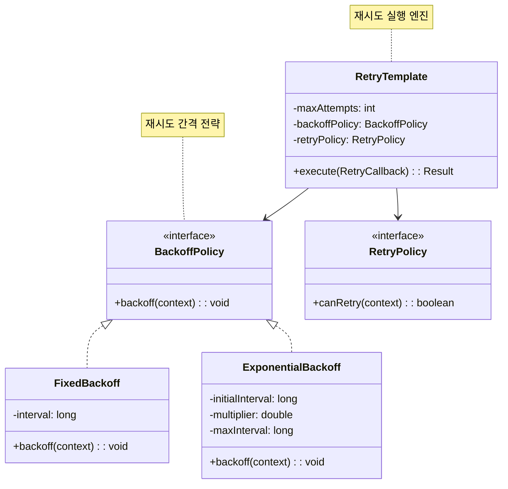
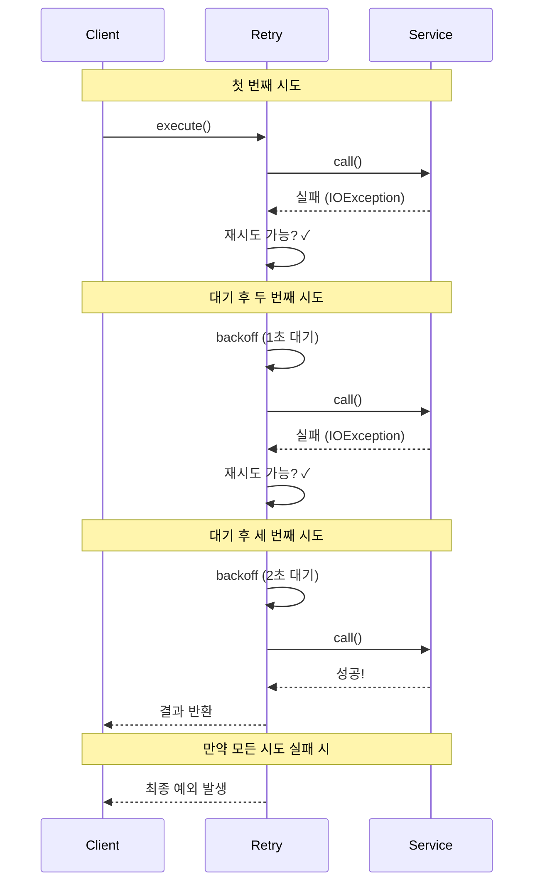

# Retry 패턴 (Retry Pattern)

## 정의

Retry 패턴은 일시적인 장애가 발생했을 때 작업을 자동으로 재시도하여 복원력을 확보하는 패턴입니다. 네트워크 지연, 일시적 서버 오류 등 순간적인 문제를 극복할 수 있습니다.

## 🎯 한눈에 보기

| 항목 | 설명 |
|------|------|
| **핵심** | 일시적 장애 시 자동으로 재시도 |
| **비유** | 전화 연결 안 되면 다시 걸기 |
| **언제** | 외부 API 호출, 네트워크 통신, 분산 시스템 |
| **Spring** | Spring Retry `@Retryable`, Resilience4j `@Retry` |

> **💡 외부 API 호출 시 일시적 오류가 발생했을 때...**
>
> **❌ Before (즉시 실패)**
> ```java
> public Data fetchData() {
>     return externalApi.call();  // 네트워크 순단 → 바로 실패!
> }
> ```
>
> **✅ After (자동 재시도)**
> ```java
> @Retryable(maxAttempts = 3, backoff = @Backoff(delay = 1000))
> public Data fetchData() {
>     return externalApi.call();  // 실패해도 3번까지 재시도!
> }
> ```

## 구조 (Structure)



## 동작 흐름 (시퀀스 다이어그램)



## Backoff 전략

### 1. Fixed Backoff (고정 간격)
```
시도1 → [1초] → 시도2 → [1초] → 시도3
```

### 2. Exponential Backoff (지수 증가)
```
시도1 → [1초] → 시도2 → [2초] → 시도3 → [4초] → 시도4
```

### 3. Exponential with Jitter (지수 + 무작위)
```
시도1 → [0.8초~1.2초] → 시도2 → [1.6초~2.4초] → 시도3
// 여러 클라이언트가 동시에 재시도하는 것을 방지 (Thundering Herd)
```

## 사용 이유

### 1. 일시적 장애 극복
```
네트워크 순단 (100ms)
서버 과부하 (몇 초간 503)
데이터베이스 잠금 (순간적)
→ 조금 기다리면 해결되는 문제들!
```

### 2. 서비스 안정성 향상
```java
// 재시도 없이: 0.1%의 네트워크 오류로 요청 실패
// 재시도 3번: 0.1% × 0.1% × 0.1% = 0.0001% 실패율
// → 1000배 향상된 성공률!
```

### 3. 사용자 경험 개선
- 사용자가 직접 재시도할 필요 없음
- 투명하게 오류 복구

## 적용 상황

### 1. 외부 API 호출
```java
@Retryable(value = RestClientException.class, maxAttempts = 3)
public WeatherData getWeather(String city) {
    return weatherApi.fetch(city);
}
```

### 2. 데이터베이스 접근
```java
@Retryable(value = OptimisticLockException.class)
@Transactional
public void updateInventory(Long productId, int quantity) {
    Product product = productRepository.findById(productId);
    product.decreaseStock(quantity);
}
```

### 3. 메시지 전송
```java
@Retryable(maxAttempts = 5, backoff = @Backoff(delay = 2000, multiplier = 2))
public void sendEmail(EmailRequest request) {
    emailClient.send(request);
}
```

## 🔰 5분 만에 이해하기 - 초급 예제

```java
import java.util.Random;

// 1. 간단한 Retry 구현
class SimpleRetry {
    private final int maxAttempts;
    private final long delayMs;

    public SimpleRetry(int maxAttempts, long delayMs) {
        this.maxAttempts = maxAttempts;
        this.delayMs = delayMs;
    }

    public <T> T execute(RetryableAction<T> action) throws Exception {
        Exception lastException = null;

        for (int attempt = 1; attempt <= maxAttempts; attempt++) {
            try {
                System.out.println("시도 " + attempt + "/" + maxAttempts);
                return action.execute();
            } catch (Exception e) {
                lastException = e;
                System.out.println("실패: " + e.getMessage());

                if (attempt < maxAttempts) {
                    System.out.println(delayMs + "ms 대기 후 재시도...\n");
                    Thread.sleep(delayMs);
                }
            }
        }

        throw lastException;
    }

    @FunctionalInterface
    interface RetryableAction<T> {
        T execute() throws Exception;
    }
}

// 2. 불안정한 외부 API 시뮬레이션
class UnstableApi {
    private int callCount = 0;
    private final Random random = new Random();

    public String fetchData() throws Exception {
        callCount++;
        // 70% 확률로 실패 (처음 몇 번은 실패할 가능성 높음)
        if (callCount <= 2 && random.nextInt(100) < 70) {
            throw new Exception("네트워크 일시 오류");
        }
        return "데이터 조회 성공!";
    }
}

// 3. 사용 예시
public class Main {
    public static void main(String[] args) {
        SimpleRetry retry = new SimpleRetry(3, 1000);  // 3번 시도, 1초 간격
        UnstableApi api = new UnstableApi();

        try {
            String result = retry.execute(() -> api.fetchData());
            System.out.println("최종 결과: " + result);
        } catch (Exception e) {
            System.out.println("모든 시도 실패: " + e.getMessage());
        }
    }
}
```

**실행 결과 (예시):**
```
시도 1/3
실패: 네트워크 일시 오류
1000ms 대기 후 재시도...

시도 2/3
실패: 네트워크 일시 오류
1000ms 대기 후 재시도...

시도 3/3
최종 결과: 데이터 조회 성공!
```

## Spring Boot + Spring Retry 예제

### 1. 의존성 추가

```gradle
// build.gradle
dependencies {
    implementation 'org.springframework.retry:spring-retry'
    implementation 'org.springframework.boot:spring-boot-starter-aop'
}
```

### 2. 활성화

```java
@Configuration
@EnableRetry  // Retry 활성화
public class RetryConfig {
}
```

### 3. 기본 사용

```java
@Service
@Slf4j
public class ExternalApiService {

    @Retryable(
        value = {IOException.class, TimeoutException.class},
        maxAttempts = 3,
        backoff = @Backoff(delay = 1000, multiplier = 2)
    )
    public String callExternalApi() {
        log.info("API 호출 시도...");
        // 외부 API 호출
        return restTemplate.getForObject(apiUrl, String.class);
    }

    @Recover  // 모든 재시도 실패 시 호출
    public String recoverFromApiFailure(Exception e) {
        log.error("API 호출 최종 실패: {}", e.getMessage());
        return "기본값 또는 캐시된 데이터";
    }
}
```

### 4. 다양한 Backoff 전략

```java
@Service
public class BackoffExamples {

    // 고정 간격
    @Retryable(
        maxAttempts = 3,
        backoff = @Backoff(delay = 1000)  // 항상 1초
    )
    public void fixedBackoff() { /* ... */ }

    // 지수 증가
    @Retryable(
        maxAttempts = 5,
        backoff = @Backoff(
            delay = 1000,      // 초기 1초
            multiplier = 2,    // 2배씩 증가
            maxDelay = 10000   // 최대 10초
        )
        // 1초 → 2초 → 4초 → 8초 → 10초(최대)
    )
    public void exponentialBackoff() { /* ... */ }

    // 무작위 지터
    @Retryable(
        maxAttempts = 3,
        backoff = @Backoff(
            delay = 1000,
            maxDelay = 3000,
            random = true  // 1초~3초 사이 랜덤
        )
    )
    public void randomBackoff() { /* ... */ }
}
```

### 5. 조건부 재시도

```java
@Service
public class ConditionalRetryService {

    // 특정 예외만 재시도
    @Retryable(
        retryFor = {IOException.class, TimeoutException.class},
        noRetryFor = {IllegalArgumentException.class}  // 이건 재시도 안 함
    )
    public void selectiveRetry() { /* ... */ }

    // 표현식으로 조건 지정
    @Retryable(
        maxAttemptsExpression = "${retry.maxAttempts:3}",
        backoff = @Backoff(delayExpression = "${retry.delay:1000}")
    )
    public void configBasedRetry() { /* ... */ }
}
```

### 6. RetryTemplate 직접 사용

```java
@Configuration
public class RetryTemplateConfig {

    @Bean
    public RetryTemplate retryTemplate() {
        RetryTemplate template = new RetryTemplate();

        // 재시도 정책
        SimpleRetryPolicy retryPolicy = new SimpleRetryPolicy();
        retryPolicy.setMaxAttempts(3);

        // 백오프 정책
        ExponentialBackOffPolicy backOffPolicy = new ExponentialBackOffPolicy();
        backOffPolicy.setInitialInterval(1000);
        backOffPolicy.setMultiplier(2.0);
        backOffPolicy.setMaxInterval(10000);

        template.setRetryPolicy(retryPolicy);
        template.setBackOffPolicy(backOffPolicy);

        // 리스너 (모니터링)
        template.registerListener(new RetryListenerSupport() {
            @Override
            public <T, E extends Throwable> void onError(
                RetryContext context, RetryCallback<T, E> callback, Throwable throwable) {
                log.warn("재시도 {}: {}", context.getRetryCount(), throwable.getMessage());
            }
        });

        return template;
    }
}

@Service
@RequiredArgsConstructor
public class RetryTemplateService {

    private final RetryTemplate retryTemplate;

    public String callWithRetry() {
        return retryTemplate.execute(context -> {
            log.info("시도 횟수: {}", context.getRetryCount());
            return externalApi.call();
        });
    }

    public String callWithRecovery() {
        return retryTemplate.execute(
            context -> externalApi.call(),
            context -> {
                log.error("모든 재시도 실패, 복구 로직 실행");
                return "fallback value";
            }
        );
    }
}
```

## Spring Boot + Resilience4j Retry

```yaml
# application.yml
resilience4j:
  retry:
    instances:
      externalApi:
        maxAttempts: 3
        waitDuration: 1s
        enableExponentialBackoff: true
        exponentialBackoffMultiplier: 2
        retryExceptions:
          - java.io.IOException
          - java.util.concurrent.TimeoutException
        ignoreExceptions:
          - com.example.BusinessException
```

```java
@Service
public class Resilience4jRetryService {

    @Retry(name = "externalApi", fallbackMethod = "fallback")
    public String callApi() {
        return externalApiClient.call();
    }

    private String fallback(Exception e) {
        return "fallback response";
    }
}
```

## CircuitBreaker와 함께 사용

```java
@Service
public class ResilientService {

    // 실행 순서: Retry → CircuitBreaker → TimeLimiter
    // Retry가 모두 실패하면 CircuitBreaker가 상태 업데이트

    @CircuitBreaker(name = "api", fallbackMethod = "fallback")
    @Retry(name = "api")  // CircuitBreaker 안에서 재시도
    public String callWithRetryAndCircuitBreaker() {
        return externalApi.call();
    }
}
```

## 장단점

### 장점 ✅

| 장점 | 설명 |
|------|------|
| **일시적 오류 복구** | 네트워크 순단, 서버 과부하 극복 |
| **투명한 복구** | 호출자가 재시도 로직을 알 필요 없음 |
| **성공률 향상** | 여러 번 시도로 전체 성공률 증가 |
| **설정 유연성** | 횟수, 간격, 조건 등 세밀한 설정 |

### 단점 ❌

| 단점 | 설명 |
|------|------|
| **지연 증가** | 재시도 시간만큼 응답 지연 |
| **리소스 낭비** | 영구적 장애에 무의미한 재시도 |
| **멱등성 필요** | 재시도해도 안전한 작업이어야 함 |
| **Thundering Herd** | 여러 클라이언트 동시 재시도 시 서버 과부하 |

## 관련 패턴

| 패턴 | 관계 |
|------|------|
| **Circuit Breaker** | Retry 실패가 누적되면 Circuit 오픈 |
| **Timeout** | 재시도 전 개별 호출 타임아웃 설정 |
| **Fallback** | 모든 재시도 실패 시 대체 응답 |
| **Bulkhead** | 재시도로 인한 리소스 고갈 방지 |

## 재시도 가이드라인

| 항목 | 권장 |
|------|------|
| **재시도 대상** | 네트워크 오류, 503, 타임아웃 등 일시적 오류 |
| **재시도 제외** | 400, 401, 404 등 클라이언트 오류 |
| **최대 시도 횟수** | 3~5회 (무한 재시도 금지) |
| **Backoff 전략** | Exponential with Jitter 권장 |
| **멱등성** | POST 요청은 멱등성 보장 필요 |
