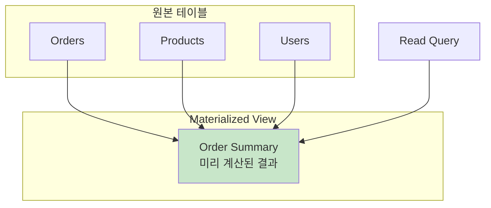
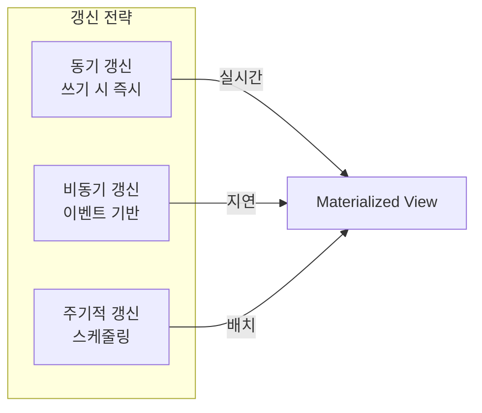

# Materialized View 패턴

## 정의

Materialized View는 복잡한 쿼리 결과를 미리 계산하여 물리적으로 저장해두는 패턴입니다. 읽기 성능을 극대화하기 위해 데이터를 비정규화된 형태로 저장합니다.

## 🎯 한눈에 보기

| 항목 | 설명 |
|------|------|
| **핵심** | 쿼리 결과를 미리 계산하여 저장 |
| **비유** | 요약 보고서 미리 만들어 두기 |
| **언제** | 복잡한 집계, 읽기 많은 워크로드 |
| **도구** | PostgreSQL, Redis, Elasticsearch |

> **💡 복잡한 JOIN이나 집계 쿼리가 느릴 때...**
>
> ```sql
> -- 매번 계산 (느림)
> SELECT category, COUNT(*), AVG(price) FROM products GROUP BY category;
>
> -- Materialized View (빠름)
> SELECT * FROM product_category_stats;
> ```

## 구조 (Structure)



## 갱신 전략



## 기본 예제

### PostgreSQL Materialized View

```sql
-- Materialized View 생성
CREATE MATERIALIZED VIEW order_daily_summary AS
SELECT
    DATE(created_at) as order_date,
    COUNT(*) as total_orders,
    SUM(amount) as total_amount,
    AVG(amount) as avg_amount,
    COUNT(DISTINCT user_id) as unique_users
FROM orders
GROUP BY DATE(created_at);

-- 인덱스 추가
CREATE INDEX idx_order_summary_date ON order_daily_summary(order_date);

-- 수동 갱신
REFRESH MATERIALIZED VIEW order_daily_summary;

-- 동시 갱신 (읽기 차단 없음)
REFRESH MATERIALIZED VIEW CONCURRENTLY order_daily_summary;
```

### Spring + JPA 연동

```java
// Entity로 Materialized View 매핑
@Entity
@Table(name = "order_daily_summary")
@Immutable  // 읽기 전용
public class OrderDailySummary {

    @Id
    private LocalDate orderDate;
    private Long totalOrders;
    private BigDecimal totalAmount;
    private BigDecimal avgAmount;
    private Long uniqueUsers;
}

@Repository
public interface OrderSummaryRepository
    extends JpaRepository<OrderDailySummary, LocalDate> {

    List<OrderDailySummary> findByOrderDateBetween(
        LocalDate start, LocalDate end);

    @Query("SELECT SUM(o.totalAmount) FROM OrderDailySummary o " +
           "WHERE o.orderDate >= :start")
    BigDecimal getTotalAmountSince(@Param("start") LocalDate start);
}

// 갱신 서비스
@Service
@RequiredArgsConstructor
public class MaterializedViewService {

    private final JdbcTemplate jdbcTemplate;

    @Scheduled(cron = "0 0 * * * *")  // 매시간
    public void refreshOrderSummary() {
        jdbcTemplate.execute(
            "REFRESH MATERIALIZED VIEW CONCURRENTLY order_daily_summary"
        );
    }
}
```

### 애플리케이션 레벨 구현 (Redis)

```java
@Service
@RequiredArgsConstructor
public class ProductStatsService {

    private final RedisTemplate<String, ProductStats> redisTemplate;
    private final ProductRepository productRepo;

    private static final String STATS_KEY = "product:stats:category:";

    // 읽기: Materialized View에서
    public ProductStats getCategoryStats(String category) {
        String key = STATS_KEY + category;
        ProductStats stats = redisTemplate.opsForValue().get(key);

        if (stats == null) {
            stats = computeAndCache(category);
        }
        return stats;
    }

    // 쓰기: 원본 변경 시 비동기 갱신
    @Async
    @EventListener
    public void onProductChanged(ProductChangedEvent event) {
        String category = event.getCategory();
        computeAndCache(category);
    }

    private ProductStats computeAndCache(String category) {
        // 원본에서 계산
        ProductStats stats = productRepo.computeStatsByCategory(category);

        // Materialized View (Redis) 갱신
        redisTemplate.opsForValue().set(
            STATS_KEY + category,
            stats,
            Duration.ofHours(1)
        );

        return stats;
    }
}

@Data
@AllArgsConstructor
public class ProductStats implements Serializable {
    private String category;
    private long productCount;
    private BigDecimal avgPrice;
    private BigDecimal minPrice;
    private BigDecimal maxPrice;
    private LocalDateTime computedAt;
}
```

### CQRS 읽기 모델로 활용

```java
// 이벤트 기반 Materialized View 갱신
@Service
@RequiredArgsConstructor
public class OrderReadModelUpdater {

    private final OrderReadRepository readRepo;  // MongoDB

    @EventListener
    public void on(OrderCreatedEvent event) {
        OrderReadModel model = OrderReadModel.builder()
            .orderId(event.getOrderId())
            .userId(event.getUserId())
            .userName(event.getUserName())  // 비정규화
            .productName(event.getProductName())  // 비정규화
            .amount(event.getAmount())
            .status(event.getStatus())
            .createdAt(event.getCreatedAt())
            .build();

        readRepo.save(model);
        updateUserOrderStats(event.getUserId());
    }

    @EventListener
    public void on(OrderStatusChangedEvent event) {
        readRepo.updateStatus(event.getOrderId(), event.getNewStatus());
    }

    private void updateUserOrderStats(String userId) {
        // 사용자별 주문 통계 Materialized View 갱신
        long orderCount = readRepo.countByUserId(userId);
        BigDecimal totalSpent = readRepo.sumAmountByUserId(userId);

        readRepo.updateUserStats(userId, orderCount, totalSpent);
    }
}

// 빠른 조회
@RestController
@RequiredArgsConstructor
public class OrderQueryController {

    private final OrderReadRepository readRepo;

    @GetMapping("/orders")
    public List<OrderReadModel> getOrders(
        @RequestParam String userId,
        @RequestParam(required = false) String status) {
        // 복잡한 JOIN 없이 즉시 조회
        return readRepo.findByUserIdAndStatus(userId, status);
    }
}
```

## 갱신 전략 비교

| 전략 | 일관성 | 쓰기 성능 | 복잡도 |
|------|--------|----------|--------|
| **동기 갱신** | 강함 | 느림 | 낮음 |
| **비동기 갱신** | 최종적 | 빠름 | 중간 |
| **주기적 갱신** | 지연됨 | 가장 빠름 | 낮음 |

## 장단점

### 장점
- 읽기 성능 극대화
- 복잡한 쿼리 단순화
- 데이터베이스 부하 감소
- API 응답 시간 개선

### 단점
| 단점 | 해결책 |
|------|--------|
| 저장 공간 증가 | 필요한 뷰만 생성 |
| 데이터 불일치 가능 | 갱신 전략 최적화 |
| 갱신 비용 | 변경 빈도 고려 |
| 스키마 변경 복잡 | 버전 관리 |

## 주의사항

```java
// ⚠️ Materialized View 사용 시 고려사항

// 1. 갱신 빈도 vs 일관성 트레이드오프
// - 실시간 필수: 동기 갱신 또는 이벤트 기반
// - 약간의 지연 허용: 주기적 갱신

// 2. 메모리/저장소 비용 고려
// ❌ 모든 데이터에 대해 생성
// ✅ 자주 조회되는 패턴에만 생성

// 3. 원본 데이터 변경 시 갱신 보장
@TransactionalEventListener(phase = AFTER_COMMIT)
public void refreshView(DataChangedEvent event) {
    // 트랜잭션 커밋 후 갱신 보장
    refreshMaterializedView(event.getEntityType());
}
```

## 관련 패턴

| 패턴 | 관계 |
|------|------|
| [CQRS](../../distributed/CQRS) | 읽기 모델로 활용 |
| [Cache-Aside](../../caching/CacheAside) | 캐시와 유사한 목적 |
| [Event Sourcing](../../distributed/EventSourcing) | 이벤트로 뷰 갱신 |
