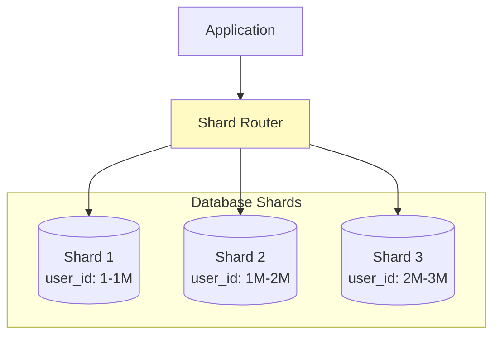

# Database Sharding 패턴

## 정의

Sharding은 대용량 데이터를 여러 데이터베이스에 수평 분할하여 저장하는 패턴입니다. 각 샤드는 전체 데이터의 일부만 담당하여 확장성을 확보합니다.

## 🎯 한눈에 보기

| 항목 | 설명 |
|------|------|
| **핵심** | 데이터를 여러 DB에 분산 저장 |
| **비유** | 도서관 책을 층별로 분류 |
| **언제** | 단일 DB 한계, 대용량 데이터 |
| **도구** | Vitess, ShardingSphere, Citus |

> **💡 단일 DB로 감당 안 될 때...**
>
> ```
> Before: 1억 건 → 1개 DB (느림)
> After:  1억 건 → 10개 샤드 × 1천만 건 (빠름)
> ```

## 구조 (Structure)



## 샤딩 전략

```mermaid
graph TB
    subgraph Range["Range Sharding"]
        R1[1-1000] --> RS1[(Shard 1)]
        R2[1001-2000] --> RS2[(Shard 2)]
    end

    subgraph Hash["Hash Sharding"]
        H[hash(key) % N] --> HS1[(Shard 1)]
        H --> HS2[(Shard 2)]
    end

    subgraph Directory["Directory Sharding"]
        D[Lookup Table] --> DS1[(Shard 1)]
        D --> DS2[(Shard 2)]
    end
```

## 기본 예제

### ShardingSphere 설정

```yaml
# application.yml
spring:
  shardingsphere:
    datasource:
      names: ds0,ds1,ds2
      ds0:
        type: com.zaxxer.hikari.HikariDataSource
        driver-class-name: com.mysql.cj.jdbc.Driver
        jdbc-url: jdbc:mysql://db0:3306/mydb
        username: root
        password: password
      ds1:
        type: com.zaxxer.hikari.HikariDataSource
        driver-class-name: com.mysql.cj.jdbc.Driver
        jdbc-url: jdbc:mysql://db1:3306/mydb
        username: root
        password: password
      ds2:
        type: com.zaxxer.hikari.HikariDataSource
        driver-class-name: com.mysql.cj.jdbc.Driver
        jdbc-url: jdbc:mysql://db2:3306/mydb
        username: root
        password: password

    rules:
      sharding:
        tables:
          orders:
            actual-data-nodes: ds$->{0..2}.orders
            table-strategy:
              standard:
                sharding-column: user_id
                sharding-algorithm-name: orders-inline
        sharding-algorithms:
          orders-inline:
            type: INLINE
            props:
              algorithm-expression: ds$->{user_id % 3}
```

### 애플리케이션 레벨 샤딩

```java
// Shard Key 기반 라우팅
@Configuration
public class ShardingConfig {

    @Bean
    public Map<Integer, DataSource> shardDataSources() {
        Map<Integer, DataSource> shards = new HashMap<>();
        shards.put(0, createDataSource("jdbc:mysql://db0:3306/mydb"));
        shards.put(1, createDataSource("jdbc:mysql://db1:3306/mydb"));
        shards.put(2, createDataSource("jdbc:mysql://db2:3306/mydb"));
        return shards;
    }
}

@Service
@RequiredArgsConstructor
public class ShardRouter {

    private final Map<Integer, DataSource> shardDataSources;
    private static final int SHARD_COUNT = 3;

    public DataSource getShardFor(Long userId) {
        int shardId = (int) (userId % SHARD_COUNT);
        return shardDataSources.get(shardId);
    }

    public int getShardId(Long userId) {
        return (int) (userId % SHARD_COUNT);
    }
}

@Repository
@RequiredArgsConstructor
public class ShardedOrderRepository {

    private final ShardRouter shardRouter;
    private final NamedParameterJdbcTemplate jdbcTemplate;

    public Order findByUserIdAndOrderId(Long userId, Long orderId) {
        DataSource shard = shardRouter.getShardFor(userId);

        return new NamedParameterJdbcTemplate(shard)
            .queryForObject(
                "SELECT * FROM orders WHERE user_id = :userId AND id = :orderId",
                Map.of("userId", userId, "orderId", orderId),
                orderRowMapper()
            );
    }

    public void save(Order order) {
        DataSource shard = shardRouter.getShardFor(order.getUserId());

        new NamedParameterJdbcTemplate(shard)
            .update(
                "INSERT INTO orders (id, user_id, amount, status) " +
                "VALUES (:id, :userId, :amount, :status)",
                Map.of(
                    "id", order.getId(),
                    "userId", order.getUserId(),
                    "amount", order.getAmount(),
                    "status", order.getStatus()
                )
            );
    }
}
```

### AbstractRoutingDataSource 활용

```java
public class ShardRoutingDataSource extends AbstractRoutingDataSource {

    @Override
    protected Object determineCurrentLookupKey() {
        return ShardContextHolder.getShardKey();
    }
}

public class ShardContextHolder {

    private static final ThreadLocal<Integer> contextHolder =
        new ThreadLocal<>();

    public static void setShardKey(Integer shardKey) {
        contextHolder.set(shardKey);
    }

    public static Integer getShardKey() {
        return contextHolder.get();
    }

    public static void clear() {
        contextHolder.remove();
    }
}

@Aspect
@Component
@RequiredArgsConstructor
public class ShardingAspect {

    private final ShardRouter shardRouter;

    @Around("@annotation(sharded)")
    public Object routeToShard(ProceedingJoinPoint pjp, Sharded sharded)
        throws Throwable {

        Object[] args = pjp.getArgs();
        Long userId = extractUserId(args, sharded.userIdParam());

        int shardId = shardRouter.getShardId(userId);
        ShardContextHolder.setShardKey(shardId);

        try {
            return pjp.proceed();
        } finally {
            ShardContextHolder.clear();
        }
    }
}

// 사용
@Service
public class OrderService {

    @Sharded(userIdParam = "userId")
    public Order getOrder(Long userId, Long orderId) {
        return orderRepository.findByUserIdAndOrderId(userId, orderId);
    }
}
```

### Cross-Shard 쿼리

```java
@Service
@RequiredArgsConstructor
public class CrossShardQueryService {

    private final Map<Integer, DataSource> shardDataSources;

    // 모든 샤드에서 집계
    public OrderStats getGlobalStats() {
        List<CompletableFuture<OrderStats>> futures = shardDataSources.values()
            .stream()
            .map(ds -> CompletableFuture.supplyAsync(() -> queryStats(ds)))
            .toList();

        // 모든 샤드 결과 합산
        return futures.stream()
            .map(CompletableFuture::join)
            .reduce(OrderStats.empty(), OrderStats::merge);
    }

    // 특정 조건으로 전체 검색 (비효율적, 피해야 함)
    public List<Order> searchAcrossShards(String keyword) {
        return shardDataSources.values().parallelStream()
            .flatMap(ds -> searchInShard(ds, keyword).stream())
            .sorted(Comparator.comparing(Order::getCreatedAt).reversed())
            .limit(100)
            .toList();
    }

    private OrderStats queryStats(DataSource ds) {
        return new JdbcTemplate(ds).queryForObject(
            "SELECT COUNT(*) as cnt, SUM(amount) as total FROM orders",
            (rs, i) -> new OrderStats(rs.getLong("cnt"), rs.getBigDecimal("total"))
        );
    }
}
```

## 샤딩 전략 비교

| 전략 | 장점 | 단점 | 사용 시점 |
|------|------|------|----------|
| **Hash** | 균등 분배 | Range 쿼리 어려움 | 일반적 |
| **Range** | Range 쿼리 용이 | 핫스팟 가능 | 시계열 데이터 |
| **Directory** | 유연한 배치 | 룩업 오버헤드 | 복잡한 요구사항 |

## 장단점

### 장점
- 무한 수평 확장
- 쿼리 부하 분산
- 장애 영향 범위 제한
- 지역별 데이터 배치 가능

### 단점
| 단점 | 해결책 |
|------|--------|
| Cross-shard 쿼리 복잡 | 샤드 키 설계 최적화 |
| 트랜잭션 제약 | Saga, TCC 패턴 |
| 리밸런싱 어려움 | Consistent Hashing |
| 운영 복잡도 증가 | ShardingSphere 등 도구 |

## 주의사항

```java
// ⚠️ Sharding 적용 시 고려사항

// 1. 샤드 키 선택이 가장 중요
// ❌ 자주 변경되는 값
// ❌ 편향된 분포 (예: 국가 코드)
// ✅ 균등 분포, 변경 없음 (예: user_id)

// 2. JOIN 회피 설계
// ❌ 다른 샤드의 테이블과 JOIN
@Query("SELECT o FROM Order o JOIN User u ON o.userId = u.id")  // 불가능

// ✅ 필요한 데이터 비정규화
@Entity
public class Order {
    private Long userId;
    private String userName;  // 비정규화
}

// 3. Auto Increment ID 문제
// ❌ DB Auto Increment (샤드별 중복)
// ✅ 분산 ID 생성기 사용
@Id
@GeneratedValue(generator = "snowflake")
private Long id;

// 4. 리샤딩 대비
// Consistent Hashing으로 리밸런싱 최소화
int shardId = consistentHash.getNode(userId);
```

## 관련 패턴

| 패턴 | 관계 |
|------|------|
| [CQRS](../../distributed/CQRS) | 읽기/쓰기 분리로 병행 |
| [Saga](../../distributed/Saga) | Cross-shard 트랜잭션 |
| [Materialized View](../MaterializedView) | Cross-shard 집계 캐싱 |
