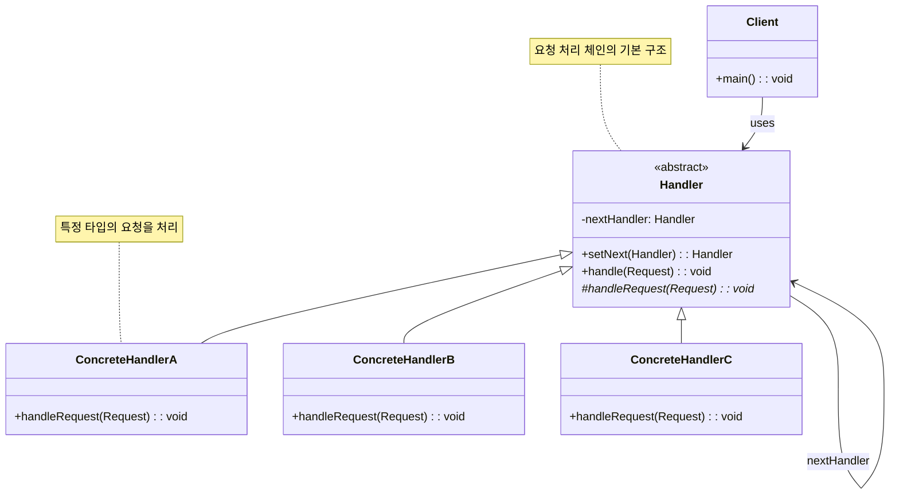

# 책임 연쇄 패턴 (Chain of Responsibility Pattern)

## 정의

책임 연쇄 패턴은 요청을 보내는 쪽과 받는 쪽을 분리하는 패턴으로, 요청을 받을 수 있는 객체들을 체인으로 연결하여 요청이 처리될 때까지 체인을 따라 요청을 전달하는 행동 디자인 패턴입니다.

## 구조 (Structure)



## 사용 이유

- **요청자와 처리자 분리**: 요청을 보내는 객체가 어떤 객체가 처리할지 몰라도 됩니다.
- **동적 체인 구성**: 런타임에 체인의 구성을 변경할 수 있습니다.
- **처리 순서 제어**: 요청 처리 순서를 체인으로 명확히 정의할 수 있습니다.
- **단일 책임 원칙**: 각 핸들러는 자신이 처리할 수 있는 요청만 처리합니다.

## 적용 상황

책임 연쇄 패턴은 다음과 같은 상황에서 특히 유용합니다:

### 1. 다단계 승인 시스템
- **결재 승인**: 금액에 따른 단계별 승인 (팀장 → 부서장 → 임원)
- **권한 검증**: 사용자 역할에 따른 다단계 권한 확인
- **예외 처리**: 심각도에 따른 단계별 에러 처리

### 2. 요청 처리 파이프라인
```java
// 나쁜 예: 하드코딩된 처리 순서
class RequestProcessor {
    public void processRequest(Request request) {
        if (request.getType() == Type.AUTHENTICATION) {
            authenticateUser(request);
        } else if (request.getType() == Type.AUTHORIZATION) {
            authorizeUser(request);
        } else if (request.getType() == Type.VALIDATION) {
            validateRequest(request);
        }
        // 새로운 처리 단계 추가 시 코드 수정 필요
    }
}

// 좋은 예: 책임 연쇄 패턴 사용
abstract class Handler {
    private Handler nextHandler;

    public void handle(Request request) {
        if (canHandle(request)) {
            processRequest(request);
        } else if (nextHandler != null) {
            nextHandler.handle(request);
        }
    }
}
```

### 3. 이벤트 처리 시스템
- **GUI 이벤트**: 위젯 → 패널 → 윈도우 순서로 이벤트 전파
- **네트워크 프로토콜**: OSI 7계층 모델의 각 레이어별 처리
- **미들웨어**: 웹 서버의 필터/인터셉터 체인

## 실생활 예제 - 고객 지원 시스템

다양한 레벨의 고객 지원 담당자가 문의를 처리하는 시스템을 책임 연쇄 패턴으로 구현해보겠습니다.

```java
import java.util.*;
import java.time.LocalDateTime;
import java.time.format.DateTimeFormatter;

// 지원 요청 타입 열거형
enum SupportLevel {
    BASIC(1, "기본 문의"),
    TECHNICAL(2, "기술 지원"),
    BILLING(3, "요금/결제"),
    ESCALATED(4, "에스컬레이션"),
    EXECUTIVE(5, "경영진 검토");

    private final int level;
    private final String description;

    SupportLevel(int level, String description) {
        this.level = level;
        this.description = description;
    }

    public int getLevel() { return level; }
    public String getDescription() { return description; }
}

// 지원 요청 클래스
class SupportRequest {
    private String requestId;
    private String customerName;
    private String customerTier; // "Bronze", "Silver", "Gold", "Platinum"
    private SupportLevel level;
    private String subject;
    private String description;
    private LocalDateTime createdAt;
    private String urgency; // "Low", "Medium", "High", "Critical"
    private Map<String, Object> metadata;

    public SupportRequest(String customerName, String customerTier, SupportLevel level,
                         String subject, String description, String urgency) {
        this.requestId = generateRequestId();
        this.customerName = customerName;
        this.customerTier = customerTier;
        this.level = level;
        this.subject = subject;
        this.description = description;
        this.urgency = urgency;
        this.createdAt = LocalDateTime.now();
        this.metadata = new HashMap<>();
    }

    private String generateRequestId() {
        return "REQ-" + System.currentTimeMillis() % 100000;
    }

    public void addMetadata(String key, Object value) {
        metadata.put(key, value);
    }

    // getter 메서드들
    public String getRequestId() { return requestId; }
    public String getCustomerName() { return customerName; }
    public String getCustomerTier() { return customerTier; }
    public SupportLevel getLevel() { return level; }
    public String getSubject() { return subject; }
    public String getDescription() { return description; }
    public LocalDateTime getCreatedAt() { return createdAt; }
    public String getUrgency() { return urgency; }
    public Map<String, Object> getMetadata() { return metadata; }

    @Override
    public String toString() {
        DateTimeFormatter formatter = DateTimeFormatter.ofPattern("MM-dd HH:mm");
        return String.format("[%s] %s (%s) - %s | %s급 | %s",
                requestId, customerName, customerTier, subject,
                urgency, createdAt.format(formatter));
    }
}

// 추상 지원 핸들러 클래스
abstract class SupportHandler {
    protected SupportHandler nextHandler;
    protected String handlerName;
    protected String department;
    protected List<String> handledRequests;

    public SupportHandler(String handlerName, String department) {
        this.handlerName = handlerName;
        this.department = department;
        this.handledRequests = new ArrayList<>();
    }

    public SupportHandler setNext(SupportHandler handler) {
        this.nextHandler = handler;
        return handler;
    }

    public void handle(SupportRequest request) {
        System.out.println("\n📨 [" + handlerName + "] 요청 검토: " + request);

        if (canHandle(request)) {
            processRequest(request);
            handledRequests.add(request.getRequestId());
        } else {
            System.out.println("❌ [" + handlerName + "] 처리 불가 - 상위 담당자에게 전달");
            if (nextHandler != null) {
                nextHandler.handle(request);
            } else {
                System.out.println("🚨 처리할 수 있는 담당자가 없습니다!");
                processUnhandledRequest(request);
            }
        }
    }

    protected abstract boolean canHandle(SupportRequest request);
    protected abstract void processRequest(SupportRequest request);

    protected void processUnhandledRequest(SupportRequest request) {
        System.out.println("📝 요청이 대기열에 추가되었습니다: " + request.getRequestId());
    }

    public void displayStatistics() {
        System.out.println(String.format("📊 [%s - %s] 처리 건수: %d건",
                department, handlerName, handledRequests.size()));
        if (!handledRequests.isEmpty()) {
            System.out.println("   처리한 요청: " + String.join(", ", handledRequests));
        }
    }
}

// 1차 지원 담당자 (기본 문의 처리)
class Level1SupportHandler extends SupportHandler {
    public Level1SupportHandler(String handlerName) {
        super(handlerName, "1차 고객지원팀");
    }

    @Override
    protected boolean canHandle(SupportRequest request) {
        // 기본 문의이고 긴급도가 높지 않은 경우 처리
        return request.getLevel() == SupportLevel.BASIC &&
               !request.getUrgency().equals("Critical");
    }

    @Override
    protected void processRequest(SupportRequest request) {
        System.out.println("✅ [" + handlerName + "] 기본 문의 처리 중...");

        // 처리 시뮬레이션
        try {
            Thread.sleep(500);
        } catch (InterruptedException e) {
            Thread.currentThread().interrupt();
        }

        String solution = generateBasicSolution(request);
        System.out.println("💡 해결 방안: " + solution);
        System.out.println("⏱️ 예상 처리 시간: 15분");

        // 고객 등급에 따른 추가 서비스
        if (request.getCustomerTier().equals("Gold") || request.getCustomerTier().equals("Platinum")) {
            System.out.println("🌟 VIP 고객 우선 처리 완료");
        }
    }

    private String generateBasicSolution(SupportRequest request) {
        if (request.getSubject().contains("로그인")) {
            return "비밀번호 재설정 링크를 이메일로 발송했습니다.";
        } else if (request.getSubject().contains("계정")) {
            return "계정 정보를 확인하고 필요한 조치를 취했습니다.";
        } else {
            return "일반적인 해결 방법을 안내해드렸습니다.";
        }
    }
}

// 2차 지원 담당자 (기술 지원)
class Level2SupportHandler extends SupportHandler {
    public Level2SupportHandler(String handlerName) {
        super(handlerName, "기술지원팀");
    }

    @Override
    protected boolean canHandle(SupportRequest request) {
        // 기술 지원이거나 중간 수준의 문제 처리
        return (request.getLevel() == SupportLevel.TECHNICAL ||
                request.getLevel() == SupportLevel.BASIC) &&
               !request.getUrgency().equals("Critical");
    }

    @Override
    protected void processRequest(SupportRequest request) {
        System.out.println("✅ [" + handlerName + "] 기술 지원 처리 중...");

        // 처리 시뮬레이션
        try {
            Thread.sleep(1000);
        } catch (InterruptedException e) {
            Thread.currentThread().interrupt();
        }

        performTechnicalDiagnosis(request);
        String solution = provideTechnicalSolution(request);
        System.out.println("🔧 기술 솔루션: " + solution);
        System.out.println("⏱️ 예상 처리 시간: 45분");

        // 원격 지원 제공
        if (request.getMetadata().containsKey("requiresRemoteAccess")) {
            System.out.println("🖥️ 원격 지원 세션을 시작합니다.");
        }
    }

    private void performTechnicalDiagnosis(SupportRequest request) {
        System.out.println("🔍 시스템 진단 중...");
        System.out.println("📋 로그 분석 완료");

        // 진단 결과를 메타데이터에 추가
        request.addMetadata("diagnosis", "시스템 정상, 설정 문제 발견");
    }

    private String provideTechnicalSolution(SupportRequest request) {
        if (request.getSubject().contains("API")) {
            return "API 키를 재발급하고 엔드포인트 설정을 수정했습니다.";
        } else if (request.getSubject().contains("통합")) {
            return "시스템 통합 설정을 검토하고 필요한 패치를 적용했습니다.";
        } else {
            return "기술적 문제를 해결하고 최적화를 수행했습니다.";
        }
    }
}

// 3차 지원 담당자 (요금/결제)
class Level3BillingHandler extends SupportHandler {
    public Level3BillingHandler(String handlerName) {
        super(handlerName, "결제지원팀");
    }

    @Override
    protected boolean canHandle(SupportRequest request) {
        // 결제 관련 문의 처리
        return request.getLevel() == SupportLevel.BILLING;
    }

    @Override
    protected void processRequest(SupportRequest request) {
        System.out.println("✅ [" + handlerName + "] 결제/요금 문의 처리 중...");

        // 처리 시뮬레이션
        try {
            Thread.sleep(800);
        } catch (InterruptedException e) {
            Thread.currentThread().interrupt();
        }

        reviewBillingHistory(request);
        String resolution = processBillingIssue(request);
        System.out.println("💳 결제 처리: " + resolution);
        System.out.println("⏱️ 예상 처리 시간: 30분");

        // 환불 처리 시 승인 단계
        if (request.getSubject().contains("환불")) {
            System.out.println("💰 환불 승인 프로세스를 시작합니다.");
            request.addMetadata("refundApprovalRequired", true);
        }
    }

    private void reviewBillingHistory(SupportRequest request) {
        System.out.println("📊 고객 결제 이력 조회 중...");
        System.out.println("💳 결제 정보 확인 완료");
    }

    private String processBillingIssue(SupportRequest request) {
        if (request.getSubject().contains("중복")) {
            return "중복 결제를 확인하고 환불 처리했습니다.";
        } else if (request.getSubject().contains("할인")) {
            return "할인 쿠폰을 적용하고 차액을 조정했습니다.";
        } else {
            return "결제 문제를 해결하고 계정을 정상화했습니다.";
        }
    }
}

// 시니어 지원 담당자 (에스컬레이션)
class SeniorSupportHandler extends SupportHandler {
    public SeniorSupportHandler(String handlerName) {
        super(handlerName, "시니어지원팀");
    }

    @Override
    protected boolean canHandle(SupportRequest request) {
        // 에스컬레이션된 문제나 긴급 문제 처리
        return request.getLevel() == SupportLevel.ESCALATED ||
               request.getUrgency().equals("Critical") ||
               request.getCustomerTier().equals("Platinum");
    }

    @Override
    protected void processRequest(SupportRequest request) {
        System.out.println("✅ [" + handlerName + "] 에스컬레이션 처리 중...");

        // 처리 시뮬레이션
        try {
            Thread.sleep(1200);
        } catch (InterruptedException e) {
            Thread.currentThread().interrupt();
        }

        conductDetailedAnalysis(request);
        coordinateWithTeams(request);
        String resolution = provideComprehensiveSolution(request);
        System.out.println("🎯 종합 솔루션: " + resolution);
        System.out.println("⏱️ 예상 처리 시간: 2시간");

        // VIP 고객 특별 관리
        if (request.getCustomerTier().equals("Platinum")) {
            System.out.println("👑 플래티넘 고객 전담 관리 시작");
            scheduleFollowUp(request);
        }
    }

    private void conductDetailedAnalysis(SupportRequest request) {
        System.out.println("🔬 상세 분석 수행 중...");
        System.out.println("📈 시스템 전체 영향도 검토");
    }

    private void coordinateWithTeams(SupportRequest request) {
        System.out.println("🤝 관련 팀들과 협조 중...");
        System.out.println("   - 개발팀 컨설팅");
        System.out.println("   - 인프라팀 검토");
        System.out.println("   - 보안팀 확인");
    }

    private String provideComprehensiveSolution(SupportRequest request) {
        return "다부서 협업을 통해 근본 원인을 해결하고 재발 방지책을 마련했습니다.";
    }

    private void scheduleFollowUp(SupportRequest request) {
        System.out.println("📅 후속 관리 일정이 등록되었습니다.");
        request.addMetadata("followUpScheduled", true);
    }
}

// 경영진 검토 담당자
class ExecutiveHandler extends SupportHandler {
    public ExecutiveHandler(String handlerName) {
        super(handlerName, "경영진");
    }

    @Override
    protected boolean canHandle(SupportRequest request) {
        // 경영진 레벨의 검토가 필요한 경우만 처리
        return request.getLevel() == SupportLevel.EXECUTIVE ||
               (request.getUrgency().equals("Critical") &&
                request.getCustomerTier().equals("Platinum"));
    }

    @Override
    protected void processRequest(SupportRequest request) {
        System.out.println("✅ [" + handlerName + "] 경영진 검토 중...");

        // 처리 시뮬레이션
        try {
            Thread.sleep(2000);
        } catch (InterruptedException e) {
            Thread.currentThread().interrupt();
        }

        conductExecutiveReview(request);
        makeStrategicDecision(request);
        System.out.println("🏛️ 경영진 결정: 특별 조치 승인");
        System.out.println("⏱️ 예상 처리 시간: 1일");

        System.out.println("📞 고객 직접 연락 예정");
        System.out.println("🎁 보상 패키지 제공");
    }

    private void conductExecutiveReview(SupportRequest request) {
        System.out.println("👔 경영진 회의 소집");
        System.out.println("📋 비즈니스 영향도 분석");
        System.out.println("💼 전략적 대응 방안 수립");
    }

    private void makeStrategicDecision(SupportRequest request) {
        System.out.println("⚖️ 경영진 의사결정 완료");
        request.addMetadata("executiveDecision", "특별 보상 및 프로세스 개선");
    }
}

// 고객 지원 시스템
class CustomerSupportSystem {
    private SupportHandler handlerChain;
    private List<SupportRequest> allRequests;
    private Map<String, SupportHandler> handlers;

    public CustomerSupportSystem() {
        this.allRequests = new ArrayList<>();
        this.handlers = new HashMap<>();
        setupHandlerChain();
    }

    private void setupHandlerChain() {
        // 핸들러 생성
        SupportHandler level1 = new Level1SupportHandler("김민수");
        SupportHandler level2 = new Level2SupportHandler("박기술");
        SupportHandler billing = new Level3BillingHandler("이결제");
        SupportHandler senior = new SeniorSupportHandler("최시니어");
        SupportHandler executive = new ExecutiveHandler("정경영");

        // 체인 구성
        handlerChain = level1;
        level1.setNext(level2)
              .setNext(billing)
              .setNext(senior)
              .setNext(executive);

        // 핸들러 맵에 저장
        handlers.put("level1", level1);
        handlers.put("level2", level2);
        handlers.put("billing", billing);
        handlers.put("senior", senior);
        handlers.put("executive", executive);
    }

    public void processRequest(SupportRequest request) {
        System.out.println("\n" + "=".repeat(70));
        System.out.println("🎫 새로운 지원 요청 접수");
        System.out.println("=".repeat(70));

        allRequests.add(request);
        handlerChain.handle(request);

        System.out.println("\n✅ 요청 처리 완료: " + request.getRequestId());
    }

    public void displaySystemStatistics() {
        System.out.println("\n📊 고객 지원 시스템 통계");
        System.out.println("=".repeat(50));
        System.out.println("총 처리 요청 수: " + allRequests.size());

        // 각 핸들러별 통계
        for (SupportHandler handler : handlers.values()) {
            handler.displayStatistics();
        }

        // 요청 유형별 통계
        displayRequestTypeStatistics();

        // 고객 등급별 통계
        displayCustomerTierStatistics();
    }

    private void displayRequestTypeStatistics() {
        System.out.println("\n📋 요청 유형별 분포:");
        Map<SupportLevel, Long> typeStats = allRequests.stream()
            .collect(java.util.stream.Collectors.groupingBy(
                SupportRequest::getLevel,
                java.util.stream.Collectors.counting()));

        typeStats.forEach((level, count) ->
            System.out.println("   " + level.getDescription() + ": " + count + "건"));
    }

    private void displayCustomerTierStatistics() {
        System.out.println("\n🏆 고객 등급별 분포:");
        Map<String, Long> tierStats = allRequests.stream()
            .collect(java.util.stream.Collectors.groupingBy(
                SupportRequest::getCustomerTier,
                java.util.stream.Collectors.counting()));

        tierStats.forEach((tier, count) ->
            System.out.println("   " + tier + ": " + count + "건"));
    }
}

// 고객 지원 시스템 데모
public class CustomerSupportDemo {
    public static void main(String[] args) throws InterruptedException {
        CustomerSupportSystem supportSystem = new CustomerSupportSystem();

        System.out.println("🏢 고객 지원 시스템 시작");
        System.out.println("=".repeat(50));

        // 다양한 지원 요청 생성 및 처리

        // 1. 기본 문의 (1차 지원에서 처리)
        SupportRequest request1 = new SupportRequest(
            "홍길동", "Bronze", SupportLevel.BASIC,
            "로그인 문제", "비밀번호를 잊어버렸습니다.", "Medium"
        );
        supportSystem.processRequest(request1);
        Thread.sleep(1000);

        // 2. 기술 지원 (2차 지원에서 처리)
        SupportRequest request2 = new SupportRequest(
            "김개발", "Silver", SupportLevel.TECHNICAL,
            "API 통합 오류", "결제 API 연동 시 400 에러가 발생합니다.", "High"
        );
        request2.addMetadata("requiresRemoteAccess", true);
        supportSystem.processRequest(request2);
        Thread.sleep(1000);

        // 3. 결제 문의 (결제 팀에서 처리)
        SupportRequest request3 = new SupportRequest(
            "박상인", "Gold", SupportLevel.BILLING,
            "중복 결제 환불", "같은 상품이 두 번 결제되었습니다.", "High"
        );
        supportSystem.processRequest(request3);
        Thread.sleep(1000);

        // 4. 긴급 문제 (시니어 지원에서 처리)
        SupportRequest request4 = new SupportRequest(
            "이VIP", "Platinum", SupportLevel.TECHNICAL,
            "시스템 전체 오류", "서비스 전체가 접속되지 않습니다.", "Critical"
        );
        supportSystem.processRequest(request4);
        Thread.sleep(1000);

        // 5. 경영진 검토 필요 (최고 레벨에서 처리)
        SupportRequest request5 = new SupportRequest(
            "최고객", "Platinum", SupportLevel.EXECUTIVE,
            "서비스 약관 위반 신고", "개인정보 처리에 심각한 문제가 있습니다.", "Critical"
        );
        supportSystem.processRequest(request5);
        Thread.sleep(1000);

        // 6. 처리할 수 없는 요청 (체인 끝까지 전달)
        SupportRequest request6 = new SupportRequest(
            "신규고객", "Bronze", SupportLevel.EXECUTIVE,
            "특별 요청", "일반적이지 않은 특별한 요청입니다.", "Low"
        );
        supportSystem.processRequest(request6);

        // 시스템 통계 출력
        supportSystem.displaySystemStatistics();

        System.out.println("\n🎯 고객 지원 시스템 데모 완료!");
    }
}
```

**실행 결과 예시:**
```
🏢 고객 지원 시스템 시작
==================================================

======================================================================
🎫 새로운 지원 요청 접수
======================================================================

📨 [김민수] 요청 검토: [REQ-12345] 홍길동 (Bronze) - 로그인 문제 | Medium급 | 01-15 14:30
✅ [김민수] 기본 문의 처리 중...
💡 해결 방안: 비밀번호 재설정 링크를 이메일로 발송했습니다.
⏱️ 예상 처리 시간: 15분

✅ 요청 처리 완료: REQ-12345

======================================================================
🎫 새로운 지원 요청 접수
======================================================================

📨 [김민수] 요청 검토: [REQ-12346] 김개발 (Silver) - API 통합 오류 | High급 | 01-15 14:30
❌ [김민수] 처리 불가 - 상위 담당자에게 전달

📨 [박기술] 요청 검토: [REQ-12346] 김개발 (Silver) - API 통합 오류 | High급 | 01-15 14:30
✅ [박기술] 기술 지원 처리 중...
🔍 시스템 진단 중...
📋 로그 분석 완료
🔧 기술 솔루션: API 키를 재발급하고 엔드포인트 설정을 수정했습니다.
⏱️ 예상 처리 시간: 45분
🖥️ 원격 지원 세션을 시작합니다.

✅ 요청 처리 완료: REQ-12346
```

## 기본 예제 코드 (Java)

```java
// Abstract Handler
abstract class Handler {
    protected Handler nextHandler;

    public Handler setNext(Handler handler) {
        this.nextHandler = handler;
        return handler;
    }

    public void handle(String request) {
        if (canHandle(request)) {
            processRequest(request);
        } else if (nextHandler != null) {
            nextHandler.handle(request);
        } else {
            System.out.println("요청을 처리할 수 없습니다: " + request);
        }
    }

    protected abstract boolean canHandle(String request);
    protected abstract void processRequest(String request);
}

// Concrete Handlers
class ConcreteHandlerA extends Handler {
    @Override
    protected boolean canHandle(String request) {
        return request.startsWith("A");
    }

    @Override
    protected void processRequest(String request) {
        System.out.println("Handler A가 처리: " + request);
    }
}

class ConcreteHandlerB extends Handler {
    @Override
    protected boolean canHandle(String request) {
        return request.startsWith("B");
    }

    @Override
    protected void processRequest(String request) {
        System.out.println("Handler B가 처리: " + request);
    }
}

// Client
public class ChainOfResponsibilityDemo {
    public static void main(String[] args) {
        Handler handlerA = new ConcreteHandlerA();
        Handler handlerB = new ConcreteHandlerB();

        handlerA.setNext(handlerB);

        handlerA.handle("A-Request");  // Handler A가 처리
        handlerA.handle("B-Request");  // Handler B가 처리
        handlerA.handle("C-Request");  // 처리할 수 없음
    }
}
```

## 장점

- **결합도 감소**: 요청 송신자와 수신자가 서로를 직접 알 필요가 없습니다.
- **동적 체인 구성**: 런타임에 체인의 구성을 변경할 수 있습니다.
- **단일 책임 원칙**: 각 핸들러는 특정 타입의 요청만 처리합니다.
- **개방-폐쇄 원칙**: 새로운 핸들러를 추가해도 기존 코드를 수정할 필요가 없습니다.
- **순서 제어**: 요청 처리 순서를 명확하게 제어할 수 있습니다.

## 단점

- **처리 보장 부족**: 요청이 반드시 처리된다는 보장이 없습니다.
- **성능 오버헤드**: 체인이 길어지면 모든 핸들러를 거쳐야 하므로 성능이 저하될 수 있습니다.
- **디버깅 어려움**: 어떤 핸들러가 요청을 처리했는지 추적하기 어려울 수 있습니다.
- **체인 구성 복잡성**: 적절한 체인을 구성하는 것이 복잡할 수 있습니다.