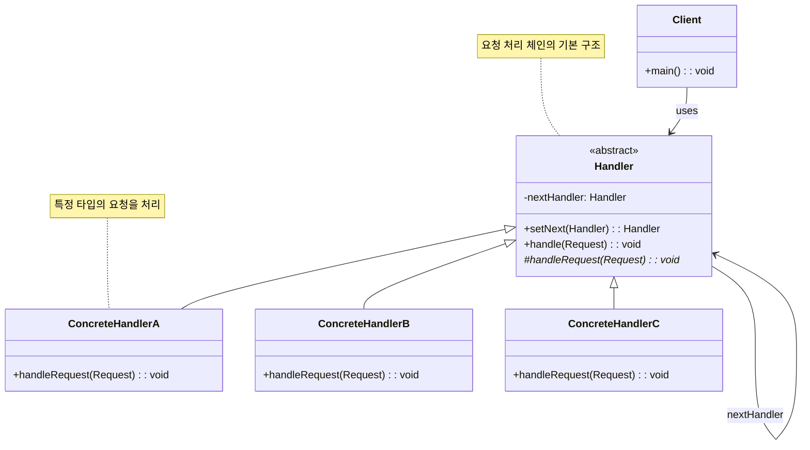
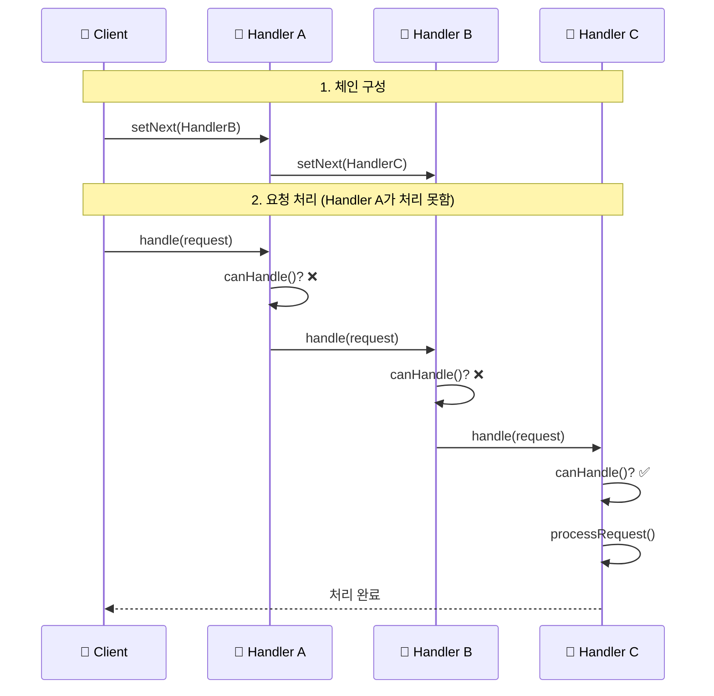

# 책임 연쇄 패턴 (Chain of Responsibility Pattern)

## 정의

책임 연쇄 패턴은 요청을 보내는 쪽과 받는 쪽을 분리하는 패턴으로, 요청을 받을 수 있는 객체들을 체인으로 연결하여 요청이 처리될 때까지 체인을 따라 요청을 전달하는 행동 디자인 패턴입니다.

## 🎯 한눈에 보기

| 항목 | 설명 |
|------|------|
| **핵심** | 요청을 처리할 수 있는 객체들을 체인으로 연결하여 순차적으로 전달 |
| **비유** | 고객센터 전화 - 상담원 → 팀장 → 센터장 순으로 에스컬레이션 |
| **언제** | 요청을 처리할 객체가 여러 개이고, 런타임에 결정해야 할 때 |
| **Spring** | `Filter`, `Interceptor`, `Security Filter Chain`, `@ControllerAdvice` |

### 핵심 구성요소
```
Handler       → 요청 처리의 공통 인터페이스 (handle, setNext)
ConcreteHandler → 실제 요청을 처리하거나 다음으로 전달
Client        → 체인의 첫 번째 핸들러에게 요청 전송
```

### 처리 흐름
```
요청 → [Handler A] → [Handler B] → [Handler C] → 처리 완료
         ↓ 못함        ↓ 못함        ↓ 처리!
       다음으로      다음으로         끝
```

## 구조 (Structure)


```mermaid
classDiagram
    class Handler {
        <<abstract>>
        -nextHandler: Handler
        +setNext(Handler): Handler
        +handle(Request): void
        #handleRequest(Request): void*
    }

    class ConcreteHandlerA {
        +handleRequest(Request): void
    }

    class ConcreteHandlerB {
        +handleRequest(Request): void
    }

    class ConcreteHandlerC {
        +handleRequest(Request): void
    }

    class Client {
        +main(): void
    }

    Handler <|-- ConcreteHandlerA
    Handler <|-- ConcreteHandlerB
    Handler <|-- ConcreteHandlerC
    Handler --> Handler : nextHandler
    Client --> Handler : uses

    note for Handler "요청 처리 체인의 기본 구조"
    note for ConcreteHandlerA "특정 타입의 요청을 처리"
```

## 동작 흐름 (Sequence Diagram)


```mermaid
sequenceDiagram
    participant Client as 👤 Client
    participant H1 as 🔗 Handler A
    participant H2 as 🔗 Handler B
    participant H3 as 🔗 Handler C

    Note over Client,H3: 1. 체인 구성
    Client->>H1: setNext(HandlerB)
    H1->>H2: setNext(HandlerC)

    Note over Client,H3: 2. 요청 처리 (Handler A가 처리 못함)
    Client->>H1: handle(request)
    H1->>H1: canHandle()? ❌
    H1->>H2: handle(request)
    H2->>H2: canHandle()? ❌
    H2->>H3: handle(request)
    H3->>H3: canHandle()? ✅
    H3->>H3: processRequest()
    H3-->>Client: 처리 완료
```

## 사용 이유

- **요청자와 처리자 분리**: 요청을 보내는 객체가 어떤 객체가 처리할지 몰라도 됩니다.
- **동적 체인 구성**: 런타임에 체인의 구성을 변경할 수 있습니다.
- **처리 순서 제어**: 요청 처리 순서를 체인으로 명확히 정의할 수 있습니다.
- **단일 책임 원칙**: 각 핸들러는 자신이 처리할 수 있는 요청만 처리합니다.

## 적용 상황

책임 연쇄 패턴은 다음과 같은 상황에서 특히 유용합니다:

### 1. 다단계 승인 시스템
- **결재 승인**: 금액에 따른 단계별 승인 (팀장 → 부서장 → 임원)
- **권한 검증**: 사용자 역할에 따른 다단계 권한 확인
- **예외 처리**: 심각도에 따른 단계별 에러 처리

### 2. 요청 처리 파이프라인
```java
// 나쁜 예: 하드코딩된 처리 순서
class RequestProcessor {
    public void processRequest(Request request) {
        if (request.getType() == Type.AUTHENTICATION) {
            authenticateUser(request);
        } else if (request.getType() == Type.AUTHORIZATION) {
            authorizeUser(request);
        } else if (request.getType() == Type.VALIDATION) {
            validateRequest(request);
        }
        // 새로운 처리 단계 추가 시 코드 수정 필요
    }
}

// 좋은 예: 책임 연쇄 패턴 사용
abstract class Handler {
    private Handler nextHandler;

    public void handle(Request request) {
        if (canHandle(request)) {
            processRequest(request);
        } else if (nextHandler != null) {
            nextHandler.handle(request);
        }
    }
}
```

### 3. 이벤트 처리 시스템
- **GUI 이벤트**: 위젯 → 패널 → 윈도우 순서로 이벤트 전파
- **네트워크 프로토콜**: OSI 7계층 모델의 각 레이어별 처리
- **미들웨어**: 웹 서버의 필터/인터셉터 체인

## 초급 예제 - 결재 승인 시스템 (5분 이해)

금액에 따라 승인 권한이 다른 결재 시스템을 구현합니다.

```java
// 1. Handler 추상 클래스 - 체인의 기본 구조
abstract class Approver {
    protected Approver nextApprover;  // 다음 승인자
    protected String name;
    protected int approvalLimit;      // 승인 가능 금액

    public Approver(String name, int approvalLimit) {
        this.name = name;
        this.approvalLimit = approvalLimit;
    }

    public Approver setNext(Approver next) {
        this.nextApprover = next;
        return next;  // 체이닝을 위해 반환
    }

    public void approve(int amount) {
        if (amount <= approvalLimit) {
            System.out.println("✅ " + name + " 승인: " + amount + "원");
        } else if (nextApprover != null) {
            System.out.println("➡️ " + name + " → 상위 결재자로 전달 (" + amount + "원)");
            nextApprover.approve(amount);
        } else {
            System.out.println("❌ 승인 불가: " + amount + "원 (한도 초과)");
        }
    }
}

// 2. Concrete Handlers - 각 결재자
class TeamLead extends Approver {
    public TeamLead(String name) {
        super(name, 100000);  // 10만원까지 승인 가능
    }
}

class Manager extends Approver {
    public Manager(String name) {
        super(name, 500000);  // 50만원까지 승인 가능
    }
}

class Director extends Approver {
    public Director(String name) {
        super(name, 1000000); // 100만원까지 승인 가능
    }
}

// 3. 사용 예시
public class ApprovalDemo {
    public static void main(String[] args) {
        // 체인 구성: 팀장 → 부장 → 이사
        Approver teamLead = new TeamLead("김팀장");
        Approver manager = new Manager("이부장");
        Approver director = new Director("박이사");

        teamLead.setNext(manager).setNext(director);

        // 결재 요청
        System.out.println("=== 결재 요청 ===");
        teamLead.approve(50000);    // 5만원 - 팀장이 승인
        teamLead.approve(200000);   // 20만원 - 부장이 승인
        teamLead.approve(800000);   // 80만원 - 이사가 승인
        teamLead.approve(2000000);  // 200만원 - 승인 불가
    }
}
```

**실행 결과:**
```
=== 결재 요청 ===
✅ 김팀장 승인: 50000원
➡️ 김팀장 → 상위 결재자로 전달 (200000원)
✅ 이부장 승인: 200000원
➡️ 김팀장 → 상위 결재자로 전달 (800000원)
➡️ 이부장 → 상위 결재자로 전달 (800000원)
✅ 박이사 승인: 800000원
➡️ 김팀장 → 상위 결재자로 전달 (2000000원)
➡️ 이부장 → 상위 결재자로 전달 (2000000원)
❌ 승인 불가: 2000000원 (한도 초과)
```

### 핵심 포인트
```
1. 각 Handler는 자신이 처리할 수 있으면 처리, 없으면 다음으로 전달
2. Client는 체인의 첫 번째 Handler만 알면 됨
3. 새로운 결재자 추가 = 새 클래스 추가 + 체인에 연결 (기존 코드 수정 불필요)
```

## 실생활 예제 - 고객 지원 시스템

다양한 레벨의 고객 지원 담당자가 문의를 처리하는 시스템을 책임 연쇄 패턴으로 구현해보겠습니다.

```java
import java.util.*;
import java.time.LocalDateTime;
import java.time.format.DateTimeFormatter;

// 지원 요청 타입 열거형
enum SupportLevel {
    BASIC(1, "기본 문의"),
    TECHNICAL(2, "기술 지원"),
    BILLING(3, "요금/결제"),
    ESCALATED(4, "에스컬레이션"),
    EXECUTIVE(5, "경영진 검토");

    private final int level;
    private final String description;

    SupportLevel(int level, String description) {
        this.level = level;
        this.description = description;
    }

    public int getLevel() { return level; }
    public String getDescription() { return description; }
}

// 지원 요청 클래스
class SupportRequest {
    private String requestId;
    private String customerName;
    private String customerTier; // "Bronze", "Silver", "Gold", "Platinum"
    private SupportLevel level;
    private String subject;
    private String description;
    private LocalDateTime createdAt;
    private String urgency; // "Low", "Medium", "High", "Critical"
    private Map<String, Object> metadata;

    public SupportRequest(String customerName, String customerTier, SupportLevel level,
                         String subject, String description, String urgency) {
        this.requestId = generateRequestId();
        this.customerName = customerName;
        this.customerTier = customerTier;
        this.level = level;
        this.subject = subject;
        this.description = description;
        this.urgency = urgency;
        this.createdAt = LocalDateTime.now();
        this.metadata = new HashMap<>();
    }

    private String generateRequestId() {
        return "REQ-" + System.currentTimeMillis() % 100000;
    }

    public void addMetadata(String key, Object value) {
        metadata.put(key, value);
    }

    // getter 메서드들
    public String getRequestId() { return requestId; }
    public String getCustomerName() { return customerName; }
    public String getCustomerTier() { return customerTier; }
    public SupportLevel getLevel() { return level; }
    public String getSubject() { return subject; }
    public String getDescription() { return description; }
    public LocalDateTime getCreatedAt() { return createdAt; }
    public String getUrgency() { return urgency; }
    public Map<String, Object> getMetadata() { return metadata; }

    @Override
    public String toString() {
        DateTimeFormatter formatter = DateTimeFormatter.ofPattern("MM-dd HH:mm");
        return String.format("[%s] %s (%s) - %s | %s급 | %s",
                requestId, customerName, customerTier, subject,
                urgency, createdAt.format(formatter));
    }
}

// 추상 지원 핸들러 클래스
abstract class SupportHandler {
    protected SupportHandler nextHandler;
    protected String handlerName;
    protected String department;
    protected List<String> handledRequests;

    public SupportHandler(String handlerName, String department) {
        this.handlerName = handlerName;
        this.department = department;
        this.handledRequests = new ArrayList<>();
    }

    public SupportHandler setNext(SupportHandler handler) {
        this.nextHandler = handler;
        return handler;
    }

    public void handle(SupportRequest request) {
        System.out.println("\n📨 [" + handlerName + "] 요청 검토: " + request);

        if (canHandle(request)) {
            processRequest(request);
            handledRequests.add(request.getRequestId());
        } else {
            System.out.println("❌ [" + handlerName + "] 처리 불가 - 상위 담당자에게 전달");
            if (nextHandler != null) {
                nextHandler.handle(request);
            } else {
                System.out.println("🚨 처리할 수 있는 담당자가 없습니다!");
                processUnhandledRequest(request);
            }
        }
    }

    protected abstract boolean canHandle(SupportRequest request);
    protected abstract void processRequest(SupportRequest request);

    protected void processUnhandledRequest(SupportRequest request) {
        System.out.println("📝 요청이 대기열에 추가되었습니다: " + request.getRequestId());
    }

    public void displayStatistics() {
        System.out.println(String.format("📊 [%s - %s] 처리 건수: %d건",
                department, handlerName, handledRequests.size()));
        if (!handledRequests.isEmpty()) {
            System.out.println("   처리한 요청: " + String.join(", ", handledRequests));
        }
    }
}

// 1차 지원 담당자 (기본 문의 처리)
class Level1SupportHandler extends SupportHandler {
    public Level1SupportHandler(String handlerName) {
        super(handlerName, "1차 고객지원팀");
    }

    @Override
    protected boolean canHandle(SupportRequest request) {
        // 기본 문의이고 긴급도가 높지 않은 경우 처리
        return request.getLevel() == SupportLevel.BASIC &&
               !request.getUrgency().equals("Critical");
    }

    @Override
    protected void processRequest(SupportRequest request) {
        System.out.println("✅ [" + handlerName + "] 기본 문의 처리 중...");

        // 처리 시뮬레이션
        try {
            Thread.sleep(500);
        } catch (InterruptedException e) {
            Thread.currentThread().interrupt();
        }

        String solution = generateBasicSolution(request);
        System.out.println("💡 해결 방안: " + solution);
        System.out.println("⏱️ 예상 처리 시간: 15분");

        // 고객 등급에 따른 추가 서비스
        if (request.getCustomerTier().equals("Gold") || request.getCustomerTier().equals("Platinum")) {
            System.out.println("🌟 VIP 고객 우선 처리 완료");
        }
    }

    private String generateBasicSolution(SupportRequest request) {
        if (request.getSubject().contains("로그인")) {
            return "비밀번호 재설정 링크를 이메일로 발송했습니다.";
        } else if (request.getSubject().contains("계정")) {
            return "계정 정보를 확인하고 필요한 조치를 취했습니다.";
        } else {
            return "일반적인 해결 방법을 안내해드렸습니다.";
        }
    }
}

// 2차 지원 담당자 (기술 지원)
class Level2SupportHandler extends SupportHandler {
    public Level2SupportHandler(String handlerName) {
        super(handlerName, "기술지원팀");
    }

    @Override
    protected boolean canHandle(SupportRequest request) {
        // 기술 지원이거나 중간 수준의 문제 처리
        return (request.getLevel() == SupportLevel.TECHNICAL ||
                request.getLevel() == SupportLevel.BASIC) &&
               !request.getUrgency().equals("Critical");
    }

    @Override
    protected void processRequest(SupportRequest request) {
        System.out.println("✅ [" + handlerName + "] 기술 지원 처리 중...");

        // 처리 시뮬레이션
        try {
            Thread.sleep(1000);
        } catch (InterruptedException e) {
            Thread.currentThread().interrupt();
        }

        performTechnicalDiagnosis(request);
        String solution = provideTechnicalSolution(request);
        System.out.println("🔧 기술 솔루션: " + solution);
        System.out.println("⏱️ 예상 처리 시간: 45분");

        // 원격 지원 제공
        if (request.getMetadata().containsKey("requiresRemoteAccess")) {
            System.out.println("🖥️ 원격 지원 세션을 시작합니다.");
        }
    }

    private void performTechnicalDiagnosis(SupportRequest request) {
        System.out.println("🔍 시스템 진단 중...");
        System.out.println("📋 로그 분석 완료");

        // 진단 결과를 메타데이터에 추가
        request.addMetadata("diagnosis", "시스템 정상, 설정 문제 발견");
    }

    private String provideTechnicalSolution(SupportRequest request) {
        if (request.getSubject().contains("API")) {
            return "API 키를 재발급하고 엔드포인트 설정을 수정했습니다.";
        } else if (request.getSubject().contains("통합")) {
            return "시스템 통합 설정을 검토하고 필요한 패치를 적용했습니다.";
        } else {
            return "기술적 문제를 해결하고 최적화를 수행했습니다.";
        }
    }
}

// 3차 지원 담당자 (요금/결제)
class Level3BillingHandler extends SupportHandler {
    public Level3BillingHandler(String handlerName) {
        super(handlerName, "결제지원팀");
    }

    @Override
    protected boolean canHandle(SupportRequest request) {
        // 결제 관련 문의 처리
        return request.getLevel() == SupportLevel.BILLING;
    }

    @Override
    protected void processRequest(SupportRequest request) {
        System.out.println("✅ [" + handlerName + "] 결제/요금 문의 처리 중...");

        // 처리 시뮬레이션
        try {
            Thread.sleep(800);
        } catch (InterruptedException e) {
            Thread.currentThread().interrupt();
        }

        reviewBillingHistory(request);
        String resolution = processBillingIssue(request);
        System.out.println("💳 결제 처리: " + resolution);
        System.out.println("⏱️ 예상 처리 시간: 30분");

        // 환불 처리 시 승인 단계
        if (request.getSubject().contains("환불")) {
            System.out.println("💰 환불 승인 프로세스를 시작합니다.");
            request.addMetadata("refundApprovalRequired", true);
        }
    }

    private void reviewBillingHistory(SupportRequest request) {
        System.out.println("📊 고객 결제 이력 조회 중...");
        System.out.println("💳 결제 정보 확인 완료");
    }

    private String processBillingIssue(SupportRequest request) {
        if (request.getSubject().contains("중복")) {
            return "중복 결제를 확인하고 환불 처리했습니다.";
        } else if (request.getSubject().contains("할인")) {
            return "할인 쿠폰을 적용하고 차액을 조정했습니다.";
        } else {
            return "결제 문제를 해결하고 계정을 정상화했습니다.";
        }
    }
}

// 시니어 지원 담당자 (에스컬레이션)
class SeniorSupportHandler extends SupportHandler {
    public SeniorSupportHandler(String handlerName) {
        super(handlerName, "시니어지원팀");
    }

    @Override
    protected boolean canHandle(SupportRequest request) {
        // 에스컬레이션된 문제나 긴급 문제 처리
        return request.getLevel() == SupportLevel.ESCALATED ||
               request.getUrgency().equals("Critical") ||
               request.getCustomerTier().equals("Platinum");
    }

    @Override
    protected void processRequest(SupportRequest request) {
        System.out.println("✅ [" + handlerName + "] 에스컬레이션 처리 중...");

        // 처리 시뮬레이션
        try {
            Thread.sleep(1200);
        } catch (InterruptedException e) {
            Thread.currentThread().interrupt();
        }

        conductDetailedAnalysis(request);
        coordinateWithTeams(request);
        String resolution = provideComprehensiveSolution(request);
        System.out.println("🎯 종합 솔루션: " + resolution);
        System.out.println("⏱️ 예상 처리 시간: 2시간");

        // VIP 고객 특별 관리
        if (request.getCustomerTier().equals("Platinum")) {
            System.out.println("👑 플래티넘 고객 전담 관리 시작");
            scheduleFollowUp(request);
        }
    }

    private void conductDetailedAnalysis(SupportRequest request) {
        System.out.println("🔬 상세 분석 수행 중...");
        System.out.println("📈 시스템 전체 영향도 검토");
    }

    private void coordinateWithTeams(SupportRequest request) {
        System.out.println("🤝 관련 팀들과 협조 중...");
        System.out.println("   - 개발팀 컨설팅");
        System.out.println("   - 인프라팀 검토");
        System.out.println("   - 보안팀 확인");
    }

    private String provideComprehensiveSolution(SupportRequest request) {
        return "다부서 협업을 통해 근본 원인을 해결하고 재발 방지책을 마련했습니다.";
    }

    private void scheduleFollowUp(SupportRequest request) {
        System.out.println("📅 후속 관리 일정이 등록되었습니다.");
        request.addMetadata("followUpScheduled", true);
    }
}

// 경영진 검토 담당자
class ExecutiveHandler extends SupportHandler {
    public ExecutiveHandler(String handlerName) {
        super(handlerName, "경영진");
    }

    @Override
    protected boolean canHandle(SupportRequest request) {
        // 경영진 레벨의 검토가 필요한 경우만 처리
        return request.getLevel() == SupportLevel.EXECUTIVE ||
               (request.getUrgency().equals("Critical") &&
                request.getCustomerTier().equals("Platinum"));
    }

    @Override
    protected void processRequest(SupportRequest request) {
        System.out.println("✅ [" + handlerName + "] 경영진 검토 중...");

        // 처리 시뮬레이션
        try {
            Thread.sleep(2000);
        } catch (InterruptedException e) {
            Thread.currentThread().interrupt();
        }

        conductExecutiveReview(request);
        makeStrategicDecision(request);
        System.out.println("🏛️ 경영진 결정: 특별 조치 승인");
        System.out.println("⏱️ 예상 처리 시간: 1일");

        System.out.println("📞 고객 직접 연락 예정");
        System.out.println("🎁 보상 패키지 제공");
    }

    private void conductExecutiveReview(SupportRequest request) {
        System.out.println("👔 경영진 회의 소집");
        System.out.println("📋 비즈니스 영향도 분석");
        System.out.println("💼 전략적 대응 방안 수립");
    }

    private void makeStrategicDecision(SupportRequest request) {
        System.out.println("⚖️ 경영진 의사결정 완료");
        request.addMetadata("executiveDecision", "특별 보상 및 프로세스 개선");
    }
}

// 고객 지원 시스템
class CustomerSupportSystem {
    private SupportHandler handlerChain;
    private List<SupportRequest> allRequests;
    private Map<String, SupportHandler> handlers;

    public CustomerSupportSystem() {
        this.allRequests = new ArrayList<>();
        this.handlers = new HashMap<>();
        setupHandlerChain();
    }

    private void setupHandlerChain() {
        // 핸들러 생성
        SupportHandler level1 = new Level1SupportHandler("김민수");
        SupportHandler level2 = new Level2SupportHandler("박기술");
        SupportHandler billing = new Level3BillingHandler("이결제");
        SupportHandler senior = new SeniorSupportHandler("최시니어");
        SupportHandler executive = new ExecutiveHandler("정경영");

        // 체인 구성
        handlerChain = level1;
        level1.setNext(level2)
              .setNext(billing)
              .setNext(senior)
              .setNext(executive);

        // 핸들러 맵에 저장
        handlers.put("level1", level1);
        handlers.put("level2", level2);
        handlers.put("billing", billing);
        handlers.put("senior", senior);
        handlers.put("executive", executive);
    }

    public void processRequest(SupportRequest request) {
        System.out.println("\n" + "=".repeat(70));
        System.out.println("🎫 새로운 지원 요청 접수");
        System.out.println("=".repeat(70));

        allRequests.add(request);
        handlerChain.handle(request);

        System.out.println("\n✅ 요청 처리 완료: " + request.getRequestId());
    }

    public void displaySystemStatistics() {
        System.out.println("\n📊 고객 지원 시스템 통계");
        System.out.println("=".repeat(50));
        System.out.println("총 처리 요청 수: " + allRequests.size());

        // 각 핸들러별 통계
        for (SupportHandler handler : handlers.values()) {
            handler.displayStatistics();
        }

        // 요청 유형별 통계
        displayRequestTypeStatistics();

        // 고객 등급별 통계
        displayCustomerTierStatistics();
    }

    private void displayRequestTypeStatistics() {
        System.out.println("\n📋 요청 유형별 분포:");
        Map<SupportLevel, Long> typeStats = allRequests.stream()
            .collect(java.util.stream.Collectors.groupingBy(
                SupportRequest::getLevel,
                java.util.stream.Collectors.counting()));

        typeStats.forEach((level, count) ->
            System.out.println("   " + level.getDescription() + ": " + count + "건"));
    }

    private void displayCustomerTierStatistics() {
        System.out.println("\n🏆 고객 등급별 분포:");
        Map<String, Long> tierStats = allRequests.stream()
            .collect(java.util.stream.Collectors.groupingBy(
                SupportRequest::getCustomerTier,
                java.util.stream.Collectors.counting()));

        tierStats.forEach((tier, count) ->
            System.out.println("   " + tier + ": " + count + "건"));
    }
}

// 고객 지원 시스템 데모
public class CustomerSupportDemo {
    public static void main(String[] args) throws InterruptedException {
        CustomerSupportSystem supportSystem = new CustomerSupportSystem();

        System.out.println("🏢 고객 지원 시스템 시작");
        System.out.println("=".repeat(50));

        // 다양한 지원 요청 생성 및 처리

        // 1. 기본 문의 (1차 지원에서 처리)
        SupportRequest request1 = new SupportRequest(
            "홍길동", "Bronze", SupportLevel.BASIC,
            "로그인 문제", "비밀번호를 잊어버렸습니다.", "Medium"
        );
        supportSystem.processRequest(request1);
        Thread.sleep(1000);

        // 2. 기술 지원 (2차 지원에서 처리)
        SupportRequest request2 = new SupportRequest(
            "김개발", "Silver", SupportLevel.TECHNICAL,
            "API 통합 오류", "결제 API 연동 시 400 에러가 발생합니다.", "High"
        );
        request2.addMetadata("requiresRemoteAccess", true);
        supportSystem.processRequest(request2);
        Thread.sleep(1000);

        // 3. 결제 문의 (결제 팀에서 처리)
        SupportRequest request3 = new SupportRequest(
            "박상인", "Gold", SupportLevel.BILLING,
            "중복 결제 환불", "같은 상품이 두 번 결제되었습니다.", "High"
        );
        supportSystem.processRequest(request3);
        Thread.sleep(1000);

        // 4. 긴급 문제 (시니어 지원에서 처리)
        SupportRequest request4 = new SupportRequest(
            "이VIP", "Platinum", SupportLevel.TECHNICAL,
            "시스템 전체 오류", "서비스 전체가 접속되지 않습니다.", "Critical"
        );
        supportSystem.processRequest(request4);
        Thread.sleep(1000);

        // 5. 경영진 검토 필요 (최고 레벨에서 처리)
        SupportRequest request5 = new SupportRequest(
            "최고객", "Platinum", SupportLevel.EXECUTIVE,
            "서비스 약관 위반 신고", "개인정보 처리에 심각한 문제가 있습니다.", "Critical"
        );
        supportSystem.processRequest(request5);
        Thread.sleep(1000);

        // 6. 처리할 수 없는 요청 (체인 끝까지 전달)
        SupportRequest request6 = new SupportRequest(
            "신규고객", "Bronze", SupportLevel.EXECUTIVE,
            "특별 요청", "일반적이지 않은 특별한 요청입니다.", "Low"
        );
        supportSystem.processRequest(request6);

        // 시스템 통계 출력
        supportSystem.displaySystemStatistics();

        System.out.println("\n🎯 고객 지원 시스템 데모 완료!");
    }
}
```

**실행 결과 예시:**
```
🏢 고객 지원 시스템 시작
==================================================

======================================================================
🎫 새로운 지원 요청 접수
======================================================================

📨 [김민수] 요청 검토: [REQ-12345] 홍길동 (Bronze) - 로그인 문제 | Medium급 | 01-15 14:30
✅ [김민수] 기본 문의 처리 중...
💡 해결 방안: 비밀번호 재설정 링크를 이메일로 발송했습니다.
⏱️ 예상 처리 시간: 15분

✅ 요청 처리 완료: REQ-12345

======================================================================
🎫 새로운 지원 요청 접수
======================================================================

📨 [김민수] 요청 검토: [REQ-12346] 김개발 (Silver) - API 통합 오류 | High급 | 01-15 14:30
❌ [김민수] 처리 불가 - 상위 담당자에게 전달

📨 [박기술] 요청 검토: [REQ-12346] 김개발 (Silver) - API 통합 오류 | High급 | 01-15 14:30
✅ [박기술] 기술 지원 처리 중...
🔍 시스템 진단 중...
📋 로그 분석 완료
🔧 기술 솔루션: API 키를 재발급하고 엔드포인트 설정을 수정했습니다.
⏱️ 예상 처리 시간: 45분
🖥️ 원격 지원 세션을 시작합니다.

✅ 요청 처리 완료: REQ-12346
```

## 기본 예제 코드 (Java)

```java
// Abstract Handler
abstract class Handler {
    protected Handler nextHandler;

    public Handler setNext(Handler handler) {
        this.nextHandler = handler;
        return handler;
    }

    public void handle(String request) {
        if (canHandle(request)) {
            processRequest(request);
        } else if (nextHandler != null) {
            nextHandler.handle(request);
        } else {
            System.out.println("요청을 처리할 수 없습니다: " + request);
        }
    }

    protected abstract boolean canHandle(String request);
    protected abstract void processRequest(String request);
}

// Concrete Handlers
class ConcreteHandlerA extends Handler {
    @Override
    protected boolean canHandle(String request) {
        return request.startsWith("A");
    }

    @Override
    protected void processRequest(String request) {
        System.out.println("Handler A가 처리: " + request);
    }
}

class ConcreteHandlerB extends Handler {
    @Override
    protected boolean canHandle(String request) {
        return request.startsWith("B");
    }

    @Override
    protected void processRequest(String request) {
        System.out.println("Handler B가 처리: " + request);
    }
}

// Client
public class ChainOfResponsibilityDemo {
    public static void main(String[] args) {
        Handler handlerA = new ConcreteHandlerA();
        Handler handlerB = new ConcreteHandlerB();

        handlerA.setNext(handlerB);

        handlerA.handle("A-Request");  // Handler A가 처리
        handlerA.handle("B-Request");  // Handler B가 처리
        handlerA.handle("C-Request");  // 처리할 수 없음
    }
}
```

## Spring Boot에서의 Chain of Responsibility 패턴

Spring에서는 **Filter Chain**, **Interceptor**, **Security Filter Chain**이 대표적인 책임 연쇄 패턴 구현입니다.

### 1. Spring Security Filter Chain (가장 많이 사용)

Spring Security는 여러 필터가 체인으로 연결되어 요청을 순차 처리합니다.

```java
// Spring Security 설정 (Filter Chain 구성)
@Configuration
@EnableWebSecurity
public class SecurityConfig {

    @Bean
    public SecurityFilterChain filterChain(HttpSecurity http) throws Exception {
        return http
            // 각 설정이 필터 체인에 필터를 추가
            .csrf(csrf -> csrf.disable())
            .authorizeHttpRequests(auth -> auth
                .requestMatchers("/api/public/**").permitAll()
                .requestMatchers("/api/admin/**").hasRole("ADMIN")
                .anyRequest().authenticated()
            )
            .addFilterBefore(new CustomLoggingFilter(), UsernamePasswordAuthenticationFilter.class)
            .addFilterAfter(new CustomAuditFilter(), UsernamePasswordAuthenticationFilter.class)
            .build();
    }
}

// 커스텀 필터 구현
public class CustomLoggingFilter extends OncePerRequestFilter {

    @Override
    protected void doFilterInternal(HttpServletRequest request,
                                    HttpServletResponse response,
                                    FilterChain filterChain)
            throws ServletException, IOException {

        // 1. 요청 로깅
        System.out.println("📥 요청: " + request.getMethod() + " " + request.getRequestURI());

        // 2. 다음 필터로 전달 (체인 연결!)
        filterChain.doFilter(request, response);

        // 3. 응답 로깅
        System.out.println("📤 응답: " + response.getStatus());
    }
}
```

### 2. Servlet Filter Chain (표준 서블릿)

```java
// 인증 필터
@Component
@Order(1)  // 순서 지정
public class AuthenticationFilter implements Filter {

    @Override
    public void doFilter(ServletRequest request, ServletResponse response,
                        FilterChain chain) throws IOException, ServletException {

        HttpServletRequest httpRequest = (HttpServletRequest) request;
        String token = httpRequest.getHeader("Authorization");

        if (isValidToken(token)) {
            System.out.println("✅ 인증 성공");
            chain.doFilter(request, response);  // 다음 필터로!
        } else {
            System.out.println("❌ 인증 실패");
            ((HttpServletResponse) response).sendError(401, "Unauthorized");
            // chain.doFilter 호출 안함 → 체인 중단!
        }
    }

    private boolean isValidToken(String token) {
        return token != null && token.startsWith("Bearer ");
    }
}

// 로깅 필터
@Component
@Order(2)
public class RequestLoggingFilter implements Filter {

    @Override
    public void doFilter(ServletRequest request, ServletResponse response,
                        FilterChain chain) throws IOException, ServletException {

        long start = System.currentTimeMillis();

        chain.doFilter(request, response);  // 다음 필터로!

        long duration = System.currentTimeMillis() - start;
        System.out.println("⏱️ 처리 시간: " + duration + "ms");
    }
}
```

### 3. HandlerInterceptor Chain (Spring MVC)

```java
// 인터셉터 정의
@Component
public class LoggingInterceptor implements HandlerInterceptor {

    @Override
    public boolean preHandle(HttpServletRequest request,
                            HttpServletResponse response,
                            Object handler) throws Exception {
        System.out.println("🔵 preHandle: " + request.getRequestURI());
        request.setAttribute("startTime", System.currentTimeMillis());
        return true;  // true면 다음 인터셉터로, false면 체인 중단
    }

    @Override
    public void postHandle(HttpServletRequest request,
                          HttpServletResponse response,
                          Object handler,
                          ModelAndView modelAndView) throws Exception {
        System.out.println("🟢 postHandle: 컨트롤러 처리 완료");
    }

    @Override
    public void afterCompletion(HttpServletRequest request,
                               HttpServletResponse response,
                               Object handler, Exception ex) throws Exception {
        long startTime = (Long) request.getAttribute("startTime");
        System.out.println("🔴 afterCompletion: " + (System.currentTimeMillis() - startTime) + "ms");
    }
}

// 인터셉터 등록 (체인 구성)
@Configuration
public class WebConfig implements WebMvcConfigurer {

    @Override
    public void addInterceptors(InterceptorRegistry registry) {
        registry.addInterceptor(new AuthInterceptor())
                .order(1)
                .addPathPatterns("/api/**");

        registry.addInterceptor(new LoggingInterceptor())
                .order(2)
                .addPathPatterns("/**");

        registry.addInterceptor(new RateLimitInterceptor())
                .order(3)
                .addPathPatterns("/api/**");
    }
}
```

### 4. 비즈니스 로직에서 직접 구현

```java
// 주문 검증 핸들러 인터페이스
public interface OrderValidationHandler {
    void setNext(OrderValidationHandler next);
    void validate(Order order) throws ValidationException;
}

// 추상 핸들러
public abstract class AbstractOrderValidator implements OrderValidationHandler {
    protected OrderValidationHandler nextHandler;

    @Override
    public void setNext(OrderValidationHandler next) {
        this.nextHandler = next;
    }

    protected void passToNext(Order order) throws ValidationException {
        if (nextHandler != null) {
            nextHandler.validate(order);
        }
    }
}

// 재고 검증
@Component
@Order(1)
public class StockValidator extends AbstractOrderValidator {
    private final InventoryService inventoryService;

    @Override
    public void validate(Order order) throws ValidationException {
        if (!inventoryService.hasStock(order.getProductId(), order.getQuantity())) {
            throw new ValidationException("재고 부족");
        }
        System.out.println("✅ 재고 검증 통과");
        passToNext(order);  // 다음 핸들러로!
    }
}

// 결제 검증
@Component
@Order(2)
public class PaymentValidator extends AbstractOrderValidator {
    private final PaymentService paymentService;

    @Override
    public void validate(Order order) throws ValidationException {
        if (!paymentService.canProcess(order.getPaymentMethod())) {
            throw new ValidationException("결제 수단 사용 불가");
        }
        System.out.println("✅ 결제 검증 통과");
        passToNext(order);
    }
}

// 배송 검증
@Component
@Order(3)
public class ShippingValidator extends AbstractOrderValidator {
    private final ShippingService shippingService;

    @Override
    public void validate(Order order) throws ValidationException {
        if (!shippingService.canDeliver(order.getAddress())) {
            throw new ValidationException("배송 불가 지역");
        }
        System.out.println("✅ 배송 검증 통과");
        passToNext(order);
    }
}

// 체인 구성 및 사용
@Service
public class OrderValidationService {
    private final OrderValidationHandler validationChain;

    @Autowired
    public OrderValidationService(List<AbstractOrderValidator> validators) {
        // Spring이 @Order 순서대로 주입한 validators로 체인 구성
        for (int i = 0; i < validators.size() - 1; i++) {
            validators.get(i).setNext(validators.get(i + 1));
        }
        this.validationChain = validators.get(0);
    }

    public void validateOrder(Order order) throws ValidationException {
        validationChain.validate(order);
        System.out.println("🎉 모든 검증 통과!");
    }
}
```

### 5. Spring에서 Chain of Responsibility가 사용되는 곳

| Spring 기능 | 설명 |
|------------|------|
| `Filter` / `FilterChain` | 서블릿 요청/응답 처리 체인 |
| `HandlerInterceptor` | Spring MVC 전처리/후처리 체인 |
| `Security Filter Chain` | 인증/인가 필터 체인 |
| `@ControllerAdvice` | 예외 처리 핸들러 체인 |
| `MessageConverter` | HTTP 메시지 변환 체인 |

### Filter vs Interceptor 비교

```
┌─────────────────┬────────────────────┬────────────────────┐
│                 │ Filter             │ Interceptor        │
├─────────────────┼────────────────────┼────────────────────┤
│ 위치            │ Servlet 레벨       │ Spring MVC 레벨    │
│ 실행 시점       │ DispatcherServlet  │ Controller 전/후   │
│                 │ 전/후              │                    │
│ Spring Bean     │ @Component 가능    │ 기본 Spring Bean   │
│ 주 용도         │ 인코딩, 보안, 로깅 │ 인증, 로깅, 권한   │
│ 예외 처리       │ 직접 처리          │ @ControllerAdvice  │
└─────────────────┴────────────────────┴────────────────────┘
```

## 장점

- **결합도 감소**: 요청 송신자와 수신자가 서로를 직접 알 필요가 없습니다.
- **동적 체인 구성**: 런타임에 체인의 구성을 변경할 수 있습니다.
- **단일 책임 원칙**: 각 핸들러는 특정 타입의 요청만 처리합니다.
- **개방-폐쇄 원칙**: 새로운 핸들러를 추가해도 기존 코드를 수정할 필요가 없습니다.
- **순서 제어**: 요청 처리 순서를 명확하게 제어할 수 있습니다.

## 단점

- **처리 보장 부족**: 요청이 반드시 처리된다는 보장이 없습니다.
- **성능 오버헤드**: 체인이 길어지면 모든 핸들러를 거쳐야 하므로 성능이 저하될 수 있습니다.
- **디버깅 어려움**: 어떤 핸들러가 요청을 처리했는지 추적하기 어려울 수 있습니다.
- **체인 구성 복잡성**: 적절한 체인을 구성하는 것이 복잡할 수 있습니다.

## 관련 패턴

| 패턴 | 관계 |
|------|------|
| **Decorator** | 둘 다 체인 구조. Decorator는 기능 추가, CoR은 요청 처리 분배 |
| **Composite** | Composite 트리 구조에서 요청을 부모로 전달할 때 CoR 사용 가능 |
| **Command** | Command 객체를 체인으로 전달하여 처리할 수 있음 |

### Chain of Responsibility vs Decorator

```
Chain of Responsibility:
├─ 목적: 요청을 처리할 객체 찾기
├─ 처리: 하나의 핸들러만 처리 (처리 후 체인 종료 가능)
└─ 예: 결재 승인, 예외 처리

Decorator:
├─ 목적: 기능을 점진적으로 추가
├─ 처리: 모든 데코레이터가 순차적으로 기능 추가
└─ 예: 스트림 래핑, 로깅 추가

// Chain of Responsibility - 처리되면 끝
if (canHandle(request)) {
    process(request);
    return;  // 여기서 종료!
}
nextHandler.handle(request);

// Decorator - 계속 전달
preProcess(request);
wrapped.handle(request);  // 항상 전달
postProcess(request);
```

### 실무에서의 선택 기준
```
요청을 누가 처리할지 런타임에 결정 → Chain of Responsibility
  예: 에러 핸들링, 권한 체크, 결재 승인

모든 단계가 순차적으로 처리해야 함 → Decorator 또는 단순 체인
  예: 로깅, 캐싱, 압축
```