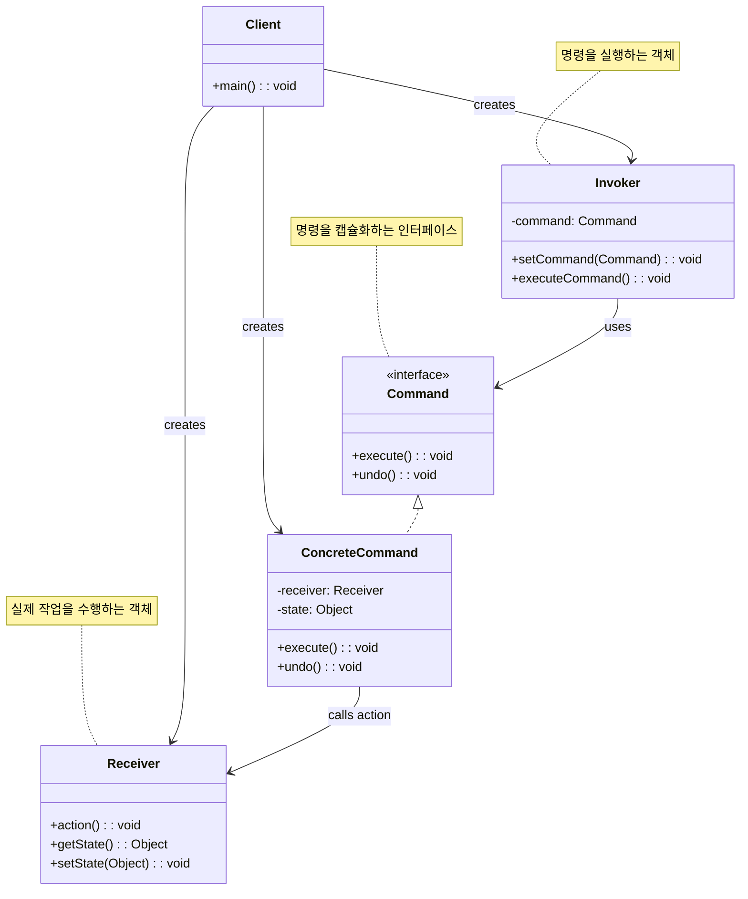

# 커맨드 패턴 (Command Pattern)

## 정의

커맨드 패턴은 요청을 객체로 캡슐화하여 다른 객체들을 서로 다른 요청, 큐, 로그 요청으로 매개변수화할 수 있게 해주는 행동 디자인 패턴입니다. 또한 실행 취소(undo) 기능을 지원할 수 있습니다.

## 구조 (Structure)



## 사용 이유

- **요청 캡슐화**: 요청자와 수신자를 분리하여 요청을 객체로 캡슐화합니다.
- **실행 취소 기능**: 명령의 이전 상태를 저장하여 undo/redo 기능을 구현할 수 있습니다.
- **지연 실행**: 명령을 나중에 실행하거나 원격에서 실행할 수 있습니다.
- **로깅**: 명령들을 기록하여 시스템 복구나 디버깅에 활용할 수 있습니다.
- **매크로 기능**: 여러 명령을 조합하여 복합 명령을 만들 수 있습니다.

## 적용 상황

커맨드 패턴은 다음과 같은 상황에서 특히 유용합니다:

### 1. GUI 애플리케이션
- **메뉴/버튼 액션**: 동일한 기능을 다른 UI 요소에서 실행
- **실행 취소/재실행**: 텍스트 편집기, 그래픽 툴
- **매크로 기능**: 일련의 작업을 자동화

### 2. 요청 큐잉 및 스케줄링
- **작업 큐**: 백그라운드에서 처리할 작업들
- **지연 실행**: 특정 시간에 실행되는 작업
- **원격 실행**: 네트워크를 통한 원격 명령 실행

### 3. 트랜잭션 시스템
```java
// 나쁜 예: 직접 호출로 롤백 어려움
class BankService {
    public void transfer(Account from, Account to, double amount) {
        from.withdraw(amount);  // 실패 시 롤백 복잡
        to.deposit(amount);     // 실패 시 앞의 작업 롤백 필요
    }
}

// 좋은 예: 커맨드 패턴으로 트랜잭션 관리
interface BankCommand {
    void execute();
    void undo();
}

class TransferCommand implements BankCommand {
    // 트랜잭션 단위로 실행/롤백 가능
}
```

## 실생활 예제 - 스마트 홈 제어 시스템

다양한 IoT 기기들을 제어하는 스마트 홈 시스템을 커맨드 패턴으로 구현해보겠습니다.

```java
import java.util.*;
import java.time.LocalDateTime;
import java.time.format.DateTimeFormatter;

// 명령 인터페이스
interface SmartHomeCommand {
    void execute();
    void undo();
    String getDescription();
    LocalDateTime getExecutedTime();
    boolean isUndoable();
}

// 추상 명령 클래스 (공통 기능 구현)
abstract class AbstractSmartHomeCommand implements SmartHomeCommand {
    protected String description;
    protected LocalDateTime executedTime;
    protected boolean undoable;

    public AbstractSmartHomeCommand(String description) {
        this.description = description;
        this.undoable = true;
    }

    @Override
    public String getDescription() {
        return description;
    }

    @Override
    public LocalDateTime getExecutedTime() {
        return executedTime;
    }

    @Override
    public boolean isUndoable() {
        return undoable;
    }

    protected void markExecuted() {
        this.executedTime = LocalDateTime.now();
    }
}

// 조명 시스템 (Receiver)
class SmartLight {
    private String location;
    private boolean isOn;
    private int brightness; // 0-100
    private String color;

    public SmartLight(String location) {
        this.location = location;
        this.isOn = false;
        this.brightness = 100;
        this.color = "White";
    }

    public void turnOn() {
        isOn = true;
        System.out.println("💡 " + location + " 조명이 켜졌습니다.");
    }

    public void turnOff() {
        isOn = false;
        System.out.println("💡 " + location + " 조명이 꺼졌습니다.");
    }

    public void setBrightness(int brightness) {
        this.brightness = Math.max(0, Math.min(100, brightness));
        System.out.println("💡 " + location + " 조명 밝기: " + this.brightness + "%");
    }

    public void setColor(String color) {
        this.color = color;
        System.out.println("💡 " + location + " 조명 색상: " + color);
    }

    // getter 메서드들
    public String getLocation() { return location; }
    public boolean isOn() { return isOn; }
    public int getBrightness() { return brightness; }
    public String getColor() { return color; }
}

// 에어컨 시스템 (Receiver)
class SmartAirConditioner {
    private String location;
    private boolean isOn;
    private int temperature; // 16-30도
    private String mode; // "COOL", "HEAT", "FAN", "DRY"

    public SmartAirConditioner(String location) {
        this.location = location;
        this.isOn = false;
        this.temperature = 24;
        this.mode = "COOL";
    }

    public void turnOn() {
        isOn = true;
        System.out.println("❄️ " + location + " 에어컨이 켜졌습니다. (모드: " + mode + ", 온도: " + temperature + "°C)");
    }

    public void turnOff() {
        isOn = false;
        System.out.println("❄️ " + location + " 에어컨이 꺼졌습니다.");
    }

    public void setTemperature(int temperature) {
        this.temperature = Math.max(16, Math.min(30, temperature));
        System.out.println("❄️ " + location + " 에어컨 온도: " + this.temperature + "°C");
    }

    public void setMode(String mode) {
        this.mode = mode;
        System.out.println("❄️ " + location + " 에어컨 모드: " + mode);
    }

    // getter 메서드들
    public String getLocation() { return location; }
    public boolean isOn() { return isOn; }
    public int getTemperature() { return temperature; }
    public String getMode() { return mode; }
}

// 스피커 시스템 (Receiver)
class SmartSpeaker {
    private String location;
    private boolean isOn;
    private int volume; // 0-100
    private String currentSong;

    public SmartSpeaker(String location) {
        this.location = location;
        this.isOn = false;
        this.volume = 50;
        this.currentSong = "";
    }

    public void turnOn() {
        isOn = true;
        System.out.println("🔊 " + location + " 스피커가 켜졌습니다.");
    }

    public void turnOff() {
        isOn = false;
        System.out.println("🔊 " + location + " 스피커가 꺼졌습니다.");
    }

    public void setVolume(int volume) {
        this.volume = Math.max(0, Math.min(100, volume));
        System.out.println("🔊 " + location + " 스피커 볼륨: " + this.volume);
    }

    public void playMusic(String song) {
        this.currentSong = song;
        System.out.println("🎵 " + location + " 스피커에서 '" + song + "' 재생 중");
    }

    public void stopMusic() {
        this.currentSong = "";
        System.out.println("⏹️ " + location + " 스피커 음악 정지");
    }

    // getter 메서드들
    public String getLocation() { return location; }
    public boolean isOn() { return isOn; }
    public int getVolume() { return volume; }
    public String getCurrentSong() { return currentSong; }
}

// 조명 제어 명령들
class LightOnCommand extends AbstractSmartHomeCommand {
    private SmartLight light;
    private boolean previousState;

    public LightOnCommand(SmartLight light) {
        super("조명 켜기 - " + light.getLocation());
        this.light = light;
    }

    @Override
    public void execute() {
        previousState = light.isOn();
        light.turnOn();
        markExecuted();
    }

    @Override
    public void undo() {
        if (!previousState) {
            light.turnOff();
            System.out.println("↩️ 조명 켜기 명령 취소");
        }
    }
}

class LightOffCommand extends AbstractSmartHomeCommand {
    private SmartLight light;
    private boolean previousState;

    public LightOffCommand(SmartLight light) {
        super("조명 끄기 - " + light.getLocation());
        this.light = light;
    }

    @Override
    public void execute() {
        previousState = light.isOn();
        light.turnOff();
        markExecuted();
    }

    @Override
    public void undo() {
        if (previousState) {
            light.turnOn();
            System.out.println("↩️ 조명 끄기 명령 취소");
        }
    }
}

class LightBrightnessCommand extends AbstractSmartHomeCommand {
    private SmartLight light;
    private int newBrightness;
    private int previousBrightness;

    public LightBrightnessCommand(SmartLight light, int brightness) {
        super("조명 밝기 조절 - " + light.getLocation() + " (" + brightness + "%)");
        this.light = light;
        this.newBrightness = brightness;
    }

    @Override
    public void execute() {
        previousBrightness = light.getBrightness();
        light.setBrightness(newBrightness);
        markExecuted();
    }

    @Override
    public void undo() {
        light.setBrightness(previousBrightness);
        System.out.println("↩️ 조명 밝기 조절 명령 취소 (이전: " + previousBrightness + "%)");
    }
}

// 에어컨 제어 명령들
class AirConditionerOnCommand extends AbstractSmartHomeCommand {
    private SmartAirConditioner ac;
    private boolean previousState;

    public AirConditionerOnCommand(SmartAirConditioner ac) {
        super("에어컨 켜기 - " + ac.getLocation());
        this.ac = ac;
    }

    @Override
    public void execute() {
        previousState = ac.isOn();
        ac.turnOn();
        markExecuted();
    }

    @Override
    public void undo() {
        if (!previousState) {
            ac.turnOff();
            System.out.println("↩️ 에어컨 켜기 명령 취소");
        }
    }
}

class AirConditionerTemperatureCommand extends AbstractSmartHomeCommand {
    private SmartAirConditioner ac;
    private int newTemperature;
    private int previousTemperature;

    public AirConditionerTemperatureCommand(SmartAirConditioner ac, int temperature) {
        super("에어컨 온도 조절 - " + ac.getLocation() + " (" + temperature + "°C)");
        this.ac = ac;
        this.newTemperature = temperature;
    }

    @Override
    public void execute() {
        previousTemperature = ac.getTemperature();
        ac.setTemperature(newTemperature);
        markExecuted();
    }

    @Override
    public void undo() {
        ac.setTemperature(previousTemperature);
        System.out.println("↩️ 에어컨 온도 조절 명령 취소 (이전: " + previousTemperature + "°C)");
    }
}

// 스피커 제어 명령들
class SpeakerPlayCommand extends AbstractSmartHomeCommand {
    private SmartSpeaker speaker;
    private String song;
    private String previousSong;
    private boolean wasPlaying;

    public SpeakerPlayCommand(SmartSpeaker speaker, String song) {
        super("음악 재생 - " + speaker.getLocation() + " ('" + song + "')");
        this.speaker = speaker;
        this.song = song;
    }

    @Override
    public void execute() {
        previousSong = speaker.getCurrentSong();
        wasPlaying = !previousSong.isEmpty();

        if (!speaker.isOn()) {
            speaker.turnOn();
        }
        speaker.playMusic(song);
        markExecuted();
    }

    @Override
    public void undo() {
        if (wasPlaying) {
            speaker.playMusic(previousSong);
        } else {
            speaker.stopMusic();
        }
        System.out.println("↩️ 음악 재생 명령 취소");
    }
}

// 매크로 명령 (복합 명령)
class MacroCommand extends AbstractSmartHomeCommand {
    private List<SmartHomeCommand> commands;

    public MacroCommand(String description, List<SmartHomeCommand> commands) {
        super("매크로: " + description);
        this.commands = new ArrayList<>(commands);
    }

    @Override
    public void execute() {
        System.out.println("🎯 매크로 실행 시작: " + description);
        for (SmartHomeCommand command : commands) {
            command.execute();
        }
        markExecuted();
        System.out.println("✅ 매크로 실행 완료");
    }

    @Override
    public void undo() {
        System.out.println("↩️ 매크로 실행 취소 시작: " + description);
        // 역순으로 undo 실행
        for (int i = commands.size() - 1; i >= 0; i--) {
            if (commands.get(i).isUndoable()) {
                commands.get(i).undo();
            }
        }
        System.out.println("✅ 매크로 실행 취소 완료");
    }
}

// 널 명령 (아무것도 하지 않는 명령)
class NoCommand extends AbstractSmartHomeCommand {
    public NoCommand() {
        super("빈 명령");
        this.undoable = false;
    }

    @Override
    public void execute() {
        // 아무것도 하지 않음
    }

    @Override
    public void undo() {
        // 아무것도 하지 않음
    }
}

// 스마트 홈 리모컨 (Invoker)
class SmartHomeRemote {
    private SmartHomeCommand[] onCommands;
    private SmartHomeCommand[] offCommands;
    private Stack<SmartHomeCommand> commandHistory;
    private SmartHomeCommand lastCommand;

    public SmartHomeRemote() {
        onCommands = new SmartHomeCommand[7];  // 7개 슬롯
        offCommands = new SmartHomeCommand[7];
        commandHistory = new Stack<>();

        SmartHomeCommand noCommand = new NoCommand();
        for (int i = 0; i < 7; i++) {
            onCommands[i] = noCommand;
            offCommands[i] = noCommand;
        }
        lastCommand = noCommand;
    }

    public void setCommand(int slot, SmartHomeCommand onCommand, SmartHomeCommand offCommand) {
        if (slot >= 0 && slot < 7) {
            onCommands[slot] = onCommand;
            offCommands[slot] = offCommand;
        }
    }

    public void onButtonPressed(int slot) {
        if (slot >= 0 && slot < 7) {
            onCommands[slot].execute();
            commandHistory.push(onCommands[slot]);
            lastCommand = onCommands[slot];
        }
    }

    public void offButtonPressed(int slot) {
        if (slot >= 0 && slot < 7) {
            offCommands[slot].execute();
            commandHistory.push(offCommands[slot]);
            lastCommand = offCommands[slot];
        }
    }

    public void undoButtonPressed() {
        if (lastCommand.isUndoable()) {
            lastCommand.undo();
        } else {
            System.out.println("❌ 실행 취소할 수 없는 명령입니다.");
        }
    }

    public void executeCommand(SmartHomeCommand command) {
        command.execute();
        commandHistory.push(command);
        lastCommand = command;
    }

    public void displayStatus() {
        System.out.println("\n📱 스마트 홈 리모컨 상태");
        System.out.println("=".repeat(40));
        for (int i = 0; i < 7; i++) {
            System.out.println("슬롯 " + (i + 1) + ": " + onCommands[i].getDescription()
                             + " / " + offCommands[i].getDescription());
        }
        System.out.println("마지막 명령: " + lastCommand.getDescription());
        System.out.println("명령 기록 수: " + commandHistory.size());
    }

    public void displayHistory() {
        System.out.println("\n📜 명령 실행 기록");
        System.out.println("=".repeat(40));
        if (commandHistory.isEmpty()) {
            System.out.println("실행된 명령이 없습니다.");
            return;
        }

        DateTimeFormatter formatter = DateTimeFormatter.ofPattern("HH:mm:ss");
        for (int i = Math.max(0, commandHistory.size() - 10); i < commandHistory.size(); i++) {
            SmartHomeCommand cmd = commandHistory.get(i);
            String time = cmd.getExecutedTime() != null ?
                cmd.getExecutedTime().format(formatter) : "N/A";
            System.out.println((i + 1) + ". [" + time + "] " + cmd.getDescription());
        }
    }
}

// 스마트 홈 제어 시스템 데모
public class SmartHomeSystemDemo {
    public static void main(String[] args) throws InterruptedException {
        // 1. 스마트 기기들 생성
        SmartLight livingRoomLight = new SmartLight("거실");
        SmartLight bedroomLight = new SmartLight("침실");
        SmartAirConditioner livingRoomAC = new SmartAirConditioner("거실");
        SmartSpeaker kitchenSpeaker = new SmartSpeaker("주방");

        // 2. 리모컨 생성
        SmartHomeRemote remote = new SmartHomeRemote();

        System.out.println("🏠 스마트 홈 제어 시스템 시작");
        System.out.println("=".repeat(50));

        // 3. 명령들 생성 및 리모컨에 설정
        SmartHomeCommand livingRoomLightOn = new LightOnCommand(livingRoomLight);
        SmartHomeCommand livingRoomLightOff = new LightOffCommand(livingRoomLight);
        SmartHomeCommand bedroomLightOn = new LightOnCommand(bedroomLight);
        SmartHomeCommand bedroomLightOff = new LightOffCommand(bedroomLight);
        SmartHomeCommand acOn = new AirConditionerOnCommand(livingRoomAC);
        SmartHomeCommand acOff = new LightOffCommand(livingRoomLight); // 예시로 다른 명령 설정

        remote.setCommand(0, livingRoomLightOn, livingRoomLightOff);
        remote.setCommand(1, bedroomLightOn, bedroomLightOff);
        remote.setCommand(2, acOn, acOff);

        // 4. 기본 명령 실행 테스트
        System.out.println("📱 기본 명령 실행 테스트");
        remote.onButtonPressed(0);  // 거실 조명 켜기
        Thread.sleep(1000);

        remote.onButtonPressed(1);  // 침실 조명 켜기
        Thread.sleep(1000);

        remote.onButtonPressed(2);  // 에어컨 켜기
        Thread.sleep(1000);

        // 5. 실행 취소 테스트
        System.out.println("\n↩️ 실행 취소 테스트");
        remote.undoButtonPressed();  // 마지막 명령 취소
        Thread.sleep(1000);

        // 6. 복잡한 명령들 직접 실행
        System.out.println("\n🎛️ 고급 제어 테스트");
        remote.executeCommand(new LightBrightnessCommand(livingRoomLight, 30));
        Thread.sleep(1000);

        remote.executeCommand(new AirConditionerTemperatureCommand(livingRoomAC, 22));
        Thread.sleep(1000);

        remote.executeCommand(new SpeakerPlayCommand(kitchenSpeaker, "좋은 아침 플레이리스트"));
        Thread.sleep(1000);

        // 7. 매크로 명령 테스트 - "영화 모드"
        System.out.println("\n🎬 매크로 명령 테스트 - '영화 모드'");
        List<SmartHomeCommand> movieModeCommands = Arrays.asList(
            new LightOffCommand(livingRoomLight),
            new LightBrightnessCommand(bedroomLight, 10),
            new AirConditionerTemperatureCommand(livingRoomAC, 20),
            new SpeakerPlayCommand(kitchenSpeaker, "영화 OST 모음")
        );

        MacroCommand movieMode = new MacroCommand("영화 모드", movieModeCommands);
        remote.executeCommand(movieMode);
        Thread.sleep(2000);

        // 8. 매크로 실행 취소
        System.out.println("\n↩️ 매크로 실행 취소 테스트");
        remote.undoButtonPressed();
        Thread.sleep(1000);

        // 9. "취침 모드" 매크로
        System.out.println("\n🌙 매크로 명령 테스트 - '취침 모드'");
        List<SmartHomeCommand> sleepModeCommands = Arrays.asList(
            new LightOffCommand(livingRoomLight),
            new LightOffCommand(bedroomLight),
            new AirConditionerTemperatureCommand(livingRoomAC, 26),
            new SpeakerPlayCommand(kitchenSpeaker, "수면 음악")
        );

        MacroCommand sleepMode = new MacroCommand("취침 모드", sleepModeCommands);
        remote.executeCommand(sleepMode);

        // 10. 상태 및 기록 확인
        remote.displayStatus();
        remote.displayHistory();

        System.out.println("\n🎯 스마트 홈 제어 시스템 데모 완료!");
    }
}
```

**실행 결과 예시:**
```
🏠 스마트 홈 제어 시스템 시작
==================================================
📱 기본 명령 실행 테스트
💡 거실 조명이 켜졌습니다.
💡 침실 조명이 켜졌습니다.
❄️ 거실 에어컨이 켜졌습니다. (모드: COOL, 온도: 24°C)

↩️ 실행 취소 테스트
❄️ 거실 에어컨이 꺼졌습니다.
↩️ 에어컨 켜기 명령 취소

🎛️ 고급 제어 테스트
💡 거실 조명 밝기: 30%
❄️ 거실 에어컨 온도: 22°C
🔊 주방 스피커가 켜졌습니다.
🎵 주방 스피커에서 '좋은 아침 플레이리스트' 재생 중

🎬 매크로 명령 테스트 - '영화 모드'
🎯 매크로 실행 시작: 매크로: 영화 모드
💡 거실 조명이 꺼졌습니다.
💡 침실 조명 밝기: 10%
❄️ 거실 에어컨 온도: 20°C
🎵 주방 스피커에서 '영화 OST 모음' 재생 중
✅ 매크로 실행 완료
```

## 기본 예제 코드 (Java)

```java
// Command Interface
interface Command {
    void execute();
    void undo();
}

// Receiver
class Light {
    private boolean isOn = false;

    public void turnOn() {
        isOn = true;
        System.out.println("조명이 켜졌습니다.");
    }

    public void turnOff() {
        isOn = false;
        System.out.println("조명이 꺼졌습니다.");
    }

    public boolean isOn() {
        return isOn;
    }
}

// Concrete Commands
class LightOnCommand implements Command {
    private Light light;

    public LightOnCommand(Light light) {
        this.light = light;
    }

    @Override
    public void execute() {
        light.turnOn();
    }

    @Override
    public void undo() {
        light.turnOff();
    }
}

class LightOffCommand implements Command {
    private Light light;

    public LightOffCommand(Light light) {
        this.light = light;
    }

    @Override
    public void execute() {
        light.turnOff();
    }

    @Override
    public void undo() {
        light.turnOn();
    }
}

// Invoker
class RemoteControl {
    private Command command;
    private Command lastCommand;

    public void setCommand(Command command) {
        this.command = command;
    }

    public void pressButton() {
        command.execute();
        lastCommand = command;
    }

    public void pressUndoButton() {
        if (lastCommand != null) {
            lastCommand.undo();
        }
    }
}

// Client
public class CommandPatternDemo {
    public static void main(String[] args) {
        Light light = new Light();
        Command lightOn = new LightOnCommand(light);
        Command lightOff = new LightOffCommand(light);

        RemoteControl remote = new RemoteControl();

        remote.setCommand(lightOn);
        remote.pressButton();  // 조명 켜기

        remote.setCommand(lightOff);
        remote.pressButton();  // 조명 끄기

        remote.pressUndoButton();  // 실행 취소 (조명 켜기)
    }
}
```

## 장점

- **요청자와 수신자 분리**: 요청을 보내는 객체와 처리하는 객체를 분리합니다.
- **실행 취소 기능**: 명령의 상태를 저장하여 undo/redo를 쉽게 구현할 수 있습니다.
- **매크로 기능**: 여러 명령을 조합하여 복합 명령을 만들 수 있습니다.
- **로깅과 트랜잭션**: 명령들을 기록하고 나중에 재실행하거나 롤백할 수 있습니다.
- **지연 실행**: 명령을 나중에 실행하거나 큐에 저장할 수 있습니다.

## 단점

- **클래스 수 증가**: 각 명령마다 별도의 클래스를 만들어야 하므로 클래스 수가 늘어납니다.
- **복잡성 증가**: 간단한 동작에 대해서도 명령 객체를 만들어야 하므로 코드가 복잡해질 수 있습니다.
- **메모리 사용량**: 명령 기록을 저장하면 메모리 사용량이 증가할 수 있습니다.