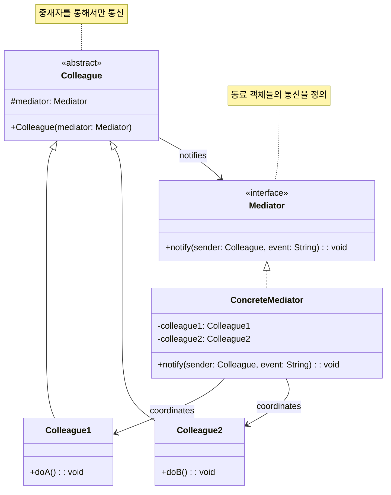
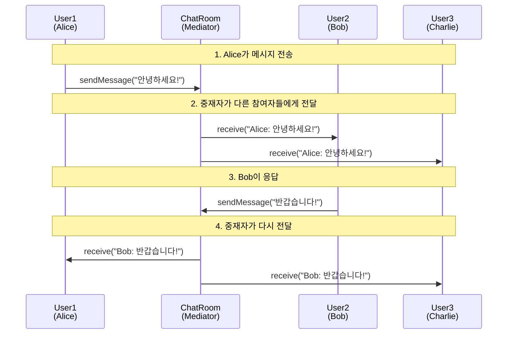

# 중재자 패턴 (Mediator Pattern)

## 정의

중재자 패턴은 객체들 간의 복잡한 통신과 제어를 캡슐화하여 객체들이 서로 직접 참조하지 않도록 하는 행동 디자인 패턴입니다. 객체 간 결합도를 낮추고 상호작용 로직을 중앙화합니다.

## 🎯 한눈에 보기

| 항목 | 설명 |
|------|------|
| **핵심** | 객체 간 직접 통신 대신 중재자를 통해 통신 |
| **비유** | 항공 관제탑이 비행기들 간 통신을 중재 |
| **언제** | 다수의 객체가 복잡하게 상호작용할 때 |
| **Spring** | `ApplicationEventPublisher`, MVC의 Controller |

> **💡 채팅방에서 메시지를 전송할 때...**
>
> **❌ Before (모든 참여자가 서로 직접 참조)**
> ```java
> class User {
>     List<User> contacts;  // ← 모든 사용자를 알아야 함
>     void sendMessage(String msg) {
>         for (User u : contacts) {
>             u.receive(msg);  // ← N:N 관계의 복잡성
>         }
>     }
> }
> ```
>
> **✅ After (중재자 패턴)**
> ```java
> class User {
>     ChatRoom chatRoom;  // ← 채팅방만 알면 됨
>     void sendMessage(String msg) {
>         chatRoom.broadcast(this, msg);  // ← 중재자가 전달
>     }
> }
> ```

## 구조 (Structure)



## 동작 흐름 (시퀀스 다이어그램)



## 사용 이유

- **결합도 감소**: 객체들이 서로 직접 참조하지 않아 느슨한 결합 달성
- **통신 로직 중앙화**: 복잡한 통신 규칙이 중재자에 집중되어 관리 용이
- **재사용성 향상**: 개별 Colleague 클래스를 독립적으로 재사용 가능
- **협력 방식 변경 용이**: 통신 로직 변경 시 중재자만 수정하면 됨

## 적용 상황

중재자 패턴은 다음과 같은 상황에서 특히 유용합니다:

1. **UI 컴포넌트**: 폼 요소들(버튼, 텍스트필드, 체크박스) 간 상호작용
2. **채팅 시스템**: 다수의 사용자가 메시지를 주고받는 채팅방
3. **항공 관제**: 여러 비행기들의 이착륙을 조율하는 관제탑
4. **게임 매칭**: 플레이어들을 매칭하고 게임 진행을 조율
5. **워크플로우 엔진**: 여러 단계/태스크 간 흐름 제어

## 🔰 5분 만에 이해하기 - 초급 예제

### 채팅방 시스템

```java
// 1. Mediator 인터페이스
interface ChatMediator {
    void sendMessage(String message, User sender);
    void addUser(User user);
}

// 2. ConcreteMediator - 채팅방
class ChatRoom implements ChatMediator {
    private List<User> users = new ArrayList<>();

    @Override
    public void addUser(User user) {
        users.add(user);
        System.out.println(user.getName() + "님이 입장했습니다.");
    }

    @Override
    public void sendMessage(String message, User sender) {
        for (User user : users) {
            // 발신자 제외하고 모든 사용자에게 전송
            if (user != sender) {
                user.receive(sender.getName() + ": " + message);
            }
        }
    }
}

// 3. Colleague - 사용자
class User {
    private String name;
    private ChatMediator mediator;

    public User(String name, ChatMediator mediator) {
        this.name = name;
        this.mediator = mediator;
    }

    public String getName() {
        return name;
    }

    // 메시지 전송 - 중재자를 통해!
    public void send(String message) {
        System.out.println(name + " (발신): " + message);
        mediator.sendMessage(message, this);
    }

    // 메시지 수신
    public void receive(String message) {
        System.out.println(name + " (수신): " + message);
    }
}

// 4. 사용 예시
public class MediatorDemo {
    public static void main(String[] args) {
        // 채팅방 생성
        ChatMediator chatRoom = new ChatRoom();

        // 사용자 생성 및 입장
        User alice = new User("Alice", chatRoom);
        User bob = new User("Bob", chatRoom);
        User charlie = new User("Charlie", chatRoom);

        chatRoom.addUser(alice);
        chatRoom.addUser(bob);
        chatRoom.addUser(charlie);

        System.out.println("\n--- 대화 시작 ---\n");

        // Alice가 메시지 전송
        alice.send("안녕하세요!");

        System.out.println();

        // Bob이 응답
        bob.send("반갑습니다!");
    }
}
```

**실행 결과:**
```
Alice님이 입장했습니다.
Bob님이 입장했습니다.
Charlie님이 입장했습니다.

--- 대화 시작 ---

Alice (발신): 안녕하세요!
Bob (수신): Alice: 안녕하세요!
Charlie (수신): Alice: 안녕하세요!

Bob (발신): 반갑습니다!
Alice (수신): Bob: 반갑습니다!
Charlie (수신): Bob: 반갑습니다!
```

## Spring Boot 예제

### 1. ApplicationEventPublisher 활용 (Spring의 Mediator)

```java
// 1. 이벤트 정의
public class OrderCreatedEvent {
    private final String orderId;
    private final String customerId;
    private final BigDecimal amount;

    public OrderCreatedEvent(String orderId, String customerId, BigDecimal amount) {
        this.orderId = orderId;
        this.customerId = customerId;
        this.amount = amount;
    }

    // getters...
}

public class PaymentCompletedEvent {
    private final String orderId;
    private final String paymentId;

    public PaymentCompletedEvent(String orderId, String paymentId) {
        this.orderId = orderId;
        this.paymentId = paymentId;
    }

    // getters...
}

// 2. 주문 서비스 - 이벤트 발행자 (Colleague)
@Service
public class OrderService {
    private final ApplicationEventPublisher eventPublisher;

    public OrderService(ApplicationEventPublisher eventPublisher) {
        this.eventPublisher = eventPublisher;
    }

    public void createOrder(String customerId, BigDecimal amount) {
        String orderId = UUID.randomUUID().toString();

        // 주문 저장 로직...
        System.out.println("주문 생성: " + orderId);

        // 중재자(Spring)를 통해 이벤트 발행
        eventPublisher.publishEvent(
            new OrderCreatedEvent(orderId, customerId, amount)
        );
    }
}

// 3. 재고 서비스 - 이벤트 리스너 (Colleague)
@Service
public class InventoryService {

    @EventListener
    public void handleOrderCreated(OrderCreatedEvent event) {
        System.out.println("재고 서비스: 주문 " + event.getOrderId() + " 재고 확인 중...");
        // 재고 차감 로직...
    }
}

// 4. 알림 서비스 - 이벤트 리스너 (Colleague)
@Service
public class NotificationService {

    @EventListener
    public void handleOrderCreated(OrderCreatedEvent event) {
        System.out.println("알림 서비스: 고객 " + event.getCustomerId() + "에게 주문 확인 메일 발송");
        // 이메일 발송 로직...
    }

    @EventListener
    public void handlePaymentCompleted(PaymentCompletedEvent event) {
        System.out.println("알림 서비스: 결제 완료 알림 발송");
        // SMS 발송 로직...
    }
}

// 5. 결제 서비스 - 이벤트 리스너 & 발행자 (Colleague)
@Service
public class PaymentService {
    private final ApplicationEventPublisher eventPublisher;

    public PaymentService(ApplicationEventPublisher eventPublisher) {
        this.eventPublisher = eventPublisher;
    }

    @EventListener
    public void handleOrderCreated(OrderCreatedEvent event) {
        System.out.println("결제 서비스: 주문 " + event.getOrderId() + " 결제 처리 중...");

        // 결제 처리 로직...
        String paymentId = UUID.randomUUID().toString();

        // 결제 완료 이벤트 발행
        eventPublisher.publishEvent(
            new PaymentCompletedEvent(event.getOrderId(), paymentId)
        );
    }
}
```

### 2. 커스텀 중재자 구현 - UI 폼 검증

```java
// 1. 중재자 인터페이스
public interface FormMediator {
    void notify(FormComponent sender, String event);
}

// 2. 폼 컴포넌트 기본 클래스
public abstract class FormComponent {
    protected FormMediator mediator;

    public void setMediator(FormMediator mediator) {
        this.mediator = mediator;
    }
}

// 3. 구체적 컴포넌트들
@Component
@Scope("prototype")
public class EmailField extends FormComponent {
    private String value = "";
    private boolean valid = false;

    public void setValue(String value) {
        this.value = value;
        this.valid = value.contains("@");
        mediator.notify(this, "emailChanged");
    }

    public boolean isValid() { return valid; }
    public String getValue() { return value; }
}

@Component
@Scope("prototype")
public class PasswordField extends FormComponent {
    private String value = "";
    private boolean valid = false;

    public void setValue(String value) {
        this.value = value;
        this.valid = value.length() >= 8;
        mediator.notify(this, "passwordChanged");
    }

    public boolean isValid() { return valid; }
}

@Component
@Scope("prototype")
public class SubmitButton extends FormComponent {
    private boolean enabled = false;

    public void setEnabled(boolean enabled) {
        this.enabled = enabled;
        System.out.println("제출 버튼: " + (enabled ? "활성화" : "비활성화"));
    }

    public boolean isEnabled() { return enabled; }

    public void click() {
        if (enabled) {
            mediator.notify(this, "submit");
        }
    }
}

// 4. 구체적 중재자 - 로그인 폼
@Component
public class LoginFormMediator implements FormMediator {
    private EmailField emailField;
    private PasswordField passwordField;
    private SubmitButton submitButton;

    @Autowired
    public void setComponents(EmailField email, PasswordField password, SubmitButton submit) {
        this.emailField = email;
        this.passwordField = password;
        this.submitButton = submit;

        email.setMediator(this);
        password.setMediator(this);
        submit.setMediator(this);
    }

    @Override
    public void notify(FormComponent sender, String event) {
        switch (event) {
            case "emailChanged":
            case "passwordChanged":
                // 모든 필드가 유효하면 버튼 활성화
                boolean allValid = emailField.isValid() && passwordField.isValid();
                submitButton.setEnabled(allValid);
                break;

            case "submit":
                System.out.println("폼 제출: " + emailField.getValue());
                // 제출 로직...
                break;
        }
    }
}

// 5. 사용 예시
@RestController
@RequestMapping("/api/form")
public class FormController {
    private final LoginFormMediator mediator;
    private final EmailField emailField;
    private final PasswordField passwordField;
    private final SubmitButton submitButton;

    @PostMapping("/email")
    public void setEmail(@RequestParam String email) {
        emailField.setValue(email);
    }

    @PostMapping("/password")
    public void setPassword(@RequestParam String password) {
        passwordField.setValue(password);
    }

    @PostMapping("/submit")
    public ResponseEntity<String> submit() {
        if (submitButton.isEnabled()) {
            submitButton.click();
            return ResponseEntity.ok("제출 완료");
        }
        return ResponseEntity.badRequest().body("폼이 유효하지 않습니다");
    }
}
```

## 장단점

### 장점 ✅

| 장점 | 설명 |
|------|------|
| **느슨한 결합** | 동료 객체들이 서로 직접 참조하지 않음 |
| **단일 책임 원칙** | 통신 로직이 중재자에 집중됨 |
| **재사용성** | 동료 클래스를 다른 중재자와 함께 재사용 가능 |
| **확장 용이** | 새 동료 추가 시 중재자만 수정 |

### 단점 ❌

| 단점 | 설명 |
|------|------|
| **God Object 위험** | 중재자가 너무 많은 로직을 가질 수 있음 |
| **복잡성 증가** | 단순한 경우 오버엔지니어링 |
| **단일 실패점** | 중재자에 문제 발생 시 전체 영향 |
| **디버깅 어려움** | 간접 통신으로 흐름 추적이 복잡해질 수 있음 |

## ❌ 언제 사용하지 말 것

- **객체 간 상호작용이 단순할 때**: 2-3개 객체의 단순 통신에는 오버엔지니어링
- **통신 로직이 자주 변경되지 않을 때**: 직접 통신이 더 효율적
- **성능이 중요할 때**: 간접 호출로 인한 오버헤드 발생
- **중재자가 God Object가 될 때**: 이 경우 여러 중재자로 분리 필요

## 관련 패턴

| 패턴 | 관계 |
|------|------|
| **Observer** | Mediator는 동료들 간 통신을 위해 Observer 사용 가능 |
| **Facade** | 둘 다 복잡성을 숨기지만, Facade는 단방향, Mediator는 양방향 |
| **Command** | Mediator가 처리할 요청을 Command로 캡슐화 가능 |
| **Chain of Responsibility** | 요청을 처리자 체인으로 전달하는 대안적 접근 |

## Observer vs Mediator

| 관점 | Observer | Mediator |
|------|----------|----------|
| **통신 방향** | 1:N (발행-구독) | N:N (양방향) |
| **결합도** | 발행자가 구독자를 모름 | 중재자가 모든 동료를 앎 |
| **로직 위치** | 구독자에 분산 | 중재자에 집중 |
| **적합한 경우** | 이벤트 브로드캐스트 | 복잡한 상호작용 제어 |

## Spring의 ApplicationEventPublisher

Spring의 `ApplicationEventPublisher`는 Mediator 패턴의 구현입니다:

```java
// 발행자는 구독자를 모름
eventPublisher.publishEvent(event);

// Spring(중재자)이 적절한 리스너에게 전달
@EventListener
public void handleEvent(MyEvent event) { ... }
```

이를 통해 서비스 간 느슨한 결합을 유지하면서 이벤트 기반 통신이 가능합니다.
