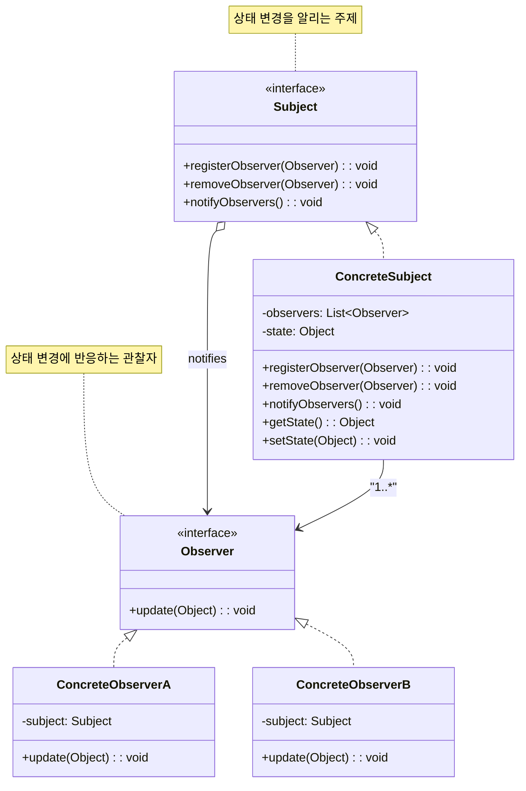

# 옵저버 패턴 (Observer Pattern)

## 정의

옵저버 패턴은 한 객체(주제, Subject)의 상태가 변경되면 그 객체에 의존하는 다른 객체(옵저버, Observer)들에게 자동으로 알림을 보내고 업데이트하는 행동 디자인 패턴입니다. 이는 일대다(one-to-many)의 의존 관계를 정의합니다.

## 구조 (Structure)



## 사용 이유

- **느슨한 결합**: 주제(Subject)와 옵저버(Observer)는 서로의 구체적인 구현을 알 필요 없이, 추상적인 인터페이스를 통해 상호작용합니다. 이로 인해 두 컴포넌트 간의 결합도가 낮아집니다.
- **동적 관계**: 런타임에 동적으로 옵저버를 추가하거나 제거할 수 있어 유연한 관계 설정이 가능합니다.
- **이벤트 기반 시스템**: GUI 이벤트 처리, 뉴스 구독 시스템, 주식 가격 변동 알림 등 상태 변화에 따라 여러 객체에 변경 사항을 전파해야 하는 경우에 널리 사용됩니다.

## 적용 상황

옵저버 패턴은 다음과 같은 상황에서 특히 유용합니다:

### 1. 실시간 데이터 모니터링
- **주식 거래 시스템**: 주식 가격 변동을 여러 화면에 실시간 업데이트
- **IoT 센서 데이터**: 온도, 습도 센서 데이터를 여러 대시보드에 전파
- **게임 점수 시스템**: 점수 변화를 순위표, UI, 업적 시스템에 알림

### 2. 이벤트 기반 시스템
- **GUI 이벤트**: 버튼 클릭, 텍스트 변경 등의 이벤트 처리
- **알림 시스템**: 이메일, SMS, 푸시 알림 등 다중 채널 알림
- **로그 시스템**: 하나의 이벤트를 여러 로그 파일에 기록

### 3. 상태 변화 전파가 필요한 경우
```java
// 나쁜 예: 직접 결합으로 확장성 부족
class UserService {
    public void updateUser(User user) {
        // 사용자 정보 업데이트
        emailService.sendEmail(user); // 직접 호출
        smsService.sendSMS(user);     // 직접 호출
        // 새로운 알림 방식 추가 시 코드 수정 필요!
    }
}

// 좋은 예: 옵저버 패턴으로 확장성 확보
class UserService extends Subject {
    public void updateUser(User user) {
        // 사용자 정보 업데이트
        notifyObservers(user); // 모든 등록된 옵저버에게 알림
    }
}
```

## 실생활 예제 - 주식 가격 모니터링 시스템

실시간 주식 가격 변화를 여러 화면과 시스템에 전파하는 시스템을 옵저버 패턴으로 구현해보겠습니다.

```java
import java.util.*;
import java.text.DecimalFormat;
import java.time.LocalDateTime;
import java.time.format.DateTimeFormatter;

// 주식 데이터 클래스
class StockData {
    private String symbol;
    private double price;
    private double previousPrice;
    private int volume;
    private LocalDateTime timestamp;

    public StockData(String symbol, double price, double previousPrice, int volume) {
        this.symbol = symbol;
        this.price = price;
        this.previousPrice = previousPrice;
        this.volume = volume;
        this.timestamp = LocalDateTime.now();
    }

    public double getChangePercent() {
        if (previousPrice == 0) return 0;
        return ((price - previousPrice) / previousPrice) * 100;
    }

    public double getChangeAmount() {
        return price - previousPrice;
    }

    public boolean isIncrease() {
        return price > previousPrice;
    }

    // getter 메서드들
    public String getSymbol() { return symbol; }
    public double getPrice() { return price; }
    public double getPreviousPrice() { return previousPrice; }
    public int getVolume() { return volume; }
    public LocalDateTime getTimestamp() { return timestamp; }

    @Override
    public String toString() {
        DecimalFormat df = new DecimalFormat("#,##0.00");
        String changeStr = String.format("%s%.2f (%.2f%%)",
            isIncrease() ? "+" : "", getChangeAmount(), getChangePercent());
        return String.format("%s: $%s %s", symbol, df.format(price), changeStr);
    }
}

// 주식 옵저버 인터페이스
interface StockObserver {
    void onStockUpdate(StockData stockData);
    String getObserverName();
}

// 주식 주제 인터페이스
interface StockSubject {
    void registerObserver(StockObserver observer);
    void removeObserver(StockObserver observer);
    void notifyObservers(StockData stockData);
}

// 주식 가격 서비스 (ConcreteSubject)
class StockPriceService implements StockSubject {
    private List<StockObserver> observers;
    private Map<String, StockData> stocks;

    public StockPriceService() {
        this.observers = new ArrayList<>();
        this.stocks = new HashMap<>();
    }

    @Override
    public void registerObserver(StockObserver observer) {
        observers.add(observer);
        System.out.println("✅ " + observer.getObserverName() + " 등록됨");
    }

    @Override
    public void removeObserver(StockObserver observer) {
        observers.remove(observer);
        System.out.println("❌ " + observer.getObserverName() + " 제거됨");
    }

    @Override
    public void notifyObservers(StockData stockData) {
        System.out.println("\n📢 주식 가격 변동 알림: " + stockData);
        for (StockObserver observer : observers) {
            observer.onStockUpdate(stockData);
        }
    }

    public void updateStockPrice(String symbol, double newPrice, int volume) {
        StockData previousData = stocks.get(symbol);
        double previousPrice = previousData != null ? previousData.getPrice() : newPrice;

        StockData newData = new StockData(symbol, newPrice, previousPrice, volume);
        stocks.put(symbol, newData);

        notifyObservers(newData);
    }

    public StockData getStockData(String symbol) {
        return stocks.get(symbol);
    }

    public Set<String> getAllSymbols() {
        return stocks.keySet();
    }
}

// 트레이딩 대시보드 (ConcreteObserver)
class TradingDashboard implements StockObserver {
    private String name;
    private Map<String, StockData> watchList;

    public TradingDashboard(String name) {
        this.name = name;
        this.watchList = new HashMap<>();
    }

    @Override
    public void onStockUpdate(StockData stockData) {
        watchList.put(stockData.getSymbol(), stockData);

        String trendIcon = stockData.isIncrease() ? "📈" : "📉";
        String timeStr = stockData.getTimestamp().format(DateTimeFormatter.ofPattern("HH:mm:ss"));

        System.out.println(String.format("[%s] %s %s %s (거래량: %,d)",
            name, trendIcon, stockData, timeStr, stockData.getVolume()));
    }

    @Override
    public String getObserverName() {
        return "Trading Dashboard (" + name + ")";
    }

    public void displayWatchList() {
        System.out.println("\n=== " + name + " 관심종목 ===");
        if (watchList.isEmpty()) {
            System.out.println("관심종목이 없습니다.");
            return;
        }

        for (StockData stock : watchList.values()) {
            String trendIcon = stock.isIncrease() ? "📈" : "📉";
            System.out.println(trendIcon + " " + stock);
        }
    }
}

// 알림 서비스 (ConcreteObserver)
class AlertService implements StockObserver {
    private Map<String, Double> alertThresholds;

    public AlertService() {
        this.alertThresholds = new HashMap<>();
    }

    @Override
    public void onStockUpdate(StockData stockData) {
        Double threshold = alertThresholds.get(stockData.getSymbol());
        if (threshold != null) {
            if (Math.abs(stockData.getChangePercent()) >= threshold) {
                sendAlert(stockData);
            }
        }
    }

    @Override
    public String getObserverName() {
        return "Alert Service";
    }

    public void setAlertThreshold(String symbol, double threshold) {
        alertThresholds.put(symbol, threshold);
        System.out.println("🚨 " + symbol + " 알림 임계값 설정: ±" + threshold + "%");
    }

    private void sendAlert(StockData stockData) {
        String alertType = stockData.isIncrease() ? "급등" : "급락";
        System.out.println(String.format("🚨 [긴급알림] %s %s! %.2f%% 변동",
            stockData.getSymbol(), alertType, Math.abs(stockData.getChangePercent())));
    }
}

// 포트폴리오 매니저 (ConcreteObserver)
class PortfolioManager implements StockObserver {
    private String managerName;
    private Map<String, Integer> holdings; // 종목별 보유량
    private double totalValue;

    public PortfolioManager(String managerName) {
        this.managerName = managerName;
        this.holdings = new HashMap<>();
        this.totalValue = 0.0;
    }

    @Override
    public void onStockUpdate(StockData stockData) {
        Integer shares = holdings.get(stockData.getSymbol());
        if (shares != null && shares > 0) {
            double stockValue = stockData.getPrice() * shares;
            double changeValue = stockData.getChangeAmount() * shares;

            System.out.println(String.format("[%s] %s 포지션 변동: $%,.2f (%s$%,.2f)",
                managerName, stockData.getSymbol(), stockValue,
                changeValue >= 0 ? "+" : "", changeValue));

            updateTotalValue();
        }
    }

    @Override
    public String getObserverName() {
        return "Portfolio Manager (" + managerName + ")";
    }

    public void addHolding(String symbol, int shares) {
        holdings.put(symbol, holdings.getOrDefault(symbol, 0) + shares);
        System.out.println(managerName + "가 " + symbol + " " + shares + "주 보유");
    }

    private void updateTotalValue() {
        // 실제로는 모든 보유 종목의 현재 가치를 계산
        totalValue += 1000; // 예시
    }

    public void displayPortfolio() {
        System.out.println("\n=== " + managerName + " 포트폴리오 ===");
        for (Map.Entry<String, Integer> entry : holdings.entrySet()) {
            System.out.println(entry.getKey() + ": " + entry.getValue() + "주 보유");
        }
    }
}

// 시장 데이터 분석기 (ConcreteObserver)
class MarketAnalyzer implements StockObserver {
    private List<StockData> priceHistory;
    private int maxHistorySize;

    public MarketAnalyzer(int maxHistorySize) {
        this.priceHistory = new ArrayList<>();
        this.maxHistorySize = maxHistorySize;
    }

    @Override
    public void onStockUpdate(StockData stockData) {
        priceHistory.add(stockData);

        // 최대 크기 유지
        if (priceHistory.size() > maxHistorySize) {
            priceHistory.remove(0);
        }

        analyzeMarketTrend(stockData);
    }

    @Override
    public String getObserverName() {
        return "Market Analyzer";
    }

    private void analyzeMarketTrend(StockData stockData) {
        if (Math.abs(stockData.getChangePercent()) > 5.0) {
            String trend = stockData.isIncrease() ? "강세" : "약세";
            System.out.println(String.format("[분석] %s 시장 %s 신호 감지 (변동률: %.2f%%)",
                stockData.getSymbol(), trend, stockData.getChangePercent()));
        }
    }

    public void generateReport() {
        System.out.println("\n=== 시장 분석 리포트 ===");
        if (priceHistory.isEmpty()) {
            System.out.println("분석할 데이터가 없습니다.");
            return;
        }

        Map<String, List<StockData>> symbolData = new HashMap<>();
        for (StockData data : priceHistory) {
            symbolData.computeIfAbsent(data.getSymbol(), k -> new ArrayList<>()).add(data);
        }

        for (Map.Entry<String, List<StockData>> entry : symbolData.entrySet()) {
            String symbol = entry.getKey();
            List<StockData> data = entry.getValue();

            double avgChange = data.stream()
                .mapToDouble(StockData::getChangePercent)
                .average()
                .orElse(0.0);

            System.out.println(String.format("%s: 평균 변동률 %.2f%% (%d회 거래)",
                symbol, avgChange, data.size()));
        }
    }
}

// 주식 거래 시스템 데모
public class StockTradingSystemDemo {
    public static void main(String[] args) throws InterruptedException {
        // 1. 주식 가격 서비스 생성
        StockPriceService priceService = new StockPriceService();

        // 2. 옵저버들 생성
        TradingDashboard mainDashboard = new TradingDashboard("메인 대시보드");
        TradingDashboard mobileDashboard = new TradingDashboard("모바일 앱");
        AlertService alertService = new AlertService();
        PortfolioManager johnPortfolio = new PortfolioManager("John");
        PortfolioManager sarahPortfolio = new PortfolioManager("Sarah");
        MarketAnalyzer analyzer = new MarketAnalyzer(10);

        // 3. 옵저버 등록
        priceService.registerObserver(mainDashboard);
        priceService.registerObserver(mobileDashboard);
        priceService.registerObserver(alertService);
        priceService.registerObserver(johnPortfolio);
        priceService.registerObserver(sarahPortfolio);
        priceService.registerObserver(analyzer);

        // 4. 알림 임계값 및 포트폴리오 설정
        alertService.setAlertThreshold("AAPL", 3.0);
        alertService.setAlertThreshold("GOOGL", 2.5);

        johnPortfolio.addHolding("AAPL", 100);
        johnPortfolio.addHolding("GOOGL", 50);
        sarahPortfolio.addHolding("AAPL", 200);
        sarahPortfolio.addHolding("MSFT", 150);

        System.out.println("\n" + "=".repeat(60));
        System.out.println("📊 실시간 주식 거래 시스템 시작");
        System.out.println("=".repeat(60));

        // 5. 주식 가격 변동 시뮬레이션
        priceService.updateStockPrice("AAPL", 150.00, 1000000);
        Thread.sleep(1000);

        priceService.updateStockPrice("GOOGL", 2800.00, 500000);
        Thread.sleep(1000);

        priceService.updateStockPrice("MSFT", 300.00, 800000);
        Thread.sleep(1000);

        // 큰 변동으로 알림 트리거
        priceService.updateStockPrice("AAPL", 155.50, 1500000); // +3.67% 상승
        Thread.sleep(1000);

        priceService.updateStockPrice("GOOGL", 2730.00, 750000); // -2.5% 하락
        Thread.sleep(1000);

        priceService.updateStockPrice("AAPL", 148.25, 1200000); // -4.66% 하락
        Thread.sleep(1000);

        // 6. 대시보드 및 포트폴리오 상태 확인
        mainDashboard.displayWatchList();
        johnPortfolio.displayPortfolio();
        sarahPortfolio.displayPortfolio();
        analyzer.generateReport();

        // 7. 일부 옵저버 제거 테스트
        System.out.println("\n" + "=".repeat(40));
        System.out.println("모바일 앱 연결 해제");
        System.out.println("=".repeat(40));
        priceService.removeObserver(mobileDashboard);

        priceService.updateStockPrice("AAPL", 152.00, 900000);

        System.out.println("\n📈 주식 거래 시스템 종료");
    }
}
```

**실행 결과 예시:**
```
✅ Trading Dashboard (메인 대시보드) 등록됨
✅ Trading Dashboard (모바일 앱) 등록됨
✅ Alert Service 등록됨
✅ Portfolio Manager (John) 등록됨
✅ Portfolio Manager (Sarah) 등록됨
✅ Market Analyzer 등록됨
🚨 AAPL 알림 임계값 설정: ±3.0%
🚨 GOOGL 알림 임계값 설정: ±2.5%
John가 AAPL 100주 보유
John가 GOOGL 50주 보유
Sarah가 AAPL 200주 보유
Sarah가 MSFT 150주 보유

============================================================
📊 실시간 주식 거래 시스템 시작
============================================================

📢 주식 가격 변동 알림: AAPL: $150.00 +0.00 (0.00%)
[메인 대시보드] 📈 AAPL: $150.00 +0.00 (0.00%) 14:30:15 (거래량: 1,000,000)
[모바일 앱] 📈 AAPL: $150.00 +0.00 (0.00%) 14:30:15 (거래량: 1,000,000)
[John] AAPL 포지션 변동: $15,000.00 (+$0.00)
[Sarah] AAPL 포지션 변동: $30,000.00 (+$0.00)

📢 주식 가격 변동 알림: AAPL: $155.50 +5.50 (3.67%)
[메인 대시보드] 📈 AAPL: $155.50 +5.50 (3.67%) 14:30:18 (거래량: 1,500,000)
🚨 [긴급알림] AAPL 급등! 3.67% 변동
[John] AAPL 포지션 변동: $15,550.00 (+$550.00)
[Sarah] AAPL 포지션 변동: $31,100.00 (+$1,100.00)
[분석] AAPL 시장 강세 신호 감지 (변동률: 3.67%)
```

## Java의 내장 Observer 패턴

Java에서는 `java.util.Observable`과 `java.util.Observer`를 제공했지만, Java 9부터 deprecated되었습니다. 대신 더 현대적인 방식들을 사용합니다:

```java
// 1. PropertyChangeListener 사용
import java.beans.PropertyChangeListener;
import java.beans.PropertyChangeSupport;

class ModernSubject {
    private PropertyChangeSupport support;
    private String property;

    public ModernSubject() {
        support = new PropertyChangeSupport(this);
    }

    public void addPropertyChangeListener(PropertyChangeListener listener) {
        support.addPropertyChangeListener(listener);
    }

    public void removePropertyChangeListener(PropertyChangeListener listener) {
        support.removePropertyChangeListener(listener);
    }

    public void setProperty(String newProperty) {
        String oldProperty = this.property;
        this.property = newProperty;
        support.firePropertyChange("property", oldProperty, newProperty);
    }
}

// 2. CompletableFuture와 함께 사용
import java.util.concurrent.CompletableFuture;

class AsyncObserver {
    public CompletableFuture<Void> handleUpdate(String data) {
        return CompletableFuture.runAsync(() -> {
            // 비동기 처리
            System.out.println("비동기 처리: " + data);
        });
    }
}
```

## 기본 예제 코드 (Java)

```java
import java.util.ArrayList;
import java.util.List;

// Observer Interface
interface Observer {
    void update(String message);
}

// Subject Interface
interface Subject {
    void registerObserver(Observer observer);
    void removeObserver(Observer observer);
    void notifyObservers();
}

// ConcreteSubject: 상태를 가지고 있으며, 상태 변경 시 옵저버에게 알림
class NewsAgency implements Subject {
    private List<Observer> observers = new ArrayList<>();
    private String latestNews;

    public void setLatestNews(String news) {
        this.latestNews = news;
        notifyObservers(); // 상태 변경 시 모든 옵저버에게 알림
    }

    @Override
    public void registerObserver(Observer observer) {
        observers.add(observer);
    }

    @Override
    public void removeObserver(Observer observer) {
        observers.remove(observer);
    }

    @Override
    public void notifyObservers() {
        for (Observer observer : observers) {
            observer.update(latestNews);
        }
    }
}

// ConcreteObserver: Subject의 상태 변화를 감지하고 업데이트함
class NewsSubscriber implements Observer {
    private String name;

    public NewsSubscriber(String name) {
        this.name = name;
    }

    @Override
    public void update(String news) {
        System.out.println(name + " received news: " + news);
    }
}

// 사용 예시
public class Client {
    public static void main(String[] args) {
        NewsAgency newsAgency = new NewsAgency();

        Observer subscriber1 = new NewsSubscriber("Subscriber 1");
        Observer subscriber2 = new NewsSubscriber("Subscriber 2");

        // 옵저버 등록
        newsAgency.registerObserver(subscriber1);
        newsAgency.registerObserver(subscriber2);

        // 상태 변경 및 알림
        newsAgency.setLatestNews("Breaking news: A new design pattern has been discovered!");

        System.out.println();

        // 옵저버 제거
        newsAgency.removeObserver(subscriber1);

        newsAgency.setLatestNews("Another news: The old pattern is now deprecated.");
    }
}
```

## 장점

- **높은 유연성과 재사용성**: 주제와 옵저버가 느슨하게 결합되어 있어 독립적으로 재사용하고 수정할 수 있습니다.
- **개방-폐쇄 원칙(OCP)**: 새로운 옵저버 유형을 추가할 때 기존 주제 코드를 수정할 필요가 없습니다.
- **런타임 관계 설정**: 애플리케이션 실행 중에 새로운 옵저버를 동적으로 추가하거나 제거할 수 있습니다.
- **브로드캐스팅**: 하나의 이벤트로 여러 객체에게 동시에 알림을 보낼 수 있습니다.

## 단점

- **예상치 못한 업데이트**: 옵저버가 많아지면 상태 변경 시 어떤 순서로 알림이 가는지 제어하기 어렵고, 변경 사항 전파가 복잡해질 수 있습니다.
- **메모리 누수**: 옵저버가 명시적으로 등록 해제되지 않으면, 주제 객체가 메모리에서 해제되지 않아 메모리 누수가 발생할 수 있습니다.
- **성능 문제**: 너무 많은 옵저버가 등록되어 있거나 업데이트 로직이 복잡한 경우, 알림을 보내는 과정에서 성능 저하가 발생할 수 있습니다.
- **순환 의존성**: 옵저버와 주제 간에 복잡한 상호작용이 있을 때 무한 루프가 발생할 수 있습니다.