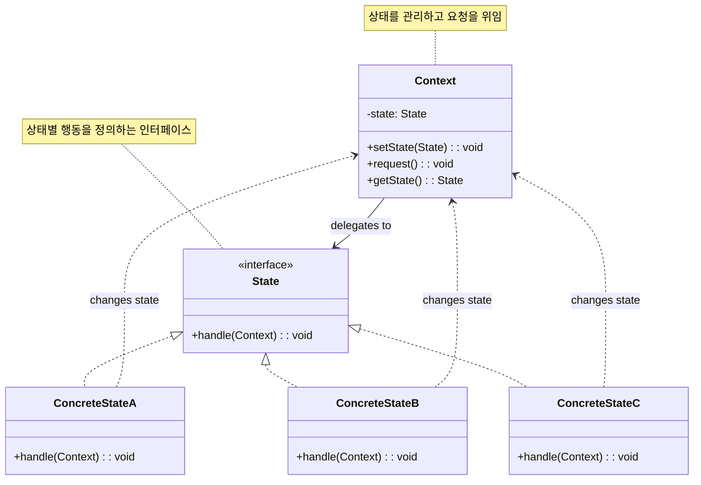

# 상태 패턴 (State Pattern)

## 정의

상태 패턴은 객체의 내부 상태가 변경될 때 객체의 행동이 변하도록 허용하는 행동 디자인 패턴입니다. 객체가 마치 자신의 클래스를 바꾼 것처럼 보이게 합니다.

## 구조 (Structure)



## 사용 이유

- **상태별 행동 분리**: 각 상태에 따른 행동을 별도의 클래스로 분리하여 관리합니다.
- **복잡한 조건문 제거**: 상태에 따른 복잡한 if-else 문을 제거하고 객체지향적으로 해결합니다.
- **상태 전이 관리**: 상태 간의 전이 로직을 명확하게 관리할 수 있습니다.
- **새로운 상태 추가 용이**: 새로운 상태가 필요할 때 기존 코드 수정 없이 추가할 수 있습니다.

## 적용 상황

상태 패턴은 다음과 같은 상황에서 특히 유용합니다:

### 1. 상태 기반 시스템
- **게임 캐릭터**: 대기, 이동, 공격, 방어 등의 상태
- **주문 시스템**: 주문접수, 결제대기, 배송중, 완료 등의 상태
- **미디어 플레이어**: 정지, 재생, 일시정지, 빨리감기 등의 상태

### 2. 복잡한 상태 전이가 있는 경우
```java
// 나쁜 예: 복잡한 조건문
class MediaPlayer {
    private String state = "STOPPED";

    public void play() {
        if (state.equals("STOPPED")) {
            // 재생 로직
            state = "PLAYING";
        } else if (state.equals("PAUSED")) {
            // 재생 재개 로직
            state = "PLAYING";
        } else if (state.equals("PLAYING")) {
            // 아무것도 하지 않음
        }
    }

    public void pause() {
        if (state.equals("PLAYING")) {
            // 일시정지 로직
            state = "PAUSED";
        } else {
            // 오류 처리
        }
    }
}

// 좋은 예: 상태 패턴 사용
interface PlayerState {
    void play(MediaPlayer player);
    void pause(MediaPlayer player);
    void stop(MediaPlayer player);
}

class MediaPlayer {
    private PlayerState state;

    public void play() {
        state.play(this);
    }

    public void pause() {
        state.pause(this);
    }
}
```

### 3. 상태 기계(State Machine)가 필요한 경우
- **네트워크 연결**: 연결대기, 연결됨, 연결해제 등
- **문서 워크플로우**: 작성중, 검토중, 승인됨, 반려됨 등
- **게임 레벨**: 로딩, 플레이중, 일시정지, 게임오버 등

## 실생활 예제 - 스마트 자동판매기 시스템

다양한 상태를 가지는 스마트 자동판매기 시스템을 상태 패턴으로 구현해보겠습니다.

```java
import java.util.*;

// 상품 클래스
class Product {
    private String name;
    private int price;
    private int stock;

    public Product(String name, int price, int stock) {
        this.name = name;
        this.price = price;
        this.stock = stock;
    }

    public boolean isAvailable() {
        return stock > 0;
    }

    public void decreaseStock() {
        if (stock > 0) {
            stock--;
        }
    }

    // getter 메서드들
    public String getName() { return name; }
    public int getPrice() { return price; }
    public int getStock() { return stock; }

    @Override
    public String toString() {
        return String.format("%s - %d원 (재고: %d개)", name, price, stock);
    }
}

// 자동판매기 상태 인터페이스
interface VendingMachineState {
    void insertCoin(VendingMachine machine, int amount);
    void selectProduct(VendingMachine machine, int productId);
    void dispenserProduct(VendingMachine machine);
    void refund(VendingMachine machine);
    void restockProducts(VendingMachine machine);
    void turnOff(VendingMachine machine);
    String getStateName();
    String getStateDescription();
}

// 자동판매기 컨텍스트 클래스
class VendingMachine {
    private VendingMachineState currentState;
    private Map<Integer, Product> products;
    private int insertedAmount;
    private Product selectedProduct;
    private List<String> transactionLog;
    private boolean maintenanceMode;

    // 상태 인스턴스들
    private VendingMachineState readyState;
    private VendingMachineState coinInsertedState;
    private VendingMachineState productSelectedState;
    private VendingMachineState dispensingState;
    private VendingMachineState maintenanceState;
    private VendingMachineState outOfOrderState;

    public VendingMachine() {
        // 상태 인스턴스 생성
        readyState = new ReadyState();
        coinInsertedState = new CoinInsertedState();
        productSelectedState = new ProductSelectedState();
        dispensingState = new DispensingState();
        maintenanceState = new MaintenanceState();
        outOfOrderState = new OutOfOrderState();

        // 초기 설정
        currentState = readyState;
        products = new HashMap<>();
        insertedAmount = 0;
        selectedProduct = null;
        transactionLog = new ArrayList<>();
        maintenanceMode = false;

        initializeProducts();
    }

    private void initializeProducts() {
        products.put(1, new Product("콜라", 1000, 10));
        products.put(2, new Product("사이다", 1000, 8));
        products.put(3, new Product("커피", 1500, 12));
        products.put(4, new Product("물", 500, 20));
        products.put(5, new Product("주스", 1200, 5));
    }

    // 상태 전이 메서드들
    public void setState(VendingMachineState state) {
        System.out.println("상태 변경: " + currentState.getStateName() + " → " + state.getStateName());
        this.currentState = state;
        logTransaction("상태 변경: " + state.getStateName());
    }

    // 외부 인터페이스 메서드들
    public void insertCoin(int amount) {
        System.out.println("\n💰 " + amount + "원 투입");
        currentState.insertCoin(this, amount);
    }

    public void selectProduct(int productId) {
        System.out.println("\n🥤 상품 " + productId + "번 선택");
        currentState.selectProduct(this, productId);
    }

    public void dispenserProduct() {
        System.out.println("\n📦 상품 배출 요청");
        currentState.dispenserProduct(this);
    }

    public void refund() {
        System.out.println("\n↩️ 환불 요청");
        currentState.refund(this);
    }

    public void restockProducts() {
        System.out.println("\n📦 상품 보충 요청");
        currentState.restockProducts(this);
    }

    public void turnOff() {
        System.out.println("\n🔌 기계 종료 요청");
        currentState.turnOff(this);
    }

    // 내부 로직 메서드들
    public void addAmount(int amount) {
        insertedAmount += amount;
        System.out.println("투입 금액: " + insertedAmount + "원");
    }

    public void returnChange() {
        if (insertedAmount > 0) {
            System.out.println("💸 거스름돈 반환: " + insertedAmount + "원");
            insertedAmount = 0;
        }
    }

    public void processPayment() {
        if (selectedProduct != null) {
            int change = insertedAmount - selectedProduct.getPrice();
            if (change > 0) {
                System.out.println("💸 거스름돈: " + change + "원");
            }
            insertedAmount = 0;
        }
    }

    public void dispenseSelectedProduct() {
        if (selectedProduct != null && selectedProduct.isAvailable()) {
            selectedProduct.decreaseStock();
            System.out.println("✅ " + selectedProduct.getName() + " 배출 완료!");
            logTransaction("상품 배출: " + selectedProduct.getName());
            selectedProduct = null;
        }
    }

    public void restockAllProducts() {
        for (Product product : products.values()) {
            // 재고를 초기값으로 복구 (실제로는 각 상품별로 다르게 보충)
            if (product.getName().equals("콜라")) product = new Product("콜라", 1000, 10);
            else if (product.getName().equals("사이다")) product = new Product("사이다", 1000, 8);
            // ... 기타 상품들
        }
        System.out.println("📦 모든 상품 재고 보충 완료");
        logTransaction("상품 재고 보충");
    }

    private void logTransaction(String action) {
        String timestamp = java.time.LocalDateTime.now().format(
            java.time.format.DateTimeFormatter.ofPattern("HH:mm:ss"));
        transactionLog.add("[" + timestamp + "] " + action);
    }

    // 상태 및 정보 조회 메서드들
    public void displayStatus() {
        System.out.println("\n📊 자동판매기 상태");
        System.out.println("=".repeat(40));
        System.out.println("현재 상태: " + currentState.getStateName());
        System.out.println("상태 설명: " + currentState.getStateDescription());
        System.out.println("투입 금액: " + insertedAmount + "원");

        if (selectedProduct != null) {
            System.out.println("선택 상품: " + selectedProduct);
        }

        System.out.println("\n📦 상품 목록:");
        for (Map.Entry<Integer, Product> entry : products.entrySet()) {
            String availability = entry.getValue().isAvailable() ? "✅" : "❌ (품절)";
            System.out.println(entry.getKey() + ". " + entry.getValue() + " " + availability);
        }
    }

    public void displayTransactionLog() {
        System.out.println("\n📜 거래 기록 (최근 10건)");
        System.out.println("=".repeat(40));
        int start = Math.max(0, transactionLog.size() - 10);
        for (int i = start; i < transactionLog.size(); i++) {
            System.out.println(transactionLog.get(i));
        }
    }

    // Getter 메서드들
    public Map<Integer, Product> getProducts() { return products; }
    public int getInsertedAmount() { return insertedAmount; }
    public Product getSelectedProduct() { return selectedProduct; }
    public void setSelectedProduct(Product product) { this.selectedProduct = product; }
    public boolean isMaintenanceMode() { return maintenanceMode; }
    public void setMaintenanceMode(boolean mode) { this.maintenanceMode = mode; }

    // 상태 객체 getter들
    public VendingMachineState getReadyState() { return readyState; }
    public VendingMachineState getCoinInsertedState() { return coinInsertedState; }
    public VendingMachineState getProductSelectedState() { return productSelectedState; }
    public VendingMachineState getDispensingState() { return dispensingState; }
    public VendingMachineState getMaintenanceState() { return maintenanceState; }
    public VendingMachineState getOutOfOrderState() { return outOfOrderState; }
}

// 구체적인 상태 클래스들

// 1. 대기 상태
class ReadyState implements VendingMachineState {
    @Override
    public void insertCoin(VendingMachine machine, int amount) {
        if (amount > 0) {
            machine.addAmount(amount);
            machine.setState(machine.getCoinInsertedState());
        } else {
            System.out.println("❌ 유효하지 않은 금액입니다.");
        }
    }

    @Override
    public void selectProduct(VendingMachine machine, int productId) {
        System.out.println("❌ 먼저 동전을 투입해주세요.");
    }

    @Override
    public void dispenserProduct(VendingMachine machine) {
        System.out.println("❌ 상품을 선택하고 결제를 완료해주세요.");
    }

    @Override
    public void refund(VendingMachine machine) {
        System.out.println("❌ 환불할 금액이 없습니다.");
    }

    @Override
    public void restockProducts(VendingMachine machine) {
        machine.setMaintenanceMode(true);
        machine.setState(machine.getMaintenanceState());
        machine.restockAllProducts();
    }

    @Override
    public void turnOff(VendingMachine machine) {
        machine.setState(machine.getOutOfOrderState());
        System.out.println("🔌 자동판매기가 종료되었습니다.");
    }

    @Override
    public String getStateName() {
        return "대기 중";
    }

    @Override
    public String getStateDescription() {
        return "동전을 투입해주세요";
    }
}

// 2. 동전 투입 상태
class CoinInsertedState implements VendingMachineState {
    @Override
    public void insertCoin(VendingMachine machine, int amount) {
        if (amount > 0) {
            machine.addAmount(amount);
            System.out.println("💰 추가 금액이 투입되었습니다.");
        } else {
            System.out.println("❌ 유효하지 않은 금액입니다.");
        }
    }

    @Override
    public void selectProduct(VendingMachine machine, int productId) {
        Product product = machine.getProducts().get(productId);

        if (product == null) {
            System.out.println("❌ 존재하지 않는 상품번호입니다.");
            return;
        }

        if (!product.isAvailable()) {
            System.out.println("❌ 선택한 상품이 품절되었습니다.");
            return;
        }

        if (machine.getInsertedAmount() < product.getPrice()) {
            int needed = product.getPrice() - machine.getInsertedAmount();
            System.out.println("❌ 금액이 부족합니다. " + needed + "원이 더 필요합니다.");
            return;
        }

        machine.setSelectedProduct(product);
        System.out.println("✅ " + product.getName() + " 선택됨 (가격: " + product.getPrice() + "원)");
        machine.setState(machine.getProductSelectedState());
    }

    @Override
    public void dispenserProduct(VendingMachine machine) {
        System.out.println("❌ 먼저 상품을 선택해주세요.");
    }

    @Override
    public void refund(VendingMachine machine) {
        machine.returnChange();
        machine.setState(machine.getReadyState());
    }

    @Override
    public void restockProducts(VendingMachine machine) {
        System.out.println("❌ 투입된 금액이 있어 재고 보충을 할 수 없습니다. 먼저 환불해주세요.");
    }

    @Override
    public void turnOff(VendingMachine machine) {
        System.out.println("❌ 투입된 금액이 있어 종료할 수 없습니다. 먼저 환불해주세요.");
    }

    @Override
    public String getStateName() {
        return "동전 투입됨";
    }

    @Override
    public String getStateDescription() {
        return "상품을 선택해주세요";
    }
}

// 3. 상품 선택 상태
class ProductSelectedState implements VendingMachineState {
    @Override
    public void insertCoin(VendingMachine machine, int amount) {
        System.out.println("ℹ️ 이미 충분한 금액이 투입되었습니다. 상품을 배출하거나 환불해주세요.");
    }

    @Override
    public void selectProduct(VendingMachine machine, int productId) {
        Product newProduct = machine.getProducts().get(productId);

        if (newProduct == null) {
            System.out.println("❌ 존재하지 않는 상품번호입니다.");
            return;
        }

        if (!newProduct.isAvailable()) {
            System.out.println("❌ 선택한 상품이 품절되었습니다.");
            return;
        }

        if (machine.getInsertedAmount() < newProduct.getPrice()) {
            System.out.println("❌ 금액이 부족합니다.");
            return;
        }

        machine.setSelectedProduct(newProduct);
        System.out.println("🔄 상품 변경: " + newProduct.getName());
    }

    @Override
    public void dispenserProduct(VendingMachine machine) {
        machine.setState(machine.getDispensingState());
        machine.processPayment();
        machine.dispenseSelectedProduct();
        machine.setState(machine.getReadyState());
    }

    @Override
    public void refund(VendingMachine machine) {
        machine.returnChange();
        machine.setSelectedProduct(null);
        machine.setState(machine.getReadyState());
    }

    @Override
    public void restockProducts(VendingMachine machine) {
        System.out.println("❌ 거래 진행 중이라 재고 보충을 할 수 없습니다.");
    }

    @Override
    public void turnOff(VendingMachine machine) {
        System.out.println("❌ 거래 진행 중이라 종료할 수 없습니다.");
    }

    @Override
    public String getStateName() {
        return "상품 선택됨";
    }

    @Override
    public String getStateDescription() {
        return "상품 배출 버튼을 눌러주세요";
    }
}

// 4. 상품 배출 상태
class DispensingState implements VendingMachineState {
    @Override
    public void insertCoin(VendingMachine machine, int amount) {
        System.out.println("⏳ 상품 배출 중입니다. 잠시만 기다려주세요.");
    }

    @Override
    public void selectProduct(VendingMachine machine, int productId) {
        System.out.println("⏳ 상품 배출 중입니다. 잠시만 기다려주세요.");
    }

    @Override
    public void dispenserProduct(VendingMachine machine) {
        System.out.println("⏳ 이미 상품을 배출 중입니다.");
    }

    @Override
    public void refund(VendingMachine machine) {
        System.out.println("⏳ 상품 배출 중이라 환불할 수 없습니다.");
    }

    @Override
    public void restockProducts(VendingMachine machine) {
        System.out.println("⏳ 상품 배출 중이라 재고 보충을 할 수 없습니다.");
    }

    @Override
    public void turnOff(VendingMachine machine) {
        System.out.println("⏳ 상품 배출 중이라 종료할 수 없습니다.");
    }

    @Override
    public String getStateName() {
        return "상품 배출 중";
    }

    @Override
    public String getStateDescription() {
        return "상품을 배출하고 있습니다";
    }
}

// 5. 정비 상태
class MaintenanceState implements VendingMachineState {
    @Override
    public void insertCoin(VendingMachine machine, int amount) {
        System.out.println("🔧 현재 정비 중입니다. 잠시 후 이용해주세요.");
    }

    @Override
    public void selectProduct(VendingMachine machine, int productId) {
        System.out.println("🔧 현재 정비 중입니다. 잠시 후 이용해주세요.");
    }

    @Override
    public void dispenserProduct(VendingMachine machine) {
        System.out.println("🔧 현재 정비 중입니다. 잠시 후 이용해주세요.");
    }

    @Override
    public void refund(VendingMachine machine) {
        System.out.println("🔧 현재 정비 중입니다. 잠시 후 이용해주세요.");
    }

    @Override
    public void restockProducts(VendingMachine machine) {
        machine.restockAllProducts();
        machine.setMaintenanceMode(false);
        machine.setState(machine.getReadyState());
        System.out.println("✅ 정비가 완료되었습니다. 정상 운영을 시작합니다.");
    }

    @Override
    public void turnOff(VendingMachine machine) {
        machine.setMaintenanceMode(false);
        machine.setState(machine.getOutOfOrderState());
        System.out.println("🔌 정비 완료 후 시스템을 종료했습니다.");
    }

    @Override
    public String getStateName() {
        return "정비 중";
    }

    @Override
    public String getStateDescription() {
        return "재고 보충 및 점검 중입니다";
    }
}

// 6. 고장/종료 상태
class OutOfOrderState implements VendingMachineState {
    @Override
    public void insertCoin(VendingMachine machine, int amount) {
        System.out.println("🚫 현재 운영을 중단했습니다.");
    }

    @Override
    public void selectProduct(VendingMachine machine, int productId) {
        System.out.println("🚫 현재 운영을 중단했습니다.");
    }

    @Override
    public void dispenserProduct(VendingMachine machine) {
        System.out.println("🚫 현재 운영을 중단했습니다.");
    }

    @Override
    public void refund(VendingMachine machine) {
        System.out.println("🚫 현재 운영을 중단했습니다.");
    }

    @Override
    public void restockProducts(VendingMachine machine) {
        machine.setState(machine.getMaintenanceState());
        System.out.println("🔧 정비 모드로 전환됩니다.");
    }

    @Override
    public void turnOff(VendingMachine machine) {
        System.out.println("🔌 이미 시스템이 종료되어 있습니다.");
    }

    @Override
    public String getStateName() {
        return "운영 중단";
    }

    @Override
    public String getStateDescription() {
        return "현재 이용할 수 없습니다";
    }
}

// 자동판매기 시스템 데모
public class VendingMachineDemo {
    public static void main(String[] args) throws InterruptedException {
        VendingMachine machine = new VendingMachine();

        System.out.println("🤖 스마트 자동판매기 시스템 시작");
        System.out.println("=".repeat(50));

        // 초기 상태 확인
        machine.displayStatus();

        // 시나리오 1: 정상적인 구매 과정
        System.out.println("\n" + "=".repeat(50));
        System.out.println("📋 시나리오 1: 정상적인 구매 과정");
        System.out.println("=".repeat(50));

        machine.insertCoin(500);
        machine.insertCoin(500);  // 총 1000원
        machine.selectProduct(1); // 콜라 선택
        machine.dispenserProduct();

        Thread.sleep(1000);

        // 시나리오 2: 환불 과정
        System.out.println("\n" + "=".repeat(50));
        System.out.println("📋 시나리오 2: 환불 과정");
        System.out.println("=".repeat(50));

        machine.insertCoin(2000);
        machine.selectProduct(3); // 커피 선택 (1500원)
        machine.refund(); // 환불

        Thread.sleep(1000);

        // 시나리오 3: 금액 부족 상황
        System.out.println("\n" + "=".repeat(50));
        System.out.println("📋 시나리오 3: 금액 부족 상황");
        System.out.println("=".repeat(50));

        machine.insertCoin(800);
        machine.selectProduct(3); // 커피 선택 (1500원, 부족)
        machine.insertCoin(700);  // 추가 투입
        machine.selectProduct(3); // 다시 선택
        machine.dispenserProduct();

        Thread.sleep(1000);

        // 시나리오 4: 재고 보충
        System.out.println("\n" + "=".repeat(50));
        System.out.println("📋 시나리오 4: 재고 보충 과정");
        System.out.println("=".repeat(50));

        machine.restockProducts();

        Thread.sleep(1000);

        // 시나리오 5: 시스템 종료
        System.out.println("\n" + "=".repeat(50));
        System.out.println("📋 시나리오 5: 시스템 종료");
        System.out.println("=".repeat(50));

        machine.turnOff();
        machine.insertCoin(1000); // 종료 상태에서 동전 투입 시도
        machine.restockProducts(); // 종료 상태에서 정비 모드 진입

        // 최종 상태 및 로그 확인
        machine.displayStatus();
        machine.displayTransactionLog();

        System.out.println("\n🎯 자동판매기 시스템 데모 완료!");
    }
}
```

**실행 결과 예시:**
```
🤖 스마트 자동판매기 시스템 시작
==================================================

📊 자동판매기 상태
========================================
현재 상태: 대기 중
상태 설명: 동전을 투입해주세요
투입 금액: 0원

📦 상품 목록:
1. 콜라 - 1000원 (재고: 10개) ✅
2. 사이다 - 1000원 (재고: 8개) ✅
3. 커피 - 1500원 (재고: 12개) ✅
4. 물 - 500원 (재고: 20개) ✅
5. 주스 - 1200원 (재고: 5개) ✅

==================================================
📋 시나리오 1: 정상적인 구매 과정
==================================================

💰 500원 투입
투입 금액: 500원
상태 변경: 대기 중 → 동전 투입됨

💰 500원 투입
투입 금액: 1000원
💰 추가 금액이 투입되었습니다.

🥤 상품 1번 선택
✅ 콜라 선택됨 (가격: 1000원)
상태 변경: 동전 투입됨 → 상품 선택됨

📦 상품 배출 요청
상태 변경: 상품 선택됨 → 상품 배출 중
✅ 콜라 배출 완료!
상태 변경: 상품 배출 중 → 대기 중
```

## 기본 예제 코드 (Java)

```java
// State Interface
interface State {
    void handle(Context context);
}

// Context
class Context {
    private State state;

    public Context(State initialState) {
        this.state = initialState;
    }

    public void setState(State state) {
        this.state = state;
    }

    public void request() {
        state.handle(this);
    }
}

// Concrete States
class ConcreteStateA implements State {
    @Override
    public void handle(Context context) {
        System.out.println("상태 A에서 작업 수행");
        // 조건에 따라 다른 상태로 전이
        context.setState(new ConcreteStateB());
    }
}

class ConcreteStateB implements State {
    @Override
    public void handle(Context context) {
        System.out.println("상태 B에서 작업 수행");
        // 조건에 따라 다른 상태로 전이
        context.setState(new ConcreteStateA());
    }
}

// Client
public class StatePatternDemo {
    public static void main(String[] args) {
        Context context = new Context(new ConcreteStateA());

        context.request(); // 상태 A 실행 후 B로 전이
        context.request(); // 상태 B 실행 후 A로 전이
        context.request(); // 상태 A 실행 후 B로 전이
    }
}
```

## 장점

- **상태별 행동 분리**: 각 상태의 행동을 별도 클래스로 분리하여 관리가 용이합니다.
- **복잡한 조건문 제거**: 상태에 따른 if-else 문을 제거하고 객체지향적으로 해결합니다.
- **상태 전이 명확화**: 상태 간 전이 로직이 명확하게 표현됩니다.
- **새로운 상태 추가 용이**: 기존 코드 수정 없이 새로운 상태를 추가할 수 있습니다.
- **상태별 데이터 캡슐화**: 각 상태에 필요한 데이터를 해당 상태 클래스에 캡슐화할 수 있습니다.

## 단점

- **클래스 수 증가**: 각 상태마다 별도의 클래스를 만들어야 하므로 클래스 수가 늘어납니다.
- **상태 전이 복잡성**: 상태 간 전이가 복잡해지면 관리가 어려워질 수 있습니다.
- **메모리 사용량**: 상태 객체들을 미리 생성해두면 메모리 사용량이 증가할 수 있습니다.
- **과도한 설계**: 간단한 상태 변화에 대해서는 패턴 적용이 과도할 수 있습니다.