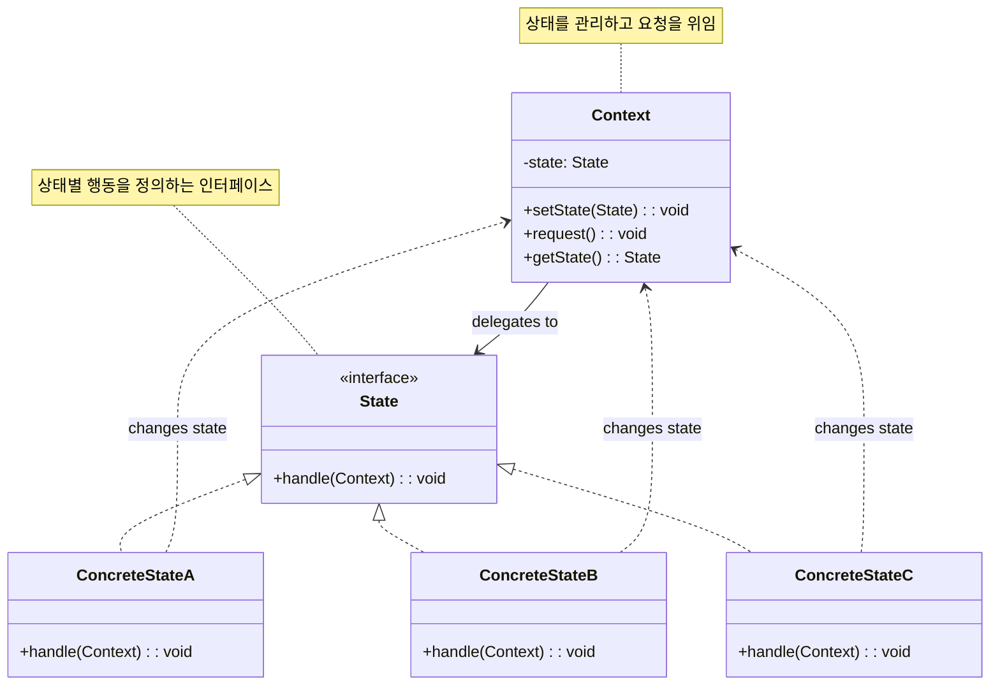
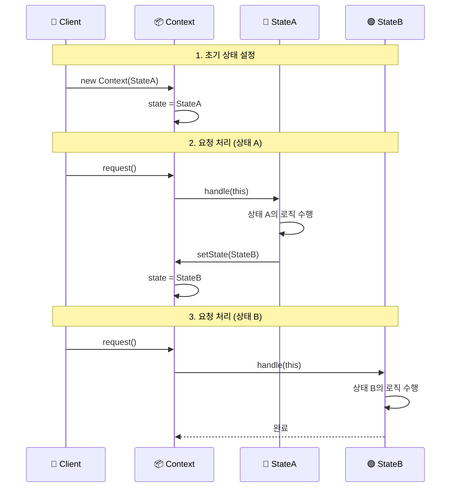

# 상태 패턴 (State Pattern)

## 정의

상태 패턴은 객체의 내부 상태가 변경될 때 객체의 행동이 변하도록 허용하는 행동 디자인 패턴입니다. 객체가 마치 자신의 클래스를 바꾼 것처럼 보이게 합니다.

## 🎯 한눈에 보기

| 항목 | 설명 |
|------|------|
| **핵심** | 상태에 따라 다르게 동작하는 if-else를 객체로 분리 |
| **비유** | 신호등 - 빨간불/노란불/초록불 상태마다 다른 동작 |
| **언제** | 객체가 상태에 따라 다르게 동작하고, 상태 전이 규칙이 복잡할 때 |
| **Spring** | Spring State Machine, 주문 상태 관리, 워크플로우 엔진 |

### 핵심 구성요소
```
Context      → 현재 상태를 보관하고 요청을 위임
State        → 상태별 행동을 정의하는 인터페이스
ConcreteState→ 각 상태에서의 구체적인 행동 구현
```

### if-else vs State 패턴
```java
// Before: if-else 지옥
if (state == "PENDING") { ... }
else if (state == "APPROVED") { ... }
else if (state == "REJECTED") { ... }

// After: 상태별 클래스로 분리
currentState.handle(this);  // 상태가 알아서 처리!
```

## 구조 (Structure)


```mermaid
classDiagram
    class Context {
        -state: State
        +setState(State): void
        +request(): void
        +getState(): State
    }

    class State {
        <<interface>>
        +handle(Context): void
    }

    class ConcreteStateA {
        +handle(Context): void
    }

    class ConcreteStateB {
        +handle(Context): void
    }

    class ConcreteStateC {
        +handle(Context): void
    }

    Context --> State : delegates to
    State <|.. ConcreteStateA
    State <|.. ConcreteStateB
    State <|.. ConcreteStateC
    ConcreteStateA ..> Context : changes state
    ConcreteStateB ..> Context : changes state
    ConcreteStateC ..> Context : changes state

    note for Context "상태를 관리하고 요청을 위임"
    note for State "상태별 행동을 정의하는 인터페이스"
```

## 동작 흐름 (Sequence Diagram)


```mermaid
sequenceDiagram
    participant Client as 👤 Client
    participant Context as 📦 Context
    participant StateA as 🔴 StateA
    participant StateB as 🟢 StateB

    Note over Client,StateB: 1. 초기 상태 설정
    Client->>Context: new Context(StateA)
    Context->>Context: state = StateA

    Note over Client,StateB: 2. 요청 처리 (상태 A)
    Client->>Context: request()
    Context->>StateA: handle(this)
    StateA->>StateA: 상태 A의 로직 수행
    StateA->>Context: setState(StateB)
    Context->>Context: state = StateB

    Note over Client,StateB: 3. 요청 처리 (상태 B)
    Client->>Context: request()
    Context->>StateB: handle(this)
    StateB->>StateB: 상태 B의 로직 수행
    StateB-->>Context: 완료
```

## 사용 이유

- **상태별 행동 분리**: 각 상태에 따른 행동을 별도의 클래스로 분리하여 관리합니다.
- **복잡한 조건문 제거**: 상태에 따른 복잡한 if-else 문을 제거하고 객체지향적으로 해결합니다.
- **상태 전이 관리**: 상태 간의 전이 로직을 명확하게 관리할 수 있습니다.
- **새로운 상태 추가 용이**: 새로운 상태가 필요할 때 기존 코드 수정 없이 추가할 수 있습니다.

## 적용 상황

상태 패턴은 다음과 같은 상황에서 특히 유용합니다:

### 1. 상태 기반 시스템
- **게임 캐릭터**: 대기, 이동, 공격, 방어 등의 상태
- **주문 시스템**: 주문접수, 결제대기, 배송중, 완료 등의 상태
- **미디어 플레이어**: 정지, 재생, 일시정지, 빨리감기 등의 상태

### 2. 복잡한 상태 전이가 있는 경우
```java
// 나쁜 예: 복잡한 조건문
class MediaPlayer {
    private String state = "STOPPED";

    public void play() {
        if (state.equals("STOPPED")) {
            // 재생 로직
            state = "PLAYING";
        } else if (state.equals("PAUSED")) {
            // 재생 재개 로직
            state = "PLAYING";
        } else if (state.equals("PLAYING")) {
            // 아무것도 하지 않음
        }
    }

    public void pause() {
        if (state.equals("PLAYING")) {
            // 일시정지 로직
            state = "PAUSED";
        } else {
            // 오류 처리
        }
    }
}

// 좋은 예: 상태 패턴 사용
interface PlayerState {
    void play(MediaPlayer player);
    void pause(MediaPlayer player);
    void stop(MediaPlayer player);
}

class MediaPlayer {
    private PlayerState state;

    public void play() {
        state.play(this);
    }

    public void pause() {
        state.pause(this);
    }
}
```

### 3. 상태 기계(State Machine)가 필요한 경우
- **네트워크 연결**: 연결대기, 연결됨, 연결해제 등
- **문서 워크플로우**: 작성중, 검토중, 승인됨, 반려됨 등
- **게임 레벨**: 로딩, 플레이중, 일시정지, 게임오버 등

## 초급 예제 - 신호등 (5분 이해)

가장 익숙한 신호등을 State 패턴으로 구현합니다.

```java
// 1. State 인터페이스 - 모든 상태의 공통 규약
interface TrafficLightState {
    void handle(TrafficLight light);
    String getColor();
}

// 2. Context - 현재 상태를 보관하고 위임
class TrafficLight {
    private TrafficLightState state;

    public TrafficLight() {
        this.state = new RedState();  // 초기 상태: 빨간불
    }

    public void setState(TrafficLightState state) {
        this.state = state;
        System.out.println("신호 변경: " + state.getColor());
    }

    public void change() {
        state.handle(this);  // 현재 상태에게 위임
    }
}

// 3. Concrete States - 각 상태별 행동 구현
class RedState implements TrafficLightState {
    @Override
    public void handle(TrafficLight light) {
        System.out.println("🔴 빨간불: 정지!");
        // 다음 상태로 전이
        light.setState(new GreenState());
    }

    @Override
    public String getColor() { return "빨간불"; }
}

class GreenState implements TrafficLightState {
    @Override
    public void handle(TrafficLight light) {
        System.out.println("🟢 초록불: 출발!");
        light.setState(new YellowState());
    }

    @Override
    public String getColor() { return "초록불"; }
}

class YellowState implements TrafficLightState {
    @Override
    public void handle(TrafficLight light) {
        System.out.println("🟡 노란불: 주의!");
        light.setState(new RedState());
    }

    @Override
    public String getColor() { return "노란불"; }
}

// 4. 사용 예시
public class TrafficLightDemo {
    public static void main(String[] args) {
        TrafficLight light = new TrafficLight();

        // 신호가 순환함
        light.change();  // 빨간불 → 초록불로 변경
        light.change();  // 초록불 → 노란불로 변경
        light.change();  // 노란불 → 빨간불로 변경
        light.change();  // 빨간불 → 초록불로 변경
    }
}
```

**실행 결과:**
```
🔴 빨간불: 정지!
신호 변경: 초록불
🟢 초록불: 출발!
신호 변경: 노란불
🟡 노란불: 주의!
신호 변경: 빨간불
🔴 빨간불: 정지!
신호 변경: 초록불
```

### 핵심 포인트
```
1. Context는 현재 상태만 알면 됨 (어떤 상태인지는 몰라도 OK)
2. 각 State가 "다음 상태로 전이"하는 책임을 가짐
3. 새로운 상태 추가 = 새 클래스 추가 (기존 코드 수정 불필요)
```

### State vs Strategy 패턴
```
State:     상태에 따라 행동이 달라짐 (상태 전이가 핵심)
           예: 빨간불 → 초록불 → 노란불 → 빨간불...

Strategy:  같은 목적, 다른 알고리즘 (선택이 핵심)
           예: 결제 방식 선택 (카드 / 현금 / 간편결제)
```

## 실생활 예제 - 스마트 자동판매기 시스템

다양한 상태를 가지는 스마트 자동판매기 시스템을 상태 패턴으로 구현해보겠습니다.

```java
import java.util.*;

// 상품 클래스
class Product {
    private String name;
    private int price;
    private int stock;

    public Product(String name, int price, int stock) {
        this.name = name;
        this.price = price;
        this.stock = stock;
    }

    public boolean isAvailable() {
        return stock > 0;
    }

    public void decreaseStock() {
        if (stock > 0) {
            stock--;
        }
    }

    // getter 메서드들
    public String getName() { return name; }
    public int getPrice() { return price; }
    public int getStock() { return stock; }

    @Override
    public String toString() {
        return String.format("%s - %d원 (재고: %d개)", name, price, stock);
    }
}

// 자동판매기 상태 인터페이스
interface VendingMachineState {
    void insertCoin(VendingMachine machine, int amount);
    void selectProduct(VendingMachine machine, int productId);
    void dispenserProduct(VendingMachine machine);
    void refund(VendingMachine machine);
    void restockProducts(VendingMachine machine);
    void turnOff(VendingMachine machine);
    String getStateName();
    String getStateDescription();
}

// 자동판매기 컨텍스트 클래스
class VendingMachine {
    private VendingMachineState currentState;
    private Map<Integer, Product> products;
    private int insertedAmount;
    private Product selectedProduct;
    private List<String> transactionLog;
    private boolean maintenanceMode;

    // 상태 인스턴스들
    private VendingMachineState readyState;
    private VendingMachineState coinInsertedState;
    private VendingMachineState productSelectedState;
    private VendingMachineState dispensingState;
    private VendingMachineState maintenanceState;
    private VendingMachineState outOfOrderState;

    public VendingMachine() {
        // 상태 인스턴스 생성
        readyState = new ReadyState();
        coinInsertedState = new CoinInsertedState();
        productSelectedState = new ProductSelectedState();
        dispensingState = new DispensingState();
        maintenanceState = new MaintenanceState();
        outOfOrderState = new OutOfOrderState();

        // 초기 설정
        currentState = readyState;
        products = new HashMap<>();
        insertedAmount = 0;
        selectedProduct = null;
        transactionLog = new ArrayList<>();
        maintenanceMode = false;

        initializeProducts();
    }

    private void initializeProducts() {
        products.put(1, new Product("콜라", 1000, 10));
        products.put(2, new Product("사이다", 1000, 8));
        products.put(3, new Product("커피", 1500, 12));
        products.put(4, new Product("물", 500, 20));
        products.put(5, new Product("주스", 1200, 5));
    }

    // 상태 전이 메서드들
    public void setState(VendingMachineState state) {
        System.out.println("상태 변경: " + currentState.getStateName() + " → " + state.getStateName());
        this.currentState = state;
        logTransaction("상태 변경: " + state.getStateName());
    }

    // 외부 인터페이스 메서드들
    public void insertCoin(int amount) {
        System.out.println("\n💰 " + amount + "원 투입");
        currentState.insertCoin(this, amount);
    }

    public void selectProduct(int productId) {
        System.out.println("\n🥤 상품 " + productId + "번 선택");
        currentState.selectProduct(this, productId);
    }

    public void dispenserProduct() {
        System.out.println("\n📦 상품 배출 요청");
        currentState.dispenserProduct(this);
    }

    public void refund() {
        System.out.println("\n↩️ 환불 요청");
        currentState.refund(this);
    }

    public void restockProducts() {
        System.out.println("\n📦 상품 보충 요청");
        currentState.restockProducts(this);
    }

    public void turnOff() {
        System.out.println("\n🔌 기계 종료 요청");
        currentState.turnOff(this);
    }

    // 내부 로직 메서드들
    public void addAmount(int amount) {
        insertedAmount += amount;
        System.out.println("투입 금액: " + insertedAmount + "원");
    }

    public void returnChange() {
        if (insertedAmount > 0) {
            System.out.println("💸 거스름돈 반환: " + insertedAmount + "원");
            insertedAmount = 0;
        }
    }

    public void processPayment() {
        if (selectedProduct != null) {
            int change = insertedAmount - selectedProduct.getPrice();
            if (change > 0) {
                System.out.println("💸 거스름돈: " + change + "원");
            }
            insertedAmount = 0;
        }
    }

    public void dispenseSelectedProduct() {
        if (selectedProduct != null && selectedProduct.isAvailable()) {
            selectedProduct.decreaseStock();
            System.out.println("✅ " + selectedProduct.getName() + " 배출 완료!");
            logTransaction("상품 배출: " + selectedProduct.getName());
            selectedProduct = null;
        }
    }

    public void restockAllProducts() {
        for (Product product : products.values()) {
            // 재고를 초기값으로 복구 (실제로는 각 상품별로 다르게 보충)
            if (product.getName().equals("콜라")) product = new Product("콜라", 1000, 10);
            else if (product.getName().equals("사이다")) product = new Product("사이다", 1000, 8);
            // ... 기타 상품들
        }
        System.out.println("📦 모든 상품 재고 보충 완료");
        logTransaction("상품 재고 보충");
    }

    private void logTransaction(String action) {
        String timestamp = java.time.LocalDateTime.now().format(
            java.time.format.DateTimeFormatter.ofPattern("HH:mm:ss"));
        transactionLog.add("[" + timestamp + "] " + action);
    }

    // 상태 및 정보 조회 메서드들
    public void displayStatus() {
        System.out.println("\n📊 자동판매기 상태");
        System.out.println("=".repeat(40));
        System.out.println("현재 상태: " + currentState.getStateName());
        System.out.println("상태 설명: " + currentState.getStateDescription());
        System.out.println("투입 금액: " + insertedAmount + "원");

        if (selectedProduct != null) {
            System.out.println("선택 상품: " + selectedProduct);
        }

        System.out.println("\n📦 상품 목록:");
        for (Map.Entry<Integer, Product> entry : products.entrySet()) {
            String availability = entry.getValue().isAvailable() ? "✅" : "❌ (품절)";
            System.out.println(entry.getKey() + ". " + entry.getValue() + " " + availability);
        }
    }

    public void displayTransactionLog() {
        System.out.println("\n📜 거래 기록 (최근 10건)");
        System.out.println("=".repeat(40));
        int start = Math.max(0, transactionLog.size() - 10);
        for (int i = start; i < transactionLog.size(); i++) {
            System.out.println(transactionLog.get(i));
        }
    }

    // Getter 메서드들
    public Map<Integer, Product> getProducts() { return products; }
    public int getInsertedAmount() { return insertedAmount; }
    public Product getSelectedProduct() { return selectedProduct; }
    public void setSelectedProduct(Product product) { this.selectedProduct = product; }
    public boolean isMaintenanceMode() { return maintenanceMode; }
    public void setMaintenanceMode(boolean mode) { this.maintenanceMode = mode; }

    // 상태 객체 getter들
    public VendingMachineState getReadyState() { return readyState; }
    public VendingMachineState getCoinInsertedState() { return coinInsertedState; }
    public VendingMachineState getProductSelectedState() { return productSelectedState; }
    public VendingMachineState getDispensingState() { return dispensingState; }
    public VendingMachineState getMaintenanceState() { return maintenanceState; }
    public VendingMachineState getOutOfOrderState() { return outOfOrderState; }
}

// 구체적인 상태 클래스들

// 1. 대기 상태
class ReadyState implements VendingMachineState {
    @Override
    public void insertCoin(VendingMachine machine, int amount) {
        if (amount > 0) {
            machine.addAmount(amount);
            machine.setState(machine.getCoinInsertedState());
        } else {
            System.out.println("❌ 유효하지 않은 금액입니다.");
        }
    }

    @Override
    public void selectProduct(VendingMachine machine, int productId) {
        System.out.println("❌ 먼저 동전을 투입해주세요.");
    }

    @Override
    public void dispenserProduct(VendingMachine machine) {
        System.out.println("❌ 상품을 선택하고 결제를 완료해주세요.");
    }

    @Override
    public void refund(VendingMachine machine) {
        System.out.println("❌ 환불할 금액이 없습니다.");
    }

    @Override
    public void restockProducts(VendingMachine machine) {
        machine.setMaintenanceMode(true);
        machine.setState(machine.getMaintenanceState());
        machine.restockAllProducts();
    }

    @Override
    public void turnOff(VendingMachine machine) {
        machine.setState(machine.getOutOfOrderState());
        System.out.println("🔌 자동판매기가 종료되었습니다.");
    }

    @Override
    public String getStateName() {
        return "대기 중";
    }

    @Override
    public String getStateDescription() {
        return "동전을 투입해주세요";
    }
}

// 2. 동전 투입 상태
class CoinInsertedState implements VendingMachineState {
    @Override
    public void insertCoin(VendingMachine machine, int amount) {
        if (amount > 0) {
            machine.addAmount(amount);
            System.out.println("💰 추가 금액이 투입되었습니다.");
        } else {
            System.out.println("❌ 유효하지 않은 금액입니다.");
        }
    }

    @Override
    public void selectProduct(VendingMachine machine, int productId) {
        Product product = machine.getProducts().get(productId);

        if (product == null) {
            System.out.println("❌ 존재하지 않는 상품번호입니다.");
            return;
        }

        if (!product.isAvailable()) {
            System.out.println("❌ 선택한 상품이 품절되었습니다.");
            return;
        }

        if (machine.getInsertedAmount() < product.getPrice()) {
            int needed = product.getPrice() - machine.getInsertedAmount();
            System.out.println("❌ 금액이 부족합니다. " + needed + "원이 더 필요합니다.");
            return;
        }

        machine.setSelectedProduct(product);
        System.out.println("✅ " + product.getName() + " 선택됨 (가격: " + product.getPrice() + "원)");
        machine.setState(machine.getProductSelectedState());
    }

    @Override
    public void dispenserProduct(VendingMachine machine) {
        System.out.println("❌ 먼저 상품을 선택해주세요.");
    }

    @Override
    public void refund(VendingMachine machine) {
        machine.returnChange();
        machine.setState(machine.getReadyState());
    }

    @Override
    public void restockProducts(VendingMachine machine) {
        System.out.println("❌ 투입된 금액이 있어 재고 보충을 할 수 없습니다. 먼저 환불해주세요.");
    }

    @Override
    public void turnOff(VendingMachine machine) {
        System.out.println("❌ 투입된 금액이 있어 종료할 수 없습니다. 먼저 환불해주세요.");
    }

    @Override
    public String getStateName() {
        return "동전 투입됨";
    }

    @Override
    public String getStateDescription() {
        return "상품을 선택해주세요";
    }
}

// 3. 상품 선택 상태
class ProductSelectedState implements VendingMachineState {
    @Override
    public void insertCoin(VendingMachine machine, int amount) {
        System.out.println("ℹ️ 이미 충분한 금액이 투입되었습니다. 상품을 배출하거나 환불해주세요.");
    }

    @Override
    public void selectProduct(VendingMachine machine, int productId) {
        Product newProduct = machine.getProducts().get(productId);

        if (newProduct == null) {
            System.out.println("❌ 존재하지 않는 상품번호입니다.");
            return;
        }

        if (!newProduct.isAvailable()) {
            System.out.println("❌ 선택한 상품이 품절되었습니다.");
            return;
        }

        if (machine.getInsertedAmount() < newProduct.getPrice()) {
            System.out.println("❌ 금액이 부족합니다.");
            return;
        }

        machine.setSelectedProduct(newProduct);
        System.out.println("🔄 상품 변경: " + newProduct.getName());
    }

    @Override
    public void dispenserProduct(VendingMachine machine) {
        machine.setState(machine.getDispensingState());
        machine.processPayment();
        machine.dispenseSelectedProduct();
        machine.setState(machine.getReadyState());
    }

    @Override
    public void refund(VendingMachine machine) {
        machine.returnChange();
        machine.setSelectedProduct(null);
        machine.setState(machine.getReadyState());
    }

    @Override
    public void restockProducts(VendingMachine machine) {
        System.out.println("❌ 거래 진행 중이라 재고 보충을 할 수 없습니다.");
    }

    @Override
    public void turnOff(VendingMachine machine) {
        System.out.println("❌ 거래 진행 중이라 종료할 수 없습니다.");
    }

    @Override
    public String getStateName() {
        return "상품 선택됨";
    }

    @Override
    public String getStateDescription() {
        return "상품 배출 버튼을 눌러주세요";
    }
}

// 4. 상품 배출 상태
class DispensingState implements VendingMachineState {
    @Override
    public void insertCoin(VendingMachine machine, int amount) {
        System.out.println("⏳ 상품 배출 중입니다. 잠시만 기다려주세요.");
    }

    @Override
    public void selectProduct(VendingMachine machine, int productId) {
        System.out.println("⏳ 상품 배출 중입니다. 잠시만 기다려주세요.");
    }

    @Override
    public void dispenserProduct(VendingMachine machine) {
        System.out.println("⏳ 이미 상품을 배출 중입니다.");
    }

    @Override
    public void refund(VendingMachine machine) {
        System.out.println("⏳ 상품 배출 중이라 환불할 수 없습니다.");
    }

    @Override
    public void restockProducts(VendingMachine machine) {
        System.out.println("⏳ 상품 배출 중이라 재고 보충을 할 수 없습니다.");
    }

    @Override
    public void turnOff(VendingMachine machine) {
        System.out.println("⏳ 상품 배출 중이라 종료할 수 없습니다.");
    }

    @Override
    public String getStateName() {
        return "상품 배출 중";
    }

    @Override
    public String getStateDescription() {
        return "상품을 배출하고 있습니다";
    }
}

// 5. 정비 상태
class MaintenanceState implements VendingMachineState {
    @Override
    public void insertCoin(VendingMachine machine, int amount) {
        System.out.println("🔧 현재 정비 중입니다. 잠시 후 이용해주세요.");
    }

    @Override
    public void selectProduct(VendingMachine machine, int productId) {
        System.out.println("🔧 현재 정비 중입니다. 잠시 후 이용해주세요.");
    }

    @Override
    public void dispenserProduct(VendingMachine machine) {
        System.out.println("🔧 현재 정비 중입니다. 잠시 후 이용해주세요.");
    }

    @Override
    public void refund(VendingMachine machine) {
        System.out.println("🔧 현재 정비 중입니다. 잠시 후 이용해주세요.");
    }

    @Override
    public void restockProducts(VendingMachine machine) {
        machine.restockAllProducts();
        machine.setMaintenanceMode(false);
        machine.setState(machine.getReadyState());
        System.out.println("✅ 정비가 완료되었습니다. 정상 운영을 시작합니다.");
    }

    @Override
    public void turnOff(VendingMachine machine) {
        machine.setMaintenanceMode(false);
        machine.setState(machine.getOutOfOrderState());
        System.out.println("🔌 정비 완료 후 시스템을 종료했습니다.");
    }

    @Override
    public String getStateName() {
        return "정비 중";
    }

    @Override
    public String getStateDescription() {
        return "재고 보충 및 점검 중입니다";
    }
}

// 6. 고장/종료 상태
class OutOfOrderState implements VendingMachineState {
    @Override
    public void insertCoin(VendingMachine machine, int amount) {
        System.out.println("🚫 현재 운영을 중단했습니다.");
    }

    @Override
    public void selectProduct(VendingMachine machine, int productId) {
        System.out.println("🚫 현재 운영을 중단했습니다.");
    }

    @Override
    public void dispenserProduct(VendingMachine machine) {
        System.out.println("🚫 현재 운영을 중단했습니다.");
    }

    @Override
    public void refund(VendingMachine machine) {
        System.out.println("🚫 현재 운영을 중단했습니다.");
    }

    @Override
    public void restockProducts(VendingMachine machine) {
        machine.setState(machine.getMaintenanceState());
        System.out.println("🔧 정비 모드로 전환됩니다.");
    }

    @Override
    public void turnOff(VendingMachine machine) {
        System.out.println("🔌 이미 시스템이 종료되어 있습니다.");
    }

    @Override
    public String getStateName() {
        return "운영 중단";
    }

    @Override
    public String getStateDescription() {
        return "현재 이용할 수 없습니다";
    }
}

// 자동판매기 시스템 데모
public class VendingMachineDemo {
    public static void main(String[] args) throws InterruptedException {
        VendingMachine machine = new VendingMachine();

        System.out.println("🤖 스마트 자동판매기 시스템 시작");
        System.out.println("=".repeat(50));

        // 초기 상태 확인
        machine.displayStatus();

        // 시나리오 1: 정상적인 구매 과정
        System.out.println("\n" + "=".repeat(50));
        System.out.println("📋 시나리오 1: 정상적인 구매 과정");
        System.out.println("=".repeat(50));

        machine.insertCoin(500);
        machine.insertCoin(500);  // 총 1000원
        machine.selectProduct(1); // 콜라 선택
        machine.dispenserProduct();

        Thread.sleep(1000);

        // 시나리오 2: 환불 과정
        System.out.println("\n" + "=".repeat(50));
        System.out.println("📋 시나리오 2: 환불 과정");
        System.out.println("=".repeat(50));

        machine.insertCoin(2000);
        machine.selectProduct(3); // 커피 선택 (1500원)
        machine.refund(); // 환불

        Thread.sleep(1000);

        // 시나리오 3: 금액 부족 상황
        System.out.println("\n" + "=".repeat(50));
        System.out.println("📋 시나리오 3: 금액 부족 상황");
        System.out.println("=".repeat(50));

        machine.insertCoin(800);
        machine.selectProduct(3); // 커피 선택 (1500원, 부족)
        machine.insertCoin(700);  // 추가 투입
        machine.selectProduct(3); // 다시 선택
        machine.dispenserProduct();

        Thread.sleep(1000);

        // 시나리오 4: 재고 보충
        System.out.println("\n" + "=".repeat(50));
        System.out.println("📋 시나리오 4: 재고 보충 과정");
        System.out.println("=".repeat(50));

        machine.restockProducts();

        Thread.sleep(1000);

        // 시나리오 5: 시스템 종료
        System.out.println("\n" + "=".repeat(50));
        System.out.println("📋 시나리오 5: 시스템 종료");
        System.out.println("=".repeat(50));

        machine.turnOff();
        machine.insertCoin(1000); // 종료 상태에서 동전 투입 시도
        machine.restockProducts(); // 종료 상태에서 정비 모드 진입

        // 최종 상태 및 로그 확인
        machine.displayStatus();
        machine.displayTransactionLog();

        System.out.println("\n🎯 자동판매기 시스템 데모 완료!");
    }
}
```

**실행 결과 예시:**
```
🤖 스마트 자동판매기 시스템 시작
==================================================

📊 자동판매기 상태
========================================
현재 상태: 대기 중
상태 설명: 동전을 투입해주세요
투입 금액: 0원

📦 상품 목록:
1. 콜라 - 1000원 (재고: 10개) ✅
2. 사이다 - 1000원 (재고: 8개) ✅
3. 커피 - 1500원 (재고: 12개) ✅
4. 물 - 500원 (재고: 20개) ✅
5. 주스 - 1200원 (재고: 5개) ✅

==================================================
📋 시나리오 1: 정상적인 구매 과정
==================================================

💰 500원 투입
투입 금액: 500원
상태 변경: 대기 중 → 동전 투입됨

💰 500원 투입
투입 금액: 1000원
💰 추가 금액이 투입되었습니다.

🥤 상품 1번 선택
✅ 콜라 선택됨 (가격: 1000원)
상태 변경: 동전 투입됨 → 상품 선택됨

📦 상품 배출 요청
상태 변경: 상품 선택됨 → 상품 배출 중
✅ 콜라 배출 완료!
상태 변경: 상품 배출 중 → 대기 중
```

## 기본 예제 코드 (Java)

```java
// State Interface
interface State {
    void handle(Context context);
}

// Context
class Context {
    private State state;

    public Context(State initialState) {
        this.state = initialState;
    }

    public void setState(State state) {
        this.state = state;
    }

    public void request() {
        state.handle(this);
    }
}

// Concrete States
class ConcreteStateA implements State {
    @Override
    public void handle(Context context) {
        System.out.println("상태 A에서 작업 수행");
        // 조건에 따라 다른 상태로 전이
        context.setState(new ConcreteStateB());
    }
}

class ConcreteStateB implements State {
    @Override
    public void handle(Context context) {
        System.out.println("상태 B에서 작업 수행");
        // 조건에 따라 다른 상태로 전이
        context.setState(new ConcreteStateA());
    }
}

// Client
public class StatePatternDemo {
    public static void main(String[] args) {
        Context context = new Context(new ConcreteStateA());

        context.request(); // 상태 A 실행 후 B로 전이
        context.request(); // 상태 B 실행 후 A로 전이
        context.request(); // 상태 A 실행 후 B로 전이
    }
}
```

## Spring Boot에서의 State 패턴

Spring에서 상태 패턴은 **주문/결제 상태 관리**, **워크플로우**, **승인 프로세스**에 자주 활용됩니다.

### 1. 주문 상태 관리 시스템 (실무 예제)

```java
// 주문 상태 인터페이스
public interface OrderState {
    void next(Order order);      // 다음 상태로 전이
    void cancel(Order order);    // 취소 처리
    String getStateName();
    boolean canCancel();
}

// 주문 엔티티 (Context 역할)
@Entity
@Getter @Setter
public class Order {
    @Id @GeneratedValue
    private Long id;

    private String productName;
    private int amount;

    @Enumerated(EnumType.STRING)
    private OrderStatus status;  // DB 저장용

    @Transient
    private OrderState state;    // 상태 객체

    @PostLoad
    public void initState() {
        this.state = OrderStateFactory.getState(this.status);
    }

    public void nextState() {
        state.next(this);
    }

    public void cancelOrder() {
        state.cancel(this);
    }

    public void changeState(OrderState newState, OrderStatus newStatus) {
        this.state = newState;
        this.status = newStatus;
    }
}

// 상태 Enum (DB 저장용)
public enum OrderStatus {
    PENDING,      // 주문 접수
    PAID,         // 결제 완료
    PREPARING,    // 상품 준비 중
    SHIPPED,      // 배송 중
    DELIVERED,    // 배송 완료
    CANCELLED     // 취소됨
}
```

```java
// 상태별 구현체들
@Component
public class PendingState implements OrderState {
    @Override
    public void next(Order order) {
        order.changeState(new PaidState(), OrderStatus.PAID);
        System.out.println("✅ 결제가 완료되었습니다.");
    }

    @Override
    public void cancel(Order order) {
        order.changeState(new CancelledState(), OrderStatus.CANCELLED);
        System.out.println("❌ 주문이 취소되었습니다.");
    }

    @Override
    public String getStateName() { return "주문 접수"; }

    @Override
    public boolean canCancel() { return true; }
}

@Component
public class PaidState implements OrderState {
    @Override
    public void next(Order order) {
        order.changeState(new PreparingState(), OrderStatus.PREPARING);
        System.out.println("📦 상품 준비를 시작합니다.");
    }

    @Override
    public void cancel(Order order) {
        // 결제 환불 로직 필요
        order.changeState(new CancelledState(), OrderStatus.CANCELLED);
        System.out.println("💸 결제가 환불되고 주문이 취소되었습니다.");
    }

    @Override
    public String getStateName() { return "결제 완료"; }

    @Override
    public boolean canCancel() { return true; }
}

@Component
public class ShippedState implements OrderState {
    @Override
    public void next(Order order) {
        order.changeState(new DeliveredState(), OrderStatus.DELIVERED);
        System.out.println("🎉 배송이 완료되었습니다!");
    }

    @Override
    public void cancel(Order order) {
        // 배송 중에는 취소 불가!
        throw new IllegalStateException("배송 중에는 취소할 수 없습니다.");
    }

    @Override
    public String getStateName() { return "배송 중"; }

    @Override
    public boolean canCancel() { return false; }  // 취소 불가
}

// ... PreparingState, DeliveredState, CancelledState 등
```

```java
// 상태 팩토리 (상태 Enum → 상태 객체 변환)
@Component
public class OrderStateFactory {
    private static Map<OrderStatus, OrderState> stateMap = new HashMap<>();

    @Autowired
    public OrderStateFactory(
            PendingState pending,
            PaidState paid,
            PreparingState preparing,
            ShippedState shipped,
            DeliveredState delivered,
            CancelledState cancelled) {

        stateMap.put(OrderStatus.PENDING, pending);
        stateMap.put(OrderStatus.PAID, paid);
        stateMap.put(OrderStatus.PREPARING, preparing);
        stateMap.put(OrderStatus.SHIPPED, shipped);
        stateMap.put(OrderStatus.DELIVERED, delivered);
        stateMap.put(OrderStatus.CANCELLED, cancelled);
    }

    public static OrderState getState(OrderStatus status) {
        return stateMap.get(status);
    }
}
```

```java
// 주문 서비스
@Service
@RequiredArgsConstructor
@Transactional
public class OrderService {
    private final OrderRepository orderRepository;

    public Order createOrder(String productName, int amount) {
        Order order = new Order();
        order.setProductName(productName);
        order.setAmount(amount);
        order.changeState(new PendingState(), OrderStatus.PENDING);
        return orderRepository.save(order);
    }

    public Order processNext(Long orderId) {
        Order order = orderRepository.findById(orderId)
            .orElseThrow(() -> new OrderNotFoundException(orderId));
        order.initState();  // DB에서 로드 후 상태 객체 초기화
        order.nextState();  // 다음 상태로 전이
        return orderRepository.save(order);
    }

    public Order cancelOrder(Long orderId) {
        Order order = orderRepository.findById(orderId)
            .orElseThrow(() -> new OrderNotFoundException(orderId));
        order.initState();

        if (!order.getState().canCancel()) {
            throw new IllegalStateException(
                order.getState().getStateName() + " 상태에서는 취소할 수 없습니다.");
        }

        order.cancelOrder();
        return orderRepository.save(order);
    }
}
```

```java
// REST 컨트롤러
@RestController
@RequestMapping("/api/orders")
@RequiredArgsConstructor
public class OrderController {
    private final OrderService orderService;

    @PostMapping
    public ResponseEntity<OrderResponse> createOrder(@RequestBody CreateOrderRequest request) {
        Order order = orderService.createOrder(request.getProductName(), request.getAmount());
        return ResponseEntity.ok(OrderResponse.from(order));
    }

    @PostMapping("/{id}/next")
    public ResponseEntity<OrderResponse> processNext(@PathVariable Long id) {
        Order order = orderService.processNext(id);
        return ResponseEntity.ok(OrderResponse.from(order));
    }

    @PostMapping("/{id}/cancel")
    public ResponseEntity<OrderResponse> cancel(@PathVariable Long id) {
        Order order = orderService.cancelOrder(id);
        return ResponseEntity.ok(OrderResponse.from(order));
    }
}
```

### 2. Spring State Machine 사용하기

Spring State Machine 라이브러리를 사용하면 복잡한 상태 전이도 쉽게 관리할 수 있습니다.

```xml
<!-- pom.xml -->
<dependency>
    <groupId>org.springframework.statemachine</groupId>
    <artifactId>spring-statemachine-starter</artifactId>
</dependency>
```

```java
// 상태와 이벤트 정의
public enum OrderStates {
    PENDING, PAID, PREPARING, SHIPPED, DELIVERED, CANCELLED
}

public enum OrderEvents {
    PAY, PREPARE, SHIP, DELIVER, CANCEL
}
```

```java
// State Machine 설정
@Configuration
@EnableStateMachine
public class OrderStateMachineConfig
        extends StateMachineConfigurerAdapter<OrderStates, OrderEvents> {

    @Override
    public void configure(StateMachineStateConfigurer<OrderStates, OrderEvents> states)
            throws Exception {
        states
            .withStates()
            .initial(OrderStates.PENDING)
            .end(OrderStates.DELIVERED)
            .end(OrderStates.CANCELLED)
            .states(EnumSet.allOf(OrderStates.class));
    }

    @Override
    public void configure(StateMachineTransitionConfigurer<OrderStates, OrderEvents> transitions)
            throws Exception {
        transitions
            // 정상 흐름
            .withExternal()
                .source(OrderStates.PENDING).target(OrderStates.PAID)
                .event(OrderEvents.PAY)
                .and()
            .withExternal()
                .source(OrderStates.PAID).target(OrderStates.PREPARING)
                .event(OrderEvents.PREPARE)
                .and()
            .withExternal()
                .source(OrderStates.PREPARING).target(OrderStates.SHIPPED)
                .event(OrderEvents.SHIP)
                .and()
            .withExternal()
                .source(OrderStates.SHIPPED).target(OrderStates.DELIVERED)
                .event(OrderEvents.DELIVER)
                .and()
            // 취소 흐름 (PENDING, PAID에서만 가능)
            .withExternal()
                .source(OrderStates.PENDING).target(OrderStates.CANCELLED)
                .event(OrderEvents.CANCEL)
                .and()
            .withExternal()
                .source(OrderStates.PAID).target(OrderStates.CANCELLED)
                .event(OrderEvents.CANCEL)
                .guard(ctx -> true)  // 추가 조건 가능
                .action(ctx -> System.out.println("환불 처리 중..."));
    }
}
```

```java
// State Machine 사용
@Service
@RequiredArgsConstructor
public class OrderStateMachineService {
    private final StateMachine<OrderStates, OrderEvents> stateMachine;

    public void processPayment(Long orderId) {
        stateMachine.sendEvent(OrderEvents.PAY);
        System.out.println("현재 상태: " + stateMachine.getState().getId());
    }

    public boolean canCancel() {
        return stateMachine.getState().getId() == OrderStates.PENDING
            || stateMachine.getState().getId() == OrderStates.PAID;
    }
}
```

### 3. Spring에서 상태 패턴이 사용되는 곳

| Spring 기능 | State 패턴 적용 |
|------------|----------------|
| `Spring State Machine` | 복잡한 상태 전이 관리 전용 라이브러리 |
| `Spring Batch` | Job/Step의 상태 관리 (STARTED, COMPLETED, FAILED) |
| `Spring Security` | 인증 상태 관리 (ANONYMOUS, AUTHENTICATED) |
| 주문/결제 시스템 | 주문 상태 흐름 관리 |

### 실무 팁: 상태와 DB 동기화

```java
// 상태를 Enum으로 DB에 저장하고, 상태 객체로 변환
@Entity
public class Order {
    @Enumerated(EnumType.STRING)
    private OrderStatus status;  // DB에 문자열로 저장

    @Transient
    private OrderState state;    // 비즈니스 로직용 객체

    // JPA 로드 후 상태 객체 초기화
    @PostLoad
    public void initState() {
        this.state = OrderStateFactory.getState(this.status);
    }
}

// 상태 변경 시 둘 다 업데이트
public void changeState(OrderState newState, OrderStatus newStatus) {
    this.state = newState;
    this.status = newStatus;  // DB 저장용
}
```

## 장점

- **상태별 행동 분리**: 각 상태의 행동을 별도 클래스로 분리하여 관리가 용이합니다.
- **복잡한 조건문 제거**: 상태에 따른 if-else 문을 제거하고 객체지향적으로 해결합니다.
- **상태 전이 명확화**: 상태 간 전이 로직이 명확하게 표현됩니다.
- **새로운 상태 추가 용이**: 기존 코드 수정 없이 새로운 상태를 추가할 수 있습니다.
- **상태별 데이터 캡슐화**: 각 상태에 필요한 데이터를 해당 상태 클래스에 캡슐화할 수 있습니다.

## 단점

- **클래스 수 증가**: 각 상태마다 별도의 클래스를 만들어야 하므로 클래스 수가 늘어납니다.
- **상태 전이 복잡성**: 상태 간 전이가 복잡해지면 관리가 어려워질 수 있습니다.
- **메모리 사용량**: 상태 객체들을 미리 생성해두면 메모리 사용량이 증가할 수 있습니다.
- **과도한 설계**: 간단한 상태 변화에 대해서는 패턴 적용이 과도할 수 있습니다.

## 관련 패턴

| 패턴 | 관계 |
|------|------|
| **Strategy** | 구조는 비슷하나 목적이 다름. Strategy는 알고리즘 교체, State는 상태에 따른 행동 변화 |
| **Singleton** | 상태 객체를 Singleton으로 만들어 재사용하면 메모리 효율적 |
| **Flyweight** | 많은 상태 객체가 필요할 때 공유하여 메모리 절약 |
| **Command** | State와 함께 사용해 상태별로 다른 명령 실행 가능 |

### State vs Strategy 비교

```
┌─────────────────┬──────────────────────────────────────────┐
│                 │ State                 │ Strategy         │
├─────────────────┼───────────────────────┼──────────────────┤
│ 목적            │ 상태에 따른 행동 변화 │ 알고리즘 교체    │
│ 상태 전이       │ 상태가 스스로 전이    │ 클라이언트가 선택│
│ 객체 관계       │ 상태끼리 서로 알 수 O │ 전략끼리 모름    │
│ 사용 예시       │ 신호등, 주문 상태     │ 정렬, 결제 방식  │
└─────────────────┴───────────────────────┴──────────────────┘

// State: 상태가 다음 상태로 자동 전이
class RedState {
    void handle(Light light) {
        light.setState(new GreenState());  // 상태가 전이 결정
    }
}

// Strategy: 클라이언트가 전략 선택
paymentService.setStrategy(new CardStrategy());  // 외부에서 선택
paymentService.pay(amount);
```

### 언제 State를 쓰고, 언제 Strategy를 쓸까?

```
State 패턴을 사용:
├─ 상태마다 다른 행동이 필요할 때 (주문: 대기 → 결제 → 배송)
├─ 상태 전이 규칙이 있을 때 (빨간불 다음은 초록불)
└─ 상태끼리 서로 전이해야 할 때

Strategy 패턴을 사용:
├─ 같은 목적의 다른 알고리즘이 있을 때 (결제: 카드/현금/페이)
├─ 런타임에 알고리즘을 교체해야 할 때
└─ 알고리즘끼리 독립적일 때 (정렬 알고리즘들)
```