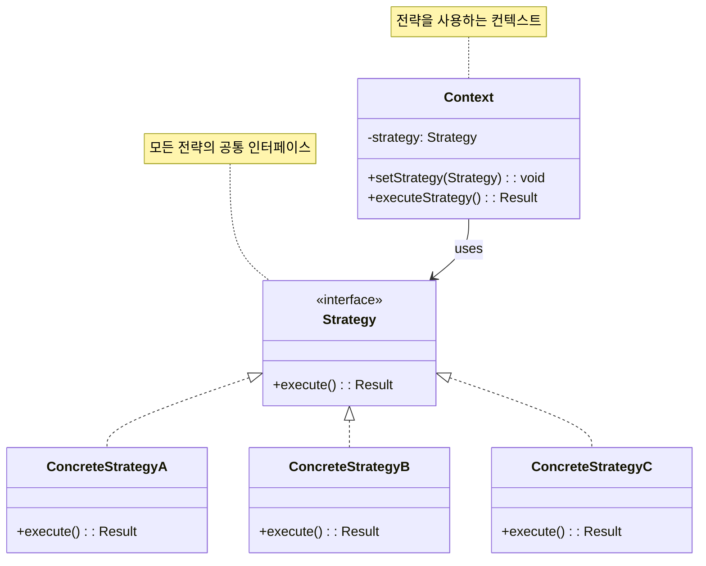

# 전략 패턴 (Strategy Pattern)

## 정의

전략 패턴은 알고리즘군을 정의하고 각각을 캡슐화하여 서로 바꿔 쓸 수 있도록 만드는 행동 디자인 패턴입니다. 전략을 사용하면 클라이언트로부터 알고리즘을 분리하여 독립적으로 변경할 수 있습니다.

## 구조 (Structure)



## 사용 이유

- **알고리즘 교체**: 런타임에 여러 알고리즘(전략) 중 하나를 선택하여 사용해야 할 때 유용합니다.
- **코드의 유연성 및 확장성**: 새로운 전략을 추가해야 할 때, 기존 컨텍스트 코드를 수정하지 않고 새로운 전략 클래스만 추가하면 되므로 개방-폐쇄 원칙(OCP)을 준수할 수 있습니다.
- **복잡한 조건문 제거**: `if-else` 또는 `switch` 문으로 다양한 전략을 분기 처리하는 코드를 피하고, 각 전략을 별도의 클래스로 캡슐화하여 코드의 가독성과 유지보수성을 높일 수 있습니다.

## 적용 상황

전략 패턴은 다음과 같은 상황에서 특히 유용합니다:

### 1. 다양한 알고리즘이 필요한 경우
- **결제 시스템**: 신용카드, 계좌이체, PayPal, 암호화폐 등 다양한 결제 방식
- **정렬 알고리즘**: 퀵소트, 머지소트, 버블소트 등 상황에 따른 정렬 방식 선택
- **압축 알고리즘**: ZIP, RAR, 7Z 등 다양한 압축 방식

### 2. 조건문이 복잡한 경우
```java
// 나쁜 예: 복잡한 조건문
class DiscountCalculator {
    public double calculateDiscount(String customerType, double amount) {
        if (customerType.equals("REGULAR")) {
            return amount * 0.05;
        } else if (customerType.equals("PREMIUM")) {
            return amount * 0.10;
        } else if (customerType.equals("VIP")) {
            return amount * 0.20;
        }
        return 0;
    }
}

// 좋은 예: 전략 패턴 사용
interface DiscountStrategy {
    double calculateDiscount(double amount);
}

class Context {
    private DiscountStrategy strategy;

    public double applyDiscount(double amount) {
        return strategy.calculateDiscount(amount);
    }
}
```

### 3. 런타임에 알고리즘 변경이 필요한 경우
- **게임 AI**: 적의 난이도에 따른 다른 행동 패턴
- **이미지 필터**: 사용자가 선택한 필터 효과 적용
- **추천 시스템**: 사용자 행동에 따른 다른 추천 알고리즘

## 실생활 예제 - 게임 캐릭터 전투 시스템

RPG 게임에서 캐릭터가 다양한 전투 스타일과 스킬을 사용하는 시스템을 전략 패턴으로 구현해보겠습니다.

```java
import java.util.*;

// 전투 결과 클래스
class BattleResult {
    private int damage;
    private String description;
    private boolean isCritical;
    private List<String> effects;

    public BattleResult(int damage, String description, boolean isCritical) {
        this.damage = damage;
        this.description = description;
        this.isCritical = isCritical;
        this.effects = new ArrayList<>();
    }

    public void addEffect(String effect) {
        effects.add(effect);
    }

    // getter 메서드들
    public int getDamage() { return damage; }
    public String getDescription() { return description; }
    public boolean isCritical() { return isCritical; }
    public List<String> getEffects() { return effects; }

    @Override
    public String toString() {
        String result = String.format("%s - 피해: %d", description, damage);
        if (isCritical) result += " (치명타!)";
        if (!effects.isEmpty()) {
            result += " [효과: " + String.join(", ", effects) + "]";
        }
        return result;
    }
}

// 전투 전략 인터페이스
interface CombatStrategy {
    BattleResult executeAttack(int attackPower, int weaponDamage);
    String getStrategyName();
    String getDescription();
}

// 근접 전투 전략
class MeleeStrategy implements CombatStrategy {
    @Override
    public BattleResult executeAttack(int attackPower, int weaponDamage) {
        Random random = new Random();

        int baseDamage = attackPower + weaponDamage;
        boolean isCritical = random.nextDouble() < 0.15; // 15% 치명타 확률

        int finalDamage = isCritical ? (int)(baseDamage * 1.5) : baseDamage;

        String[] attackTypes = {"베기", "찌르기", "내려치기", "옆베기"};
        String attackType = attackTypes[random.nextInt(attackTypes.length)];

        BattleResult result = new BattleResult(finalDamage,
            "⚔️ 근접 공격 (" + attackType + ")", isCritical);

        // 추가 효과 확률
        if (random.nextDouble() < 0.1) {
            result.addEffect("출혈");
        }

        return result;
    }

    @Override
    public String getStrategyName() {
        return "근접 전투";
    }

    @Override
    public String getDescription() {
        return "근거리에서 무기로 직접 공격하는 전투 방식";
    }
}

// 원거리 전투 전략
class RangedStrategy implements CombatStrategy {
    @Override
    public BattleResult executeAttack(int attackPower, int weaponDamage) {
        Random random = new Random();

        int baseDamage = (int)(attackPower * 0.8 + weaponDamage); // 근접보다 약간 낮은 기본 데미지
        boolean isCritical = random.nextDouble() < 0.25; // 25% 치명타 확률 (정확도 보정)

        int finalDamage = isCritical ? (int)(baseDamage * 2.0) : baseDamage;

        String[] attackTypes = {"헤드샷", "몸통 사격", "조준 사격", "연사"};
        String attackType = attackTypes[random.nextInt(attackTypes.length)];

        BattleResult result = new BattleResult(finalDamage,
            "🏹 원거리 공격 (" + attackType + ")", isCritical);

        // 추가 효과 확률
        if (random.nextDouble() < 0.15) {
            result.addEffect("기절");
        }

        return result;
    }

    @Override
    public String getStrategyName() {
        return "원거리 전투";
    }

    @Override
    public String getDescription() {
        return "활이나 총을 사용한 원거리 공격 방식";
    }
}

// 마법 전투 전략
class MagicStrategy implements CombatStrategy {
    @Override
    public BattleResult executeAttack(int attackPower, int weaponDamage) {
        Random random = new Random();

        int baseDamage = (int)(attackPower * 1.2 + weaponDamage * 0.5); // 높은 공격력, 낮은 무기 의존도
        boolean isCritical = random.nextDouble() < 0.20; // 20% 치명타 확률

        int finalDamage = isCritical ? (int)(baseDamage * 1.8) : baseDamage;

        String[] spellTypes = {"파이어볼", "라이트닝 볼트", "아이스 스피어", "매직 미사일"};
        String spellType = spellTypes[random.nextInt(spellTypes.length)];

        BattleResult result = new BattleResult(finalDamage,
            "🔮 마법 공격 (" + spellType + ")", isCritical);

        // 마법 고유 효과들
        if (spellType.equals("파이어볼") && random.nextDouble() < 0.3) {
            result.addEffect("화상");
        } else if (spellType.equals("라이트닝 볼트") && random.nextDouble() < 0.25) {
            result.addEffect("마비");
        } else if (spellType.equals("아이스 스피어") && random.nextDouble() < 0.2) {
            result.addEffect("빙결");
        }

        return result;
    }

    @Override
    public String getStrategyName() {
        return "마법 전투";
    }

    @Override
    public String getDescription() {
        return "마나를 사용한 다양한 마법 공격";
    }
}

// 방어 전략
class DefensiveStrategy implements CombatStrategy {
    @Override
    public BattleResult executeAttack(int attackPower, int weaponDamage) {
        Random random = new Random();

        int baseDamage = (int)(attackPower * 0.6 + weaponDamage * 0.7); // 낮은 데미지
        boolean isCritical = random.nextDouble() < 0.05; // 5% 치명타 확률

        int finalDamage = isCritical ? (int)(baseDamage * 1.3) : baseDamage;

        String[] defensiveActions = {"방패 밀치기", "반격", "가드 카운터", "철벽 방어"};
        String action = defensiveActions[random.nextInt(defensiveActions.length)];

        BattleResult result = new BattleResult(finalDamage,
            "🛡️ 방어적 공격 (" + action + ")", isCritical);

        // 방어 효과
        if (random.nextDouble() < 0.4) {
            result.addEffect("데미지 감소");
        }
        if (random.nextDouble() < 0.3) {
            result.addEffect("체력 회복");
        }

        return result;
    }

    @Override
    public String getStrategyName() {
        return "방어 전투";
    }

    @Override
    public String getDescription() {
        return "방어에 중점을 둔 안전한 전투 방식";
    }
}

// 광전사 전략
class BerserkerStrategy implements CombatStrategy {
    @Override
    public BattleResult executeAttack(int attackPower, int weaponDamage) {
        Random random = new Random();

        int baseDamage = (int)(attackPower * 1.5 + weaponDamage * 1.2); // 높은 데미지
        boolean isCritical = random.nextDouble() < 0.30; // 30% 치명타 확률

        int finalDamage = isCritical ? (int)(baseDamage * 2.2) : baseDamage;

        String[] berserkerAttacks = {"광란의 일격", "분노의 연타", "혈투", "무모한 돌진"};
        String attack = berserkerAttacks[random.nextInt(berserkerAttacks.length)];

        BattleResult result = new BattleResult(finalDamage,
            "😡 광전사 공격 (" + attack + ")", isCritical);

        // 광전사 특수 효과
        if (random.nextDouble() < 0.5) {
            result.addEffect("분노 중첩");
        }
        if (random.nextDouble() < 0.2) {
            result.addEffect("체력 소모");
        }

        return result;
    }

    @Override
    public String getStrategyName() {
        return "광전사";
    }

    @Override
    public String getDescription() {
        return "높은 위험과 높은 보상의 공격적인 전투 방식";
    }
}

// 게임 캐릭터 클래스 (Context)
class GameCharacter {
    private String name;
    private int level;
    private int attackPower;
    private int weaponDamage;
    private CombatStrategy combatStrategy;
    private List<String> availableStrategies;

    public GameCharacter(String name, int level, int attackPower, int weaponDamage) {
        this.name = name;
        this.level = level;
        this.attackPower = attackPower;
        this.weaponDamage = weaponDamage;
        this.availableStrategies = new ArrayList<>();

        // 기본 전략 설정
        this.combatStrategy = new MeleeStrategy();
        availableStrategies.add("melee");
    }

    public void setCombatStrategy(CombatStrategy strategy) {
        this.combatStrategy = strategy;
    }

    public void learnStrategy(String strategyType) {
        if (!availableStrategies.contains(strategyType)) {
            availableStrategies.add(strategyType);
            System.out.println(name + "이(가) " + getStrategyName(strategyType) + " 전투 방식을 습득했습니다!");
        }
    }

    public void switchStrategy(String strategyType) {
        if (!availableStrategies.contains(strategyType)) {
            System.out.println(name + "은(는) " + getStrategyName(strategyType) + " 전투 방식을 모릅니다!");
            return;
        }

        CombatStrategy newStrategy = createStrategy(strategyType);
        setCombatStrategy(newStrategy);
        System.out.println(name + "이(가) " + newStrategy.getStrategyName() + " 전투 모드로 전환했습니다.");
    }

    public BattleResult performAttack() {
        int totalAttackPower = attackPower + (level * 2);
        return combatStrategy.executeAttack(totalAttackPower, weaponDamage);
    }

    public void displayStatus() {
        System.out.println("=== " + name + " 상태 ===");
        System.out.println("레벨: " + level);
        System.out.println("공격력: " + attackPower);
        System.out.println("무기 데미지: " + weaponDamage);
        System.out.println("현재 전투 방식: " + combatStrategy.getStrategyName());
        System.out.println("설명: " + combatStrategy.getDescription());
        System.out.println("보유 전투 방식: " + availableStrategies.size() + "개");
        for (String strategy : availableStrategies) {
            System.out.println("  - " + getStrategyName(strategy));
        }
    }

    private CombatStrategy createStrategy(String type) {
        return switch (type.toLowerCase()) {
            case "melee" -> new MeleeStrategy();
            case "ranged" -> new RangedStrategy();
            case "magic" -> new MagicStrategy();
            case "defensive" -> new DefensiveStrategy();
            case "berserker" -> new BerserkerStrategy();
            default -> new MeleeStrategy();
        };
    }

    private String getStrategyName(String type) {
        CombatStrategy strategy = createStrategy(type);
        return strategy.getStrategyName();
    }

    public void levelUp() {
        level++;
        attackPower += 5;
        System.out.println(name + "이(가) 레벨업! (레벨 " + level + ")");
    }

    public List<String> getAvailableStrategies() {
        return new ArrayList<>(availableStrategies);
    }

    public String getName() { return name; }
    public int getLevel() { return level; }
}

// 전투 시뮬레이터
class BattleSimulator {
    public static void simulateBattle(GameCharacter character1, GameCharacter character2, int rounds) {
        System.out.println("\n⚔️ 전투 시작: " + character1.getName() + " vs " + character2.getName());
        System.out.println("=".repeat(60));

        int character1Wins = 0;
        int character2Wins = 0;

        for (int round = 1; round <= rounds; round++) {
            System.out.println("\n🥊 라운드 " + round);

            BattleResult result1 = character1.performAttack();
            BattleResult result2 = character2.performAttack();

            System.out.println(character1.getName() + ": " + result1);
            System.out.println(character2.getName() + ": " + result2);

            if (result1.getDamage() > result2.getDamage()) {
                character1Wins++;
                System.out.println("🏆 " + character1.getName() + " 승리!");
            } else if (result2.getDamage() > result1.getDamage()) {
                character2Wins++;
                System.out.println("🏆 " + character2.getName() + " 승리!");
            } else {
                System.out.println("🤝 무승부!");
            }
        }

        System.out.println("\n📊 최종 결과:");
        System.out.println(character1.getName() + ": " + character1Wins + "승");
        System.out.println(character2.getName() + ": " + character2Wins + "승");
        System.out.println("무승부: " + (rounds - character1Wins - character2Wins) + "회");

        if (character1Wins > character2Wins) {
            System.out.println("🏆 전체 승자: " + character1.getName());
        } else if (character2Wins > character1Wins) {
            System.out.println("🏆 전체 승자: " + character2.getName());
        } else {
            System.out.println("🤝 전체적으로 무승부!");
        }
    }
}

// 게임 전투 시스템 데모
public class GameCombatSystemDemo {
    public static void main(String[] args) throws InterruptedException {
        // 캐릭터 생성
        GameCharacter warrior = new GameCharacter("전사 아르투르", 10, 50, 30);
        GameCharacter mage = new GameCharacter("마법사 멀린", 8, 35, 45);

        System.out.println("🎮 게임 전투 시스템 데모");
        System.out.println("=".repeat(50));

        // 초기 상태 표시
        warrior.displayStatus();
        System.out.println();
        mage.displayStatus();

        // 새로운 전투 방식 학습
        System.out.println("\n📚 전투 방식 학습");
        warrior.learnStrategy("defensive");
        warrior.learnStrategy("berserker");
        mage.learnStrategy("magic");
        mage.learnStrategy("ranged");

        // 전투 방식 변경 및 테스트
        System.out.println("\n🔄 전투 방식 변경 테스트");
        warrior.switchStrategy("defensive");
        mage.switchStrategy("magic");

        // 각 전투 방식별 공격 테스트
        System.out.println("\n⚔️ 각 전투 방식별 공격 테스트");

        String[] strategies = {"melee", "ranged", "magic", "defensive", "berserker"};
        for (String strategy : strategies) {
            warrior.switchStrategy(strategy);
            BattleResult result = warrior.performAttack();
            System.out.println(warrior.getName() + " (" + strategy + "): " + result);
            Thread.sleep(500);
        }

        // 실제 전투 시뮬레이션
        System.out.println("\n" + "=".repeat(60));
        System.out.println("실제 전투 시뮬레이션");

        // 1라운드: 기본 전투
        warrior.switchStrategy("melee");
        mage.switchStrategy("magic");
        BattleSimulator.simulateBattle(warrior, mage, 3);

        // 2라운드: 전략 변경 후 전투
        System.out.println("\n" + "=".repeat(60));
        System.out.println("전략 변경 후 재대결");
        warrior.switchStrategy("berserker");
        mage.switchStrategy("defensive");
        BattleSimulator.simulateBattle(warrior, mage, 3);

        // 캐릭터 성장
        System.out.println("\n📈 캐릭터 성장");
        warrior.levelUp();
        mage.levelUp();

        // 최종 상태
        System.out.println("\n📋 최종 캐릭터 상태");
        warrior.displayStatus();
        System.out.println();
        mage.displayStatus();

        System.out.println("\n🎯 전투 시스템 데모 완료!");
    }
}
```

**실행 결과 예시:**
```
🎮 게임 전투 시스템 데모
==================================================
=== 전사 아르투르 상태 ===
레벨: 10
공격력: 50
무기 데미지: 30
현재 전투 방식: 근접 전투
설명: 근거리에서 무기로 직접 공격하는 전투 방식
보유 전투 방식: 1개
  - 근접 전투

=== 마법사 멀린 상태 ===
레벨: 8
공격력: 35
무기 데미지: 45
현재 전투 방식: 근접 전투
설명: 근거리에서 무기로 직접 공격하는 전투 방식
보유 전투 방식: 1개
  - 근접 전투

📚 전투 방식 학습
전사 아르투르이(가) 방어 전투 전투 방식을 습득했습니다!
전사 아르투르이(가) 광전사 전투 방식을 습득했습니다!
마법사 멀린이(가) 마법 전투 전투 방식을 습득했습니다!
마법사 멀린이(가) 원거리 전투 전투 방식을 습득했습니다!

🔄 전투 방식 변경 테스트
전사 아르투르이(가) 방어 전투 전투 모드로 전환했습니다.
마법사 멀린이(가) 마법 전투 전투 모드로 전환했습니다.

⚔️ 각 전투 방식별 공격 테스트
전사 아르투르이(가) 근접 전투 전투 모드로 전환했습니다.
전사 아르투르 (melee): ⚔️ 근접 공격 (베기) - 피해: 100
전사 아르투르이(가) 원거리 전투 전투 모드로 전환했습니다.
전사 아르투르 (ranged): 🏹 원거리 공격 (조준 사격) - 피해: 86 (치명타!)
```

## 함수형 프로그래밍과 전략 패턴

Java 8 이후 람다 표현식을 사용하여 더 간결하게 전략 패턴을 구현할 수 있습니다:

```java
import java.util.function.BiFunction;

// 함수형 인터페이스 활용
class FunctionalStrategy {
    // 전략을 함수로 정의
    public static BiFunction<Integer, Integer, Integer> ADD = (a, b) -> a + b;
    public static BiFunction<Integer, Integer, Integer> SUBTRACT = (a, b) -> a - b;
    public static BiFunction<Integer, Integer, Integer> MULTIPLY = (a, b) -> a * b;

    // 컨텍스트 클래스
    static class Calculator {
        private BiFunction<Integer, Integer, Integer> strategy;

        public Calculator(BiFunction<Integer, Integer, Integer> strategy) {
            this.strategy = strategy;
        }

        public int calculate(int a, int b) {
            return strategy.apply(a, b);
        }

        public void setStrategy(BiFunction<Integer, Integer, Integer> strategy) {
            this.strategy = strategy;
        }
    }

    public static void main(String[] args) {
        Calculator calc = new Calculator(ADD);
        System.out.println("10 + 5 = " + calc.calculate(10, 5));

        calc.setStrategy(MULTIPLY);
        System.out.println("10 * 5 = " + calc.calculate(10, 5));

        // 람다로 즉석에서 전략 정의
        calc.setStrategy((a, b) -> a % b);
        System.out.println("10 % 5 = " + calc.calculate(10, 5));
    }
}
```

## 기본 예제 코드 (Java)

```java
// Strategy Interface: 모든 전략들이 구현해야 할 공통 인터페이스
interface Strategy {
    int doOperation(int num1, int num2);
}

// ConcreteStrategy A: 덧셈 전략
class OperationAdd implements Strategy {
    @Override
    public int doOperation(int num1, int num2) {
        return num1 + num2;
    }
}

// ConcreteStrategy B: 뺄셈 전략
class OperationSubtract implements Strategy {
    @Override
    public int doOperation(int num1, int num2) {
        return num1 - num2;
    }
}

// ConcreteStrategy C: 곱셈 전략
class OperationMultiply implements Strategy {
    @Override
    public int doOperation(int num1, int num2) {
        return num1 * num2;
    }
}

// Context: 전략을 사용하는 클래스
class Context {
    private Strategy strategy;

    public Context(Strategy strategy) {
        this.strategy = strategy;
    }

    public void setStrategy(Strategy strategy) {
        this.strategy = strategy;
    }

    public int executeStrategy(int num1, int num2) {
        return strategy.doOperation(num1, num2);
    }
}

// 사용 예시
public class Client {
    public static void main(String[] args) {
        Context context = new Context(new OperationAdd());
        System.out.println("10 + 5 = " + context.executeStrategy(10, 5));

        context.setStrategy(new OperationSubtract());
        System.out.println("10 - 5 = " + context.executeStrategy(10, 5));

        context.setStrategy(new OperationMultiply());
        System.out.println("10 * 5 = " + context.executeStrategy(10, 5));
    }
}
```

## 장점

- **유연한 알고리즘 전환**: 런타임에 동적으로 알고리즘을 변경할 수 있습니다.
- **확장성**: 새로운 전략을 쉽게 추가할 수 있습니다 (개방-폐쇄 원칙).
- **코드 단순화**: 복잡한 조건 분기문을 제거하고 코드를 더 깔끔하게 만들 수 있습니다.
- **테스트 용이성**: 각 전략을 독립적으로 테스트할 수 있습니다.
- **재사용성**: 전략들을 다른 컨텍스트에서도 재사용할 수 있습니다.

## 단점

- **클래스 수 증가**: 각 전략을 별도의 클래스로 만들어야 하므로, 간단한 로직에 적용할 경우 클래스의 수가 늘어나는 단점이 있습니다.
- **클라이언트의 책임**: 클라이언트가 어떤 전략을 사용해야 하는지 알아야 하므로, 클라이언트와 특정 전략 간에 약간의 결합이 생길 수 있습니다.
- **오버헤드**: 간단한 알고리즘의 경우 전략 패턴을 적용하는 것이 과도할 수 있습니다.