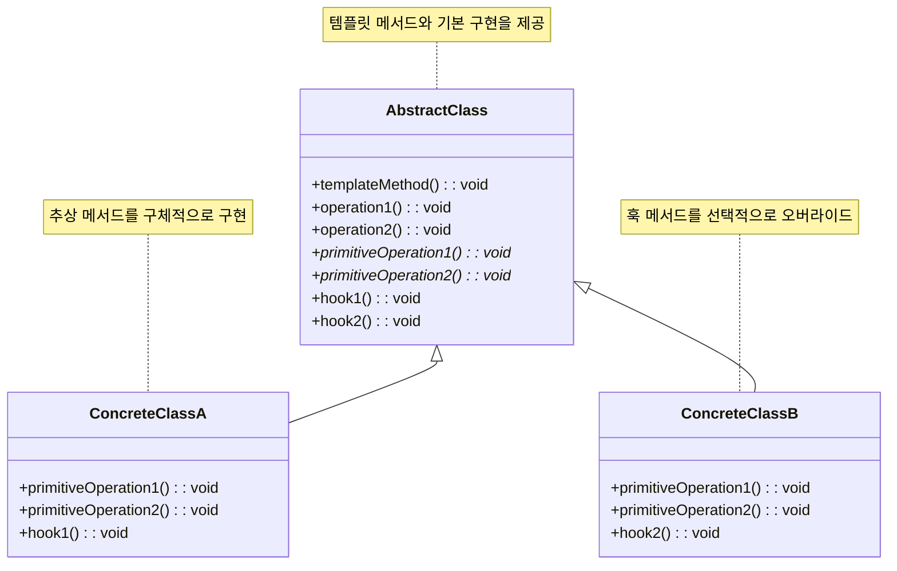

# 템플릿 메서드 패턴 (Template Method Pattern)

## 정의

템플릿 메서드 패턴은 알고리즘의 골격(구조)을 상위 클래스에서 정의하고, 일부 단계를 서브클래스에서 구현하도록 하는 행동 디자인 패턴입니다. 이를 통해 알고리즘의 구조를 변경하지 않으면서 특정 단계를 서브클래스에서 재정의할 수 있습니다.

## 구조 (Structure)



## 사용 이유

- **알고리즘 구조 고정**: 전체적으로는 동일하면서 부분적으로는 다른 구문으로 구성된 메서드의 코드 중복을 최소화하고 싶을 때 사용됩니다. 상위 클래스에서 알고리즘의 전체적인 흐름을 제어하고, 하위 클래스에서는 세부 내용을 커스터마이징할 수 있습니다.
- **코드 재사용성 향상**: 여러 클래스에서 공통으로 사용되는 알고리즘 로직을 추상 클래스에 정의하여 코드의 재사용성을 높입니다.
- **확장성**: 알고리즘의 특정 단계를 확장해야 할 때, 새로운 서브클래스를 추가하여 해당 부분만 오버라이드하면 되므로 유연한 확장이 가능합니다 (개방-폐쇄 원칙).

## 적용 상황

템플릿 메서드 패턴은 다음과 같은 상황에서 특히 유용합니다:

### 1. 공통 알고리즘 구조가 있는 경우
- **데이터 처리 파이프라인**: 읽기 → 처리 → 검증 → 저장 순서
- **웹 요청 처리**: 인증 → 요청 파싱 → 비즈니스 로직 → 응답 생성
- **게임 턴 시스템**: 턴 시작 → 행동 선택 → 행동 실행 → 턴 종료

### 2. 중복 코드가 많은 경우
```java
// 나쁜 예: 중복되는 코드가 많음
class PDFExporter {
    public void export(Data data) {
        // 1. 데이터 검증
        validateData(data);
        // 2. 헤더 생성
        createHeader();
        // 3. PDF 형식으로 변환
        convertToPDF(data);
        // 4. 푸터 생성
        createFooter();
        // 5. 파일 저장
        saveFile();
    }
}

class ExcelExporter {
    public void export(Data data) {
        // 1. 데이터 검증 (동일)
        validateData(data);
        // 2. 헤더 생성 (동일)
        createHeader();
        // 3. Excel 형식으로 변환 (다름)
        convertToExcel(data);
        // 4. 푸터 생성 (동일)
        createFooter();
        // 5. 파일 저장 (동일)
        saveFile();
    }
}

// 좋은 예: 템플릿 메서드 패턴 사용
abstract class DataExporter {
    public final void export(Data data) {
        validateData(data);    // 공통
        createHeader();        // 공통
        convertData(data);     // 서브클래스에서 구현
        createFooter();        // 공통
        saveFile();           // 공통
    }

    protected abstract void convertData(Data data);
}
```

### 3. Hook 메서드가 필요한 경우
- **선택적 기능**: 필요에 따라 오버라이드할 수 있는 빈 메서드
- **조건부 실행**: 특정 조건에서만 실행되는 로직
- **확장 포인트**: 미래 확장을 위한 확장 지점

## 실생활 예제 - 카페 음료 제조 시스템

다양한 카페 음료를 제조하는 시스템을 템플릿 메서드 패턴으로 구현해보겠습니다.

```java
import java.util.*;

// 음료 재료 클래스
class Ingredient {
    private String name;
    private int amount;
    private String unit;

    public Ingredient(String name, int amount, String unit) {
        this.name = name;
        this.amount = amount;
        this.unit = unit;
    }

    public String getName() { return name; }
    public int getAmount() { return amount; }
    public String getUnit() { return unit; }

    @Override
    public String toString() {
        return name + " " + amount + unit;
    }
}

// 음료 정보 클래스
class DrinkInfo {
    private String name;
    private int preparationTime;
    private int price;
    private String size;

    public DrinkInfo(String name, int preparationTime, int price, String size) {
        this.name = name;
        this.preparationTime = preparationTime;
        this.price = price;
        this.size = size;
    }

    // getter 메서드들
    public String getName() { return name; }
    public int getPreparationTime() { return preparationTime; }
    public int getPrice() { return price; }
    public String getSize() { return size; }
}

// 추상 클래스: 음료 제조 템플릿
abstract class CafeDrink {
    protected List<Ingredient> ingredients;
    protected DrinkInfo drinkInfo;
    protected boolean isHot;
    protected String customerName;

    public CafeDrink(String customerName, String size) {
        this.customerName = customerName;
        this.ingredients = new ArrayList<>();
        this.isHot = true; // 기본값
        initializeDrinkInfo(size);
    }

    // 템플릿 메서드: 음료 제조의 전체 과정을 정의
    public final void makeDrink() {
        System.out.println("☕ " + drinkInfo.getName() + " 제조 시작");
        System.out.println("주문자: " + customerName + " | 사이즈: " + drinkInfo.getSize());
        System.out.println("=".repeat(50));

        // 1. 주문 확인
        confirmOrder();

        // 2. 재료 준비
        prepareIngredients();

        // 3. 컵 준비
        prepareCup();

        // 4. 기본 음료 추출
        extractBase();

        // 5. 재료 추가 (서브클래스에서 구현)
        addIngredients();

        // 6. 토핑 추가 (훅 메서드)
        addToppings();

        // 7. 온도 조절 (서브클래스에서 구현)
        adjustTemperature();

        // 8. 마지막 장식 (훅 메서드)
        finalizePresentation();

        // 9. 서빙
        serveDrink();

        System.out.println("✅ " + drinkInfo.getName() + " 제조 완료!");
        System.out.println("예상 제조 시간: " + drinkInfo.getPreparationTime() + "분");
        System.out.println("가격: " + drinkInfo.getPrice() + "원");
        System.out.println();
    }

    // 공통 구현 메서드들
    private void confirmOrder() {
        System.out.println("📋 주문 확인: " + drinkInfo.getName() + " (" + drinkInfo.getSize() + ")");
    }

    protected void prepareCup() {
        String cupSize = drinkInfo.getSize().equals("Large") ? "큰 컵" :
                        drinkInfo.getSize().equals("Medium") ? "중간 컵" : "작은 컵";
        System.out.println("🥤 " + cupSize + " 준비");
    }

    private void serveDrink() {
        System.out.println("🎯 " + customerName + "님께 " + drinkInfo.getName() + " 서빙");
    }

    // 서브클래스에서 구현해야 하는 추상 메서드들
    protected abstract void initializeDrinkInfo(String size);
    protected abstract void prepareIngredients();
    protected abstract void extractBase();
    protected abstract void addIngredients();
    protected abstract void adjustTemperature();

    // 훅 메서드들 (선택적으로 오버라이드)
    protected void addToppings() {
        // 기본적으로는 아무것도 하지 않음
    }

    protected void finalizePresentation() {
        // 기본적으로는 아무것도 하지 않음
    }

    // 유틸리티 메서드
    protected void addIngredient(String name, int amount, String unit) {
        ingredients.add(new Ingredient(name, amount, unit));
    }

    protected void displayIngredients() {
        System.out.println("📦 재료 목록:");
        for (Ingredient ingredient : ingredients) {
            System.out.println("   - " + ingredient);
        }
    }
}

// 구체 클래스 1: 아메리카노
class Americano extends CafeDrink {
    public Americano(String customerName, String size) {
        super(customerName, size);
    }

    @Override
    protected void initializeDrinkInfo(String size) {
        int price = size.equals("Large") ? 4500 : size.equals("Medium") ? 4000 : 3500;
        this.drinkInfo = new DrinkInfo("아메리카노", 2, price, size);
    }

    @Override
    protected void prepareIngredients() {
        addIngredient("에스프레소 샷", 2, "개");
        addIngredient("뜨거운 물", 200, "ml");
        displayIngredients();
    }

    @Override
    protected void extractBase() {
        System.out.println("☕ 에스프레소 추출 중... (25초)");
        System.out.println("☕ 완벽한 크레마 형성!");
    }

    @Override
    protected void addIngredients() {
        System.out.println("💧 뜨거운 물 추가");
        System.out.println("🔄 가볍게 저어서 섞기");
    }

    @Override
    protected void adjustTemperature() {
        if (isHot) {
            System.out.println("🌡️ 뜨거운 아메리카노 완성 (70-75°C)");
        } else {
            System.out.println("🧊 아이스 아메리카노로 변경");
        }
    }
}

// 구체 클래스 2: 카푸치노
class Cappuccino extends CafeDrink {
    public Cappuccino(String customerName, String size) {
        super(customerName, size);
    }

    @Override
    protected void initializeDrinkInfo(String size) {
        int price = size.equals("Large") ? 5500 : size.equals("Medium") ? 5000 : 4500;
        this.drinkInfo = new DrinkInfo("카푸치노", 4, price, size);
    }

    @Override
    protected void prepareIngredients() {
        addIngredient("에스프레소 샷", 2, "개");
        addIngredient("우유", 150, "ml");
        displayIngredients();
    }

    @Override
    protected void extractBase() {
        System.out.println("☕ 진한 에스프레소 추출 중...");
        System.out.println("☕ 완벽한 바디감의 에스프레소 완성!");
    }

    @Override
    protected void addIngredients() {
        System.out.println("🥛 우유 스티밍 시작...");
        System.out.println("💨 마이크로폼 생성 중... (60-65°C)");
        System.out.println("🎨 라떼 아트 준비");
    }

    @Override
    protected void adjustTemperature() {
        System.out.println("🌡️ 완벽한 온도로 조절 (65-70°C)");
    }

    @Override
    protected void finalizePresentation() {
        System.out.println("🎨 하트 모양 라떼 아트 완성");
        System.out.println("✨ 시나몬 파우더 가볍게 뿌리기");
    }
}

// 구체 클래스 3: 바닐라 라떼
class VanillaLatte extends CafeDrink {
    public VanillaLatte(String customerName, String size) {
        super(customerName, size);
    }

    @Override
    protected void initializeDrinkInfo(String size) {
        int price = size.equals("Large") ? 6000 : size.equals("Medium") ? 5500 : 5000;
        this.drinkInfo = new DrinkInfo("바닐라 라떼", 5, price, size);
    }

    @Override
    protected void prepareIngredients() {
        addIngredient("에스프레소 샷", 2, "개");
        addIngredient("우유", 200, "ml");
        addIngredient("바닐라 시럽", 15, "ml");
        displayIngredients();
    }

    @Override
    protected void extractBase() {
        System.out.println("☕ 부드러운 에스프레소 추출...");
        System.out.println("☕ 라떼용 에스프레소 완성!");
    }

    @Override
    protected void addIngredients() {
        System.out.println("🍯 바닐라 시럽 먼저 추가");
        System.out.println("☕ 에스프레소와 시럽 블렌딩");
        System.out.println("🥛 부드러운 우유 스티밍 (60°C)");
        System.out.println("🔄 우유와 에스프레소 조화");
    }

    @Override
    protected void adjustTemperature() {
        System.out.println("🌡️ 라떼 최적 온도 유지 (65°C)");
    }

    @Override
    protected void addToppings() {
        System.out.println("🎯 휘핑크림 추가");
        System.out.println("🍒 체리 토핑");
    }

    @Override
    protected void finalizePresentation() {
        System.out.println("🎨 스완 라떼 아트");
        System.out.println("✨ 바닐라 파우더 마무리");
    }
}

// 구체 클래스 4: 프라푸치노 (차가운 음료)
class Frappuccino extends CafeDrink {
    public Frappuccino(String customerName, String size) {
        super(customerName, size);
        this.isHot = false; // 차가운 음료
    }

    @Override
    protected void initializeDrinkInfo(String size) {
        int price = size.equals("Large") ? 6500 : size.equals("Medium") ? 6000 : 5500;
        this.drinkInfo = new DrinkInfo("프라푸치노", 3, price, size);
    }

    @Override
    protected void prepareIngredients() {
        addIngredient("에스프레소 샷", 2, "개");
        addIngredient("우유", 100, "ml");
        addIngredient("얼음", 150, "g");
        addIngredient("설탕", 20, "g");
        displayIngredients();
    }

    @Override
    protected void extractBase() {
        System.out.println("☕ 차가운 에스프레소 추출...");
        System.out.println("❄️ 에스프레소 냉각 중...");
    }

    @Override
    protected void addIngredients() {
        System.out.println("🧊 블렌더에 얼음 추가");
        System.out.println("☕ 차가운 에스프레소 추가");
        System.out.println("🥛 차가운 우유 추가");
        System.out.println("🍯 설탕 추가");
    }

    @Override
    protected void adjustTemperature() {
        System.out.println("🌪️ 고속 블렌딩 (30초)");
        System.out.println("❄️ 시원한 프라푸치노 완성 (2-4°C)");
    }

    @Override
    protected void addToppings() {
        System.out.println("🍦 휘핑크림 듬뿍");
        System.out.println("🍫 초콜릿 시럽 드리즐");
        System.out.println("🥜 견과류 토핑");
    }

    @Override
    protected void finalizePresentation() {
        System.out.println("🥤 투명 플라스틱 컵에 담기");
        System.out.println("🥄 긴 스푼과 빨대 제공");
        System.out.println("❄️ 시원함 유지를 위한 쿨러백 제공");
    }
}

// 카페 주문 시스템
class CafeOrderSystem {
    private List<CafeDrink> orders;

    public CafeOrderSystem() {
        this.orders = new ArrayList<>();
    }

    public void processOrder(CafeDrink drink) {
        orders.add(drink);
        drink.makeDrink();
    }

    public void displayOrderSummary() {
        System.out.println("📊 오늘의 주문 요약");
        System.out.println("=".repeat(30));
        System.out.println("총 주문 수: " + orders.size() + "잔");

        Map<String, Integer> drinkCount = new HashMap<>();
        for (CafeDrink drink : orders) {
            String drinkName = drink.drinkInfo.getName();
            drinkCount.put(drinkName, drinkCount.getOrDefault(drinkName, 0) + 1);
        }

        for (Map.Entry<String, Integer> entry : drinkCount.entrySet()) {
            System.out.println(entry.getKey() + ": " + entry.getValue() + "잔");
        }
    }
}

// 카페 음료 제조 시스템 데모
public class CafeDrinkSystemDemo {
    public static void main(String[] args) throws InterruptedException {
        CafeOrderSystem cafeSystem = new CafeOrderSystem();

        System.out.println("☕ 스타벅스 카페 음료 제조 시스템");
        System.out.println("=".repeat(60));

        // 다양한 음료 주문
        System.out.println("📱 주문 접수 시작...\n");

        // 1. 아메리카노 주문
        CafeDrink americano = new Americano("김철수", "Medium");
        cafeSystem.processOrder(americano);
        Thread.sleep(1000);

        // 2. 카푸치노 주문
        CafeDrink cappuccino = new Cappuccino("이영희", "Large");
        cafeSystem.processOrder(cappuccino);
        Thread.sleep(1000);

        // 3. 바닐라 라떼 주문
        CafeDrink vanillaLatte = new VanillaLatte("박민수", "Small");
        cafeSystem.processOrder(vanillaLatte);
        Thread.sleep(1000);

        // 4. 프라푸치노 주문
        CafeDrink frappuccino = new Frappuccino("최지은", "Large");
        cafeSystem.processOrder(frappuccino);

        // 주문 요약
        cafeSystem.displayOrderSummary();

        System.out.println("\n🎯 모든 음료 제조 완료!");
        System.out.println("고객 만족도: ⭐⭐⭐⭐⭐");
    }
}
```

**실행 결과 예시:**
```
☕ 스타벅스 카페 음료 제조 시스템
============================================================
📱 주문 접수 시작...

☕ 아메리카노 제조 시작
주문자: 김철수 | 사이즈: Medium
==================================================
📋 주문 확인: 아메리카노 (Medium)
📦 재료 목록:
   - 에스프레소 샷 2개
   - 뜨거운 물 200ml
🥤 중간 컵 준비
☕ 에스프레소 추출 중... (25초)
☕ 완벽한 크레마 형성!
💧 뜨거운 물 추가
🔄 가볍게 저어서 섞기
🌡️ 뜨거운 아메리카노 완성 (70-75°C)
🎯 김철수님께 아메리카노 서빙
✅ 아메리카노 제조 완료!
예상 제조 시간: 2분
가격: 4000원
```

## Hook 메서드의 활용

Hook 메서드는 템플릿 메서드 패턴에서 중요한 개념입니다:

```java
abstract class DataProcessor {
    public final void processData() {
        loadData();
        if (shouldValidate()) {  // Hook 메서드
            validateData();
        }
        transformData();
        if (shouldCompress()) {  // Hook 메서드
            compressData();
        }
        saveData();
    }

    // Hook 메서드들 - 기본 구현 제공
    protected boolean shouldValidate() { return true; }
    protected boolean shouldCompress() { return false; }

    // 선택적 Hook 메서드
    protected void compressData() {
        // 기본적으로는 아무것도 하지 않음
    }
}

class FastDataProcessor extends DataProcessor {
    @Override
    protected boolean shouldValidate() {
        return false; // 빠른 처리를 위해 검증 생략
    }
}
```

## 기본 예제 코드 (Java)

```java
// AbstractClass: 템플릿 메서드를 정의하는 추상 클래스
abstract class Game {
    // 템플릿 메서드: 알고리즘의 골격을 정의하며 final로 선언하여 오버라이드를 막음
    public final void play() {
        // 공통적인 단계
        initialize();
        startPlay();
        // 서브클래스에서 구현할 단계
        playing();
        // 공통적인 단계
        endPlay();
    }

    // 공통적으로 구현된 메서드
    void initialize() {
        System.out.println("게임을 초기화합니다.");
    }

    void startPlay() {
        System.out.println("게임을 시작합니다.");
    }

    void endPlay() {
        System.out.println("게임을 종료합니다.");
    }

    // 서브클래스에서 구현해야 할 추상 메서드
    abstract void playing();
}

// ConcreteClass A: 축구 게임
class Football extends Game {
    @Override
    void playing() {
        System.out.println("축구 게임을 진행합니다!");
    }
}

// ConcreteClass B: 농구 게임
class Basketball extends Game {
    @Override
    void playing() {
        System.out.println("농구 게임을 진행합니다!");
    }
}

// 사용 예시
public class Client {
    public static void main(String[] args) {
        Game football = new Football();
        football.play();

        System.out.println();

        Game basketball = new Basketball();
        basketball.play();
    }
}
```

## 장점

- **코드 중복 감소**: 공통된 로직을 상위 클래스에 모아 코드 중복을 줄일 수 있습니다.
- **구조의 일관성 유지**: 알고리즘의 전체적인 구조를 변경하지 않고 특정 부분만 수정할 수 있어 일관성을 유지하기 쉽습니다.
- **유지보수 용이**: 공통 로직 수정 시 상위 클래스만 변경하면 되므로 유지보수가 편리합니다.
- **제어 역전**: 상위 클래스가 전체 흐름을 제어하므로 Hollywood Principle("Don't call us, we'll call you")을 따릅니다.
- **확장성**: Hook 메서드를 통해 유연한 확장이 가능합니다.

## 단점

- **유연성 제한**: 템플릿 메서드에서 정의한 알고리즘의 구조 자체는 변경하기 어렵습니다.
- **클래스 수 증가**: 각기 다른 구현에 대해 서브클래스를 만들어야 하므로 클래스의 수가 늘어날 수 있습니다.
- **상속 의존성**: 상속을 기반으로 하므로 컴포지션보다 결합도가 높습니다.
- **복잡성 증가**: Hook 메서드가 많아지면 전체 구조를 이해하기 어려워질 수 있습니다.