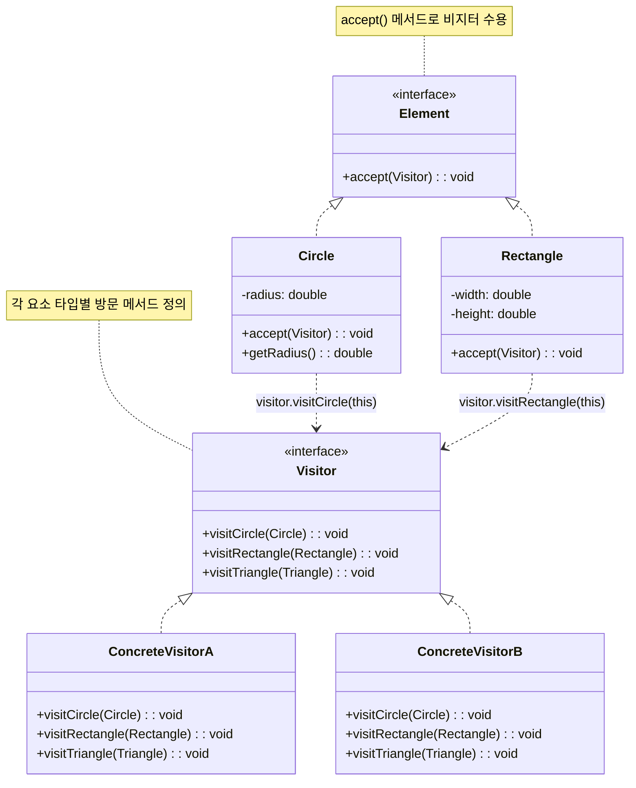
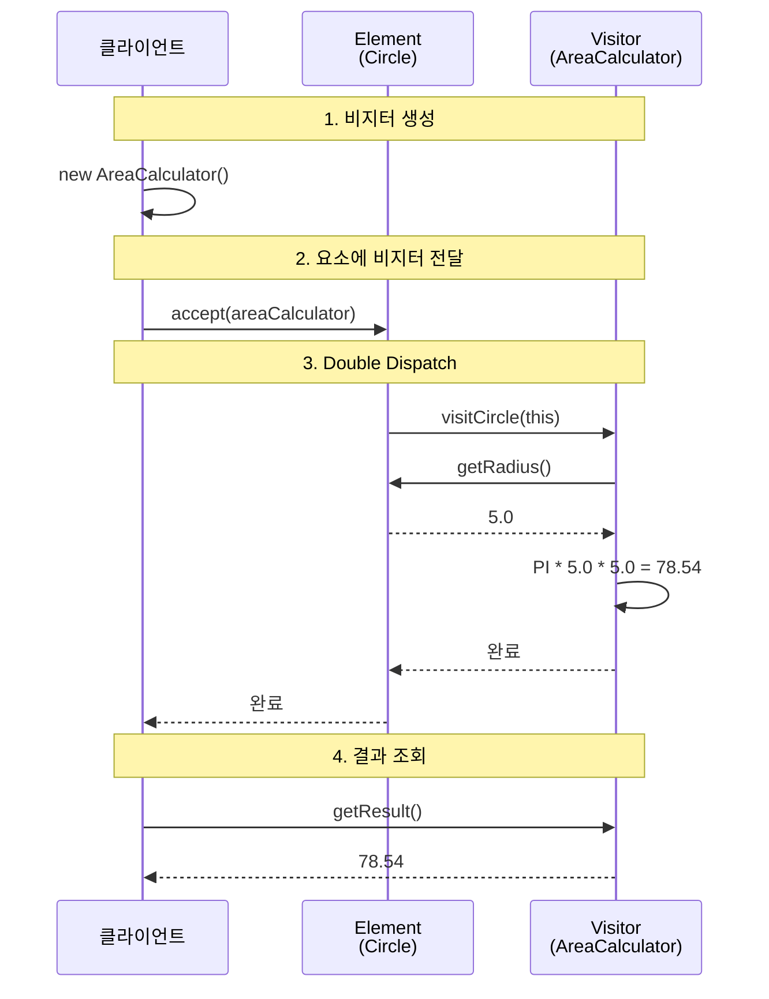

# 비지터 패턴 (Visitor Pattern)

## 정의

비지터 패턴은 객체 구조의 요소에 대해 수행할 연산을 분리하여, 구조를 변경하지 않고도 새로운 연산을 추가할 수 있게 하는 행동 디자인 패턴입니다. 데이터 구조와 연산을 분리하여 개방-폐쇄 원칙을 지원합니다.

## 🎯 한눈에 보기

| 항목 | 설명 |
|------|------|
| **핵심** | 객체 구조를 변경하지 않고 새로운 연산을 추가 |
| **비유** | 세무사가 회사를 방문해서 각 부서별로 다른 세금 계산 |
| **언제** | 복잡한 객체 구조에 다양한 연산을 추가해야 할 때 |
| **Spring** | `BeanPostProcessor`, ASM 라이브러리, 컴파일러 |

> **💡 다양한 도형의 면적과 둘레를 계산해야 할 때...**
>
> **❌ Before (각 도형 클래스에 메서드 추가)**
> ```java
> class Circle {
>     double area() { return PI * r * r; }
>     double perimeter() { return 2 * PI * r; }
>     String toJson() { ... }     // ← 새 연산마다
>     String toXml() { ... }      // ← 모든 클래스 수정!
> }
> ```
>
> **✅ After (비지터 패턴)**
> ```java
> shape.accept(areaVisitor);      // ← 면적 계산
> shape.accept(perimeterVisitor); // ← 둘레 계산
> shape.accept(jsonVisitor);      // ← JSON 변환 (새 Visitor만 추가!)
> ```

## 구조 (Structure)



## 동작 흐름 (시퀀스 다이어그램)



## 사용 이유

- **연산 추가 용이**: 새로운 연산이 필요하면 새 Visitor 클래스만 추가하면 됩니다. 기존 요소 클래스는 수정할 필요가 없습니다.
- **관련 연산 집중화**: 특정 연산과 관련된 모든 로직이 하나의 Visitor 클래스에 모여 있어 응집도가 높습니다.
- **객체 구조 독립성**: 데이터 구조(Element)와 알고리즘(Visitor)을 분리하여 각각 독립적으로 발전시킬 수 있습니다.
- **Double Dispatch 활용**: 런타임에 요소의 실제 타입과 비지터의 실제 타입 모두를 기반으로 적절한 메서드가 호출됩니다.

## 적용 상황

비지터 패턴은 다음과 같은 상황에서 특히 유용합니다:

1. **컴파일러/인터프리터**: AST(추상 구문 트리)를 순회하며 타입 검사, 코드 생성, 최적화 등 다양한 연산 수행
2. **문서 처리**: XML/JSON 구조를 순회하며 검증, 변환, 직렬화 등 수행
3. **파일 시스템**: 디렉토리 구조를 순회하며 용량 계산, 검색, 백업 등 수행
4. **UI 컴포넌트**: 컴포넌트 트리를 순회하며 렌더링, 이벤트 처리, 레이아웃 계산
5. **쇼핑 카트**: 상품 목록을 순회하며 할인 계산, 세금 계산, 배송비 계산

## 🔰 5분 만에 이해하기 - 초급 예제

### 도형 면적/둘레 계산기

```java
// 1. Element 인터페이스
interface Shape {
    void accept(ShapeVisitor visitor);
}

// 2. ConcreteElement - 원
class Circle implements Shape {
    private double radius;

    public Circle(double radius) {
        this.radius = radius;
    }

    public double getRadius() {
        return radius;
    }

    @Override
    public void accept(ShapeVisitor visitor) {
        visitor.visitCircle(this);  // Double Dispatch의 핵심!
    }
}

// 3. ConcreteElement - 사각형
class Rectangle implements Shape {
    private double width, height;

    public Rectangle(double width, double height) {
        this.width = width;
        this.height = height;
    }

    public double getWidth() { return width; }
    public double getHeight() { return height; }

    @Override
    public void accept(ShapeVisitor visitor) {
        visitor.visitRectangle(this);
    }
}

// 4. Visitor 인터페이스
interface ShapeVisitor {
    void visitCircle(Circle circle);
    void visitRectangle(Rectangle rectangle);
}

// 5. ConcreteVisitor - 면적 계산
class AreaCalculator implements ShapeVisitor {
    private double totalArea = 0;

    @Override
    public void visitCircle(Circle circle) {
        double area = Math.PI * circle.getRadius() * circle.getRadius();
        totalArea += area;
        System.out.println("원 면적: " + area);
    }

    @Override
    public void visitRectangle(Rectangle rect) {
        double area = rect.getWidth() * rect.getHeight();
        totalArea += area;
        System.out.println("사각형 면적: " + area);
    }

    public double getTotalArea() {
        return totalArea;
    }
}

// 6. ConcreteVisitor - 둘레 계산
class PerimeterCalculator implements ShapeVisitor {
    private double totalPerimeter = 0;

    @Override
    public void visitCircle(Circle circle) {
        double perimeter = 2 * Math.PI * circle.getRadius();
        totalPerimeter += perimeter;
        System.out.println("원 둘레: " + perimeter);
    }

    @Override
    public void visitRectangle(Rectangle rect) {
        double perimeter = 2 * (rect.getWidth() + rect.getHeight());
        totalPerimeter += perimeter;
        System.out.println("사각형 둘레: " + perimeter);
    }

    public double getTotalPerimeter() {
        return totalPerimeter;
    }
}

// 7. 사용 예시
public class VisitorDemo {
    public static void main(String[] args) {
        List<Shape> shapes = List.of(
            new Circle(5),
            new Rectangle(4, 3),
            new Circle(2)
        );

        // 면적 계산
        AreaCalculator areaCalc = new AreaCalculator();
        for (Shape shape : shapes) {
            shape.accept(areaCalc);
        }
        System.out.println("총 면적: " + areaCalc.getTotalArea());

        // 둘레 계산 - 새 Visitor만 추가하면 됨!
        PerimeterCalculator perimCalc = new PerimeterCalculator();
        for (Shape shape : shapes) {
            shape.accept(perimCalc);
        }
        System.out.println("총 둘레: " + perimCalc.getTotalPerimeter());
    }
}
```

**실행 결과:**
```
원 면적: 78.54
사각형 면적: 12.0
원 면적: 12.57
총 면적: 103.11
원 둘레: 31.42
사각형 둘레: 14.0
원 둘레: 12.57
총 둘레: 57.99
```

## Spring Boot 예제

### Bean 검증 시스템

```java
// 1. Element - 검증 대상 Bean들
public interface Validatable {
    void accept(BeanValidator validator);
}

@Component
public class UserService implements Validatable {
    @Autowired
    private UserRepository userRepository;

    @Value("${user.max-connections:100}")
    private int maxConnections;

    @Override
    public void accept(BeanValidator validator) {
        validator.visitUserService(this);
    }

    public UserRepository getUserRepository() { return userRepository; }
    public int getMaxConnections() { return maxConnections; }
}

@Component
public class OrderService implements Validatable {
    @Autowired
    private PaymentGateway paymentGateway;

    @Override
    public void accept(BeanValidator validator) {
        validator.visitOrderService(this);
    }

    public PaymentGateway getPaymentGateway() { return paymentGateway; }
}

// 2. Visitor 인터페이스
public interface BeanValidator {
    void visitUserService(UserService service);
    void visitOrderService(OrderService service);
    List<String> getValidationErrors();
}

// 3. ConcreteVisitor - 의존성 검증
@Component
public class DependencyValidator implements BeanValidator {
    private final List<String> errors = new ArrayList<>();

    @Override
    public void visitUserService(UserService service) {
        if (service.getUserRepository() == null) {
            errors.add("UserService: UserRepository is not injected");
        }
        if (service.getMaxConnections() <= 0) {
            errors.add("UserService: maxConnections must be positive");
        }
    }

    @Override
    public void visitOrderService(OrderService service) {
        if (service.getPaymentGateway() == null) {
            errors.add("OrderService: PaymentGateway is not injected");
        }
    }

    @Override
    public List<String> getValidationErrors() {
        return Collections.unmodifiableList(errors);
    }
}

// 4. ConcreteVisitor - 보안 검증
@Component
public class SecurityValidator implements BeanValidator {
    private final List<String> errors = new ArrayList<>();

    @Override
    public void visitUserService(UserService service) {
        // 보안 관련 검증
        if (service.getMaxConnections() > 1000) {
            errors.add("UserService: maxConnections too high - potential DoS risk");
        }
    }

    @Override
    public void visitOrderService(OrderService service) {
        // 결제 관련 보안 검증
        if (!service.getPaymentGateway().isSecure()) {
            errors.add("OrderService: PaymentGateway is not secure");
        }
    }

    @Override
    public List<String> getValidationErrors() {
        return Collections.unmodifiableList(errors);
    }
}

// 5. 검증 서비스
@Service
public class ValidationService {
    private final List<Validatable> beans;
    private final List<BeanValidator> validators;

    public ValidationService(List<Validatable> beans, List<BeanValidator> validators) {
        this.beans = beans;
        this.validators = validators;
    }

    public Map<String, List<String>> validateAll() {
        Map<String, List<String>> results = new HashMap<>();

        for (BeanValidator validator : validators) {
            for (Validatable bean : beans) {
                bean.accept(validator);
            }
            results.put(
                validator.getClass().getSimpleName(),
                validator.getValidationErrors()
            );
        }

        return results;
    }
}

// 6. 애플리케이션 시작 시 검증
@Component
public class StartupValidator implements ApplicationListener<ApplicationReadyEvent> {
    private final ValidationService validationService;

    @Override
    public void onApplicationEvent(ApplicationReadyEvent event) {
        Map<String, List<String>> results = validationService.validateAll();

        results.forEach((validator, errors) -> {
            if (!errors.isEmpty()) {
                System.err.println("[" + validator + "] 검증 오류:");
                errors.forEach(e -> System.err.println("  - " + e));
            }
        });
    }
}
```

### 실제 활용 - AST 처리 (컴파일러 패턴)

```java
// Expression AST 노드들
public interface Expression {
    void accept(ExpressionVisitor visitor);
}

public class NumberExpr implements Expression {
    private final int value;

    public NumberExpr(int value) { this.value = value; }
    public int getValue() { return value; }

    @Override
    public void accept(ExpressionVisitor visitor) {
        visitor.visitNumber(this);
    }
}

public class BinaryExpr implements Expression {
    private final Expression left;
    private final String operator;
    private final Expression right;

    // constructor, getters...

    @Override
    public void accept(ExpressionVisitor visitor) {
        visitor.visitBinary(this);
    }
}

// Visitor 인터페이스
public interface ExpressionVisitor {
    void visitNumber(NumberExpr expr);
    void visitBinary(BinaryExpr expr);
}

// 평가 Visitor
public class EvaluatorVisitor implements ExpressionVisitor {
    private final Deque<Integer> stack = new ArrayDeque<>();

    @Override
    public void visitNumber(NumberExpr expr) {
        stack.push(expr.getValue());
    }

    @Override
    public void visitBinary(BinaryExpr expr) {
        expr.getLeft().accept(this);
        expr.getRight().accept(this);

        int right = stack.pop();
        int left = stack.pop();

        int result = switch (expr.getOperator()) {
            case "+" -> left + right;
            case "-" -> left - right;
            case "*" -> left * right;
            case "/" -> left / right;
            default -> throw new IllegalArgumentException();
        };

        stack.push(result);
    }

    public int getResult() {
        return stack.peek();
    }
}

// 출력 Visitor
public class PrintVisitor implements ExpressionVisitor {
    private final StringBuilder sb = new StringBuilder();

    @Override
    public void visitNumber(NumberExpr expr) {
        sb.append(expr.getValue());
    }

    @Override
    public void visitBinary(BinaryExpr expr) {
        sb.append("(");
        expr.getLeft().accept(this);
        sb.append(" ").append(expr.getOperator()).append(" ");
        expr.getRight().accept(this);
        sb.append(")");
    }

    public String getResult() {
        return sb.toString();
    }
}
```

## 장단점

### 장점 ✅

| 장점 | 설명 |
|------|------|
| **개방-폐쇄 원칙** | 새 연산 추가 시 기존 클래스 수정 불필요 |
| **단일 책임 원칙** | 각 Visitor가 하나의 연산만 담당 |
| **관련 로직 집중** | 특정 연산의 모든 로직이 한 클래스에 모임 |
| **상태 축적 가능** | Visitor가 순회하면서 상태를 축적할 수 있음 |

### 단점 ❌

| 단점 | 설명 |
|------|------|
| **요소 추가 어려움** | 새 Element 타입 추가 시 모든 Visitor 수정 필요 |
| **캡슐화 약화** | Element가 내부 상태를 Visitor에 노출해야 함 |
| **복잡성 증가** | Double Dispatch 개념 이해 필요 |
| **순환 의존성** | Visitor와 Element가 서로 참조 |

## ❌ 언제 사용하지 말 것

- **요소 타입이 자주 변경될 때**: 새 Element 추가마다 모든 Visitor 수정 필요
- **단순한 연산만 필요할 때**: 오버엔지니어링이 될 수 있음
- **캡슐화가 중요할 때**: Visitor에 내부 상태 노출이 문제가 되는 경우
- **요소 계층이 얕을 때**: 단순 다형성으로 충분한 경우

## 관련 패턴

| 패턴 | 관계 |
|------|------|
| **Composite** | Composite 구조를 Visitor로 순회하며 연산 수행 |
| **Iterator** | Iterator로 순회하면서 Visitor 적용 가능 |
| **Strategy** | Visitor는 알고리즘을 캡슐화한다는 점에서 유사 |
| **Command** | Visitor의 각 visit 메서드를 Command로 볼 수 있음 |

## Double Dispatch 이해하기

비지터 패턴의 핵심은 **Double Dispatch**입니다:

```java
// 1차 디스패치: element의 실제 타입에 따라 accept() 선택
element.accept(visitor);

// 2차 디스패치: visitor의 실제 타입에 따라 visitXxx() 선택
// Circle.accept() 내부에서:
visitor.visitCircle(this);
```

이를 통해 요소 타입과 연산 타입 조합에 따른 적절한 메서드가 런타임에 선택됩니다.
