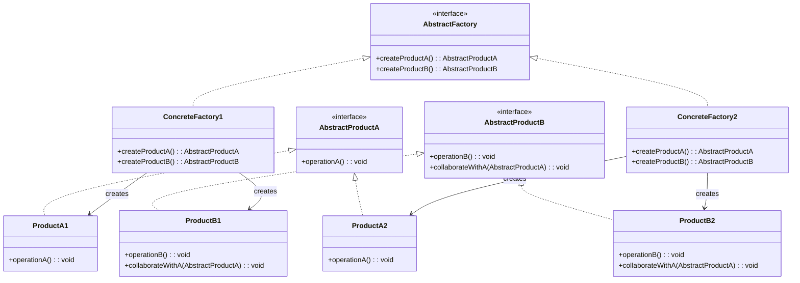

# 추상 팩토리 패턴 (Abstract Factory Pattern)

## 정의

추상 팩토리 패턴은 서로 관련이 있거나 의존적인 여러 객체들의 조합을 만드는 인터페이스를 제공하는 생성 디자인 패턴입니다. 구체적인 클래스를 지정하지 않고도 관련된 객체들의 패밀리를 생성할 수 있습니다.

## 구조 (Structure)



## 사용 이유

- **관련 객체 패밀리 생성**: 서로 연관된 여러 객체를 일관성 있게 생성할 수 있습니다.
- **플랫폼 독립성**: 클라이언트 코드를 구체적인 클래스로부터 분리하여 플랫폼에 독립적인 코드를 작성할 수 있습니다.
- **제품 일관성**: 같은 팩토리에서 생성된 제품들이 서로 호환되도록 보장합니다.

## 적용 상황

추상 팩토리 패턴은 다음과 같은 상황에서 특히 유용합니다:

### 1. 다중 플랫폼 지원
- **크로스 플랫폼 UI**: Windows, macOS, Linux별 UI 컴포넌트
- **다중 데이터베이스**: MySQL, PostgreSQL, Oracle용 DAO 객체
- **운영체제별 기능**: 파일 시스템, 네트워킹, 프로세스 관리

### 2. 제품군 관리
- **테마별 UI**: 다크 모드, 라이트 모드별 컴포넌트
- **브랜드별 제품**: 각 브랜드별 로고, 색상, 폰트 패키지
- **국가별 현지화**: 언어, 통화, 날짜 형식 패키지

### 3. 호환성 보장이 중요한 경우
```java
// 나쁜 예: 서로 다른 스타일이 섞일 수 있음
Button modernButton = new ModernButton();
TextField classicTextField = new ClassicTextField(); // 스타일 불일치!

// 좋은 예: 추상 팩토리로 일관성 보장
UIFactory factory = new ModernUIFactory();
Button button = factory.createButton();
TextField textField = factory.createTextField(); // 같은 스타일로 보장
```

## 실생활 예제 - 크로스 플랫폼 UI 컴포넌트

다양한 운영체제에서 일관된 UI를 제공하는 시스템을 추상 팩토리 패턴으로 구현해보겠습니다.

```java
// UI 컴포넌트 추상 인터페이스들
interface Button {
    void render();
    void onClick();
    String getStyle();
}

interface TextField {
    void render();
    void setText(String text);
    String getText();
    String getStyle();
}

interface CheckBox {
    void render();
    void setChecked(boolean checked);
    boolean isChecked();
    String getStyle();
}

// Windows 스타일 구현
class WindowsButton implements Button {
    private String text;

    public WindowsButton(String text) {
        this.text = text;
    }

    @Override
    public void render() {
        System.out.println("🪟 Windows 스타일 버튼 렌더링: [" + text + "]");
    }

    @Override
    public void onClick() {
        System.out.println("Windows 버튼 클릭 효과음: 'click.wav'");
    }

    @Override
    public String getStyle() {
        return "Windows Fluent Design";
    }
}

class WindowsTextField implements TextField {
    private String text = "";

    @Override
    public void render() {
        System.out.println("🪟 Windows 스타일 텍스트 필드: |" + text + "|");
    }

    @Override
    public void setText(String text) {
        this.text = text;
        System.out.println("Windows 텍스트 입력: " + text);
    }

    @Override
    public String getText() {
        return text;
    }

    @Override
    public String getStyle() {
        return "Windows Fluent Design";
    }
}

class WindowsCheckBox implements CheckBox {
    private boolean checked = false;
    private String label;

    public WindowsCheckBox(String label) {
        this.label = label;
    }

    @Override
    public void render() {
        String checkMark = checked ? "☑️" : "☐";
        System.out.println("🪟 Windows 체크박스: " + checkMark + " " + label);
    }

    @Override
    public void setChecked(boolean checked) {
        this.checked = checked;
        System.out.println("Windows 체크박스 " + (checked ? "선택됨" : "해제됨"));
    }

    @Override
    public boolean isChecked() {
        return checked;
    }

    @Override
    public String getStyle() {
        return "Windows Fluent Design";
    }
}

// macOS 스타일 구현
class MacOSButton implements Button {
    private String text;

    public MacOSButton(String text) {
        this.text = text;
    }

    @Override
    public void render() {
        System.out.println("🍎 macOS 스타일 버튼 렌더링: (" + text + ")");
    }

    @Override
    public void onClick() {
        System.out.println("macOS 버튼 햅틱 피드백 + 'pop.aiff'");
    }

    @Override
    public String getStyle() {
        return "macOS Big Sur Design";
    }
}

class MacOSTextField implements TextField {
    private String text = "";

    @Override
    public void render() {
        System.out.println("🍎 macOS 스타일 텍스트 필드: 〈" + text + "〉");
    }

    @Override
    public void setText(String text) {
        this.text = text;
        System.out.println("macOS 텍스트 입력 (자동완성 활성화): " + text);
    }

    @Override
    public String getText() {
        return text;
    }

    @Override
    public String getStyle() {
        return "macOS Big Sur Design";
    }
}

class MacOSCheckBox implements CheckBox {
    private boolean checked = false;
    private String label;

    public MacOSCheckBox(String label) {
        this.label = label;
    }

    @Override
    public void render() {
        String checkMark = checked ? "✅" : "⬜";
        System.out.println("🍎 macOS 체크박스: " + checkMark + " " + label);
    }

    @Override
    public void setChecked(boolean checked) {
        this.checked = checked;
        System.out.println("macOS 체크박스 애니메이션 " + (checked ? "체크" : "언체크"));
    }

    @Override
    public boolean isChecked() {
        return checked;
    }

    @Override
    public String getStyle() {
        return "macOS Big Sur Design";
    }
}

// Linux 스타일 구현
class LinuxButton implements Button {
    private String text;

    public LinuxButton(String text) {
        this.text = text;
    }

    @Override
    public void render() {
        System.out.println("🐧 Linux GTK 버튼 렌더링: <" + text + ">");
    }

    @Override
    public void onClick() {
        System.out.println("Linux GTK 버튼 클릭 (테마 적용)");
    }

    @Override
    public String getStyle() {
        return "Linux GTK Theme";
    }
}

class LinuxTextField implements TextField {
    private String text = "";

    @Override
    public void render() {
        System.out.println("🐧 Linux GTK 텍스트 필드: {" + text + "}");
    }

    @Override
    public void setText(String text) {
        this.text = text;
        System.out.println("Linux 터미널 스타일 입력: " + text);
    }

    @Override
    public String getText() {
        return text;
    }

    @Override
    public String getStyle() {
        return "Linux GTK Theme";
    }
}

class LinuxCheckBox implements CheckBox {
    private boolean checked = false;
    private String label;

    public LinuxCheckBox(String label) {
        this.label = label;
    }

    @Override
    public void render() {
        String checkMark = checked ? "[x]" : "[ ]";
        System.out.println("🐧 Linux 체크박스: " + checkMark + " " + label);
    }

    @Override
    public void setChecked(boolean checked) {
        this.checked = checked;
        System.out.println("Linux 체크박스 상태 변경: " + (checked ? "true" : "false"));
    }

    @Override
    public boolean isChecked() {
        return checked;
    }

    @Override
    public String getStyle() {
        return "Linux GTK Theme";
    }
}

// 추상 팩토리 인터페이스
interface UIFactory {
    Button createButton(String text);
    TextField createTextField();
    CheckBox createCheckBox(String label);
    String getThemeName();
}

// 구체적인 팩토리 구현들
class WindowsUIFactory implements UIFactory {
    @Override
    public Button createButton(String text) {
        return new WindowsButton(text);
    }

    @Override
    public TextField createTextField() {
        return new WindowsTextField();
    }

    @Override
    public CheckBox createCheckBox(String label) {
        return new WindowsCheckBox(label);
    }

    @Override
    public String getThemeName() {
        return "Windows Fluent Design System";
    }
}

class MacOSUIFactory implements UIFactory {
    @Override
    public Button createButton(String text) {
        return new MacOSButton(text);
    }

    @Override
    public TextField createTextField() {
        return new MacOSTextField();
    }

    @Override
    public CheckBox createCheckBox(String label) {
        return new MacOSCheckBox(label);
    }

    @Override
    public String getThemeName() {
        return "macOS Human Interface Guidelines";
    }
}

class LinuxUIFactory implements UIFactory {
    @Override
    public Button createButton(String text) {
        return new LinuxButton(text);
    }

    @Override
    public TextField createTextField() {
        return new LinuxTextField();
    }

    @Override
    public CheckBox createCheckBox(String label) {
        return new LinuxCheckBox(label);
    }

    @Override
    public String getThemeName() {
        return "Linux GTK Design Guidelines";
    }
}

// 클라이언트 애플리케이션
class CrossPlatformApp {
    private UIFactory uiFactory;
    private Button submitButton;
    private Button cancelButton;
    private TextField nameField;
    private TextField emailField;
    private CheckBox agreeCheckBox;
    private CheckBox subscribeCheckBox;

    public CrossPlatformApp(UIFactory uiFactory) {
        this.uiFactory = uiFactory;
        createUI();
    }

    private void createUI() {
        System.out.println("=== " + uiFactory.getThemeName() + " 테마로 UI 생성 ===");

        // 버튼들 생성
        submitButton = uiFactory.createButton("제출");
        cancelButton = uiFactory.createButton("취소");

        // 텍스트 필드들 생성
        nameField = uiFactory.createTextField();
        emailField = uiFactory.createTextField();

        // 체크박스들 생성
        agreeCheckBox = uiFactory.createCheckBox("이용약관에 동의합니다");
        subscribeCheckBox = uiFactory.createCheckBox("뉴스레터 구독");

        renderUI();
    }

    private void renderUI() {
        System.out.println("\n--- 회원가입 폼 렌더링 ---");
        System.out.println("이름:");
        nameField.render();
        System.out.println("이메일:");
        emailField.render();
        System.out.println();
        agreeCheckBox.render();
        subscribeCheckBox.render();
        System.out.println();
        submitButton.render();
        cancelButton.render();
    }

    public void simulateUserInteraction() {
        System.out.println("\n--- 사용자 입력 시뮬레이션 ---");
        nameField.setText("김개발");
        emailField.setText("kim@example.com");
        agreeCheckBox.setChecked(true);
        subscribeCheckBox.setChecked(false);

        System.out.println("\n--- 버튼 클릭 시뮬레이션 ---");
        submitButton.onClick();

        System.out.println("\n--- 입력된 정보 확인 ---");
        System.out.println("이름: " + nameField.getText());
        System.out.println("이메일: " + emailField.getText());
        System.out.println("약관 동의: " + agreeCheckBox.isChecked());
        System.out.println("뉴스레터: " + subscribeCheckBox.isChecked());
    }
}

// 팩토리 선택기
class UIFactoryProvider {
    public static UIFactory getFactory(String osType) {
        return switch (osType.toLowerCase()) {
            case "windows" -> new WindowsUIFactory();
            case "macos", "mac" -> new MacOSUIFactory();
            case "linux" -> new LinuxUIFactory();
            default -> {
                System.out.println("알 수 없는 OS입니다. Linux 기본 테마를 사용합니다.");
                yield new LinuxUIFactory();
            }
        };
    }

    public static String detectOS() {
        String os = System.getProperty("os.name").toLowerCase();
        if (os.contains("win")) return "windows";
        if (os.contains("mac")) return "macos";
        if (os.contains("nix") || os.contains("nux")) return "linux";
        return "linux"; // 기본값
    }
}

// 메인 애플리케이션
public class CrossPlatformUIDemo {
    public static void main(String[] args) {
        // 1. 현재 운영체제 감지
        String currentOS = UIFactoryProvider.detectOS();
        System.out.println("감지된 운영체제: " + currentOS);

        // 2. 해당 OS에 맞는 팩토리 생성
        UIFactory factory = UIFactoryProvider.getFactory(currentOS);

        // 3. 애플리케이션 실행
        CrossPlatformApp app = new CrossPlatformApp(factory);
        app.simulateUserInteraction();

        System.out.println("\n" + "=".repeat(50));

        // 4. 다른 OS 테마도 테스트
        System.out.println("다른 플랫폼 테마 테스트:");

        String[] testPlatforms = {"windows", "macos", "linux"};
        for (String platform : testPlatforms) {
            if (!platform.equals(currentOS)) {
                System.out.println("\n### " + platform.toUpperCase() + " 테마 테스트 ###");
                UIFactory testFactory = UIFactoryProvider.getFactory(platform);
                CrossPlatformApp testApp = new CrossPlatformApp(testFactory);
            }
        }
    }
}
```

**실행 결과 예시:**
```
감지된 운영체제: windows
=== Windows Fluent Design System 테마로 UI 생성 ===

--- 회원가입 폼 렌더링 ---
이름:
🪟 Windows 스타일 텍스트 필드: ||
이메일:
🪟 Windows 스타일 텍스트 필드: ||

🪟 Windows 체크박스: ☐ 이용약관에 동의합니다
🪟 Windows 체크박스: ☐ 뉴스레터 구독

🪟 Windows 스타일 버튼 렌더링: [제출]
🪟 Windows 스타일 버튼 렌더링: [취소]

--- 사용자 입력 시뮬레이션 ---
Windows 텍스트 입력: 김개발
Windows 텍스트 입력: kim@example.com
Windows 체크박스 선택됨
Windows 체크박스 해제됨

--- 버튼 클릭 시뮬레이션 ---
Windows 버튼 클릭 효과음: 'click.wav'

--- 입력된 정보 확인 ---
이름: 김개발
이메일: kim@example.com
약관 동의: true
뉴스레터: false
```

## 팩토리 메서드 패턴과의 차이점

| 구분 | 팩토리 메서드 | 추상 팩토리 |
|------|---------------|-------------|
| **목적** | 단일 제품 생성 | 관련 제품군 생성 |
| **생성 객체** | 하나의 제품 | 여러 관련 제품 |
| **구조** | 하나의 팩토리 메서드 | 여러 팩토리 메서드 |
| **사용 시기** | 객체 타입이 다양할 때 | 제품 패밀리가 다양할 때 |

```java
// 팩토리 메서드: 하나의 제품만 생성
abstract class ButtonFactory {
    abstract Button createButton(); // 단일 제품
}

// 추상 팩토리: 관련된 여러 제품을 생성
interface UIFactory {
    Button createButton();    // 제품 A
    TextField createTextField(); // 제품 B
    CheckBox createCheckBox();   // 제품 C
}
```

## 기본 예제 코드 (Java)

```java
// 추상 제품들
interface AbstractProductA {
    void operationA();
}

interface AbstractProductB {
    void operationB();
    void collaborate(AbstractProductA productA);
}

// 구체적인 제품들 - 패밀리 1
class ConcreteProductA1 implements AbstractProductA {
    @Override
    public void operationA() {
        System.out.println("Product A1 operation");
    }
}

class ConcreteProductB1 implements AbstractProductB {
    @Override
    public void operationB() {
        System.out.println("Product B1 operation");
    }

    @Override
    public void collaborate(AbstractProductA productA) {
        System.out.println("B1 collaborating with A1");
    }
}

// 구체적인 제품들 - 패밀리 2
class ConcreteProductA2 implements AbstractProductA {
    @Override
    public void operationA() {
        System.out.println("Product A2 operation");
    }
}

class ConcreteProductB2 implements AbstractProductB {
    @Override
    public void operationB() {
        System.out.println("Product B2 operation");
    }

    @Override
    public void collaborate(AbstractProductA productA) {
        System.out.println("B2 collaborating with A2");
    }
}

// 추상 팩토리
interface AbstractFactory {
    AbstractProductA createProductA();
    AbstractProductB createProductB();
}

// 구체적인 팩토리들
class ConcreteFactory1 implements AbstractFactory {
    @Override
    public AbstractProductA createProductA() {
        return new ConcreteProductA1();
    }

    @Override
    public AbstractProductB createProductB() {
        return new ConcreteProductB1();
    }
}

class ConcreteFactory2 implements AbstractFactory {
    @Override
    public AbstractProductA createProductA() {
        return new ConcreteProductA2();
    }

    @Override
    public AbstractProductB createProductB() {
        return new ConcreteProductB2();
    }
}

// 클라이언트
public class Client {
    public static void main(String[] args) {
        AbstractFactory factory1 = new ConcreteFactory1();
        AbstractProductA productA1 = factory1.createProductA();
        AbstractProductB productB1 = factory1.createProductB();

        productA1.operationA();
        productB1.operationB();
        productB1.collaborate(productA1);
    }
}
```

## 장점

- **제품 일관성**: 같은 팩토리에서 생성된 제품들이 서로 호환됩니다.
- **결합도 감소**: 클라이언트 코드가 구체적인 클래스에 의존하지 않습니다.
- **확장 용이**: 새로운 제품 패밀리를 추가하기 쉽습니다.
- **단일 책임 원칙**: 제품 생성 로직이 한 곳에 집중됩니다.
- **개방-폐쇄 원칙**: 기존 코드 수정 없이 새로운 팩토리와 제품을 추가할 수 있습니다.

## 단점

- **복잡성 증가**: 많은 인터페이스와 클래스가 필요하여 코드가 복잡해집니다.
- **제품 추가 어려움**: 새로운 종류의 제품을 추가하려면 모든 팩토리를 수정해야 합니다.
- **런타임 오버헤드**: 팩토리를 통한 객체 생성으로 인한 성능 오버헤드가 있을 수 있습니다.