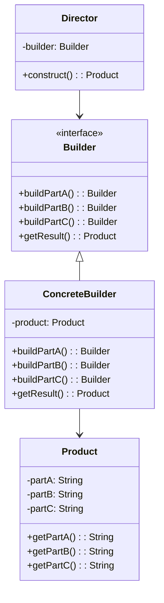

# 빌더 패턴 (Builder Pattern)

## 정의

빌더 패턴은 복잡한 객체를 생성하는 과정을 단계별로 분리하여, 동일한 생성 절차에서 서로 다른 표현 결과를 만들 수 있도록 하는 생성 디자인 패턴입니다.

## 구조 (Structure)



## 사용 이유

- **복잡한 객체 생성**: 생성자에 많은 매개변수가 필요하거나, 객체 생성 과정이 여러 단계로 구성되어 복잡할 때 유용합니다.
- **가독성 향상**: 메서드 체이닝(Method Chaining)을 통해 각 필드에 어떤 값이 설정되는지 명확하게 알 수 있어 코드의 가독성이 높아집니다.
- **일관성 유지**: 객체 생성 과정을 디렉터(Director) 클래스로 중앙에서 관리하면, 복잡한 객체를 일관성 있게 생성할 수 있습니다.
- **불변 객체 생성**: 생성 과정이 완료된 후에는 변경할 수 없는 불변(Immutable) 객체를 만드는 데 용이합니다.

## 적용 상황

빌더 패턴은 다음과 같은 상황에서 특히 유용합니다:

### 1. 복잡한 설정을 가진 객체
- **컴퓨터 조립**: CPU, RAM, 저장장치, GPU 등 다양한 부품을 선택적으로 조합
- **건물 설계**: 기초, 벽체, 지붕, 인테리어 등을 단계별로 설계
- **음식 주문**: 메인 메뉴는 필수, 사이드 메뉴와 음료는 선택사항

### 2. 매개변수가 많은 생성자 문제 해결
```java
// 나쁜 예: 매개변수가 너무 많고 의미가 불분명
Computer computer = new Computer("Intel i7", "16GB", "512GB SSD", "RTX 4070", "Windows 11", true, false, "WiFi 6");

// 좋은 예: 빌더 패턴 사용
Computer computer = new Computer.Builder("Intel i7", "16GB")
    .storage("512GB SSD")
    .gpu("RTX 4070")
    .os("Windows 11")
    .hasWiFi(true)
    .build();
```

## 실생활 예제 - 컴퓨터 조립

컴퓨터를 주문할 때를 생각해보세요. CPU와 RAM은 필수 사양이지만, 저장장치, GPU, 운영체제 등은 사용자의 필요에 따라 선택할 수 있습니다.

```java
// 컴퓨터 클래스
class Computer {
    // 필수 구성요소
    private final String cpu;
    private final String ram;

    // 선택적 구성요소
    private final String storage;
    private final String gpu;
    private final String os;
    private final boolean hasWiFi;
    private final boolean hasBluetooth;
    private final String networkCard;

    private Computer(Builder builder) {
        this.cpu = builder.cpu;
        this.ram = builder.ram;
        this.storage = builder.storage;
        this.gpu = builder.gpu;
        this.os = builder.os;
        this.hasWiFi = builder.hasWiFi;
        this.hasBluetooth = builder.hasBluetooth;
        this.networkCard = builder.networkCard;
    }

    @Override
    public String toString() {
        return String.format(
            "컴퓨터 사양:\n" +
            "- CPU: %s\n" +
            "- RAM: %s\n" +
            "- 저장장치: %s\n" +
            "- GPU: %s\n" +
            "- 운영체제: %s\n" +
            "- WiFi: %s\n" +
            "- 블루투스: %s\n" +
            "- 네트워크 카드: %s",
            cpu, ram, storage, gpu, os,
            hasWiFi ? "지원" : "미지원",
            hasBluetooth ? "지원" : "미지원",
            networkCard
        );
    }

    public static class Builder {
        // 필수 매개변수
        private final String cpu;
        private final String ram;

        // 선택적 매개변수 - 기본값으로 초기화
        private String storage = "256GB SSD";
        private String gpu = "내장 그래픽";
        private String os = "운영체제 없음";
        private boolean hasWiFi = false;
        private boolean hasBluetooth = false;
        private String networkCard = "기본 이더넷";

        public Builder(String cpu, String ram) {
            this.cpu = cpu;
            this.ram = ram;
        }

        public Builder storage(String storage) {
            this.storage = storage;
            return this;
        }

        public Builder gpu(String gpu) {
            this.gpu = gpu;
            return this;
        }

        public Builder os(String os) {
            this.os = os;
            return this;
        }

        public Builder hasWiFi(boolean hasWiFi) {
            this.hasWiFi = hasWiFi;
            return this;
        }

        public Builder hasBluetooth(boolean hasBluetooth) {
            this.hasBluetooth = hasBluetooth;
            return this;
        }

        public Builder networkCard(String networkCard) {
            this.networkCard = networkCard;
            return this;
        }

        public Computer build() {
            return new Computer(this);
        }
    }
}

// 사용 예시
public class ComputerStore {
    public static void main(String[] args) {
        // 기본 사무용 컴퓨터
        Computer officeComputer = new Computer.Builder("Intel i5", "8GB")
            .os("Windows 11")
            .hasWiFi(true)
            .build();

        System.out.println("=== 사무용 컴퓨터 ===");
        System.out.println(officeComputer);

        // 고성능 게이밍 컴퓨터
        Computer gamingComputer = new Computer.Builder("Intel i9", "32GB")
            .storage("1TB NVMe SSD")
            .gpu("RTX 4080")
            .os("Windows 11 Pro")
            .hasWiFi(true)
            .hasBluetooth(true)
            .networkCard("기가비트 이더넷")
            .build();

        System.out.println("\n=== 게이밍 컴퓨터 ===");
        System.out.println(gamingComputer);
    }
}
```

## Lombok을 사용한 스프링 예제

Spring Boot에서 Lombok의 `@Builder` 어노테이션을 사용하면 빌더 패턴을 더 간편하게 구현할 수 있습니다.

```java
import lombok.Builder;
import lombok.Getter;
import lombok.ToString;
import javax.validation.constraints.*;
import java.time.LocalDateTime;

// 사용자 등록 요청 DTO
@Builder
@Getter
@ToString
public class UserRegistrationRequest {

    @NotBlank(message = "사용자명은 필수입니다")
    @Size(min = 2, max = 50, message = "사용자명은 2~50자 사이여야 합니다")
    private final String username;

    @NotBlank(message = "이메일은 필수입니다")
    @Email(message = "올바른 이메일 형식이 아닙니다")
    private final String email;

    @NotBlank(message = "비밀번호는 필수입니다")
    @Size(min = 8, message = "비밀번호는 최소 8자 이상이어야 합니다")
    private final String password;

    @Min(value = 18, message = "나이는 18세 이상이어야 합니다")
    @Max(value = 150, message = "나이는 150세 이하여야 합니다")
    private final Integer age;

    @Pattern(regexp = "^010-\\d{4}-\\d{4}$", message = "휴대폰 번호 형식이 올바르지 않습니다")
    private final String phoneNumber;

    // 선택적 필드들
    private final String address;
    private final String nickname;
    private final LocalDateTime registrationDate;

    @Builder.Default
    private final boolean emailNotificationEnabled = true;

    @Builder.Default
    private final boolean smsNotificationEnabled = false;
}

// 사용자 엔티티
@Entity
@Table(name = "users")
@Builder
@Getter
@NoArgsConstructor
@AllArgsConstructor
public class User {

    @Id
    @GeneratedValue(strategy = GenerationType.IDENTITY)
    private Long id;

    @Column(unique = true, nullable = false)
    private String username;

    @Column(unique = true, nullable = false)
    private String email;

    @Column(nullable = false)
    private String passwordHash;

    private Integer age;
    private String phoneNumber;
    private String address;
    private String nickname;

    @Column(name = "email_notification_enabled")
    @Builder.Default
    private Boolean emailNotificationEnabled = true;

    @Column(name = "sms_notification_enabled")
    @Builder.Default
    private Boolean smsNotificationEnabled = false;

    @CreationTimestamp
    private LocalDateTime createdAt;

    @UpdateTimestamp
    private LocalDateTime updatedAt;
}

// 서비스 클래스
@Service
@RequiredArgsConstructor
public class UserService {

    private final UserRepository userRepository;
    private final PasswordEncoder passwordEncoder;

    @Transactional
    public User registerUser(@Valid UserRegistrationRequest request) {
        // 빌더 패턴을 사용한 User 엔티티 생성
        User user = User.builder()
            .username(request.getUsername())
            .email(request.getEmail())
            .passwordHash(passwordEncoder.encode(request.getPassword()))
            .age(request.getAge())
            .phoneNumber(request.getPhoneNumber())
            .address(request.getAddress())
            .nickname(request.getNickname())
            .emailNotificationEnabled(request.isEmailNotificationEnabled())
            .smsNotificationEnabled(request.isSmsNotificationEnabled())
            .build();

        return userRepository.save(user);
    }
}

// 컨트롤러
@RestController
@RequestMapping("/api/users")
@RequiredArgsConstructor
public class UserController {

    private final UserService userService;

    @PostMapping("/register")
    public ResponseEntity<UserResponse> registerUser(
            @Valid @RequestBody UserRegistrationRequest request) {

        User user = userService.registerUser(request);

        // 응답 DTO도 빌더 패턴으로 생성
        UserResponse response = UserResponse.builder()
            .id(user.getId())
            .username(user.getUsername())
            .email(user.getEmail())
            .age(user.getAge())
            .nickname(user.getNickname())
            .createdAt(user.getCreatedAt())
            .build();

        return ResponseEntity.ok(response);
    }
}

// 사용 예시 - 테스트 코드
@Test
public void testUserRegistration() {
    // Lombok 빌더를 사용한 객체 생성
    UserRegistrationRequest request = UserRegistrationRequest.builder()
        .username("johndoe")
        .email("john@example.com")
        .password("securePassword123")
        .age(25)
        .phoneNumber("010-1234-5678")
        .address("서울시 강남구")
        .nickname("John")
        .emailNotificationEnabled(true)
        .smsNotificationEnabled(false)
        .build();

    // 검증 및 등록
    User registeredUser = userService.registerUser(request);

    assertThat(registeredUser.getUsername()).isEqualTo("johndoe");
    assertThat(registeredUser.getEmail()).isEqualTo("john@example.com");
}
```

## 빌더 패턴에서 검증(Validation) 구현

빌더 패턴에서 객체 생성 시 필수값 검증과 비즈니스 로직 검증을 구현하는 방법들을 살펴보겠습니다.

### 1. Lombok + Bean Validation 조합 (추천)

Lombok의 `@Builder`와 Bean Validation을 함께 사용하면 가장 깔끔하고 편리하게 검증을 구현할 수 있습니다.

```java
@Data
@Builder
public class AdvancedNotifyRequest {

    @Size(min = 1, max = 50)
    private String id;

    @NotBlank(message = "메시지는 필수입니다")
    @Size(max = 1000, message = "메시지는 1000자 이하여야 합니다")
    private String message;

    @NotBlank(message = "채널은 필수입니다")
    private String channel;

    @Builder.Default
    private boolean isNotify = true;

    // 검증을 수행하는 빌더
    public static class AdvancedNotifyRequestBuilder {

        private Validator validator;

        public AdvancedNotifyRequestBuilder withValidator(Validator validator) {
            this.validator = validator;
            return this;
        }

        public AdvancedNotifyRequest build() {
            AdvancedNotifyRequest request = new AdvancedNotifyRequest(isNotify, message, channel);

            // 무조건 검증 수행
            if (validator == null) {
                throw new IllegalStateException("검증을 위해 withValidator()를 먼저 호출해야 합니다");
            }

            Set<ConstraintViolation<AdvancedNotifyRequest>> violations =
                validator.validate(request);

            if (!violations.isEmpty()) {
                StringBuilder sb = new StringBuilder("검증 오류: ");
                violations.forEach(violation ->
                    sb.append(violation.getMessage()).append("; "));
                throw new IllegalArgumentException(sb.toString());
            }

            return request;
        }
    }
}
```

**사용 예시:**

```java
@Service
@RequiredArgsConstructor
public class NotificationService {

    private final Validator validator;

    public void createNotification() {
        try {
            // Bean Validation을 사용한 검증
            AdvancedNotifyRequest request = AdvancedNotifyRequest.builder()
                .id("NOTI_001")
                .message("새로운 알림입니다")
                .channel("email")
                .isNotify(true)
                .withValidator(validator)
                .build();

            System.out.println("알림 객체 생성 성공");

        } catch (IllegalArgumentException e) {
            System.err.println("검증 실패: " + e.getMessage());
        }
    }

    public void demonstrateValidationFailure() {
        try {
            // 실패 케이스: 필수 필드 누락
            AdvancedNotifyRequest.builder()
                .id("NOTI_002")
                // message 누락 - @NotBlank 때문에 실패
                .channel("slack")
                .withValidator(validator)
                .build();

        } catch (IllegalArgumentException e) {
            System.err.println("예상된 검증 실패: " + e.getMessage());
        }
    }
}
```

### 2. 추가적인 고급 활용법 - 자동 검증 빌더

빌더 패턴에서 Bean Validation을 활용하여 별도 설정 없이 자동으로 검증을 수행하는 방법입니다.

```java
@Data
@Builder
public class NotifyRequest {

    @Size(min = 1, max = 50)
    private String id;

    @NotBlank(message = "메시지는 필수입니다")
    @Size(max = 1000, message = "메시지는 1000자 이하여야 합니다")
    private String message;

    @NotBlank(message = "채널은 필수입니다")
    private String channel;

    @Builder.Default
    private boolean isNotify = true;

    // 정적 Validator 인스턴스 - 한 번만 생성하고 재사용
    private static final Validator validator = Validation.buildDefaultValidatorFactory().getValidator();

    // 완전 자동화된 빌더
    public static class NotifyRequestBuilder {

        public NotifyRequest build() {
            NotifyRequest request = new NotifyRequest(isNotify, message, channel);

            // 자동으로 검증 수행 - 별도 설정 불필요
            Set<ConstraintViolation<NotifyRequest>> violations =
                validator.validate(request);

            if (!violations.isEmpty()) {
                StringBuilder sb = new StringBuilder("검증 오류: ");
                violations.forEach(violation ->
                    sb.append(violation.getMessage()).append("; "));
                throw new IllegalArgumentException(sb.toString());
            }

            return request;
        }
    }
}
```

**사용 예시:**

```java
@Service
public class NotificationService {

    public void createNotification() {
        try {
            // 완전 자동화 - 별도 설정 없이 바로 사용
            NotifyRequest request = NotifyRequest.builder()
                .id("NOTI_001")
                .message("새로운 알림입니다")
                .channel("email")
                .build();  // 자동으로 검증됨!

            System.out.println("알림 객체 생성 성공");

        } catch (IllegalArgumentException e) {
            System.err.println("검증 실패: " + e.getMessage());
        }
    }

    public void demonstrateAutoValidation() {
        try {
            // 실패 케이스: 필수 필드 누락 - 자동으로 검증됨
            NotifyRequest.builder()
                .id("NOTI_002")
                // message 누락 - @NotBlank 때문에 자동으로 실패
                .channel("email")
                .build();

        } catch (IllegalArgumentException e) {
            System.err.println("자동 검증 실패: " + e.getMessage());
        }
    }
}
```

## 기본 예제 코드 (Java)

```java
// Product 클래스
class Product {
    private String partA;
    private String partB;
    private String partC;

    // 빌더를 통해서만 인스턴스화 가능하도록 private 생성자
    private Product(Builder builder) {
        this.partA = builder.partA;
        this.partB = builder.partB;
        this.partC = builder.partC;
    }

    @Override
    public String toString() {
        return "Product [partA=" + partA + ", partB=" + partB + ", partC=" + partC + "]";
    }

    // Static nested Builder 클래스
    public static class Builder {
        // 필수 매개변수
        private final String partA;

        // 선택적 매개변수
        private String partB = "DefaultB";
        private String partC = "DefaultC";

        public Builder(String partA) {
            this.partA = partA;
        }

        public Builder setPartB(String partB) {
            this.partB = partB;
            return this; // 메서드 체이닝을 위해 this 반환
        }

        public Builder setPartC(String partC) {
            this.partC = partC;
            return this;
        }

        public Product build() {
            return new Product(this);
        }
    }
}

// 사용 예시
public class Client {
    public static void main(String[] args) {
        // 필수 값만 설정
        Product product1 = new Product.Builder("PartA_Value").build();
        System.out.println(product1);

        // 모든 값 설정
        Product product2 = new Product.Builder("PartA_Value")
                                      .setPartB("PartB_Value")
                                      .setPartC("PartC_Value")
                                      .build();
        System.out.println(product2);
    }
}
```

## 장점

- **코드 가독성**: 필요한 값만 설정하고, 메서드 이름을 통해 어떤 값을 설정하는지 명확히 알 수 있습니다.
- **객체 생성 제어**: 객체를 생성하는 단계를 세밀하게 제어할 수 있습니다.
- **불변성**: `build()` 메서드가 호출되기 전까지는 객체가 생성되지 않으며, 한 번 생성된 후에는 상태를 변경하지 않는 불변 객체를 쉽게 만들 수 있습니다.
- **유연성**: 동일한 생성 과정으로 다양한 객체 표현을 만들 수 있습니다.
- **매개변수 검증**: `build()` 메서드에서 객체 생성 전에 매개변수 유효성을 검사할 수 있습니다.

## 단점

- **코드 복잡성 증가**: 빌더 클래스를 추가로 작성해야 하므로 코드의 양이 늘어납니다. 간단한 객체를 생성할 때는 오버헤드가 될 수 있습니다.
- **내부 빌더의 불변성**: 빌더 자체는 불변이 아니므로, `build()` 메서드 호출 전에 빌더의 상태가 변경될 수 있습니다.
- **메모리 사용량**: 빌더 객체가 추가로 생성되므로 메모리 사용량이 증가합니다.