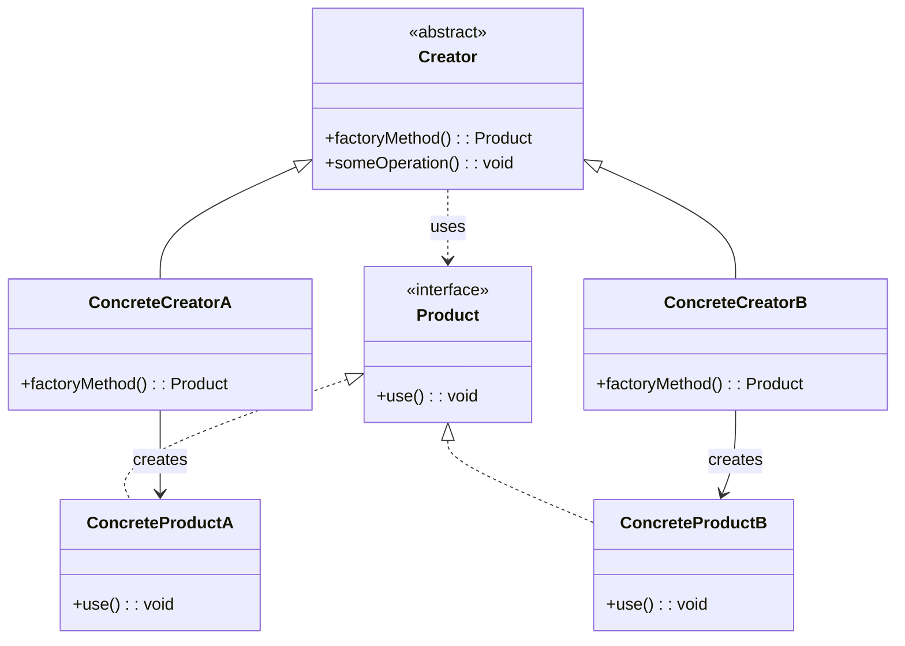

# 팩토리 메서드 패턴 (Factory Method Pattern)

## 정의

팩토리 메서드 패턴은 객체를 생성하기 위한 인터페이스를 정의하지만, 어떤 클래스의 인스턴스를 생성할지에 대한 결정은 서브클래스에서 내리도록 하는 생성 디자인 패턴입니다. 즉, 객체 생성 과정을 서브클래스에 위임하는 것입니다.

## 구조 (Structure)



## 사용 이유

- **결합도 감소**: 객체를 생성하는 코드와 사용하는 코드를 분리하여 결합도를 낮출 수 있습니다. 클라이언트 코드는 구체적인 클래스 이름 대신 인터페이스에만 의존하게 됩니다.
- **유연성 및 확장성 증가**: 새로운 종류의 객체를 추가해야 할 때, 기존 팩토리 코드를 수정하는 대신 새로운 서브클래스를 추가하여 팩토리 메서드를 오버라이드하면 되므로 시스템의 확장성이 향상됩니다.

## 적용 상황

팩토리 메서드 패턴은 다음과 같은 상황에서 특히 유용합니다:

### 1. 런타임에 객체 타입이 결정되는 경우
- **게임 개발**: 플레이어가 선택한 캐릭터 클래스에 따라 다른 캐릭터 객체 생성
- **UI 컴포넌트**: 운영체제에 따라 다른 스타일의 버튼, 윈도우 생성
- **데이터베이스 연결**: 설정에 따라 MySQL, PostgreSQL, Oracle 등 다른 DB 드라이버 생성

### 2. 라이브러리나 프레임워크 개발 시
```java
// 나쁜 예: 직접 구현체에 의존
PaymentProcessor processor = new CreditCardProcessor();

// 좋은 예: 팩토리 메서드 사용
PaymentProcessorFactory factory = getFactory(paymentType);
PaymentProcessor processor = factory.createProcessor();
```

## 실생활 예제 - 게임 캐릭터 생성 시스템

RPG 게임에서 플레이어가 선택한 직업에 따라 다른 특성을 가진 캐릭터를 생성하는 시스템을 구현해보겠습니다.

```java
// 게임 캐릭터 인터페이스
interface GameCharacter {
    void attack();
    void defend();
    void useSpecialSkill();
    String getCharacterInfo();
}

// 전사 캐릭터
class Warrior implements GameCharacter {
    private String name;
    private int health = 150;
    private int damage = 25;

    public Warrior(String name) {
        this.name = name;
    }

    @Override
    public void attack() {
        System.out.println(name + " 전사가 검으로 " + damage + "의 피해를 입힙니다!");
    }

    @Override
    public void defend() {
        System.out.println(name + " 전사가 방패로 방어합니다! (피해 50% 감소)");
    }

    @Override
    public void useSpecialSkill() {
        System.out.println(name + " 전사가 '분노의 일격'을 사용합니다! (피해 2배)");
    }

    @Override
    public String getCharacterInfo() {
        return String.format("전사 %s - 체력: %d, 공격력: %d", name, health, damage);
    }
}

// 마법사 캐릭터
class Mage implements GameCharacter {
    private String name;
    private int health = 80;
    private int mana = 120;
    private int damage = 35;

    public Mage(String name) {
        this.name = name;
    }

    @Override
    public void attack() {
        System.out.println(name + " 마법사가 파이어볼로 " + damage + "의 마법 피해를 입힙니다!");
    }

    @Override
    public void defend() {
        System.out.println(name + " 마법사가 마법 보호막을 사용합니다! (마나 -10)");
    }

    @Override
    public void useSpecialSkill() {
        System.out.println(name + " 마법사가 '메테오'를 시전합니다! (광역 피해)");
    }

    @Override
    public String getCharacterInfo() {
        return String.format("마법사 %s - 체력: %d, 마나: %d, 마법력: %d", name, health, mana, damage);
    }
}

// 궁수 캐릭터
class Archer implements GameCharacter {
    private String name;
    private int health = 100;
    private int arrows = 50;
    private int damage = 20;

    public Archer(String name) {
        this.name = name;
    }

    @Override
    public void attack() {
        if (arrows > 0) {
            System.out.println(name + " 궁수가 화살로 " + damage + "의 피해를 입힙니다! (남은 화살: " + (--arrows) + ")");
        } else {
            System.out.println(name + " 궁수의 화살이 떨어졌습니다!");
        }
    }

    @Override
    public void defend() {
        System.out.println(name + " 궁수가 재빠르게 회피합니다! (회피율 70%)");
    }

    @Override
    public void useSpecialSkill() {
        System.out.println(name + " 궁수가 '관통사격'을 사용합니다! (적 관통)");
    }

    @Override
    public String getCharacterInfo() {
        return String.format("궁수 %s - 체력: %d, 화살: %d, 공격력: %d", name, health, arrows, damage);
    }
}

// 캐릭터 생성 팩토리 추상 클래스
abstract class CharacterCreator {
    // 팩토리 메서드 - 서브클래스에서 구현
    public abstract GameCharacter createCharacter(String playerName);

    // 캐릭터 생성 및 초기화를 담당하는 템플릿 메서드
    public GameCharacter createAndInitializeCharacter(String playerName) {
        GameCharacter character = createCharacter(playerName);

        System.out.println("=== 캐릭터 생성 완료 ===");
        System.out.println(character.getCharacterInfo());
        System.out.println("초기 장비를 지급합니다...");
        System.out.println("튜토리얼을 시작합니다...");

        return character;
    }
}

// 전사 생성 팩토리
class WarriorCreator extends CharacterCreator {
    @Override
    public GameCharacter createCharacter(String playerName) {
        System.out.println("용맹한 전사를 생성합니다...");
        return new Warrior(playerName);
    }
}

// 마법사 생성 팩토리
class MageCreator extends CharacterCreator {
    @Override
    public GameCharacter createCharacter(String playerName) {
        System.out.println("지혜로운 마법사를 생성합니다...");
        return new Mage(playerName);
    }
}

// 궁수 생성 팩토리
class ArcherCreator extends CharacterCreator {
    @Override
    public GameCharacter createCharacter(String playerName) {
        System.out.println("민첩한 궁수를 생성합니다...");
        return new Archer(playerName);
    }
}

// 게임 시스템
public class GameCharacterSystem {
    public static void main(String[] args) {
        Scanner scanner = new Scanner(System.in);

        System.out.println("=== RPG 게임 캐릭터 생성 ===");
        System.out.print("플레이어 이름을 입력하세요: ");
        String playerName = scanner.nextLine();

        System.out.println("\n직업을 선택하세요:");
        System.out.println("1. 전사 (높은 체력과 방어력)");
        System.out.println("2. 마법사 (강력한 마법 공격)");
        System.out.println("3. 궁수 (빠른 원거리 공격)");
        System.out.print("선택 (1-3): ");

        int choice = scanner.nextInt();
        CharacterCreator creator = getCharacterCreator(choice);

        if (creator != null) {
            GameCharacter character = creator.createAndInitializeCharacter(playerName);

            // 캐릭터 테스트
            System.out.println("\n=== 캐릭터 능력 테스트 ===");
            character.attack();
            character.defend();
            character.useSpecialSkill();
        } else {
            System.out.println("잘못된 선택입니다.");
        }

        scanner.close();
    }

    // 팩토리 선택 로직
    private static CharacterCreator getCharacterCreator(int choice) {
        return switch (choice) {
            case 1 -> new WarriorCreator();
            case 2 -> new MageCreator();
            case 3 -> new ArcherCreator();
            default -> null;
        };
    }
}
```

**실행 결과 예시:**
```
=== RPG 게임 캐릭터 생성 ===
플레이어 이름을 입력하세요: 드래곤슬레이어

직업을 선택하세요:
1. 전사 (높은 체력과 방어력)
2. 마법사 (강력한 마법 공격)
3. 궁수 (빠른 원거리 공격)
선택 (1-3): 1

용맹한 전사를 생성합니다...
=== 캐릭터 생성 완료 ===
전사 드래곤슬레이어 - 체력: 150, 공격력: 25
초기 장비를 지급합니다...
튜토리얼을 시작합니다...

=== 캐릭터 능력 테스트 ===
드래곤슬레이어 전사가 검으로 25의 피해를 입힙니다!
드래곤슬레이어 전사가 방패로 방어합니다! (피해 50% 감소)
드래곤슬레이어 전사가 '분노의 일격'을 사용합니다! (피해 2배)
```

## 기본 예제 코드 (Java)

```java
// Product 인터페이스
interface Product {
    void use();
}

// ConcreteProduct A
class ConcreteProductA implements Product {
    @Override
    public void use() {
        System.out.println("Using Product A");
    }
}

// ConcreteProduct B
class ConcreteProductB implements Product {
    @Override
    public void use() {
        System.out.println("Using Product B");
    }
}

// Creator (Factory) 추상 클래스
abstract class Creator {
    // 팩토리 메서드 (서브클래스가 구현)
    public abstract Product factoryMethod();

    public void someOperation() {
        Product product = factoryMethod();
        product.use();
    }
}

// ConcreteCreator A
class ConcreteCreatorA extends Creator {
    @Override
    public Product factoryMethod() {
        return new ConcreteProductA();
    }
}

// ConcreteCreator B
class ConcreteCreatorB extends Creator {
    @Override
    public Product factoryMethod() {
        return new ConcreteProductB();
    }
}

// 사용 예시
public class Client {
    public static void main(String[] args) {
        Creator creatorA = new ConcreteCreatorA();
        creatorA.someOperation(); // "Using Product A" 출력

        Creator creatorB = new ConcreteCreatorB();
        creatorB.someOperation(); // "Using Product B" 출력
    }
}
```

## 장점

- **느슨한 결합**: 클라이언트와 구체적인 제품 클래스 간의 결합을 분리합니다.
- **단일 책임 원칙(SRP)**: 제품 생성 코드를 한 곳으로 모아 코드의 유지보수성을 높입니다.
- **개방-폐쇄 원칙(OCP)**: 새로운 제품 유형을 추가할 때 기존 클라이언트 코드를 수정하지 않고 새로운 생성자 클래스를 추가할 수 있습니다.
- **코드 재사용성**: 공통적인 객체 생성 로직을 추상 클래스에서 정의하여 재사용할 수 있습니다.

## 단점

- **코드 복잡성 증가**: 패턴을 구현하기 위해 많은 새로운 클래스(인터페이스, 생성자, 제품 클래스 등)가 필요하므로 코드의 전체적인 복잡성이 증가할 수 있습니다.
- **클래스 수 증가**: 새로운 제품 타입마다 해당하는 팩토리 클래스를 만들어야 하므로 클래스 수가 늘어납니다.