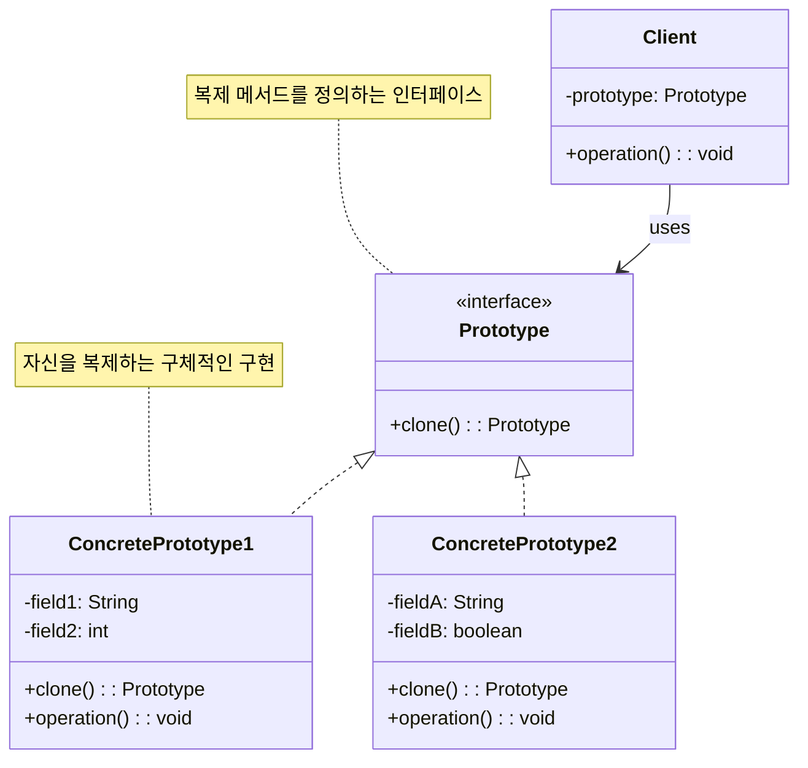

# 프로토타입 패턴 (Prototype Pattern)

## 정의

프로토타입 패턴은 기존 객체를 복제하여 새로운 객체를 생성하는 생성 디자인 패턴입니다. 클래스로부터 객체를 생성하는 것이 비용이 많이 들거나 복잡할 때, 기존 인스턴스를 복제하여 새로운 인스턴스를 만드는 것이 더 효율적일 수 있습니다.

## 구조 (Structure)



## 사용 이유

- **성능 최적화**: 복잡한 객체 생성 과정을 피하고 기존 객체를 복제하여 성능을 향상시킵니다.
- **동적 객체 생성**: 런타임에 생성할 객체의 타입이 결정될 때 유용합니다.
- **복잡한 초기화 비용 절약**: 데이터베이스 연결, 파일 로딩 등 비용이 큰 초기화 작업을 한 번만 수행합니다.

## 적용 상황

프로토타입 패턴은 다음과 같은 상황에서 특히 유용합니다:

### 1. 객체 생성 비용이 높은 경우
- **복잡한 그래픽 객체**: 3D 모델, 이미지 처리 결과
- **데이터베이스 쿼리 결과**: 복잡한 조인 쿼리의 결과 객체
- **네트워크 리소스**: API 호출 결과, 원격 데이터

### 2. 다양한 설정의 객체가 필요한 경우
- **게임 아이템**: 기본 무기에서 다양한 옵션이 추가된 변형
- **문서 템플릿**: 기본 양식에서 부분적으로 수정된 문서
- **UI 컴포넌트**: 기본 스타일에서 색상, 크기 등이 변경된 컴포넌트

### 3. 객체의 클래스가 런타임에 결정되는 경우
```java
// 나쁜 예: 하드코딩된 객체 생성
if (type.equals("warrior")) {
    return new Warrior(); // 새로운 타입 추가시 코드 수정 필요
}

// 좋은 예: 프로토타입 패턴 사용
return prototypeRegistry.getPrototype(type).clone(); // 설정으로 관리 가능
```

## 얕은 복사 vs 깊은 복사

프로토타입 패턴을 구현할 때 가장 중요한 고려사항은 복사의 깊이입니다.

### 얕은 복사 (Shallow Copy)

```java
class ShallowCopyExample implements Cloneable {
    private String name;
    private List<String> items;

    public ShallowCopyExample(String name) {
        this.name = name;
        this.items = new ArrayList<>();
    }

    @Override
    public ShallowCopyExample clone() {
        try {
            return (ShallowCopyExample) super.clone(); // 얕은 복사
        } catch (CloneNotSupportedException e) {
            throw new RuntimeException(e);
        }
    }

    // getter, setter 메서드들...
}

// 문제점: 참조 객체가 공유됨
ShallowCopyExample original = new ShallowCopyExample("Original");
original.getItems().add("Item1");

ShallowCopyExample copy = original.clone();
copy.getItems().add("Item2"); // original의 items에도 영향!

System.out.println(original.getItems()); // [Item1, Item2] - 예상치 못한 변경!
```

### 깊은 복사 (Deep Copy)

```java
class DeepCopyExample implements Cloneable {
    private String name;
    private List<String> items;

    public DeepCopyExample(String name) {
        this.name = name;
        this.items = new ArrayList<>();
    }

    @Override
    public DeepCopyExample clone() {
        try {
            DeepCopyExample cloned = (DeepCopyExample) super.clone();
            cloned.items = new ArrayList<>(this.items); // 깊은 복사
            return cloned;
        } catch (CloneNotSupportedException e) {
            throw new RuntimeException(e);
        }
    }

    // getter, setter 메서드들...
}

// 안전한 복사: 각각 독립적인 객체
DeepCopyExample original = new DeepCopyExample("Original");
original.getItems().add("Item1");

DeepCopyExample copy = original.clone();
copy.getItems().add("Item2"); // original에 영향 없음

System.out.println(original.getItems()); // [Item1] - 예상대로 동작
System.out.println(copy.getItems()); // [Item1, Item2]
```

## 실생활 예제 - 게임 몬스터 복제 시스템

RPG 게임에서 다양한 몬스터를 효율적으로 생성하는 시스템을 프로토타입 패턴으로 구현해보겠습니다.

```java
import java.util.*;

// 게임 아이템 클래스
class Item implements Cloneable {
    private String name;
    private int value;
    private String type;

    public Item(String name, int value, String type) {
        this.name = name;
        this.value = value;
        this.type = type;
    }

    @Override
    public Item clone() {
        try {
            return (Item) super.clone();
        } catch (CloneNotSupportedException e) {
            throw new RuntimeException(e);
        }
    }

    // getter, setter 메서드들
    public String getName() { return name; }
    public void setName(String name) { this.name = name; }
    public int getValue() { return value; }
    public void setValue(int value) { this.value = value; }
    public String getType() { return type; }

    @Override
    public String toString() {
        return String.format("%s (%s, 가치: %d골드)", name, type, value);
    }
}

// 몬스터 능력치 클래스
class Stats implements Cloneable {
    private int health;
    private int attack;
    private int defense;
    private int speed;

    public Stats(int health, int attack, int defense, int speed) {
        this.health = health;
        this.attack = attack;
        this.defense = defense;
        this.speed = speed;
    }

    @Override
    public Stats clone() {
        try {
            return (Stats) super.clone();
        } catch (CloneNotSupportedException e) {
            throw new RuntimeException(e);
        }
    }

    // getter, setter 메서드들
    public int getHealth() { return health; }
    public void setHealth(int health) { this.health = health; }
    public int getAttack() { return attack; }
    public void setAttack(int attack) { this.attack = attack; }
    public int getDefense() { return defense; }
    public void setDefense(int defense) { this.defense = defense; }
    public int getSpeed() { return speed; }
    public void setSpeed(int speed) { this.speed = speed; }

    @Override
    public String toString() {
        return String.format("HP:%d, 공격:%d, 방어:%d, 속도:%d", health, attack, defense, speed);
    }
}

// 프로토타입 인터페이스
interface MonsterPrototype extends Cloneable {
    MonsterPrototype clone();
    void displayInfo();
    void levelUp(int levels);
    String getType();
}

// 기본 몬스터 클래스
abstract class BaseMonster implements MonsterPrototype {
    protected String name;
    protected String type;
    protected int level;
    protected Stats stats;
    protected List<Item> dropItems;
    protected String[] skills;
    protected Map<String, Integer> resistances;

    public BaseMonster(String name, String type, int level, Stats stats) {
        this.name = name;
        this.type = type;
        this.level = level;
        this.stats = stats;
        this.dropItems = new ArrayList<>();
        this.resistances = new HashMap<>();
    }

    @Override
    public BaseMonster clone() {
        try {
            BaseMonster cloned = (BaseMonster) super.clone();

            // 깊은 복사 수행
            cloned.stats = this.stats.clone();
            cloned.dropItems = new ArrayList<>();
            for (Item item : this.dropItems) {
                cloned.dropItems.add(item.clone());
            }
            cloned.skills = this.skills.clone();
            cloned.resistances = new HashMap<>(this.resistances);

            return cloned;
        } catch (CloneNotSupportedException e) {
            throw new RuntimeException(e);
        }
    }

    @Override
    public void levelUp(int levels) {
        this.level += levels;
        // 레벨업에 따른 능력치 증가
        stats.setHealth(stats.getHealth() + levels * 10);
        stats.setAttack(stats.getAttack() + levels * 3);
        stats.setDefense(stats.getDefense() + levels * 2);
        stats.setSpeed(stats.getSpeed() + levels * 1);

        System.out.println(name + "이(가) " + levels + "레벨 상승! (현재 레벨: " + this.level + ")");
    }

    @Override
    public String getType() {
        return type;
    }

    public void addDropItem(Item item) {
        dropItems.add(item);
    }

    public void setSkills(String[] skills) {
        this.skills = skills;
    }

    public void addResistance(String element, int value) {
        resistances.put(element, value);
    }

    @Override
    public void displayInfo() {
        System.out.println("=== " + name + " (레벨 " + level + ") ===");
        System.out.println("타입: " + type);
        System.out.println("능력치: " + stats);

        if (skills != null && skills.length > 0) {
            System.out.println("스킬: " + Arrays.toString(skills));
        }

        if (!resistances.isEmpty()) {
            System.out.println("저항력: " + resistances);
        }

        if (!dropItems.isEmpty()) {
            System.out.println("드롭 아이템:");
            for (Item item : dropItems) {
                System.out.println("  - " + item);
            }
        }
        System.out.println();
    }
}

// 구체적인 몬스터 클래스들
class Orc extends BaseMonster {
    public Orc() {
        super("오크", "휴머노이드", 5, new Stats(80, 25, 15, 10));

        // 오크 특성 설정
        addDropItem(new Item("오크의 도끼", 150, "무기"));
        addDropItem(new Item("가죽 갑옷", 100, "방어구"));
        setSkills(new String[]{"강타", "포효"});
        addResistance("물리", 10);
    }
}

class Dragon extends BaseMonster {
    public Dragon() {
        super("드래곤", "용족", 20, new Stats(300, 80, 60, 25));

        // 드래곤 특성 설정
        addDropItem(new Item("드래곤 비늘", 500, "재료"));
        addDropItem(new Item("드래곤 하트", 1000, "재료"));
        addDropItem(new Item("드래곤 소드", 2000, "무기"));
        setSkills(new String[]{"화염브레스", "비행", "꼬리치기", "용의 포효"});
        addResistance("화염", 90);
        addResistance("물리", 50);
        addResistance("마법", 30);
    }
}

class Goblin extends BaseMonster {
    public Goblin() {
        super("고블린", "휴머노이드", 2, new Stats(30, 15, 8, 20));

        // 고블린 특성 설정
        addDropItem(new Item("구리 동전", 5, "재화"));
        addDropItem(new Item("낡은 단검", 25, "무기"));
        setSkills(new String[]{"빠른 공격", "도주"});
        addResistance("독", 5);
    }
}

class Slime extends BaseMonster {
    public Slime() {
        super("슬라임", "젤리", 1, new Stats(40, 10, 5, 8));

        // 슬라임 특성 설정
        addDropItem(new Item("슬라임 젤리", 10, "재료"));
        setSkills(new String[]{"산성 공격"});
        addResistance("물리", 20);
        addResistance("독", 100);
    }
}

// 프로토타입 매니저 (레지스트리)
class MonsterPrototypeManager {
    private Map<String, MonsterPrototype> prototypes;

    public MonsterPrototypeManager() {
        prototypes = new HashMap<>();
        initializePrototypes();
    }

    private void initializePrototypes() {
        // 기본 프로토타입들 등록
        prototypes.put("orc", new Orc());
        prototypes.put("dragon", new Dragon());
        prototypes.put("goblin", new Goblin());
        prototypes.put("slime", new Slime());

        System.out.println("몬스터 프로토타입 매니저 초기화 완료!");
        System.out.println("등록된 몬스터 타입: " + prototypes.keySet());
        System.out.println();
    }

    public MonsterPrototype createMonster(String type) {
        MonsterPrototype prototype = prototypes.get(type.toLowerCase());
        if (prototype == null) {
            throw new IllegalArgumentException("알 수 없는 몬스터 타입: " + type);
        }
        return prototype.clone();
    }

    public MonsterPrototype createMonster(String type, int level) {
        MonsterPrototype monster = createMonster(type);
        if (level > 1) {
            monster.levelUp(level - 1); // 현재 레벨 - 1만큼 레벨업
        }
        return monster;
    }

    public void registerPrototype(String type, MonsterPrototype prototype) {
        prototypes.put(type.toLowerCase(), prototype);
        System.out.println("새로운 몬스터 프로토타입 등록: " + type);
    }

    public Set<String> getAvailableTypes() {
        return prototypes.keySet();
    }
}

// 게임 몬스터 스포너
class MonsterSpawner {
    private MonsterPrototypeManager prototypeManager;
    private Random random;

    public MonsterSpawner(MonsterPrototypeManager manager) {
        this.prototypeManager = manager;
        this.random = new Random();
    }

    public List<MonsterPrototype> spawnRandomMonsters(int count) {
        List<MonsterPrototype> monsters = new ArrayList<>();
        String[] types = {"goblin", "orc", "slime", "dragon"};

        for (int i = 0; i < count; i++) {
            String randomType = types[random.nextInt(types.length)];
            int randomLevel = random.nextInt(10) + 1; // 1~10 레벨

            MonsterPrototype monster = prototypeManager.createMonster(randomType, randomLevel);
            monsters.add(monster);
        }

        return monsters;
    }

    public MonsterPrototype spawnBoss(String type) {
        MonsterPrototype boss = prototypeManager.createMonster(type);
        boss.levelUp(15); // 보스는 기본 레벨에서 +15 레벨
        return boss;
    }
}

// 게임 데모 클래스
public class MonsterPrototypeDemo {
    public static void main(String[] args) {
        // 1. 프로토타입 매니저 초기화
        MonsterPrototypeManager manager = new MonsterPrototypeManager();
        MonsterSpawner spawner = new MonsterSpawner(manager);

        // 2. 기본 몬스터들 생성 테스트
        System.out.println("=== 기본 몬스터 생성 테스트 ===");
        MonsterPrototype basicOrc = manager.createMonster("orc");
        MonsterPrototype basicDragon = manager.createMonster("dragon");

        basicOrc.displayInfo();
        basicDragon.displayInfo();

        // 3. 레벨이 다른 같은 종류 몬스터 생성
        System.out.println("=== 다양한 레벨의 오크 생성 ===");
        MonsterPrototype lowLevelOrc = manager.createMonster("orc", 3);
        MonsterPrototype highLevelOrc = manager.createMonster("orc", 10);

        lowLevelOrc.displayInfo();
        highLevelOrc.displayInfo();

        // 4. 랜덤 몬스터 스포닝
        System.out.println("=== 랜덤 몬스터 스포닝 ===");
        List<MonsterPrototype> randomMonsters = spawner.spawnRandomMonsters(5);
        for (MonsterPrototype monster : randomMonsters) {
            monster.displayInfo();
        }

        // 5. 보스 몬스터 생성
        System.out.println("=== 보스 몬스터 등장 ===");
        MonsterPrototype dragonBoss = spawner.spawnBoss("dragon");
        dragonBoss.displayInfo();

        // 6. 성능 테스트 - 많은 몬스터 생성
        System.out.println("=== 성능 테스트: 1000마리 몬스터 생성 ===");
        long startTime = System.currentTimeMillis();

        List<MonsterPrototype> army = new ArrayList<>();
        for (int i = 0; i < 1000; i++) {
            army.add(manager.createMonster("goblin"));
        }

        long endTime = System.currentTimeMillis();
        System.out.println("1000마리 고블린 생성 완료!");
        System.out.println("소요 시간: " + (endTime - startTime) + "ms");
        System.out.println("생성된 몬스터 수: " + army.size());
    }
}
```

**실행 결과 예시:**
```
몬스터 프로토타입 매니저 초기화 완료!
등록된 몬스터 타입: [goblin, slime, orc, dragon]

=== 기본 몬스터 생성 테스트 ===
=== 오크 (레벨 5) ===
타입: 휴머노이드
능력치: HP:80, 공격:25, 방어:15, 속도:10
스킬: [강타, 포효]
저항력: {물리=10}
드롭 아이템:
  - 오크의 도끼 (무기, 가치: 150골드)
  - 가죽 갑옷 (방어구, 가치: 100골드)

=== 드래곤 (레벨 20) ===
타입: 용족
능력치: HP:300, 공격:80, 방어:60, 속도:25
스킬: [화염브레스, 비행, 꼬리치기, 용의 포효]
저항력: {화염=90, 물리=50, 마법=30}
드롭 아이템:
  - 드래곤 비늘 (재료, 가치: 500골드)
  - 드래곤 하트 (재료, 가치: 1000골드)
  - 드래곤 소드 (무기, 가치: 2000골드)

=== 다양한 레벨의 오크 생성 ===
오크이(가) 2레벨 상승! (현재 레벨: 3)
=== 오크 (레벨 3) ===
타입: 휴머노이드
능력치: HP:100, 공격:31, 방어:19, 속도:12

오크이(가) 5레벨 상승! (현재 레벨: 10)
=== 오크 (레벨 10) ===
타입: 휴머노이드
능력치: HP:130, 공격:40, 방어:25, 속도:15
```

## 직렬화를 이용한 깊은 복사

복잡한 객체의 깊은 복사를 구현하는 다른 방법으로 직렬화를 사용할 수 있습니다.

```java
import java.io.*;

class SerializableMonster implements Serializable, Cloneable {
    private String name;
    private List<Item> items;

    // 직렬화를 이용한 깊은 복사
    public SerializableMonster deepClone() {
        try {
            ByteArrayOutputStream baos = new ByteArrayOutputStream();
            ObjectOutputStream oos = new ObjectOutputStream(baos);
            oos.writeObject(this);

            ByteArrayInputStream bais = new ByteArrayInputStream(baos.toByteArray());
            ObjectInputStream ois = new ObjectInputStream(bais);

            return (SerializableMonster) ois.readObject();
        } catch (IOException | ClassNotFoundException e) {
            throw new RuntimeException(e);
        }
    }
}
```

## 기본 예제 코드 (Java)

```java
// 프로토타입 인터페이스
interface Prototype extends Cloneable {
    Prototype clone();
}

// 구체적인 프로토타입 구현
class ConcretePrototype implements Prototype {
    private String field;

    public ConcretePrototype(String field) {
        this.field = field;
    }

    @Override
    public ConcretePrototype clone() {
        try {
            return (ConcretePrototype) super.clone();
        } catch (CloneNotSupportedException e) {
            throw new RuntimeException(e);
        }
    }

    public String getField() {
        return field;
    }

    public void setField(String field) {
        this.field = field;
    }
}

// 클라이언트
public class Client {
    public static void main(String[] args) {
        ConcretePrototype prototype = new ConcretePrototype("Original");
        ConcretePrototype copy = prototype.clone();

        System.out.println("Original: " + prototype.getField());
        System.out.println("Copy: " + copy.getField());

        copy.setField("Modified");
        System.out.println("After modification:");
        System.out.println("Original: " + prototype.getField());
        System.out.println("Copy: " + copy.getField());
    }
}
```

## 장점

- **성능 향상**: 복잡한 객체의 초기화 비용을 줄일 수 있습니다.
- **동적 객체 생성**: 런타임에 객체 타입을 결정하여 생성할 수 있습니다.
- **서브클래스 수 감소**: 팩토리 클래스 계층을 만들지 않아도 됩니다.
- **설정된 객체 복제**: 이미 설정이 완료된 복잡한 객체를 쉽게 복제할 수 있습니다.
- **객체 생성 과정 숨김**: 클라이언트는 복제 과정의 세부사항을 알 필요가 없습니다.

## 단점

- **복잡한 복제 로직**: 순환 참조가 있는 복잡한 객체의 깊은 복사는 구현이 어렵습니다.
- **clone() 메서드 오버라이드**: 모든 클래스에서 clone() 메서드를 구현해야 합니다.
- **얕은 복사 함정**: 기본 clone()은 얕은 복사를 수행하므로 참조 객체 문제가 발생할 수 있습니다.
- **상속 관계에서의 복잡성**: 상속 관계가 복잡할 때 clone() 구현이 어려워집니다.