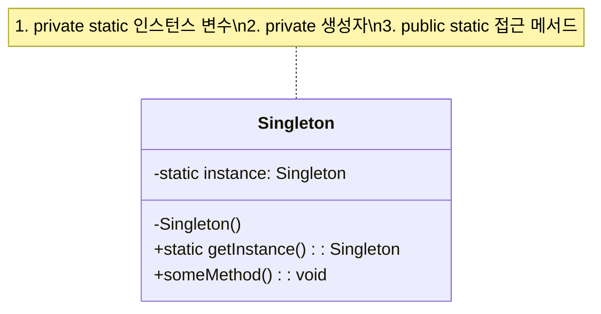

# 싱글턴 패턴 (Singleton Pattern)

## 정의

싱글턴 패턴은 특정 클래스의 인스턴스가 오직 하나만 생성되도록 보장하고, 그 인스턴스에 대한 전역적인 접근점을 제공하는 생성 디자인 패턴입니다.

## 구조 (Structure)



## 사용 이유

- **자원 관리**: 데이터베이스 연결, 파일 시스템 접근과 같이 여러 곳에서 공유해야 하지만 하나만 존재해야 하는 자원을 관리할 때 유용합니다. 인스턴스를 하나만 생성함으로써 자원 낭비를 막고 일관성을 유지할 수 있습니다.
- **전역 설정**: 애플리케이션 전체에서 공유되는 설정 정보나 로깅 객체처럼 유일해야 하는 경우에 사용됩니다.

## 적용 상황

싱글톤 패턴은 다음과 같은 상황에서 특히 유용합니다:

### 1. 시스템 리소스 관리
- **데이터베이스 커넥션 풀**: 연결 수를 제한하고 효율적으로 관리
- **캐시 매니저**: 메모리 내 캐시를 전역적으로 관리
- **로거(Logger)**: 애플리케이션 전체의 로그 출력을 일관되게 처리

### 2. 설정 및 상태 관리
- **애플리케이션 설정**: 환경 변수, 프로퍼티 파일 등의 설정 정보
- **게임 상태**: 점수, 레벨, 게임 설정 등의 전역 상태
- **사용자 세션**: 로그인 정보 및 사용자 상태

### 3. 하드웨어 인터페이스
```java
// 나쁜 예: 여러 인스턴스로 하드웨어 충돌 가능
PrinterManager printer1 = new PrinterManager();
PrinterManager printer2 = new PrinterManager(); // 충돌 위험!

// 좋은 예: 싱글톤으로 안전한 하드웨어 접근
PrinterManager printer = PrinterManager.getInstance();
```

## 다양한 구현 방식

### 1. Eager Initialization (즉시 초기화)

```java
public class EagerSingleton {
    // 클래스 로딩 시점에 인스턴스 생성
    private static final EagerSingleton instance = new EagerSingleton();

    private EagerSingleton() {}

    public static EagerSingleton getInstance() {
        return instance;
    }
}
```

**장점**: Thread-Safe, 구현 간단
**단점**: 사용하지 않아도 메모리 사용

### 2. Lazy Initialization (지연 초기화)

```java
public class LazySingleton {
    private static LazySingleton instance;

    private LazySingleton() {}

    public static LazySingleton getInstance() {
        if (instance == null) {
            instance = new LazySingleton();
        }
        return instance;
    }
}
```

**장점**: 필요할 때만 생성
**단점**: 멀티스레드 환경에서 안전하지 않음

### 3. Thread-Safe Singleton (동기화 방식)

```java
public class ThreadSafeSingleton {
    private static ThreadSafeSingleton instance;

    private ThreadSafeSingleton() {}

    public static synchronized ThreadSafeSingleton getInstance() {
        if (instance == null) {
            instance = new ThreadSafeSingleton();
        }
        return instance;
    }
}
```

**장점**: 멀티스레드 안전
**단점**: 성능 저하 (매번 동기화)

### 4. Double-Checked Locking

```java
public class DoubleCheckedSingleton {
    private static volatile DoubleCheckedSingleton instance;

    private DoubleCheckedSingleton() {}

    public static DoubleCheckedSingleton getInstance() {
        if (instance == null) {
            synchronized (DoubleCheckedSingleton.class) {
                if (instance == null) {
                    instance = new DoubleCheckedSingleton();
                }
            }
        }
        return instance;
    }
}
```

**장점**: 성능과 안전성 모두 확보
**단점**: 구현 복잡, volatile 키워드 필요

### 5. Bill Pugh Solution (권장)

```java
public class BillPughSingleton {
    private BillPughSingleton() {}

    private static class SingletonHelper {
        private static final BillPughSingleton INSTANCE = new BillPughSingleton();
    }

    public static BillPughSingleton getInstance() {
        return SingletonHelper.INSTANCE;
    }
}
```

**장점**: 지연 로딩 + Thread-Safe + 성능 최적화
**단점**: 없음 (가장 권장되는 방식)

### 6. Enum Singleton (가장 안전)

```java
public enum EnumSingleton {
    INSTANCE;

    public void someMethod() {
        System.out.println("Enum Singleton Method");
    }
}
```

**장점**: 직렬화/역직렬화, 리플렉션 공격에 안전
**단점**: 상속 불가능

## 실생활 예제 - 게임 설정 관리자

게임에서 전체 설정을 관리하는 시스템을 싱글톤 패턴으로 구현해보겠습니다.

```java
public class GameConfigManager {
    private static volatile GameConfigManager instance;

    // 게임 설정 데이터
    private int soundVolume = 50;
    private int musicVolume = 70;
    private boolean isFullScreen = false;
    private String difficulty = "Normal";
    private String language = "Korean";
    private int maxFPS = 60;

    // 플레이어 진행 상황
    private int currentLevel = 1;
    private int totalScore = 0;
    private int highScore = 0;

    private GameConfigManager() {
        // 설정 파일에서 기본값 로드
        loadConfigFromFile();
    }

    public static GameConfigManager getInstance() {
        if (instance == null) {
            synchronized (GameConfigManager.class) {
                if (instance == null) {
                    instance = new GameConfigManager();
                }
            }
        }
        return instance;
    }

    // 오디오 설정
    public void setSoundVolume(int volume) {
        this.soundVolume = Math.max(0, Math.min(100, volume));
        System.out.println("효과음 볼륨이 " + this.soundVolume + "%로 설정되었습니다.");
        saveConfigToFile();
    }

    public void setMusicVolume(int volume) {
        this.musicVolume = Math.max(0, Math.min(100, volume));
        System.out.println("배경음 볼륨이 " + this.musicVolume + "%로 설정되었습니다.");
        saveConfigToFile();
    }

    // 화면 설정
    public void setFullScreen(boolean fullScreen) {
        this.isFullScreen = fullScreen;
        System.out.println("전체화면 모드: " + (fullScreen ? "ON" : "OFF"));
        saveConfigToFile();
    }

    public void setMaxFPS(int fps) {
        this.maxFPS = fps;
        System.out.println("최대 FPS가 " + fps + "로 설정되었습니다.");
        saveConfigToFile();
    }

    // 게임 설정
    public void setDifficulty(String difficulty) {
        this.difficulty = difficulty;
        System.out.println("난이도가 '" + difficulty + "'로 설정되었습니다.");
        saveConfigToFile();
    }

    public void setLanguage(String language) {
        this.language = language;
        System.out.println("언어가 '" + language + "'로 변경되었습니다.");
        saveConfigToFile();
    }

    // 게임 진행 상황
    public void updateScore(int points) {
        this.totalScore += points;
        if (this.totalScore > this.highScore) {
            this.highScore = this.totalScore;
            System.out.println("🎉 새로운 최고 점수: " + this.highScore + "점!");
        }
        saveProgressToFile();
    }

    public void levelUp() {
        this.currentLevel++;
        System.out.println("🎊 레벨 업! 현재 레벨: " + this.currentLevel);
        saveProgressToFile();
    }

    public void resetGame() {
        this.currentLevel = 1;
        this.totalScore = 0;
        System.out.println("게임이 초기화되었습니다.");
        saveProgressToFile();
    }

    // 설정 정보 조회
    public void displayCurrentSettings() {
        System.out.println("=== 현재 게임 설정 ===");
        System.out.println("효과음 볼륨: " + soundVolume + "%");
        System.out.println("배경음 볼륨: " + musicVolume + "%");
        System.out.println("전체화면: " + (isFullScreen ? "ON" : "OFF"));
        System.out.println("최대 FPS: " + maxFPS);
        System.out.println("난이도: " + difficulty);
        System.out.println("언어: " + language);
        System.out.println();
        System.out.println("=== 게임 진행 상황 ===");
        System.out.println("현재 레벨: " + currentLevel);
        System.out.println("현재 점수: " + totalScore + "점");
        System.out.println("최고 점수: " + highScore + "점");
    }

    // Getter 메서드들
    public int getSoundVolume() { return soundVolume; }
    public int getMusicVolume() { return musicVolume; }
    public boolean isFullScreen() { return isFullScreen; }
    public String getDifficulty() { return difficulty; }
    public String getLanguage() { return language; }
    public int getMaxFPS() { return maxFPS; }
    public int getCurrentLevel() { return currentLevel; }
    public int getTotalScore() { return totalScore; }
    public int getHighScore() { return highScore; }

    private void loadConfigFromFile() {
        System.out.println("설정 파일에서 게임 설정을 로드합니다...");
        // 실제로는 파일에서 설정을 읽어옴
    }

    private void saveConfigToFile() {
        System.out.println("게임 설정을 파일에 저장합니다...");
        // 실제로는 파일에 설정을 저장
    }

    private void saveProgressToFile() {
        System.out.println("게임 진행 상황을 저장합니다...");
        // 실제로는 파일에 진행 상황을 저장
    }
}

// 게임에서의 사용 예시
public class GameApplication {
    public static void main(String[] args) {
        // 게임 시작 시 설정 매니저 초기화
        GameConfigManager config = GameConfigManager.getInstance();

        System.out.println("=== 게임 시작 ===");
        config.displayCurrentSettings();

        System.out.println("\n=== 플레이어가 설정 변경 ===");
        config.setSoundVolume(80);
        config.setMusicVolume(60);
        config.setFullScreen(true);
        config.setDifficulty("Hard");

        System.out.println("\n=== 게임 플레이 중 ===");
        config.updateScore(1500);
        config.updateScore(2300);
        config.levelUp();
        config.updateScore(5000); // 최고 점수 갱신!

        System.out.println("\n=== 다른 게임 모듈에서 설정 접근 ===");
        // 다른 곳에서도 같은 인스턴스 접근
        GameConfigManager anotherRef = GameConfigManager.getInstance();
        System.out.println("현재 난이도: " + anotherRef.getDifficulty());
        System.out.println("현재 점수: " + anotherRef.getTotalScore());

        System.out.println("\n=== 최종 설정 확인 ===");
        config.displayCurrentSettings();
    }
}
```

**실행 결과 예시:**
```
=== 게임 시작 ===
설정 파일에서 게임 설정을 로드합니다...
=== 현재 게임 설정 ===
효과음 볼륨: 50%
배경음 볼륨: 70%
전체화면: OFF
최대 FPS: 60
난이도: Normal
언어: Korean

=== 게임 진행 상황 ===
현재 레벨: 1
현재 점수: 0점
최고 점수: 0점

=== 플레이어가 설정 변경 ===
효과음 볼륨이 80%로 설정되었습니다.
게임 설정을 파일에 저장합니다...
배경음 볼륨이 60%로 설정되었습니다.
게임 설정을 파일에 저장합니다...
전체화면 모드: ON
게임 설정을 파일에 저장합니다...
난이도가 'Hard'로 설정되었습니다.
게임 설정을 파일에 저장합니다...

=== 게임 플레이 중 ===
게임 진행 상황을 저장합니다...
게임 진행 상황을 저장합니다...
🎊 레벨 업! 현재 레벨: 2
게임 진행 상황을 저장합니다...
🎉 새로운 최고 점수: 8800점!
게임 진행 상황을 저장합니다...

=== 다른 게임 모듈에서 설정 접근 ===
현재 난이도: Hard
현재 점수: 8800
```

## Spring에서의 싱글톤

Spring Framework에서는 기본적으로 모든 Bean이 싱글톤 스코프로 관리됩니다.

```java
@Configuration
public class AppConfig {

    @Bean
    @Scope("singleton") // 기본값이므로 생략 가능
    public GameConfigManager gameConfigManager() {
        return new GameConfigManager();
    }
}

@Service
public class GameService {

    @Autowired
    private GameConfigManager configManager; // Spring이 싱글톤으로 주입

    public void startGame() {
        configManager.resetGame();
        configManager.displayCurrentSettings();
    }
}

@RestController
public class GameController {

    @Autowired
    private GameConfigManager configManager; // 같은 인스턴스가 주입됨

    @PostMapping("/settings/volume")
    public ResponseEntity<String> updateVolume(@RequestParam int volume) {
        configManager.setSoundVolume(volume);
        return ResponseEntity.ok("Volume updated");
    }
}
```

**Spring 싱글톤의 장점:**
- **의존성 주입**: `@Autowired`로 자동 주입
- **라이프사이클 관리**: Spring이 생성/소멸 관리
- **AOP 지원**: 횡단 관심사 처리 가능
- **테스트 용이**: `@MockBean`으로 테스트 시 Mock 객체 주입 가능

## 기본 예제 코드 (Java)

```java
public class Singleton {

    // 1. 클래스 로딩 시점에 인스턴스를 생성하고 private static으로 선언하여 외부 접근을 막습니다.
    private static final Singleton instance = new Singleton();

    // 2. private 생성자를 만들어 외부에서 new 키워드로 인스턴스를 생성하지 못하게 합니다.
    private Singleton() {}

    // 3. 외부에서 유일한 인스턴스에 접근할 수 있도록 public static 메서드를 제공합니다.
    public static Singleton getInstance() {
        return instance;
    }

    public void showMessage() {
        System.out.println("Hello, I am a Singleton instance!");
    }
}
```

## 장점

- **메모리 절약**: 인스턴스를 하나만 생성하므로 메모리 사용량을 줄일 수 있습니다.
- **데이터 공유 용이**: 전역적인 상태를 공유하기 쉬워 다른 객체들과의 데이터 공유가 간편합니다.
- **일관성 보장**: 전역적으로 하나의 인스턴스만 존재하므로 상태의 일관성을 보장할 수 있습니다.
- **성능 향상**: 객체 생성 비용이 높은 경우 성능 향상을 기대할 수 있습니다.

## 단점

- **동시성 문제**: 멀티스레드 환경에서는 여러 스레드가 동시에 `getInstance()` 메서드를 호출하여 여러 인스턴스가 생성될 수 있습니다. 이를 방지하기 위해 동기화 처리가 필요할 수 있습니다.
- **유연성 저하**: 싱글턴 인스턴스는 애플리케이션 전반에 걸쳐 공유되므로, 다른 클래스와의 결합도가 높아져 단위 테스트가 어려워질 수 있습니다.
- **SOLID 원칙 위배**: 단일 책임 원칙(SRP)과 개방-폐쇄 원칙(OCP)을 위배할 가능성이 있습니다.
- **전역 상태**: 전역 상태로 인한 예상치 못한 부작용이 발생할 수 있습니다.
- **상속의 어려움**: 싱글톤 클래스는 상속이 어렵고, 인터페이스 구현도 제약이 있습니다.