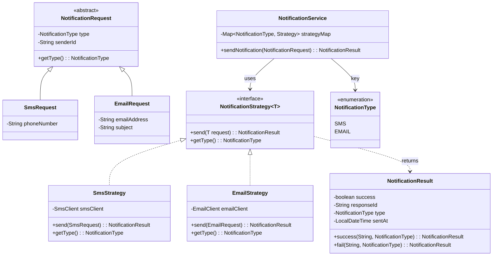
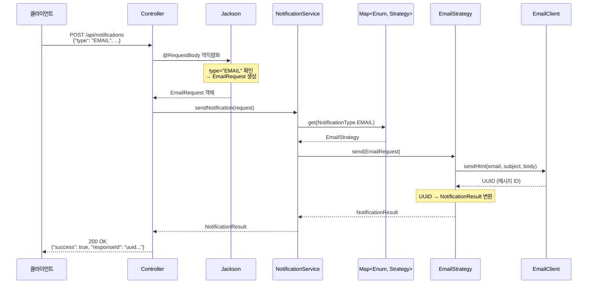

# Spring 전략패턴 (Strategy Pattern with Spring)

## 정의

Spring 환경에서 전략 패턴을 실무에 적용할 때, **각 전략마다 다른 외부 클라이언트를 의존**하고 **전략별로 다른 요청/응답 DTO가 필요**한 상황을 해결하는 방법입니다. 제네릭과 Jackson 다형성을 활용하여 타입 안전하고 확장 가능한 구조를 만듭니다.

## 🎯 한눈에 보기

| 항목 | 설명 |
|------|------|
| **핵심** | Enum + Map<Enum, Strategy> + Jackson 다형성 + 공통 응답 DTO |
| **문제** | 전략마다 다른 요청 DTO, 다른 응답 타입, 다른 외부 클라이언트 |
| **해결** | 제네릭 인터페이스 + `@JsonSubTypes` + `NotificationResult` |
| **장점** | 타입 안전성, 컴파일 타임 검증, OCP 준수, 통일된 응답 |

> **💡 왜 이런 구조가 필요할까?**
>
> **❌ 단순 전략패턴의 한계**
> ```java
> interface Strategy {
>     void execute(CommonDto dto);  // 요청: SMS는 phoneNumber, Email은 subject 필요
>                                   // 응답: SMS는 Long, Email은 UUID 반환하는데?
> }
> ```
>
> **✅ 제네릭 + 공통 응답 DTO**
> ```java
> interface Strategy<T extends BaseRequest> {
>     NotificationResult execute(T dto);  // 요청: 각자 DTO, 응답: 공통 DTO!
> }
> ```

## 문제 상황

### 1. 전략별로 다른 요청 필드가 필요

```java
// SMS 전략: phoneNumber 필요
class SmsRequest {
    private String phoneNumber;  // SMS 전용
}

// Email 전략: emailAddress, subject 필요
class EmailRequest {
    private String emailAddress;  // Email 전용
    private String subject;       // Email 전용
}
```

### 2. 전략별로 다른 외부 클라이언트 의존

```java
// SmsStrategy는 SmsClient만 필요
// EmailStrategy는 EmailClient만 필요
// 서로의 클라이언트를 알 필요 없음!
```

### 3. 전략별로 다른 응답 타입 반환

```java
// SmsClient가 반환하는 타입
Long smsMessageId = smsClient.sendText(...);  // Long 타입

// EmailClient가 반환하는 타입
UUID emailMessageId = emailClient.sendHtml(...);  // UUID 타입

// 서비스에서 통일된 형태로 받고 싶은데?
```

## 구조 (Structure)



## 구현 예제: 알림 발송 시스템

SMS와 Email 알림을 발송하는 시스템을 Enum + Map 기반 전략패턴으로 구현합니다.

### 1. Enum 정의

```java
public enum NotificationType {
    SMS,
    EMAIL
}
```

### 2. 요청 DTO 설계 (Jackson 다형성)

JSON의 `type` 필드 값에 따라 자동으로 올바른 클래스로 역직렬화됩니다.

```java
import com.fasterxml.jackson.annotation.JsonSubTypes;
import com.fasterxml.jackson.annotation.JsonTypeInfo;
import lombok.Getter;
import lombok.Setter;

@JsonTypeInfo(
    use = JsonTypeInfo.Id.NAME,
    include = JsonTypeInfo.As.EXISTING_PROPERTY,
    property = "type",
    visible = true
)
@JsonSubTypes({
    @JsonSubTypes.Type(value = SmsRequest.class, name = "SMS"),
    @JsonSubTypes.Type(value = EmailRequest.class, name = "EMAIL")
})
@Getter
@Setter
public abstract class NotificationRequest {
    private NotificationType type;  // Enum 타입
    private String senderId;        // 공통 필드
}
```

```java
@Getter
@Setter
public class SmsRequest extends NotificationRequest {
    private String phoneNumber;  // SMS 전용 필드
}
```

```java
@Getter
@Setter
public class EmailRequest extends NotificationRequest {
    private String emailAddress;  // Email 전용 필드
    private String subject;       // Email 전용 필드
}
```

### 3. 응답 DTO 설계 (공통화)

각 클라이언트가 반환하는 다른 타입(Long, UUID 등)을 통일된 형태로 변환합니다.

```java
import lombok.Getter;
import lombok.AllArgsConstructor;
import java.time.LocalDateTime;

@Getter
@AllArgsConstructor
public class NotificationResult {

    private boolean success;
    private String responseId;       // Long, UUID 등을 String으로 통일
    private NotificationType type;
    private LocalDateTime sentAt;
    private String message;          // 성공/실패 메시지

    /**
     * 성공 응답 생성
     */
    public static NotificationResult success(String responseId, NotificationType type) {
        return new NotificationResult(
            true,
            responseId,
            type,
            LocalDateTime.now(),
            "발송 성공"
        );
    }

    /**
     * 실패 응답 생성
     */
    public static NotificationResult fail(NotificationType type, String errorMessage) {
        return new NotificationResult(
            false,
            null,
            type,
            LocalDateTime.now(),
            errorMessage
        );
    }
}
```

### 4. 전략 인터페이스 (제네릭 + 공통 응답)

```java
public interface NotificationStrategy<T extends NotificationRequest> {

    /**
     * 알림을 발송합니다.
     * @param request 전략별 구체적인 요청 DTO
     * @return NotificationResult 공통 응답 DTO
     */
    NotificationResult send(T request);

    /**
     * 이 전략이 처리하는 알림 타입을 반환합니다.
     * @return NotificationType enum 값
     */
    NotificationType getType();
}
```

### 5. 구체 전략 구현

#### SmsStrategy (Long → NotificationResult 변환)

```java
@Component
@RequiredArgsConstructor
public class SmsStrategy implements NotificationStrategy<SmsRequest> {

    private final SmsClient smsClient;  // SMS 전용 외부 클라이언트

    @Override
    public NotificationResult send(SmsRequest request) {
        try {
            // SmsClient는 Long 타입의 메시지 ID를 반환
            Long messageId = smsClient.sendText(
                request.getPhoneNumber(),
                "발신자: " + request.getSenderId()
            );

            // Long → String으로 변환하여 공통 응답 생성
            return NotificationResult.success(
                messageId.toString(),
                NotificationType.SMS
            );
        } catch (Exception e) {
            return NotificationResult.fail(
                NotificationType.SMS,
                "SMS 발송 실패: " + e.getMessage()
            );
        }
    }

    @Override
    public NotificationType getType() {
        return NotificationType.SMS;
    }
}
```

#### EmailStrategy (UUID → NotificationResult 변환)

```java
@Component
@RequiredArgsConstructor
public class EmailStrategy implements NotificationStrategy<EmailRequest> {

    private final EmailClient emailClient;  // Email 전용 외부 클라이언트

    @Override
    public NotificationResult send(EmailRequest request) {
        try {
            // EmailClient는 UUID 타입의 메시지 ID를 반환
            UUID messageId = emailClient.sendHtml(
                request.getEmailAddress(),
                request.getSubject(),
                "발신자: " + request.getSenderId()
            );

            // UUID → String으로 변환하여 공통 응답 생성
            return NotificationResult.success(
                messageId.toString(),
                NotificationType.EMAIL
            );
        } catch (Exception e) {
            return NotificationResult.fail(
                NotificationType.EMAIL,
                "Email 발송 실패: " + e.getMessage()
            );
        }
    }

    @Override
    public NotificationType getType() {
        return NotificationType.EMAIL;
    }
}
```

### 6. 서비스 (Map<Enum, Strategy> + 응답 반환)

```java
@Service
public class NotificationService {

    private final Map<NotificationType, NotificationStrategy<?>> strategyMap;

    /**
     * Spring이 모든 NotificationStrategy 구현체를 List로 주입하면
     * 생성자에서 Map<Enum, Strategy>으로 변환합니다.
     */
    public NotificationService(List<NotificationStrategy<?>> strategies) {
        this.strategyMap = strategies.stream()
            .collect(Collectors.toMap(
                NotificationStrategy::getType,
                Function.identity()
            ));
    }

    public NotificationResult sendNotification(NotificationRequest request) {
        // 1. Enum으로 전략 조회 (O(1) 성능)
        NotificationStrategy strategy = strategyMap.get(request.getType());

        if (strategy == null) {
            return NotificationResult.fail(
                request.getType(),
                "지원하지 않는 알림 타입: " + request.getType()
            );
        }

        // 2. 전략 실행 및 응답 반환
        return doSend(strategy, request);
    }

    /**
     * 제네릭 타입 매칭을 위한 헬퍼 메서드
     */
    @SuppressWarnings("unchecked")
    private <T extends NotificationRequest> NotificationResult doSend(
            NotificationStrategy<T> strategy,
            NotificationRequest request) {
        return strategy.send((T) request);
    }

    /**
     * 지원하는 알림 타입 목록 조회
     */
    public Set<NotificationType> getSupportedTypes() {
        return strategyMap.keySet();
    }
}
```

### 7. 컨트롤러

```java
@RestController
@RequestMapping("/api/notifications")
@RequiredArgsConstructor
public class NotificationController {

    private final NotificationService notificationService;

    @PostMapping
    public ResponseEntity<NotificationResult> send(
            @RequestBody NotificationRequest request) {
        NotificationResult result = notificationService.sendNotification(request);

        if (result.isSuccess()) {
            return ResponseEntity.ok(result);
        } else {
            return ResponseEntity.badRequest().body(result);
        }
    }

    @GetMapping("/types")
    public ResponseEntity<Set<NotificationType>> getTypes() {
        return ResponseEntity.ok(notificationService.getSupportedTypes());
    }
}
```

### 8. JSON 요청/응답 예시

#### SMS 요청

```json
POST /api/notifications
{
    "type": "SMS",
    "senderId": "admin",
    "phoneNumber": "010-1234-5678"
}
```

#### SMS 응답

```json
{
    "success": true,
    "responseId": "123456789",
    "type": "SMS",
    "sentAt": "2024-01-15T10:30:00",
    "message": "발송 성공"
}
```

#### Email 요청

```json
POST /api/notifications
{
    "type": "EMAIL",
    "senderId": "admin",
    "emailAddress": "user@example.com",
    "subject": "환영합니다"
}
```

#### Email 응답

```json
{
    "success": true,
    "responseId": "550e8400-e29b-41d4-a716-446655440000",
    "type": "EMAIL",
    "sentAt": "2024-01-15T10:31:00",
    "message": "발송 성공"
}
```

#### 실패 응답

```json
{
    "success": false,
    "responseId": null,
    "type": "SMS",
    "sentAt": "2024-01-15T10:32:00",
    "message": "SMS 발송 실패: 잘못된 전화번호 형식"
}
```

## 동작 흐름 (시퀀스 다이어그램)



## 핵심 포인트 정리

| 구분 | 설명 |
|------|------|
| **요청 DTO 분기** | Jackson의 `@JsonTypeInfo`로 JSON 파싱 단계에서 구체 클래스 생성 |
| **응답 DTO 통일** | 각 클라이언트의 다른 응답 타입(Long, UUID)을 `NotificationResult`로 통일 |
| **클라이언트 분리** | 각 전략은 자신에게 필요한 외부 클라이언트만 주입받음 |
| **타입 안전성** | 전략 내부에서 캐스팅 없이 구체 DTO의 필드에 직접 접근 |
| **전략 조회** | `Map<Enum, Strategy>`로 O(1) 성능의 전략 조회 |
| **확장성** | 새 전략 추가 시 기존 코드 수정 없이 클래스만 추가 (OCP) |

## 새 전략 추가하기 (Push 알림)

Push 알림을 추가하려면 **3개의 파일만 추가/수정**하면 됩니다.

### 1. Enum에 타입 추가

```java
public enum NotificationType {
    SMS,
    EMAIL,
    PUSH  // 추가
}
```

### 2. 요청 DTO 추가

```java
// NotificationRequest에 @JsonSubTypes 추가
@JsonSubTypes({
    @JsonSubTypes.Type(value = SmsRequest.class, name = "SMS"),
    @JsonSubTypes.Type(value = EmailRequest.class, name = "EMAIL"),
    @JsonSubTypes.Type(value = PushRequest.class, name = "PUSH")  // 추가
})

// PushRequest 클래스 생성
@Getter
@Setter
public class PushRequest extends NotificationRequest {
    private String deviceToken;  // Push 전용 필드
    private String title;        // Push 전용 필드
}
```

### 3. 전략 구현체 추가 (Integer → NotificationResult 변환)

```java
@Component
@RequiredArgsConstructor
public class PushStrategy implements NotificationStrategy<PushRequest> {

    private final PushClient pushClient;  // Push 전용 외부 클라이언트

    @Override
    public NotificationResult send(PushRequest request) {
        try {
            // PushClient는 Integer 타입의 발송 건수를 반환한다고 가정
            Integer sendCount = pushClient.sendPush(
                request.getDeviceToken(),
                request.getTitle(),
                "발신자: " + request.getSenderId()
            );

            // Integer → String으로 변환
            return NotificationResult.success(
                "push-" + sendCount,
                NotificationType.PUSH
            );
        } catch (Exception e) {
            return NotificationResult.fail(
                NotificationType.PUSH,
                "Push 발송 실패: " + e.getMessage()
            );
        }
    }

    @Override
    public NotificationType getType() {
        return NotificationType.PUSH;
    }
}
```

**Service, Controller 코드 수정 없이** 바로 사용 가능!

```json
// 요청
POST /api/notifications
{
    "type": "PUSH",
    "senderId": "admin",
    "deviceToken": "abc123...",
    "title": "새 메시지가 도착했습니다"
}

// 응답
{
    "success": true,
    "responseId": "push-1",
    "type": "PUSH",
    "sentAt": "2024-01-15T10:35:00",
    "message": "발송 성공"
}
```

## 장점

| 장점 | 설명 |
|------|------|
| **타입 안전성** | 컴파일 타임에 타입 체크, 런타임 에러 방지 |
| **깔끔한 코드** | if-else 분기 없이 Map으로 전략 조회 |
| **독립적인 의존성** | 각 전략이 필요한 클라이언트만 주입 |
| **통일된 응답** | 다양한 클라이언트 응답을 공통 DTO로 표준화 |
| **OCP 준수** | 새 전략 추가 시 기존 코드 수정 불필요 |
| **테스트 용이** | 각 전략을 독립적으로 단위 테스트 가능 |

## 단점

| 단점 | 설명 |
|------|------|
| **클래스 수 증가** | 전략마다 Request DTO, Strategy 클래스 필요 |
| **DTO 상속 구조** | Jackson 어노테이션과 상속 관계 관리 필요 |
| **런타임 캐스팅** | 서비스에서 `@SuppressWarnings("unchecked")` 사용 |
| **응답 정보 손실** | 클라이언트 고유 응답을 String으로 변환 시 타입 정보 손실 |

## 관련 문서

| 문서 | 설명 |
|------|------|
| [전략 패턴 기본](../../behavioral/Strategy/README.md) | GoF 전략 패턴 기본 개념 |
| [서비스 빈 테스트](../../tdd/service/README.md) | Mockito로 전략 테스트하기 |
| [TDD 가이드](../../tdd/README.md) | 테스트 주도 개발 가이드 |
